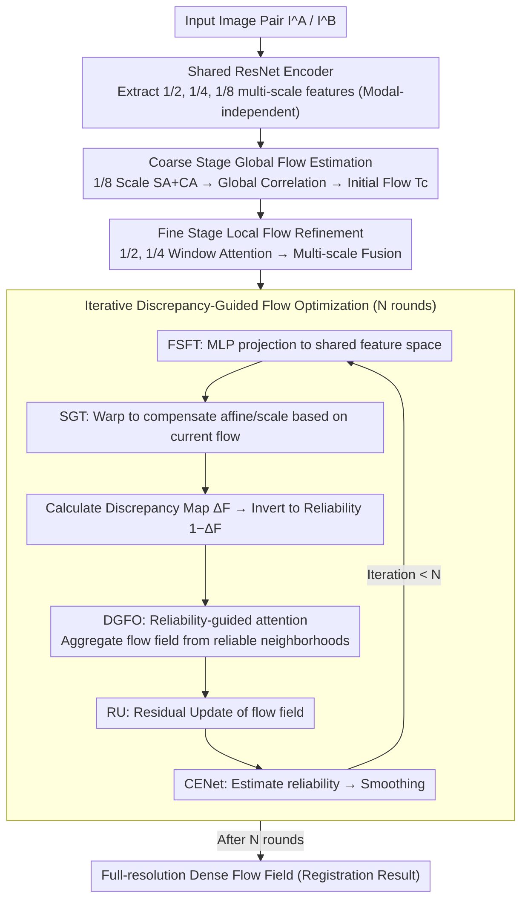

# CRFT: Consistent-Recurrent Feature Flow Transformer for Cross-Modal Image Registration

**Conference**: CVPR 2026  
**arXiv**: [2604.05689](https://arxiv.org/abs/2604.05689)  
**Code**: [https://github.com/NEU-Liuxuecong/CRFT](https://github.com/NEU-Liuxuecong/CRFT)  
**Area**: Medical Imaging / Image Registration  
**Keywords**: Cross-modal registration, feature flow learning, coarse-to-fine, discrepancy-guided attention, spatial geometric transform

## TL;DR
CRFT is proposed as a unified coarse-to-fine cross-modal image registration framework. It learns modality-independent feature flow representations within a Transformer architecture, utilizing $1/8$ resolution global correspondence in the coarse stage and $1/2$-$1/4$ multi-scale local refinement in the fine stage. Combined with iterative discrepancy-guided attention and Spatial Geometric Transform (SGT) to recursively refine the flow field and capture subtle spatial inconsistencies, it outperforms SOTA methods like RAFT, GMFlow, and LoFTR across various cross-modal datasets including optical/infrared, SAR, and multispectral.

## Background & Motivation

**Background**: Cross-modal image registration (establishing spatial correspondence between images from different sensors) is a core problem in computer vision, applied in 3D reconstruction, visual localization, and remote sensing analysis.

**Limitations of Prior Work**: (1) Handcrafted features (SIFT/RIFT) are unreliable under strong non-linear appearance differences; (2) Learned sparse matching (SuperGlue/LoFTR) is optimized for RGB and generalizes poorly to cross-modal data; (3) Optical flow methods (RAFT/GMFlow) assume photometric consistency, which is violated by cross-modal inputs; (4) Existing methods struggle with combinations of large affine transformations, scale changes, and modality gaps.

**Core Idea**: (1) Learning modality-independent feature flows in Transformers—relying on cross-modal feature space correspondence rather than pixel consistency; (2) Coarse-to-fine hierarchical matching (global + local); (3) Iterative discrepancy-guided recursive flow field refinement—utilizing feature discrepancies to actively locate poorly aligned regions.

## Method

### Overall Architecture

CRFT addresses the complex problem where two images come from different sensors (e.g., Optical vs. SAR, Visible vs. Infrared), and the grayscale values of the same ground object might be completely inverted. The "photometric consistency" essential for optical flow methods fails here, yet registration requires sub-pixel dense correspondence. CRFT moves the entire process into the **feature space**, using a coarse-to-fine pipeline to refine the correspondence layer by layer.

Specifically, an input image pair $(I^A, I^B)$ passes through a weight-shared ResNet encoder to extract features at $1/2$, $1/4$, and $1/8$ scales. First, self-attention and cross-attention are used at the coarsest $1/8$ scale to establish global correspondence, resulting in a stable but coarse initial flow field. This flow is then brought to the $1/2$ and $1/4$ high-resolution scales, where window attention adds local details. The core of the paper is an iterative refinement loop that runs for $N$ rounds: in each round, the current flow is applied to the features, affine/scale deformations are explicitly compensated, feature discrepancies are calculated, and these discrepancies are inverted into reliability map to guide attention. Correspondences from reliable regions are used to propagate and correct unreliable regions, gradually converging the flow field to sub-pixel accuracy.

### Key Designs

**1. Coarse Stage Global Flow Estimation: Stabilizing large correspondences at low resolution**

Direct cross-modal matching at high resolution is risky—spectral and radiation differences between modalities can overwhelm local details, leading to large-scale deviations. CRFT chooses to operate at $1/8$ resolution first: these features correspond to high-level structures (contours, skeletons) which are naturally more robust to inter-modal photometric inconsistencies. Self-attention enhances individual feature representations, and cross-attention performs cross-modal matching to construct a global correlation matrix, from which an initial flow field is derived. This flow is coarse but covers the global scope, providing a reliable starting point for subsequent refinement.

**2. Fine Stage Local Flow Refinement: Recovering spatial details at high resolution**

The coarse flow lacks details found only in high-resolution features. However, the $1/2$ and $1/4$ layers are too large for global attention due to computational costs. CRFT uses window self-attention to capture fine patterns within local windows and cross-attention to inject cross-modal spatial details into the flow field, combined with hierarchical multi-scale fusion. This recovers local accuracy while bypassing the overhead of high-resolution global attention.

**3. Iterative Discrepancy-Guided Flow Optimization: Using "misalignment" to decide "what to fix"**

This is the core innovation of CRFT, targeting complex non-linear and large affine deformations. The refinement is structured as an $N$-round loop. Each round involves: **Fine-Scale Feature Transformation (FSFT)**, using a lightweight MLP to project both modalities into a shared feature space to stabilize discrepancy calculation; **Spatial Geometric Transform (SGT)**, which explicitly models affine/scale transformations as a learnable warp module to compensate for large deformations; the warped features are subtracted from the target features to obtain a **discrepancy map** $\Delta F$, marking unaligned regions. CRFT inverts this into a reliability map $1-\Delta F$. **Discrepancy-Guided Flow Optimization (DGFO)** uses this map to generate attention query/keys, aggregating the flow field from **reliable (aligned) neighbors**. Finally, a **Residual Update (RU)** pushes the flow field forward, and the **Confidence Estimation Network (CENet)** predicts pixel-wise confidence for weighted smoothing.

**4. Modality-Independent Design: Unifying cross-modal registration as "Feature Flow"**

CRFT forces the shared encoder to learn modality-invariant features. The formulation estimates **flow in the feature space** rather than pixel-level photometric flow, bypassing the "photometric consistency" assumption. Experimental results show that this design remains competitive even in RGB-RGB scenarios.

## Key Experimental Results

### Main Results

**OSdataset (Optical-to-SAR Registration)**

| Method | Type | AEPE ↓ | CMR@3px ↑ | CMR@1px ↑ | CMR@0.7px ↑ |
|------|------|--------|-----------|-----------|-------------|
| RIFT2 | Handcrafted | 23.61 | 22.9% | 0.0% | 0.0% |
| GMFlow | Optical Flow | 11.91 | 17.0% | 0.0% | 0.0% |
| RAFT | Optical Flow | 3.51 | 69.6% | 15.9% | 8.7% |
| ADRNet | Dense Match | 1.67 | 90.1% | 35.0% | 20.6% |
| GDROS | Dense Match | 1.34 | 91.1% | 49.2% | 35.5% |
| XoFTR+Flow | Semi-dense | 1.13 | 96.2% | 57.6% | 41.7% |
| **Ours** | **Ours** | **0.65** | **99.0%** | **95.1%** | **89.9%** |

Ours is the only method reaching sub-pixel AEPE (0.65); CMR@0.7px reaches 89.9%, which is **2.15×** higher than the second-best XoFTR+Flow (41.7%).

**RoadScene (Visible-to-Infrared Registration)**

| Method | AEPE ↓ | CMR@3px ↑ | CMR@1px ↑ | CMR@0.7px ↑ |
|------|--------|-----------|-----------|-------------|
| RIFT2 | 17.27 | 36.4% | 0.0% | 0.0% |
| RAFT | 8.92 | 66.6% | 14.1% | 8.0% |
| ADRNet | 4.72 | 50.1% | 9.4% | 4.8% |
| XoFTR+Flow | 4.83 | 27.3% | 0.0% | 0.0% |
| **Ours** | **2.37** | **68.2%** | **18.2%** | **4.5%** |

Ours achieves the lowest AEPE (2.37) and highest CMR@1px (18.2%) on RoadScene.

### Ablation Study

| Configuration | Effect Description |
|------|----------|
| Coarse stage only | Global correspondence is available but lacks spatial precision |
| + Fine stage | Improved local details and accuracy |
| + Discrepancy Guidance (N=1) | Further correction of geometric misalignment |
| **+ Iterative Refinement (N=3)** | **Optimal, stable convergence** |
| w/o SGT | Significant performance drop for large affine transformations |
| w/o DGFO | Lower efficiency; attention lacks focus on reliable regions |
| w/o FSFT | Unstable discrepancy calculation due to unaligned feature spaces |

### Key Findings
- The SGT module is critical for large affine transformations; without SGT, registration of large-angle/scale changes fails significantly.
- Discrepancy-guided attention vs. uniform attention: The former makes iterations more efficient by using high-consistency regions as anchor points to propagate the flow field.
- $N=3$ iterations are generally sufficient for convergence; further rounds yield diminishing returns.
- Ours remains competitive in RGB-RGB scenarios, showing that modality-independent design does not sacrifice intra-modal performance.

## Highlights & Insights
- **Modality-Independent Feature Flow**: Unifies cross-modal registration as flow estimation in a shared feature space, ensuring high generalization across different modality pairs.
- **Adaptive Discrepancy-Guided Attention**: Inverts feature differences into reliability weights for attention, allowing the flow field to aggregate from reliable neighbors and propagate to unaligned regions.
- **Explicit Geometric Modeling with SGT**: Integrates affine transformations as a learnable module rather than expecting the flow field to learn large deformations implicitly.

## Limitations & Future Work
- $N=3$ iterations increase inference time compared to single-pass methods.
- Global attention in the coarse stage requires controlled resolution for large images.
- Current validation focuses on remote sensing and navigation; application to medical registration (CT-MRI) remains to be explored.

## Rating
- Novelty: ⭐⭐⭐⭐ Effective combination of discrepancy-guided recursion, SGT, and modality-independent flows.
- Experimental Thoroughness: ⭐⭐⭐⭐⭐ Validated across optical, infrared, SAR, and multispectral scenarios.
- Writing Quality: ⭐⭐⭐⭐ Detailed architecture diagrams.
- Value: ⭐⭐⭐⭐ High potential for general registration in remote sensing and navigation.

<!-- RELATED:START -->

## Related Papers

- [\[CVPR 2026\] CoFiDA-M: Concept-Aware Feature Modulation for Cross-Domain Adaptation with Image-Only Inference](cofida-m_concept-aware_feature_modulation_for_cross-domain_adaptation_with_image.md)
- [\[CVPR 2026\] MambaLiteUNet: Cross-Gated Adaptive Feature Fusion for Robust Skin Lesion Segmentation](mambaliteunet_cross-gated_adaptive_feature_fusion_for_robust_skin_lesion_segment.md)
- [\[CVPR 2026\] Cross-Modal Guided Visual Synthesis for Data-Efficient Multimodal Depression Recognition](cross-modal_guided_visual_synthesis_for_data-efficient_multimodal_depression_rec.md)
- [\[CVPR 2026\] Cross-domain Dual-stream Feature Disentanglement for Brain Disorder Prediction with Sparsely Labeled PET](cross-domain_dual-stream_feature_disentanglement_for_brain_disorder_prediction_w.md)
- [\[ECCV 2024\] Unsupervised Multi-modal Medical Image Registration via Invertible Translation](../../ECCV2024/medical_imaging/unsupervised_multi-modal_medical_image_registration_via_invertible_translation.md)

<!-- RELATED:END -->
