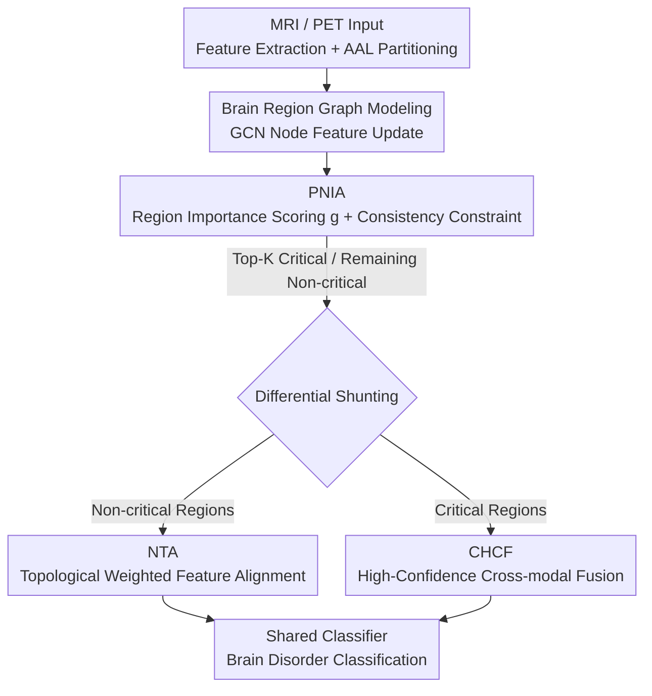

# Cross-domain Dual-stream Feature Disentanglement for Brain Disorder Prediction with Sparsely Labeled PET

**Conference**: CVPR 2026  
**Paper**: [CVF Open Access](https://openaccess.thecvf.com/content/CVPR2026/html/Wang_Cross-domain_Dual-stream_Feature_Disentanglement_for_Brain_Disorder_Prediction_with_Sparsely_CVPR_2026_paper.html)  
**Code**: Undisclosed  
**Area**: Medical Imaging  
**Keywords**: PET brain disease diagnosis, Cross-modal domain adaptation, Feature disentanglement, Semi-supervised learning, Brain region graph modeling  

## TL;DR
Addressing the scarcity of PET labels by transferring knowledge from label-rich MRI, this paper proposes the DSDA framework. It explicitly decouples "classification-relevant critical brain regions" from "classification-irrelevant non-critical regions" using a brain region importance map. It then applies **differential processing**: non-critical regions undergo topological weighted alignment to eliminate domain discrepancy, while critical regions undergo high-confidence feature fusion to preserve pathological discriminative information. The method achieves 86.6%/87.7%/88.9% accuracy on ADNI/AIBL/PPMI respectively, setting a new SOTA.

## Background & Motivation
**Background**: PET can detect metabolic abnormalities before significant anatomical changes occur, making it a key tool for the early diagnosis of neurodegenerative diseases such as Alzheimer's and Parkinson's. However, PET image interpretation relies heavily on nuclear medicine expert annotations, resulting in extremely scarce high-quality labeled data. In contrast, MRI labels are easier to obtain, making "using label-rich MRI to assist label-scarce PET classification" a promising route, which is essentially a **Domain Adaptation (DA)** problem.

**Limitations of Prior Work**: Mainstream DA methods adopt a **global alignment** strategy, assuming that aligning domain-invariant features and reducing distribution discrepancy between source and target domains allows the source-trained classifier to be directly applied to the target domain. However, the optimization direction of domain alignment is not necessarily consistent with that of classification. Global alignment does not explicitly serve the classification objective and may even **destroy discriminative features** crucial for classification during the alignment process. Subsequent work shifted toward "selective alignment," only aligning features that improve domain adaptability, but these methods are generally limited to **single-modal cross-dataset** scenarios (where physical signals are identical, and alignment only needs to eliminate statistical discrepancy).

**Key Challenge**: In **cross-modal** scenarios like MRI $\rightarrow$ PET, classification-related pathological signals in both modalities carry their own **non-interchangeable modal-specific physical semantics**—MRI reflects structural pathology, while PET reflects functional/metabolic abnormalities. Forcing these heterogeneous features into a shared distribution space destroys their inherent physical and pathological meanings, impairing discriminative power. Thus, cross-modal tasks face two pulling requirements: **eliminating domain discrepancy** and **preserving modal-specific discriminative information**, which cannot both be satisfied by global alignment.

**Key Insight**: The authors' key insight is that cross-modal data contains both "classification-relevant signals" with modal-specific semantics (which should not be aligned) and modal-independent shared information (e.g., relative position and size of brain regions, which can be aligned to eliminate domain differences). Therefore, one should **do the opposite**: align "classification-irrelevant features" to eliminate domain shift while preserving "classification-relevant features" to maintain discriminative power. This is implemented via the DSDA framework—first decoupling critical/non-critical brain regions and then processing them differentially.

## Method

### Overall Architecture
DSDA operates under a **semi-supervised domain adaptation** setting: the source domain is label-rich MRI ($D_s=\{x_s^i,y_s^i\}$), and the target domain contains a small amount of labeled PET ($D_t$, much smaller than the source) and a large amount of unlabeled PET ($D_u$), where $D_s$ and $D_u$ are unpaired individuals. The goal is to perform joint training to excel on the target PET test set.

The pipeline comprises two major modules. Input MRI/PET images are split into brain-region-level features via a feature extractor $F$ and the AAL (Anatomical Automatic Labeling) template, forming a graph structure (nodes = brain regions, edges = feature similarity). Then: **① PNIA (Pathology-aware Node Importance Alignment)** uses Graph Convolutional Networks (GCN) to update node features, employs an attention network to assign a "diagnostic importance score" $g$ to each region, and uses a consistency loss to constrain cross-domain/cross-modal importance distributions; **② DPDFP (Dual-Path Differential Feature Processing)** selects the Top-K regions as critical and the rest as non-critical based on $g$, separating them into two paths—non-critical regions undergo **NTA (Topological Weighted Alignment)** to remove domain shifts, and critical regions undergo **CHCF (High-confidence Fusion)** to transfer discriminative features from MRI to PET. All classifiers share parameters.

### Key Designs

**1. PNIA: Decoupling "To Align" and "To Preserve" via Brain Region Importance Maps**

The prerequisite for differential processing is accurately locating "which regions are critical." Background (non-brain) noise interferes with feature extraction, and different brain regions contribute differently to diagnosis. Thus, the authors use a **graph structure** to analyze at the brain region level rather than the whole image. Specifically, features from $x_s,x_t,x_u$ are extracted via $F$ and AAL. Since region sizes vary, they are zero-padded to a fixed size to construct graph $G=(X,A)$ ($X$ is the feature matrix, $A$ is the adjacency matrix). Node features are updated via GCN:

$$Z = \sigma(D^{-\frac{1}{2}}\tilde{A}D^{-\frac{1}{2}}XW)$$

where $\tilde{A}=A+I_N$ is the adjacency matrix with self-loops, $D$ is the degree matrix, and $W$ is the learnable weights. Updated $Z$ passes through an attention network $\text{Att}(\cdot)$ to yield importance scores $g=\text{softmax}(\text{Att}(Z))$.

Crucially, prior research shows that MRI and PET consistently highlight **overlapping critical regions** for diagnosis. Based on this prior, the authors design a region importance consistency loss $L_{con}$ to align importance scores between source and unlabeled target domains:

$$L_{con} = \frac{1}{N}\sum_{i=1}^{N}\big(g_s(i)-g_u(i)\big)^2$$

This step provides a reliable basis for Top-K decoupling and aligns high-level semantics of "where is important"—which is more stable and interpretable than directly aligning low-level features.

**2. NTA: Topological Weighted Alignment for Non-critical Regions**

Aligning all regions indiscriminately across domains reduces domain shift but washes out classification-related discriminative features. The authors only perform alignment on **non-critical regions**. First, a non-critical region mask is obtained by taking Top-K regions from PNIA scores:

$$M = 1 - \text{TopK}(G_s, K) - \text{TopK}(G_u, K)$$

The alignment loss for non-critical regions uses contrastive cosine similarity:

$$L_{NA} = -\log\Big(\text{Sigmoid}\big(\tfrac{\text{Cos}(Z_s[M], Z_u[M])}{\tau}\big)\Big)$$

where $\tau$ is the temperature coefficient. To prevent noise in non-critical regions from being erroneously amplified, the authors use **cross-domain topological similarity** as a weight to dynamically adjust alignment strength. Topology is characterized by node degrees $D_m=\sum_j A_{m,ij}$ ($m\in\{s,u\}$), and the final loss is weighted by the cosine similarity of source/target degree vectors:

$$L_{NTA} = \text{Cos}(D_s[M], D_u[M]) * L_{NA}$$

The intuition is: only when the connection topologies of non-critical regions match across domains is strong alignment performed; otherwise, alignment intensity is reduced to avoid pulling noise together as "shared information." This leverages the structural consistency of non-critical regions to provide domain-invariant context without interfering with core representations in critical regions.

**3. CHCF: Dual Filtering + Progressive High-confidence Fusion for Critical Regions**

Critical regions should not be aligned; instead, discriminative features from MRI should be **fused** into PET. However, since $D_s$ and $D_u$ are unpaired, direct fusion would confuse class information. The authors use **dual-layer filtering** to ensure fusion only occurs on reliable samples. The first layer uses Monte Carlo Dropout: features $Z$ are fed to classifier $C$ for $T$ runs to obtain a distribution, calculating the mean $\mu$ and variance $\sigma^2$. Uncertainty is defined as:

$$U_{\sigma^2} = \frac{1}{C_m}\sum_{i=1}^{C_m}\sigma_i^2$$

Samples with $U_{\sigma^2}<\varepsilon$ are deemed high-confidence, filtering out low-quality pseudo-labels. The second layer performs **cross-modal label consistency** checks: fusion is activated only when the PET pseudo-label matches the MRI ground truth, ensuring real pathological relationships are fused.

Finally, considering that features are weakly correlated with the classification task in early training, a **progressive weighting** scheme is designed. Let $e$ be the current epoch and $E$ the total epochs. The fusion weight $\theta=e/E$ grows linearly, and PET features are dynamically corrected only at MRI critical region positions $M_s$:

$$Z_u[M_s] = Z_u[M_s] + \theta * Z_s[M_s]$$

The fused features $Z_u'$ are fed to the classifier for pseudo-label $\hat{y}$ and loss $L_{pseudo}=\text{CE}(P,\hat{y})$. Progressive weighting allows the model to stabilize before absorbing structural pathological cues from MRI.

### Loss & Training
Labeled MRI/PET are processed via GCN to get $Z_s,Z_t$, and supervised classification loss is calculated: $L_m=\text{CE}(C(Z_m),y_m)$ for $m\in\{s,t\}$. The total loss balances unsupervised terms with supervised terms using weight $\alpha$:

$$L_{all} = \alpha(L_{con}+L_{NTA}+L_{pseudo}) + (1-\alpha)(L_s+L_t)$$

Training: 100 epochs, learning rate 1e-4, batch size 8. Feature extractor: 3 layers, GCN: 2 layers, classifier: 3 layers. Labeled data ratio fixed at 20%.

## Key Experimental Results

### Main Results
Comparison with 11 SOTA methods on ADNI, AIBL, and PPMI (including single-modal semi-supervised FixMatch/MPL, and cross-modal DA methods like CDAC/CLDA/DeCoTa/ODADA/DCC/SLA/DDSPSeg/CAN/FSSADA). DSDA achieved ACC of 86.6%/87.7%/88.9% respectively.

| Dataset | Metric(ACC) | DSDA(Ours) | Prev. SOTA | Gain |
|---------|-------------|------------|------------|------|
| ADNI    | ACC         | **0.866**  | DDSPSeg 0.853 | +1.3% |
| ADNI    | AUC         | **0.962**  | DDSPSeg 0.958 | +0.4% |
| AIBL    | ACC         | **0.877**  | SLA 0.842    | +3.5% |
| AIBL    | AUC         | **0.962**  | SLA 0.950    | +1.2% |

The authors noted that CAN performed poorly (ADNI ACC 0.452) as it was designed for subtle intra-modal domain shifts in wafer map datasets, whereas the cross-modal MRI$\leftrightarrow$PET distribution difference far exceeds its scope—highlighting the difficulty of cross-modal domain adaptation.

### Ablation Study
Stepwise module addition on AIBL (Baseline: supervised learning $L_{label}=L_s+L_t$):

| Configuration | ACC | F1 | AUC | Note |
|---------------|-----|----|-----|------|
| Baseline      | 0.747 | 0.735 | 0.915 | Supervised only |
| +PNIA         | 0.830 | 0.819 | 0.941 | Adding importance map + $L_{con}$, ACC +9% |
| +PNIA+NTA     | 0.854 | 0.858 | 0.959 | Adding non-critical alignment, ACC +2% |
| +PNIA+CHCF    | 0.863 | 0.858 | 0.959 | Adding critical fusion, outperforms former |
| Full Model    | **0.877** | **0.872** | **0.962** | Complete model, final +1% |

### Key Findings
- **PNIA is the major contributor**: Adding PNIA alone boosted ACC from 0.747 to 0.830 (+9%), indicating that "quantifying region importance first" is the foundation—accurate localization makes subsequent differential processing meaningful.
- **NTA and CHCF are complementary**: Both show individual improvements over PNIA (0.854 vs 0.863); full performance requires collaborative optimization.
- **Hyperparameter K is disease-specific**: AD peaks at K=15, PD at K=10. Visualizations show critical regions (Hippocampus, Temporal Gyrus, Posterior Cingulate / Caudate, Pallidum, Precuneus) align with AD/PD clinical literature, demonstrating clinical interpretability.

## Highlights & Insights
- **The "Reverse Alignment" Perspective**: Breaks the inertia of "aligning classification-related features" by proposing that in cross-modal settings, one should **align classification-irrelevant features and preserve classification-related ones**. This resolves the conflict between alignment and classification objectives.
- **Topological Similarity as an Alignment Gate**: Using node degree cosine similarity to regulate alignment ($L_{NTA}$) acts as a structural gate, preventing noise from being treated as shared info—a trick transferable to other graph-based DA tasks.
- **Safe Cross-modal Migration**: The combination of MC Dropout, cross-modal label consistency, and progressive weighting $\theta=e/E$ makes feature fusion on unpaired data safe, providing a reusable paradigm for semi-supervised cross-modal transfer.

## Limitations & Future Work
- **Dependency on AAL Templates**: The method relies on brain region graph modeling. Inaccurate AAL partitioning or registration would impair decoupling. Sensitivity to registration error was not discussed.
- **Manual K Tuning**: Optimal K varies between AD and PD, necessitating a search for new diseases. An end-to-end mechanism to learn the number of critical regions is missing.
- **Data Scale**: Training used ~120 MRI + 30 labeled PET; scalability to larger or more diverse disease categories needs verification.
- **Code Undisclosed**: High barrier to reproduction due to multiple hyperparameters (MC runs $T$, threshold $\varepsilon$, temperature $\tau$, weight $\alpha$).

## Related Work & Insights
- **vs. Global Alignment DA (e.g., DANN)**: Traditional methods align domain-invariant features globally; this paper argues that such alignment hurts discriminative features and aligns non-critical regions instead to preserve modal-specific pathological signals.
- **vs. Selective Alignment (e.g., attention-based)**: Existing methods couple feature selection with classification for single-modal tasks; this paper recognizes that cross-modal classification features are **non-interchangeable**, thus aligning the inverse set (non-critical features) and using fusion for critical regions.
- **vs. Medical DA SOTA (e.g., DDSPSeg, SLA)**: While existing SOTAs are strong (0.84~0.85), DSDA further improves results via region-level decoupling and differential processing, while offering interpretable visualizations of critical regions.

## Rating
- Novelty: ⭐⭐⭐⭐ "Aligning classification-irrelevant, preserving classification-relevant" view is novel.
- Experimental Thoroughness: ⭐⭐⭐⭐ Three datasets, 11 SOTA comparisons, and ablation; more data would be better.
- Writing Quality: ⭐⭐⭐⭐ Clear motivation, intuitive diagrams, and complete formulas.
- Value: ⭐⭐⭐⭐ Addresses real-world PET label scarcity with interpretable methods fitting clinical priors.

<!-- RELATED:START -->

## Related Papers

- [\[CVPR 2026\] CoFiDA-M: Concept-Aware Feature Modulation for Cross-Domain Adaptation with Image-Only Inference](cofida-m_concept-aware_feature_modulation_for_cross-domain_adaptation_with_image.md)
- [\[CVPR 2026\] Virtual Immunohistochemistry Staining with Dual-Aligned Multi-Task Feature Guidance](virtual_immunohistochemistry_staining_with_dual-aligned_multi-task_feature_guida.md)
- [\[CVPR 2026\] Interpretable Cross-Domain Few-Shot Learning with Rectified Target-Domain Local Alignment](interpretable_cross-domain_few-shot_learning_with_rectified_target-domain_local_.md)
- [\[CVPR 2026\] Continual Learning for fMRI-Based Brain Disorder Diagnosis via Functional Connectivity Matrices Generative Replay](forge_continual_learning_for_fmri_based_brain_disorder_diagnosis.md)
- [\[CVPR 2026\] Dual-Level Hypergraph Generation for Addressing Feature Scarcity in Whole-Slide Image Classification](dual-level_hypergraph_generation_for_addressing_feature_scarcity_in_whole-slide_.md)

<!-- RELATED:END -->
