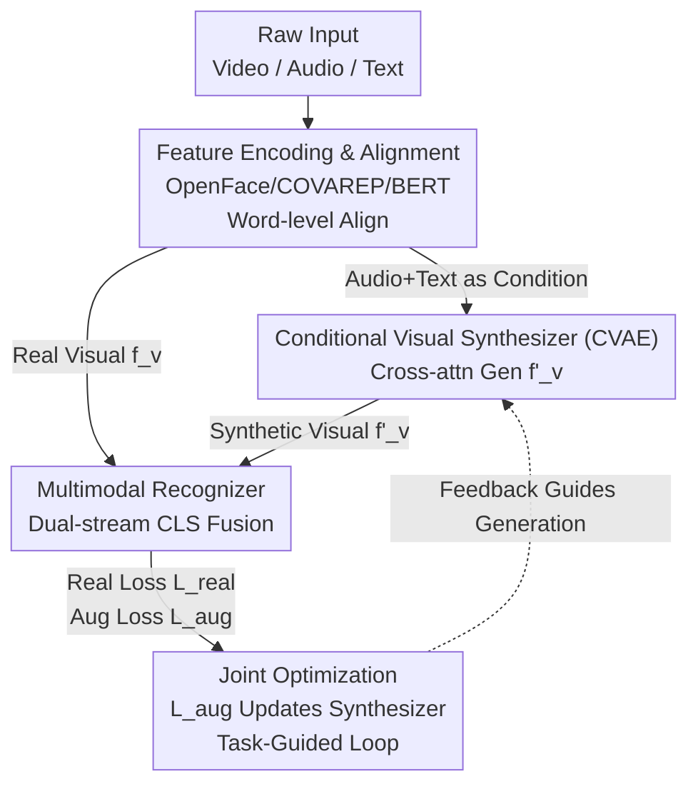

# Cross-Modal Guided Visual Synthesis for Data-Efficient Multimodal Depression Recognition

**Conference**: CVPR 2026  
**Paper**: [CVF Open Access](https://openaccess.thecvf.com/content/CVPR2026/html/Yang_Cross-Modal_Guided_Visual_Synthesis_for_Data-Efficient_Multimodal_Depression_Recognition_CVPR_2026_paper.html)  
**Code**: None  
**Area**: Medical Imaging / Multimodal VLM  
**Keywords**: Depression Recognition, Multimodal Fusion, Conditional Generative Augmentation, CVAE, Task-Guided Optimization  

## TL;DR
This work utilizes audio and text as conditions to synthesize novel "visual behavioral features" at the feature level via a CVAE to alleviate clinical depression data scarcity. The synthesis process is backward-guided by the loss of the downstream recognizer, ensuring synthesized features prioritize "utility for recognition" over mere "realism," achieving SOTA on DAIC-WOZ and E-DAIC.

## Background & Motivation
**Background**: Automatic Major Depressive Disorder (MDD) recognition increasingly relies on multimodal behavioral analysis—fusing facial expressions, vocal prosody, and linguistic content from interview videos. The visual channel is particularly critical, as core symptoms like psychomotor retardation and affective flattening are directly manifested through facial muscle activity, head pose, and eye gaze.

**Limitations of Prior Work**: Manually labeled multimodal clinical data is extremely scarce (DAIC-WOZ contains only 189 sessions), while deep visual encoders are notoriously data-hungry. Consequently, even with sophisticated multimodal fusion architectures, the fused visual features remain suboptimal due to insufficient training—high-quality fusion cannot salvage poorly learned visual representations. Existing countermeasures are inadequate: traditional geometric augmentation (flipping/cropping) provides only low-level robustness without generating semantically meaningful content, while cross-attention fusion architectures assume that features from each modality are already well-extracted, which fails when visual encoders are under-optimized.

**Key Challenge**: Data scarcity creates a bottleneck for visual representation learning, resulting in a "chicken-and-egg" cycle between learning good features and having enough data. Furthermore, mainstream generative data augmentation is **decoupled in two stages**: a generator is first trained independently to maximize "realism," and its output is then fed to downstream tasks as a static dataset, preventing downstream performance from guiding the generation process.

**Goal**: (1) Synthesize semantically meaningful visual features under data scarcity; (2) Align synthesis objectives with "recognition accuracy" rather than "visual fidelity."

**Key Insight**: The authors observe an implicit correlation between textual content, vocal prosody (how it is said), and facial expressions. Thus, audio and text can be used as **conditional information** to generate matching visual features.

**Core Idea**: Combine conditional generation (Audio + Text → Visual features) to supplement scarce visual data, and integrate downstream recognition loss into the generator to form a closed-loop feedback, producing "most discriminative" rather than "most realistic" visual features.

## Method

### Overall Architecture
CMG-VS is an end-to-end system integrating "data generation" and "recognition" within a single computational graph across four stages: **Feature Encoding & Alignment → Conditional Visual Synthesizer (CVAE) → Multimodal Recognizer → Joint Optimization**.

The process: Raw text/video/audio are first passed through encoders and aligned into synchronized sequences via word-level timestamps. The aligned audio + text features serve as "conditions" fed into the CVAE synthesizer to generate a novel visual feature sequence $f'_v$. The recognizer then runs two parallel data streams—a "Real Stream" (using original visual features $f_v$) and an "Augmented Stream" (replacing $f_v$ with synthesized $f'_v$). Both streams share the same fusion network for prediction. During joint optimization, recognition loss from the augmented stream is backpropagated to update the synthesizer, creating a closed-loop "recognition performance → guided generation" mechanism.

### Key Designs

**1. Conditional Visual Synthesizer: Translating "Audio + Text" to "Visual Behavioral Features"**

To address the inability to generate meaningful semantic content from poor visual features, the authors build a Conditional Variational Autoencoder (CVAE) to learn the conditional distribution $P(f_v \mid f_a, f_t)$. Both the encoder and decoder utilize Transformer blocks, with **cross-attention** used to inject conditions: in the encoder, the visual sequence $f_v$ acts as the Query, while the concatenated audio + text $f_{context}=[f_a, f_t]$ serves as Key/Value, forcing the model to focus on "context-relevant visual features." Latent variables are sampled via reparameterization $z = \mu + \sigma \odot \varepsilon$. The decoder is symmetric, translating the compressed $z$ into a temporally coherent visual sequence $f'_v \in \mathbb{R}^{N_t \times d_v}$ conditioned on $f_{context}$. Training maximizes the conditional ELBO:

$$L_{ELBO} = \mathbb{E}_{q_\phi(z|f_v,f_a,f_t)}[\log p_\theta(f_v|z,f_a,f_t)] - D_{KL}(q_\phi(z|f_v,f_a,f_t) \parallel p(z))$$

**2. Dual-Stream Hierarchical Fusion Recognizer: Shared Fusion for Real and Synthetic Data**

The recognizer predicts depression scores from $(f_{vision}, f_a, f_t)$, where $f_{vision}$ can be either real $f_v$ or synthetic $f'_v$. Both inputs pass through a **shared-weight** fusion network. A hierarchical fusion Transformer is used: intra-modal encoders provide temporal context, followed by a learnable `[CLS]` token that sequentially cross-attends to the three modalities:

$$(h^l_{cls})' = \text{CrossAttend}(h^{l-1}_{cls}, f^{ctx}_{vision}),\quad (h^l_{cls})'' = \text{CrossAttend}((h^l_{cls})', f^{ctx}_a),\quad h^l_{cls} = \text{CrossAttend}((h^l_{cls})'', f^{ctx}_t)$$

**3. Task-Guided Joint Optimization: Closed-Loop Feedback as the Core Innovation**

This is the central contribution, addressing the disconnect in two-stage augmentation. The total loss couples three components:

$$L_{total} = L_{real} + \lambda_{aug} L_{aug} + \lambda_{cvae}(L_{consis} + \beta L_{KL})$$

Where $L_{real}$ and $L_{aug}$ are MSE losses for original and augmented streams. The key mechanism: **gradients from the augmented loss $L_{aug}$ are backpropagated to update the synthesizer parameters**. This turns downstream performance into an optimization signal for the generator, shifting it from seeking "realism" (via $L_{consis}$) to seeking "utility" for the recognizer.

### Loss & Training
- **Synthesizer**: Consistency loss $L_{consis}$ (L1 reconstruction) + KL regularization $L_{KL}$.
- **Recognizer**: Real stream $L_{real}$ + Augmented stream $L_{aug}$ (MSE).
- **Strategy**: Alternating optimization, end-to-end joint training. Encoders include OpenFace 2.0 (AUs, Pose, Gaze), COVAREP (Acoustic), and BERT-base (Text).

## Key Experimental Results

### Main Results
Evaluated on DAIC-WOZ (Classification) and E-DAIC (Regression).

| Dataset | Task | Metric | CMG-VS | Prev. SOTA | Result |
|--------|------|------|--------|----------|------|
| DAIC-WOZ | Classification | F1↑ | **0.860** | 0.850 | SOTA |
| DAIC-WOZ | Classification | Precision↑ | **0.846** | ≤0.82 | Significant Gain |
| E-DAIC | Regression | CCC↑ | **0.69** | 0.68 | SOTA |
| E-DAIC | Regression | RMSE↓ | **4.35** | 4.47 | Lowest |

A key highlight is the significantly higher Precision (0.846), indicating fewer false positives while maintaining high Recall (0.875).

### Ablation Study

| Configuration | F1↑ | Note |
|------|-----|------|
| CMG-VS Full Model | **0.860** | Full setting |
| Two-Stage (No Task-Guidance) | 0.841 | Realism-only synthesis, Gain -1.9 |
| Recognizer-Only (No Synthesis) | 0.825 | No augmentation, Gain -3.5 |

| Condition Modality | F1↑ | Synthetic Feature Granularity | F1↑ |
|----------|-----|--------------|-----|
| Audio + Text (Full) | **0.860** | Full Visual (Full) | **0.860** |
| Text Only | 0.851 | AUs Only | 0.857 |
| Audio Only | 0.845 | Pose & Gaze Only | 0.837 |

### Key Findings
- **Task-guidance is the primary driver**: Removing task-guidance (moving to two-stage) drops F1 by 0.019, confirming that "task-useful features" outperform "realistic features."
- **Audio and Text are complementary**: Text provides slightly more visual synthesis cues than audio.
- **AUs are the most valuable visual component**: Synthesizing only Action Units (AUs) achieves an F1 of 0.857, nearly matching the full feature set.
- **Feature Space**: t-SNE shows CMG-VS learns more compact intra-class and separable inter-class representations.

## Highlights & Insights
- **Inverted Modality Perspective**: Instead of treating audio/text merely as fusion targets, using them as **conditions** to generate visual features leverages implicit cross-modal correlations to bypass the "visual data scarcity" bottleneck.
- **Breaking Two-Stage Decoupling**: Directing $L_{aug}$ gradients to the generator ensures the synthesis process is accountable to downstream performance.
- **Feature-level Synthesis**: Generating features rather than pixels is computationally efficient and avoids the instability of pixel-level generation on small clinical datasets.

## Limitations & Future Work
- **Feature-level Ceiling**: Synthesis quality is capped by the expressive power of pre-extracted features (OpenFace/COVAREP); information lost during encoding cannot be recovered.
- **Small Datasets**: DAIC-WOZ is small, and the use of a custom internal test set (due to non-public labels) makes exact cross-paper comparisons difficult.
- **Code Availability**: No open-source code is provided.
- **Future Directions**: Exploring pixel-level generation or generalizing the loop to other data-scarce multimodal domains.

## Related Work & Insights
- **Vs Geometric Augmentation**: CMG-VS generates semantic content beyond spatial transformations.
- **Vs Multimodal Fusion**: Instead of passively fusing existing features, it actively "recovers" missing or poor visual representations.
- **Vs Two-Stage Generative Augmentation**: It replaces the realism-maximization goal with a task-utility goal.
- **Vs Speech-driven Animation**: While sharing conditional generation principles, the objective here is discriminative power (classification accuracy) rather than perceptual realism (FID).

## Rating
- Novelty: ⭐⭐⭐⭐
- Experimental Thoroughness: ⭐⭐⭐
- Writing Quality: ⭐⭐⭐⭐
- Value: ⭐⭐⭐⭐

<!-- RELATED:START -->

## Related Papers

- [\[AAAI 2026\] Personality-guided Public-Private Domain Disentangled Hypergraph-Former Network for Multimodal Depression Detection](../../AAAI2026/medical_imaging/personality-guided_public-private_domain_disentangled_hypergraph-former_network_.md)
- [\[CVPR 2026\] MultiModalPFN: Extending Prior-Data Fitted Networks for Multimodal Tabular Learning](multimodalpfn_extending_prior-data_fitted_networks_for_multimodal_tabular_learni.md)
- [\[CVPR 2026\] Active Inference for Micro-Gesture Recognition: EFE-Guided Temporal Sampling and Adaptive Learning](active_inference_for_micro-gesture_recognition_efe-guided_temporal_sampling_and_.md)
- [\[CVPR 2026\] SPECTRE: Scaling Self-Supervised and Cross-Modal Pretraining for Volumetric CT Transformers](scaling_self-supervised_and_cross-modal_pretraining_for_volumetric_ct_transforme.md)
- [\[CVPR 2026\] CRFT: Consistent-Recurrent Feature Flow Transformer for Cross-Modal Image Registration](crft_consistent-recurrent_feature_flow_transformer_for_cross-modal_image_registr.md)

<!-- RELATED:END -->
