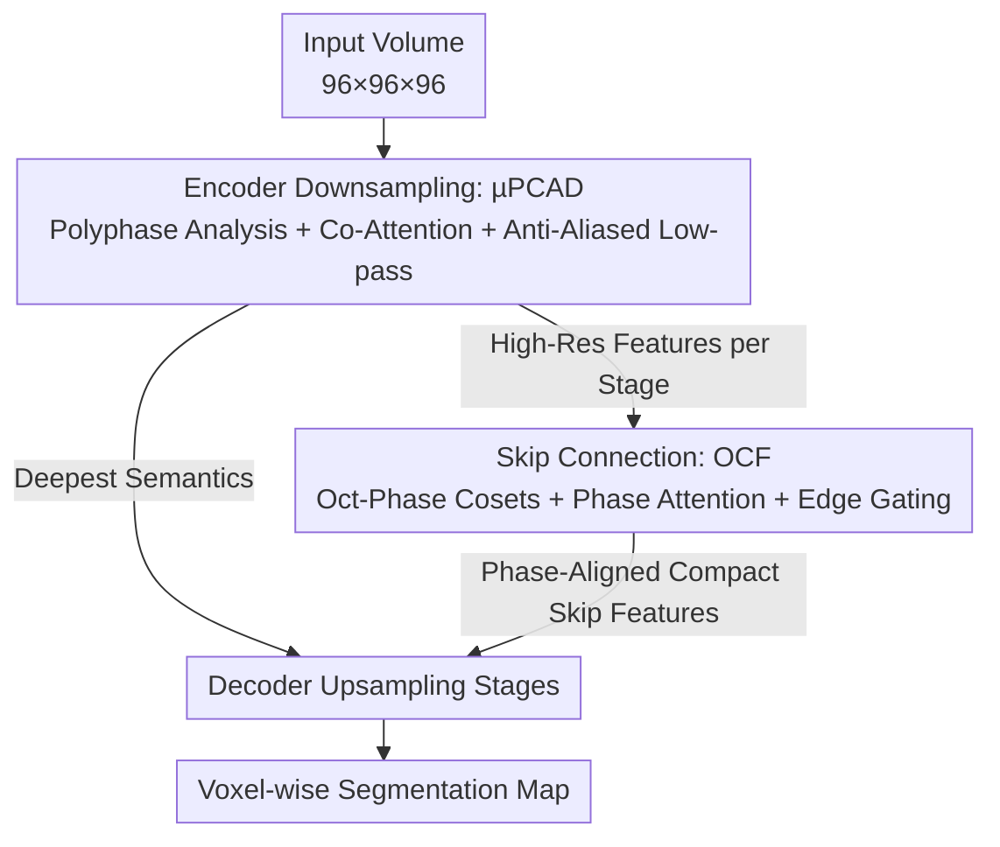

# CROWn: A Unified 3D Medical Segmentation Framework Integrating Anti-Aliased Downsampling and Phase-Calibrated Fusion

**Conference**: CVPR 2026  
**Paper**: [CVF Open Access](https://openaccess.thecvf.com/content/CVPR2026/html/Huang_CROWn_A_Unified_Framework_for_Anti-Aliased_Downsampling_and_Phase-Calibrated_Fusion_CVPR_2026_paper.html)  
**Code**: https://github.com/IMOP-lab/CROWn  
**Area**: Medical Imaging  
**Keywords**: 3D Medical Segmentation, Anti-Aliased Downsampling, Polyphase Analysis, Phase Calibration, Skip Connection Fusion

## TL;DR
CROWn integrates sampling theory into the two most information-prone stages of U-shaped segmentation networks—downsampling and skip connection fusion: using µPCAD for "pooling query × wavelet subband value" co-attention with explicit anti-aliasing low-pass filtering during extraction, and OCF to decompose high-resolution skip connections into eight phase cosets followed by phase attention and edge-gated alignment. It achieves comprehensive SOTA in IoU/Dice across 15 CT/MRI/OCT datasets with only 23.78M parameters.

## Background & Motivation

**Background**: 3D medical segmentation is dominated by U-shaped CNNs (3D U-Net, nnU-Net) or voxel Transformers (UNETR, SwinUNETR), with recent additions from ConvNeXt variants (3D UX-Net, MedNeXt) and State Space Models (SegMamba). These networks rely on strided convolutions or pooling for stage-wise downsampling and skip concatenation to pass high-resolution details back to the decoder.

**Limitations of Prior Work**: Clinical scans are inherently **anisotropic** (unequal three-axis voxel spacing, large slice thickness), compounded by spectral occupancy shifts from different devices, reconstruction kernels, or denoising pipelines. Strided convolutions and pooling do **not perform anti-aliasing** when compressing the spectrum—high frequencies are folded (aliasing), erasing fine structures and amplifying stair-step artifacts. Furthermore, skip connections directly concatenate these **already aliased high-frequency components** into the decoder, leading to poor fusion due to scale/phase misalignment with low-resolution semantics.

**Key Challenge**: Decimation, aliasing, and boundary evidence are **coupled**, yet existing architectures treat them as independent problems—either by stacking capacity (deeper/wider backbones) or using global attention for semantics, without controlling aliasing "at the moment of extraction" or explicitly aligning high-resolution evidence "before fusion." Consequently, models entangle device-dependent artifacts with anatomical structures, leading to poor cross-domain generalization.

**Goal**: To suppress aliasing at the downsampling interface (preserving boundary high frequencies) while performing phase alignment for high-resolution evidence before skip fusion, ensuring stable boundary localization and topological consistency across varied sampling regulations and devices.

**Key Insight**: The authors combine **polyphase analysis + anti-aliasing low-pass filtering** from signal processing with attention from representation learning. Downsampling is no longer a crude decimation but a process where features are decomposed into multiple phases/subbands, using attention to select boundary-relevant high frequencies and suppress false phase components, followed by explicit low-pass extraction.

**Core Idea**: Rewrite the two key operators of U-shaped networks—**downsampling** (µPCAD) and **skip connections** (OCF)—using "sampling theory × co-attention," making anti-aliasing and phase calibration built-in inductive biases rather than post-processing remedies.

## Method

### Overall Architecture

CROWn maintains a standard U-shaped encoder-decoder structure but replaces the two most information-lossy operators: every downsampling stage in the encoder is replaced by **µPCAD** (Anti-Aliased Co-Attentional Decimator), and every skip connection passes through **OCF** (Oct-Phase Coset Fibers) before entering the decoder. For a $96\times96\times96$ 3D patch, it outputs a voxel-wise segmentation map. These two modules are complementary: µPCAD manages "not folding high frequencies during the downward pass," while OCF handles "aligning high frequencies to the decoder's scale during the return pass."

### Key Designs

**1. µPCAD: Anti-Aliased Polyphase Co-Attention Downsampler**

Addressing the issue where "strided convolution/pooling folds high frequencies and erases fine structures during extraction," µPCAD splits one downsampling step into three: "polyphase decomposition → co-attention → explicit low-pass decimation," ensuring boundary-relevant high frequencies are preserved and false phases are suppressed. Given encoder features $X\in\mathbb{R}^{B\times C_{in}\times D\times H\times W}$, the module processes slices along the $W$ axis (typically the thick-slice axis in anisotropic data). For each slice, it uses two $1\times1$ mappings + stride-2 pooling to generate a **pooling branch** as query/key: $Q=\text{maxpool}$, $K=\text{avgpool}$. Simultaneously, a $1\times1$ mapping followed by **separable Haar wavelets** performs a stride-2 transform on $(D,H)$ to obtain four subbands as **values**:

$$\kappa_{LL}=l\otimes l,\quad \kappa_{LH}=l\otimes h,\quad \kappa_{HL}=h\otimes l,\quad \kappa_{HH}=h\otimes h$$

where $l=(2^{-1/2},2^{-1/2})$ is low-pass and $h=(2^{-1/2},-2^{-1/2})$ is high-pass. The critical "co-attention" is **cross-source**—it treats the pooling branches as query/key and wavelet subbands as value, effectively "using spatial statistics to retrieve which frequency subbands are worth preserving":

$$A_{b,:,i,j}=\sum_{h=1}^{H_a}\sum_{(i',j')\in\Pi_r}\frac{\exp(\langle q^{h}_{b,i,j},k^{h}_{b,i',j'}\rangle/\sqrt{\delta_h})}{\sum_{(u,v)}\exp(\langle q^{h}_{b,i,j},k^{h}_{b,u,v}\rangle/\sqrt{\delta_h})}\,v^{h}_{b,i',j'}$$

Subsequently, the polyphase fusion branch $L$, co-attention $A$, and low-frequency structure $V_{LL}$ are mixed via learnable gates $F=\sigma(\alpha)L+\sigma(\beta)A+\gamma\,\mathcal{J}(V_{LL})$, followed by a channel squeeze-excitation gate $\rho$. **The final step is the actual anti-aliased extraction**: applying a fixed low-pass kernel $k=(\tfrac14,\tfrac12,\tfrac14)$ for depthwise blur along the $W$ axis, followed by a stride-2 learnable projection-decimator $D^{(2)}_w$, reducing $W$ to half, resulting in a $D/2\times H/2\times W/2$ output. This "blur then decimate" approach is the classic method for anti-aliasing, but here the features have already been re-weighted by co-attention based on boundary relevance—thus redundant/artifact frequencies are suppressed while boundary frequencies remain. Ablations (Table 2) comparing it against SE/CBAM/Transformer/MedNeXt blocks on the same backbone show µPCAD yields the best boundaries (HD95 2.43 vs. 2.81 for the runner-up), indicating that "managing the moment of extraction" is more valuable than "simply adding capacity."

**2. OCF: Phase-Calibrated Skip Connection via Oct-Phase Coset Fibers**

Addressing the issue where "high-resolution skip connections directly pass aliased high frequencies to the decoder, causing phase misalignment with low-resolution semantics," OCF reconstructs skip connections into phase-aligned, compact, and boundary-aware features before fusion. Given high-resolution skip feature $U$, a fixed separable low-pass filter $G$ (kernel weights $1,2,1$) performs **anti-aliasing preprocessing** $B=G*U$. Then, a **3D space-to-depth** "oct-phase coset decomposition" is performed—splitting every $2\times2\times2$ neighborhood into 8 cosets $P_{pqr}$ according to phase $(p,q,r)\in\{0,1\}^3$, reducing each spatial dimension to half:

$$P^{pqr}_{b,c,i,j,k}=B_{b,c,\,2i+p,\,2j+q,\,2k+r}$$

This step explicitly preserves the phase information that would otherwise be lost when halving resolution as 8 channel groups. Next, a phase context mapping $\Xi$ scores the 8 phases, applying a softmax to generate weights $\omega_{pqr}$ for **phase attention** weighted aggregation $Z=\sum_{(p,q,r)}\omega_{pqr}P_{pqr}$—the network autonomously decides which phase's evidence is more reliable. An **edge gate** is then applied: using three-axis Sobel operators on the channel mean field to calculate edge magnitude $E=\sqrt{(K_x*A)^2+(K_y*A)^2+(K_z*A)^2+\varepsilon}$, which is normalized into a gate $\Gamma=1+\tanh(\eta)\,E/(\mu_E+\varepsilon)$ to amplify features at boundaries. Finally, depthwise-separable aggregation (channel-wise kernel + pointwise mixing) compresses it into compact channels. The entire pipeline can be described as a transmission through a fiber bundle $\pi:F\to\Pi$ as $G=N\,\varsigma(M(\kappa\star(\Gamma\cdot\bigoplus_a\text{lift}_\pi[G*U])))$. Consequently, skip features are semantically closer to the decoder's scale and no longer propagate aliasing. The component ablation in Table 5 proves that all four parts are indispensable: removing blur, using uniform (non-attentional) phase mixing, shuffling phases, or removing the edge gate all lead to a drop in Dice (e.g., HD95 increases from 4.30 to 5.33 without phase attention).

### Loss & Training
DiceCE loss + AdamW; inputs are randomly cropped into $96^3$ patches, batch size 1, trained for 320,000 steps; all baseline methods use the same 3D data augmentation (random rotation/translation/scaling) to ensure the tables reflect structural differences rather than augmentation differences. Inference uses MONAI's 3D sliding window. All experiments were conducted on 8×RTX 4090 (PyTorch 2.5.1 / CUDA 12.1).

## Key Experimental Results

### Main Results
Compared against 17 recent methods across 15 public CT/MRI/OCT datasets using IoU / Dice / HD95 metrics. CROWn achieved the highest IoU and Dice on **all datasets**, with particularly significant gains in anisotropic cohorts (FLARE2022, MSD Pancreas) and fine-structure data (OIMHS). Selected representative results:

| Dataset | Metric | CROWn | Runner-up | Note |
|--------|------|-------|----------|------|
| FLARE2022 | IoU / Dice | **82.65 / 89.76** | 81.58 / 88.86 (SegMamba) | Anisotropic multi-organ CT, HD95 reduced from 9.21 to 4.30 |
| OIMHS | IoU / Dice | **89.68 / 94.36** | 88.83 / 93.83 (SegMamba) | Fine layer interfaces in OCT, fewer stair-step artifacts |
| MSD Pancreas | IoU / Dice | **56.68 / 70.20** | 55.27 / 68.46 (DiffUNet) | Pancreatic tumor boundaries, less leakage |
| MSD Colon | IoU / Dice | **43.80 / 55.89** | 41.26 / 54.56 (VSmTrans) | Difficult small target segmentation |
| COVID-19 CT | IoU / Dice | **73.91 / 83.75** | 72.62 / 82.87 (SuperLightNet) | Robustness across modalities |

Boundary error (HD95) decreased overall, which the authors attribute to "anti-aliased extraction + calibrated skip fusion" preserving boundary evidence during cross-scale integration.

### Ablation Study

µPCAD vs. Classic Modules (Same 3D U-Net backbone, OIMHS):

| Configuration | IoU | Dice | HD95 | Note |
|------|-----|------|------|------|
| 3D U-Net | 87.69 | 93.18 | 2.91 | baseline |
| +SE / +CBAM | 88.88 / 88.56 | 93.89 / 93.69 | 2.84 / 2.81 | Channel/Spatial re-weighting |
| +Transformer | 88.26 | 93.50 | 2.99 | Global attention |
| +MedNeXt block | 88.79 | 93.83 | 2.83 | Large kernel updates |
| **+µPCAD** | **89.31** | **94.14** | **2.43** | Anti-aliased extraction, best boundaries |

OCF Component Attribution (FLARE2022):

| Configuration | IoU | Dice | HD95 | Note |
|------|-----|------|------|------|
| w/o Blur | 81.96 | 89.15 | 4.46 | Removed anti-aliasing low-pass |
| w/o Phase Attention | 81.94 | 89.26 | 5.33 | Used uniform phase mixing |
| Fixed Shift Phase | 81.53 | 88.80 | 4.62 | Shuffled/Fixed phase |
| **Full OCF** | **82.65** | **89.76** | **4.30** | Synergy of all four components |

### Key Findings
- **Full deployment of modules is most stable**: Placing µPCAD at every downsampling interface and OCF at every skip connection yields better results than using them in only a single layer—indicating that aliasing control and phase calibration are needed at "every scale conversion."
- **Anti-aliasing is more valuable than adding capacity**: In anisotropic voxels, µPCAD's boundary gains exceed pure capacity upgrades like SE/CBAM/Transformer/MedNeXt, validating the hypothesis of "managing the moment of sampling."
- **Axial selection is critical**: µPCAD performs best when polyphase analysis is conducted along the $W$ axis (thick-slice axis) (Table 3, IoU 89.68 vs. 88.98/88.43 for D/H), matching the intuition that anti-aliasing provides the greatest benefit in the thick-slice direction.
- **Efficiency-friendly**: CROWn uses only 23.78M parameters / 199.58G FLOPs, far lower than heavy stacks like 3D UX-Net (53M/631G) or SegMamba, yet achieves higher accuracy—explained as "concentrating capacity at scale conversions rather than deeper/wider backbones."

## Highlights & Insights
- **Turning signal processing's "low-pass then decimate" into a learnable operator**: The final step of µPCAD using a fixed blur kernel $(\tfrac14,\tfrac12,\tfrac14)$ + a learnable decimator is a neural network version of classic anti-aliasing; cleverly, features are re-weighted by co-attention before blurring, so the low-pass filter suppresses artifacts rather than details.
- **Smart cross-source co-attention design**: Using spatial pooling statistics as query/key and wavelet subbands as value essentially "uses spatial context to retrieve frequency subbands," which aligns better with the goal of "preserving boundary high frequencies and suppressing false phases" than simple self-attention.
- **Space-to-depth as a phase preserver**: instead of averaging out phase info during resolution halving, OCF explicitly decomposes it into 8 cosets for attentional selection. This "modeling phase explicitly" idea is transferable to any dense prediction task with up/downsampling (Super-res, depth estimation, optical flow).
- **Sobel edge gating** injects the "where are the boundaries" prior into skip connections at almost zero cost, offering a reusable lightweight trick.

## Limitations & Future Work
- The paper focuses on comprehensive SOTA in IoU/Dice/HD95, but several key ablations (stage-wise placement, cross-backbone, qualitative figures) are in the supplementary material; the main text relies on conclusive statements. ⚠️ Refer to the original supplementary material for specific values.
- µPCAD processes slices along a single $W$ axis; whether this remains the optimal axial choice for data that is truly strongly anisotropic across all three axes was only validated on OIMHS, requiring more data for generalization proof.
- The combination of oct-phase cosets and multi-head co-attention involves many operators. While total FLOPs are controlled, implementation complexity is high and relies on strong spacing assumptions (reflective boundary, $2\times2\times2$ neighborhood).
- Equations (4) and (10) present the pipeline as a single lattice/fiber-bundle form, appearing more as a demonstration of theoretical consistency. ⚠️ Whether actual implementation follows these closed-form calculations strictly or uses step-wise approximations needs code verification.

## Related Work & Insights
- **vs. Standard U-shaped CNN/Transformer (nnU-Net, UNETR, SwinUNETR)**: These use strided conv/pooling and skip concat, which neither control aliasing during extraction nor align skip phases; CROWn replaces these with µPCAD/OCF to specifically address aliasing and misalignment in anisotropic settings.
- **vs. Long-range modeling methods like SegMamba**: Mamba/Transformer rely on global context to patch semantics but remain weak at blurry interfaces; CROWn improves boundaries through sampling theory while being more efficient (23.78M vs. heavy stacks).
- **vs. Frequency domain/wavelet methods (WaveFormer)**: Pure frequency methods often weaken clinically significant edges during noise suppression; CROWn uses co-attention to let the network pick "which subbands to preserve" rather than one-size-fits-all filtering.
- **vs. Classic Anti-Aliasing (2D work like BlurPool)**: CROWn upgrades anti-aliasing from "fixed blur pooling" to "polyphase decomposition + attention routing + learnable decimation," expanding it to a dual-operator synergy (downsampling + skip connections) for 3D anisotropic scenarios.

## Rating
- Novelty: ⭐⭐⭐⭐ Solid and rare integration of polyphase sampling/anti-aliasing theory into both downsampling and skip connection operators.
- Experimental Thoroughness: ⭐⭐⭐⭐⭐ Comprehensive coverage across 15 datasets, 17 baselines, and multi-dimensional ablations (backbone/axis/component).
- Writing Quality: ⭐⭐⭐⭐ Clear mechanisms and complete equations, though heavy reliance on supplementary material for ablations.
- Value: ⭐⭐⭐⭐ High accuracy + low parameter count; µPCAD/OCF are plug-and-play for any U-shaped backbone, showing strong potential for clinical deployment and method transfer.

<!-- RELATED:START -->

## Related Papers

- [\[CVPR 2026\] Bridging RGB and Hematoxylin Components: An Interleaved Guidance and Fusion Framework for Point Supervised Nuclei Segmentation](bridging_rgb_and_hematoxylin_components_an_interleaved_guidance_and_fusion_frame.md)
- [\[CVPR 2025\] VISTA3D: A Unified Segmentation Foundation Model For 3D Medical Imaging](../../CVPR2025/medical_imaging/vista3d_a_unified_segmentation_foundation_model_for_3d_medical_imaging.md)
- [\[CVPR 2026\] GaussianPile: A Unified Sparse Gaussian Splatting Framework for Slice-based Volumetric Reconstruction](gaussianpile_a_unified_sparse_gaussian_splatting_framework_for_slice-based_volum.md)
- [\[CVPR 2026\] Tell2Adapt: A Unified Framework for Source Free Unsupervised Domain Adaptation via Vision Foundation Model](tell2adapt_a_unified_framework_for_source_free_unsupervised_domain_adaptation_vi.md)
- [\[CVPR 2026\] VoxTell: Free-Text Promptable Universal 3D Medical Image Segmentation](voxtell_free-text_promptable_universal_3d_medical_image_segmentation.md)

<!-- RELATED:END -->
