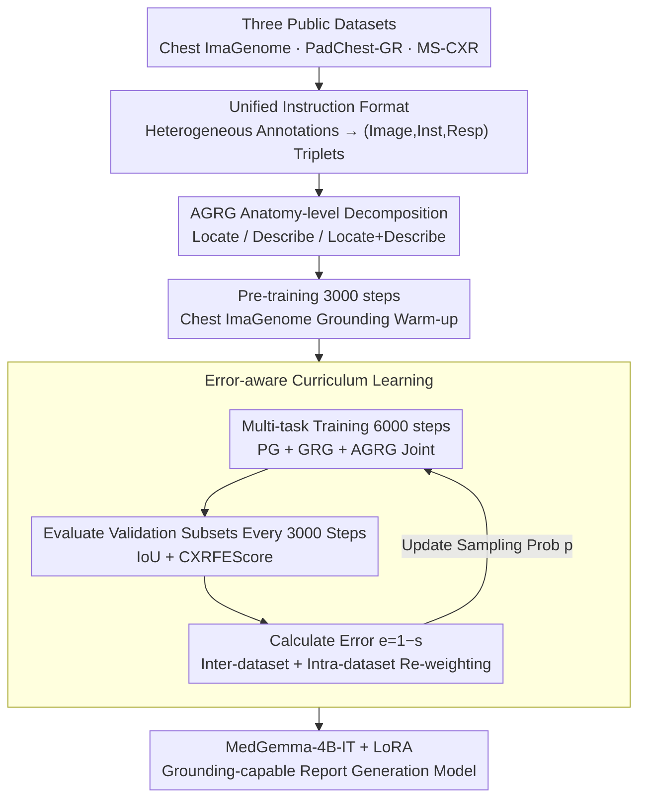

# CURE: Curriculum-guided Multi-task Training for Reliable Anatomy Grounded Report Generation

**Conference**: CVPR 2026  
**arXiv**: [2601.15408](https://arxiv.org/abs/2601.15408)  
**Code**: [Available](https://github.com/PabloMessina/CURE)  
**Area**: Medical Imaging  
**Keywords**: Curriculum Learning, Visual Grounding, Radiology Report Generation, Multi-task Learning, Hallucination Suppression  

## TL;DR

Ours proposes CURE—an error-aware curriculum-guided multi-task training framework. Without introducing additional data, it dynamically adjusts the sampling distribution to focus on difficult samples, improving visual grounding accuracy by +0.37 IoU and reducing the hallucination rate by 18.6% for medical VLMs.

## Background & Motivation

**Background**: Medical Vision-Language Models (VLMs) can automatically generate radiology reports from images. Representative methods like MAIRA-2 and MedGemma have achieved good results on multiple benchmarks.

**Limitations of Prior Work**: Existing models lack reliable visual grounding capabilities—textual descriptions of lesions cannot accurately correspond to image regions, leading to frequent "hallucinations" (e.g., as shown in Fig. 1, MAIRA-2 misreports a fracture in a normal clavicle region).

**Key Challenge**: Traditional phrase grounding training data is naturally biased toward abnormal findings, causing models to over-associate normal anatomical regions with abnormal labels, resulting in high false positive rates. Furthermore, the significant scale differences between datasets (Chest ImaGenome with 12.9 million vs. MS-CXR with only 815 instances) mean that standard proportional sampling causes small datasets to be overshadowed.

**Goal**: To simultaneously improve visual grounding accuracy and factual consistency of reports without introducing additional private data.

**Key Insight**: Drawing on Curriculum Learning—rather than using a fixed sampling ratio, sampling weights are dynamically adjusted based on the current performance of the model, allowing the model to focus more on data sources and anatomical categories it has not yet mastered.

**Core Idea**: Error-aware dual-level curriculum learning—at both the inter-dataset and intra-dataset (category-level) granularities, sampling probabilities are dynamically re-weighted based on model evaluation errors. Combined with Anatomy-guided Report Generation (AGRG) fine-grained task decomposition, a single image generates multiple training instances, efficiently utilizing existing public data.

## Method

### Overall Architecture

CURE uses MedGemma-4B-IT as the base model, fine-tuned with LoRA (rank=16, 4-bit). The pipeline consists of two steps: "Data Restructuring → Two-stage Curriculum Training."

**Data Restructuring**: Heterogeneous annotations (boxes, phrases, anatomical labels, descriptions) from three public datasets (Chest ImaGenome, PadChest-GR, MS-CXR) are unified into `(Image, Instruction, Response)` triplets. Scene graphs from Chest ImaGenome are split by anatomical location into three types of fine-grained instances: Locate / Describe / Locate+Describe, expanding approximately 237,000 images into tens of millions of multi-task training samples.

**Two-stage Curriculum Training**: First, a 3000-step grounding warm-up is performed on Chest ImaGenome, followed by 6000 steps of joint training for PG, GRG, and AGRG tasks. During the multi-task phase, the process pauses every 3000 steps to re-rank the sampling probabilities at both the dataset and category levels using measured performance (IoU + CXRFEScore) on validation subsets, ensuring training compute continues to lean toward "unlearned" data sources and anatomical regions. Three key designs unfold along this pipeline: first unifying heterogeneous data, then performing AGRG anatomy-level decomposition, and finally using error-aware curriculum for dynamic scheduling.

### Key Designs

**1. Unified Instruction Format: Packing four types of heterogeneous supervision into the same instruction-following template**

Supervision signals for the three tasks take different forms—PG (Phrase Grounding) is phrase-box pairs, GRG (Grounded Report Generation) is full reports with boxes, and AGRG is location-box/description pairs. If each used a separate format, the model would effectively learn three interfaces, leading to task interference. CURE unifies them all into `(Image, Instruction, Response)` triplets: PG is written as `"Ground the phrase: {phrase}"` → `"phrase: [cx,cy,w,h]..."`, while GRG is `"Generate a grounded report"` → full report containing bbox coordinates. This unified template allows all tasks to share parameters and decoding logic, reducing conflict. This step also includes data augmentation: For PadChest-GR, in addition to original sentence-box pairs, label-box pairs are extracted, nearly doubling PG training data.

**2. Anatomy-guided Report Generation (AGRG) Decomposition: Splitting a single scene graph into dozens of instances to decouple grounding and description**

A chronic issue in medical grounding training is the natural bias towards abnormal findings. Models often only see "where the lesion is," causing them to over-associate normal regions with abnormal labels, leading to false positives. CURE splits Chest ImaGenome scene graphs into three sub-tasks based on anatomy: Locate (Anatomy name → `[cx, cy, w, h]` box, covering 36 locations), Describe (Anatomy name → text description, 38 locations), and Locate+Describe (Box and description together, 29 locations), with uniform sampling to maintain balance. This decomposition has two benefits: explicit decoupling—separating "drawing the box" and "saying it correctly" before joining them in Locate+Describe to avoid interference; and data efficiency—one image can generate 9-36 training instances, expanding 237,000 images into 12.9 million supervision points, of which about 1.74% are actually used due to compute limits. More importantly, since every anatomical location (including normal regions) is an independent sample, the model sees many "this is normal" descriptions, suppressing the bias to misreport normal areas as abnormal.

**3. Error-aware Curriculum Learning: Automatically shifting compute to "unlearned" data sources and categories**

This directly addresses the core contradiction of dataset scale (Chest ImaGenome 12.9M vs. MS-CXR 815). Proportional sampling would drown out small datasets and lead to underfitting of infrequent but clinically important regions. CURE does not use fixed ratios but pauses every 3000 steps to re-rank weights based on current performance. This scheduling operates at two levels. **Inter-dataset**: For each source $D_i$, a combined score is calculated:

$$s_i = \alpha \cdot \text{IoU}_i + (1-\alpha) \cdot \text{CXRFEScore}_i$$

balancing grounding accuracy (IoU) and factual consistency (CXRFEScore), then normalizing the error $e_i = 1 - s_i$ into the next round's sampling probability $p_i = e_i / \sum_j e_j$. Data sources with poorer performance have higher errors and sampling probabilities. **Intra-dataset**: The same logic applies within datasets—MS-CXR phrase grounding is re-weighted by 8 phrase categories, PadChest-GR by 26 high-level label groups, and Chest ImaGenome AGRG by 29–38 anatomical locations. Only PadChest-GR's GRG task maintains uniform sampling due to the co-occurrence of multiple findings. This "patching the weak spots" scheduling is more effective than fixed sampling at utilizing limited training steps.

### Loss & Training

- Standard autoregressive language model loss (next-token prediction).
- Optimizer: AdamW, learning rate $2 \times 10^{-4}$, linear schedule + 0.03 warmup.
- Effective batch size = 25 (per-device 5 × gradient accumulation 5).
- Gradient clipping max_norm = 0.3.
- Data Augmentation: Spatial transforms + CLAHE (Contrast Limited Adaptive Histogram Equalization).
- Pre-training and multi-task stages initialize the optimizer independently, retaining only model weights.

## Key Experimental Results

### Main Results

**Table 1: Phrase Grounding IoU**

| Model | MS-CXR Mi.↑ | MS-CXR Ma.↑ | PadChest Mi.↑ | PadChest Ma.↑ | VinDr (Zero-shot) Mi.↑ | VinDr Ma.↑ |
|------|-------------|-------------|---------------|---------------|-------------------|------------|
| MAIRA-2 | 0.496 | 0.452 | 0.280 | 0.287 | 0.162 | 0.115 |
| **CURE** | **0.554** | **0.495** | **0.453** | **0.438** | **0.244** | **0.205** |

CURE outperforms MAIRA-2 across all datasets and metrics, with particularly significant gains on PadChest-GR (+0.173 / +0.151).

**Table 2: Anatomy-guided Report Generation (AGRG) - Chest ImaGenome**

| Model | IoU↑ | F1-Mi↑ | F1-Ma↑ | Cos.↑ | CXRFEScore↑ |
|------|------|--------|--------|-------|-------------|
| MAIRA-2 | 0.226 | 0.272 | 0.100 | 0.557 | 0.360 |
| MedGemma-4B-IT | – | 0.344 | 0.294 | 0.631 | 0.477 |
| **CURE** | **0.596** | **0.474** | 0.273 | **0.649** | **0.548** |

IoU increased from 0.226 → 0.596 (+0.37), more than doubling grounding accuracy; CXRFEScore +0.188.

**Table 3: MIMIC-CXR Report Generation**

| Model | F1-Ma↑ | F1-Mi↑ | Cos.↑ | CXRFEScore↑ | RadF1↑ |
|------|--------|--------|-------|-------------|--------|
| CXRMate-RRG24 | 0.414 | 0.589 | 0.764 | 0.656 | **0.255** |
| MAIRA-2 (w/ grounding) | 0.304 | 0.490 | 0.751 | 0.603 | 0.120 |
| CURE (AGRG+GRG) | **0.415** | 0.562 | **0.792** | 0.655 | 0.176 |

CURE achieved the best scores in CheXbert Cosine Similarity (0.792) and F1-Ma (0.415), performing competitively with the competition winner CXRMate-RRG24.

### Ablation Study

**Table 4: Stepwise Ablation (Excerpt from Table 7)**

| Configuration | AGRG IoU↑ | AGRG CXRS↑ | GRG IoU↑ | MS-CXR PG↑ | PadChest PG↑ | VinDr PG↑ |
|------|-----------|-----------|----------|------------|-------------|----------|
| v1: Base | 0.393 | 0.565 | 0.171 | 0.389 | 0.356 | 0.192 |
| v2: +Aug | 0.378 | 0.552 | 0.185 | 0.406 | 0.365 | 0.205 |
| v5: +Aug+CL(3k) | 0.419 | 0.552 | 0.180 | 0.432 | 0.393 | 0.205 |
| v8: +Aug+CIG(3k)+CL(3k) | 0.469 | 0.546 | 0.206 | 0.497 | 0.422 | 0.225 |
| **v9 (CURE)**: +HPS | **0.596** | **0.548** | **0.265** | **0.554** | **0.453** | **0.244** |

- Curriculum learning re-weighting every 3000 steps was optimal.
- CIG pre-training from 1k → 3k steps brought consistent grounding gains.
- Hyperparameter Search (HPS) provided the final jump, with AGRG IoU moving from 0.469 → 0.596.

### Key Findings

1. **Significant Hallucination Reduction**: CURE's average abnormal hallucination rate is 8.78% vs. 26.50% for MAIRA-2 (67% reduction); notably, for the clavicle region, MAIRA-2 hallucinated 59-63% of the time, while CURE was only at 1%.
2. **Contradiction Rate Halved**: In NLI evaluation, CURE's contradiction rate was 17.44% vs. 33.22% for MAIRA-2, with an entailment rate of 39.50% vs. 15.94%.
3. **Zero-shot Generalization**: On VinDr-CXR (unseen during training), CURE achieved a PG IoU of 0.244 vs. MAIRA-2's 0.162.
4. **No Private Data Required**: CURE trained only on public data surpassed the IoU of MAIRA-2, which uses 190,000 private reports.

## Highlights & Insights

- **Dual-level curriculum learning is a key innovation**: It solves both inter-dataset and intra-category imbalance without adding extra network modules.
- **Fine-grained task decomposition significantly improves data efficiency**: 237k images → 12.9M training instances, using only ~1.74% of the potential pool.
- **AGRG replaces traditional Finding-Generation objectives**: By exposing the model to both normal and abnormal descriptions, it fundamentally mitigates false positive bias.
- **Granting grounding capability from scratch**: MedGemma-4B-IT originally had no visual grounding; after CURE training, its grounding capability exceeded that of the purpose-built MAIRA-2.
- **Low training cost**: LoRA rank=16 / 4-bit, completed in 9000 steps without requiring massive compute.

## Limitations & Future Work

1. **Report-level text quality slightly inferior**: On the PadChest-GR GRG task, text metrics still lag behind MAIRA-2 (F1-Mi 0.507 vs. 0.592), which uses private data.
2. **Validated only on Chest X-rays**: All experiments are limited to the CXR domain; transferability to CT/MRI/Pathology is unknown.
3. **Increased Cardiac Silhouette hallucinations**: CURE's hallucination rate in the cardiac silhouette (25.67%) was higher than MAIRA-2 (2.00%), suggesting curriculum learning might over-correct certain categories.
4. **Lower RadF1**: CURE's RadF1 (0.176) is significantly lower than CXRMate-RRG24 (0.255), which uses RL+RadF1 reward for specific optimization.
5. **NLI evaluation via Gemini**: Hallucination assessment relies on an external LLM, potentially introducing evaluation bias.

## Related Work & Insights

- **MAIRA-2**: The direct competitor, also performing multi-task grounding and report generation, but relies on the private USMix dataset and lacks curriculum learning.
- **MedGemma-4B-IT**: The base model for CURE, which lacks native visual grounding, demonstrating the generalizability of the CURE framework.
- **CXRMate-RRG24**: Competition winner using RL + RadGraph F1 reward; leads in RadF1 but lacks grounding capabilities.
- **Self-Paced Curriculum Learning (SPCL)**: CURE’s strategy can be viewed as an extension of SPCL for medical multi-tasking—using IoU + CXRFEScore instead of pure loss to measure sample difficulty.
- **Insight**: The error-aware sampling strategy can be generalized to any multi-dataset multi-task training scenario (e.g., autonomous driving sensor fusion, multilingual NLP).

## Rating

⭐⭐⭐⭐ The method is concise and efficient, with solid and sufficient experiments. It achieves significant improvements in grounding and reliability without increasing data or model complexity, although there is room for improvement in text generation quality and it is limited to the CXR domain.

<!-- RELATED:START -->

## Related Papers

- [\[ICLR 2026\] Rethinking Radiology Report Generation: From Narrative Flow to Topic-Guided Findings](../../ICLR2026/medical_imaging/rethinking_radiology_report_generation_from_narrative_flow_to_topic-guided_findi.md)
- [\[CVPR 2026\] Phrase-grounded APO for Improving Chest X-ray Report Generation](phrase-grounded_apo_for_improving_chest_x-ray_report_generation.md)
- [\[CVPR 2026\] SAT-RRG: LLM-Guided Self-Adaptive Training for Radiology Report Generation with Token-Level Push–Pull Optimization](sat-rrg_llm-guided_self-adaptive_training_for_radiology_report_generation_with_t.md)
- [\[ICML 2026\] CAME-Grad: The Double Dilemma in Multi-Task Radiology Report Generation — A Gradient Dynamics Analysis and Solution](../../ICML2026/medical_imaging/the_double_dilemma_in_multi-task_radiology_report_generation_a_gradient_dynamics.md)
- [\[CVPR 2026\] BiOTPrompt: Bidirectional Optimal Transport Guided Prompting for Disease Evolution-aware Radiology Report Generation](biotprompt_bidirectional_optimal_transport_guided_prompting_for_disease_evolutio.md)

<!-- RELATED:END -->
