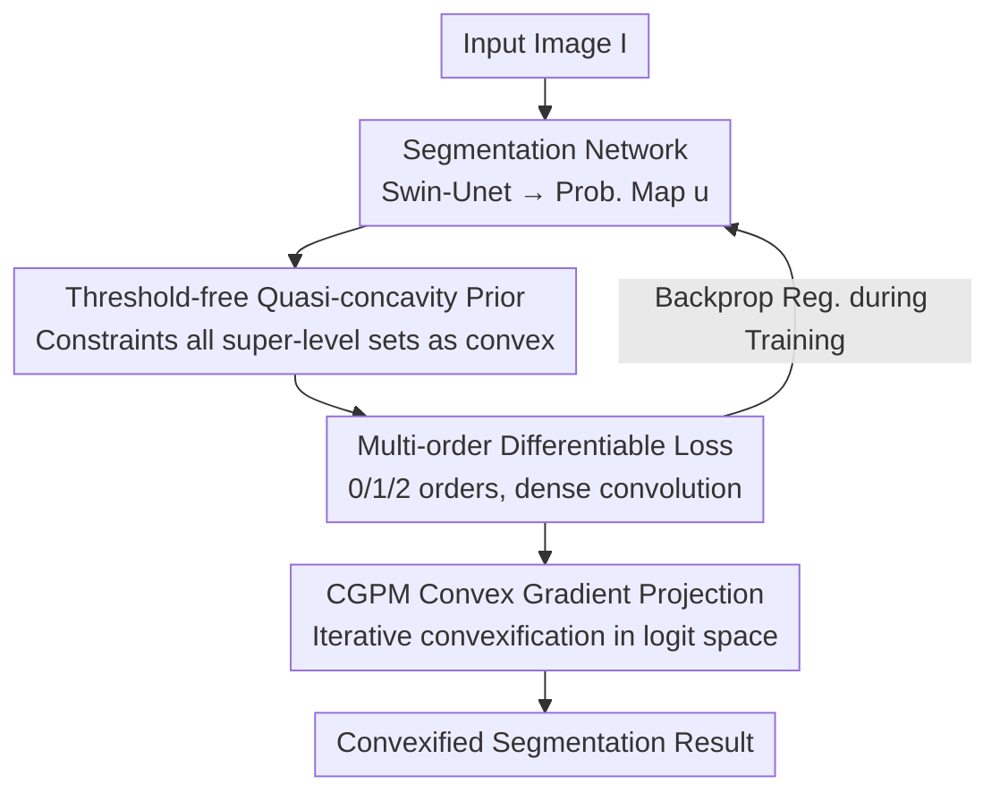

# D-Convexity: A Unified Differentiable Convex Shape Prior via Quasi-Concavity for Data-driven Image Segmentation

**Conference**: CVPR 2026  
**arXiv**: [2605.19210](https://arxiv.org/abs/2605.19210)  
**Code**: https://github.com/ShengzheC/D-Convexity (Available)  
**Area**: Medical Image / Image Segmentation / Shape Prior  
**Keywords**: Convex shape prior, Quasi-concavity, Differentiable segmentation, Retinal segmentation, Level set

## TL;DR
The "convex segmentation" prior is reformulated from a global constraint on binary sets into a **quasi-concavity** constraint on the network's output probability map $u$. This yields a threshold-free, differentiable, and densely computable convexity loss. Further, a Convex Gradient Projection Module (CGPM) is used to enforce hard convexity during inference. The method consistently improves Dice/IoU and reduces Hausdorff distance for near-convex structures such as retinal and cardiac anatomy.

## Background & Motivation

**Background**: In medical image segmentation, many anatomical structures (optic disc, optic cup, heart ventricles, pupils) are inherently convex or near-convex. When data is noisy, samples are scarce, or occlusions occur, injecting a "convex region" shape prior into the network can significantly suppress holes, protrusions, and erroneous merging of adjacent instances. Classic approaches are split into discrete combinatorial optimization (1–0–1 penalties on collinear triplets, graph-cut/ILP convexity constraints) and continuous level set methods (constraining non-negative curvature or non-negative Laplacian of the signed distance function).

**Limitations of Prior Work**: Both approaches are difficult to integrate into end-to-end trainable networks. Discrete methods rely on branch-and-bound or approximate solvers, which are non-differentiable and cannot couple with backpropagation. Continuous level set methods formulate convexity as PDE constraints, which are theoretically elegant but either serve only as necessary (not sufficient) conditions or **guarantee convexity only at a specific threshold (e.g., the $\phi=0$ level set)**. For a decoder outputting continuous probabilities, choosing the correct threshold is problematic, making it unsuitable as a differentiable loss. Recent deep shape priors include shape terms in the loss but lack explicit control over true convexity.

**Key Challenge**: Convexity is naturally a geometric property defined on **binary sets**, whereas networks output a continuous probability map $u \in [0,1]$. Constraining the set $S_\gamma=\{x:u(x)\ge\gamma\}$ to be convex for a specific threshold $\gamma$ requires selecting that threshold and handling set-valued constraints, which is neither differentiable nor elegant.

**Goal**: To identify a convexity constraint that directly acts on the continuous function $u$, requires no threshold selection, is differentiable, can be computed densely, and clarifies the relationships between various existing convexity models.

**Key Insight**: From a functional perspective, instead of constraining a binary mask at a single threshold, one can require the super-level sets $S_\gamma$ to be convex for **all** thresholds simultaneously. The condition that "all super-level sets are convex" is exactly the definition of a **quasi-concave** function $u$. This step shifts the constraint from the set level directly to the function level.

**Core Idea**: Express the convex shape prior via the quasi-concavity of $u$ ($u \text{ is quasi-concave} \iff \forall \gamma, S_\gamma \text{ is a convex set}$). Differentiable local inequalities of zeroth, first, and second order are derived based on the smoothness of $u$ ($u \in C^0/C^1/C^2$), transforming a global convexity constraint into point-wise penalties implementable via convolutions.

## Method

### Overall Architecture
Let the segmentation network $\mathcal{N}(I;\Theta)$ output raw features $o$, which yield the probability map $u=\mathcal{S}(o):\Omega\to[0,1]$ via sigmoid. Instead of directly constraining a specific $S_\gamma$, the framework requires $u$ to be quasi-concave. This functional constraint is decomposed into three computable conditions: a zeroth-order local midpoint convexification algorithm, a first-order gradient inequality linked to supporting hyperplanes, and a second-order quadratic form condition for the Hessian on the tangent space. Both first and second-order conditions are formulated as compact, threshold-free convolutional losses applied densely across the image. During training, these quasi-concavity losses act as regularization terms alongside fidelity losses (Dice/Cross-entropy). During inference, the CGPM projects the network output onto a more convex solution as a hard constraint.

### Key Designs

**1. Quasi-concavity: Reformulating "Set Convexity" as a Threshold-free "Functional Quasi-concavity" Prior**

Convexity constraints are typically tied to a binary set produced by a threshold, making them non-differentiable. The key observation is that $S_\gamma$ is a super-level set of $u$. If **$S_\gamma$ is convex regardless of the choice of $\gamma$**, it is equivalent to $u$ being quasi-concave:

$$u \text{ is quasi-concave} \iff \forall \gamma, S_\gamma = \{x \in \Omega : u(x) \ge \gamma\} \text{ is a convex set}$$

This reformulation offers three benefits: it eliminates threshold selection; it provides 0/1/2-order conditions based on the smoothness class ($C^0/C^1/C^2$) of $u$; and the constraints are differentiable and compatible with deep learning frameworks. Note that quasi-concavity is weaker than concavity; while concavity requires the function to be below its tangent plane everywhere, quasi-concavity only requires convex super-level sets, perfectly matching "convex shape" without overly constraining the magnitude of the probability map.

**2. Multi-order Differentiable Features: Point-wise Losses via Convolution**

Quasi-concavity is expanded into three equivalent or sufficient conditions for implementation:

- **Zeroth-order** ($u \in C^0$, Theorem 1): $u(\lambda x + (1-\lambda)y) \ge \min\{u(x), u(y)\}$. This is implemented as a local midpoint convexification algorithm. For each pixel $y$ and offset $d$, the midpoint $m=y+d$ and reflection $z=y+2d$ are used to update $u(m) \leftarrow \max(u(m), \min\{u(y), u(z)\})$. Iterative propagation monotonically raises $u$ and converges.
- **First-order** ($u \in C^1$, Theorem 2): If $u(x) \ge u(y)$, then $\nabla u(y)^\top(x-y) \ge 0$. Geometrically, the gradient $\nabla u$ at boundary points points into the set, defining a supporting half-space. The corresponding loss penalizes pixel pairs violating this inequality using a soft sigmoid approximation:
$$\mathcal{L}_{1st}(u) = \frac{1}{|\Omega|} \sum_{y \in \Omega} \sum_{x \in N_y} \mathrm{Sigmoid}_\varepsilon \big( u(x) - u(y) \big) \cdot \mathrm{ReLU} \big( -\nabla u(y)^\top(x - y) \big)$$
- **Second-order** ($u \in C^2$, Theorem 4/5): The Hessian is negative definite on the tangent space. In 2D, with tangent direction $d=(-u_y, u_x)$, the condition simplifies to an explicit quadratic form:
$$Q_2(x) = u_x^2 u_{yy} - 2 u_x u_y u_{xy} + u_y^2 u_{xx} < 0$$
The loss checks this point-wise (complexity $\mathcal{O}(|\Omega|)$). It is gated by the gradient magnitude and includes a margin $\delta$:
$$\mathcal{L}_{2nd}(u) = \frac{1}{|\Omega|} \sum_{x \in \Omega} \|\nabla u(x)\| \cdot \mathrm{ReLU} \big( Q_2(x) + \delta \big)$$
All differential operators ($u_x, u_y, u_{xx}, u_{xy}, u_{yy}$) are implemented using finite difference convolution kernels for efficiency. The 2nd-order condition is the default choice.

**3. CGPM: Projection to Convex Solutions during Inference**

Soft losses during training do not strictly guarantee convexity at inference. The Convex Gradient Projection Module (CGPM) solves a proximal convexification problem given the raw logit $o$ and $u = \mathrm{Sigmoid}(o)$:

$$u_p \in \arg\min_{v \in [0, 1]} \tfrac{1}{2}\|v - u\|^2 + \lambda \cdot \mathcal{L}_{convex}(v)$$

where $\mathcal{L}_{convex}$ is either $\mathcal{L}_{1st}$ or $\mathcal{L}_{2nd}$. This is solved via unrolled gradient descent in logit space. The first term ensures fidelity to the original prediction, while the second pushes for convexity.

**4. Unification of Prior Convexity Models**

The quasi-concave framework unifies several existing methods: [13]'s collinearity constraint is the 0th-order condition; the binary convolution conditions in [17,23,20] can be derived from the 1st-order half-space inclusion; and curvature-based constraints [32,39] or SDF Laplacian constraints [22,38] correspond to the 2nd-order condition. Letting $\phi = -u$, the curvature $\kappa$ is:

$$\kappa(x) = \frac{-Q_2(x)}{\|\nabla u(x)\|^3}$$

Thus, constraining $Q_2(x) < 0$ yields $\kappa(x) > 0$. This highlights that previous $\kappa \ge 0$ constraints were necessary but not sufficient for convexity.

### Loss & Training
The default configuration uses Swin-Unet as the backbone with inputs resized to $224 \times 224$ and $\mathcal{L}_{2nd}$ within the CGPM. The framework is trained with Cross-entropy. CGPM parameters: $\eta=10^{-2}$, $\lambda=1$, $T_{\max}=100$. Optimization uses AdamW + OneCycle for 200 epochs with a batch size of 6 and a max learning rate of $10^{-4}$.

## Key Experimental Results

### Main Results
Shape-aware method comparison (Table 1, Swin-Unet backbone, REFUGE $\to$ RIM-ONE-r3 generalization):

| Dataset | Metric | Ours | U-Net | Active Boundary |
|--------|------|------|-------|-----------------|
| REFUGE | Dice ↑ | **88.61** | 84.66 | 84.82 |
| REFUGE | IoU ↑ | **79.54** | 73.71 | 73.63 |
| REFUGE | HD ↓ | **5.859** | 11.07 | 10.59 |
| RIM-ONE-r3 (Generalization) | Dice ↑ | **83.09** | 76.48 | 75.37 |
| RIM-ONE-r3 (Generalization) | HD ↓ | **12.59** | 20.57 | 20.64 |

### Ablation Study
Orders of conditions and backbone adaptability (Table 3, 10 paired trials on REFUGE, gain $\Delta$ over respective baseline):

| Backbone | Prior | Dice Δ | IoU Δ | HD Δ |
|------|------|--------|-------|------|
| U-Net | 0th-order | −0.156 | −0.232 | −0.098 |
| U-Net | 1st-order | +0.429 | +0.644 | −0.832 |
| U-Net | 2nd-order | **+1.510** | **+2.280** | **−2.240** |
| Swin-Unet | 2nd-order | **+2.375** | **+3.711** | **−1.630** |
| DeepLabV3+ | 2nd-order | **+6.569** | **+9.202** | **−3.324** |

### Key Findings
- **2nd-order Optimality**: Across all backbones, $\mathcal{L}_{2nd}$ provides the largest Dice/IoU gains and HD reductions. The gains increases as the backbone's inherent shape ability decreases.
- **0th-order Limitation**: Directly applying midpoint convexification is too aggressive for raw outputs, leading to slight performance drops. It is treated as an interpretable but less practical baseline.
- **Robust Generalization**: On cross-dataset testing (REFUGE to RIM-ONE-r3), the Dice score is 83.09 vs. U-Net's 76.48, showing that convexity priors are highly effective against domain shifts.
- **Inference Cost**: CGPM increases inference time from 0.01s to 0.12s per image, a manageable trade-off for guaranteed convexity.

## Highlights & Insights
- **Functional Perspective**: Shifting from "set convexity at a threshold" to "functional quasi-concavity" bypasses non-differentiability and threshold selection. This approach could extend to other geometric constraints like connectivity or star-shape priors.
- **Computational Efficiency of $Q_2$**: The 2nd-order condition has $\mathcal{O}(|\Omega|)$ complexity compared to the $\mathcal{O}(|\Omega|^2)$ requirements of 0th/1st-order pixel pairs. Implementing differential geometry via convolution kernels is engineering-friendly.
- **Theoretical Unification**: By establishing $\kappa = -Q_2/\|\nabla u\|^3$, the paper unifies discrete, convolutional, and level-set priors into one framework and correctly identifies the insufficiency of previous curvature necessary conditions.
- **Dual-purpose CGPM**: The module serves as both a differentiable regularizer during training and a hard convexifier during inference, bridging the gap between soft constraints and hard requirements.

## Limitations & Future Work
- **Limited to Near-Convex Structures**: Gains are specifically for convex anatomical targets. For concave, branching, or complex topologies (e.g., vessel trees), the convex prior acts as a harmful constraint.
- **Sufficient Condition and Smoothness**: $Q_2 < 0$ is a sufficient but not necessary condition for quasi-concavity and assumes $u \in C^2$. Reliability at sharp boundaries remains to be fully explored.
- **Inference Overhead**: Although 0.12s is fast, it is a 12x increase which might be a bottleneck for real-time or high-resolution applications.
- **Future Directions**: Extension to 3D volumetric data and exploring adaptive radii for local convexity.

## Related Work & Insights
- **vs. Discrete Optimization**: These use global combinatorial constraints that are non-differentiable. Ours reformulates these (0th-order) into the continuous domain for backpropagation.
- **vs. Level Set/SDF Methods**: Previous methods only guaranteed convexity at a single threshold and used conditions like $\kappa \ge 0$ that are only necessary. Ours is threshold-free and provides a sufficient condition.
- **vs. Deep Shape Losses**: Prior works lacked explicit/threshold-free convexity control. This work provides a differentiable point-wise loss and a hard inference constraint within a unified theoretical framework.

## Rating
- Novelty: ⭐⭐⭐⭐⭐ (Uses quasi-concavity to elegantly solve the threshold-free differentiability problem)
- Experimental Thoroughness: ⭐⭐⭐⭐ (Solid ablation and cross-dataset tests, though limited to convex targets)
- Writing Quality: ⭐⭐⭐⭐⭐ (Clear mathematical derivation well-linked to implementation)
- Value: ⭐⭐⭐⭐ (A practical plug-and-play module for medical segmentation with strong theoretical backing)

<!-- RELATED:START -->

## Related Papers

- [\[CVPR 2026\] Multimodal Causality-Driven Representation Learning for Generalizable Medical Image Segmentation](multimodal_causal-driven_representation_learning_for_generalizable_medical_image.md)
- [\[CVPR 2026\] SHAPE: Structure-aware Hierarchical Unsupervised Domain Adaptation with Plausibility Evaluation for Medical Image Segmentation](shape_structure-aware_hierarchical_unsupervised_domain_adaptation_with_plausibil.md)
- [\[CVPR 2026\] MultiModalPFN: Extending Prior-Data Fitted Networks for Multimodal Tabular Learning](multimodalpfn_extending_prior-data_fitted_networks_for_multimodal_tabular_learni.md)
- [\[CVPR 2026\] PGR-Net: Prior-Guided ROI Reasoning Network for Brain Tumor MRI Segmentation](pgr-net_prior-guided_roi_reasoning_network_for_brain_tumor_mri_segmentation.md)
- [\[CVPR 2026\] OSA: Echocardiography Video Segmentation via Orthogonalized State Update and Anatomical Prior-aware Feature Enhancement](osa_echocardiography_video_segmentation_via_orthogonalized_state_update_and_anat.md)

<!-- RELATED:END -->
