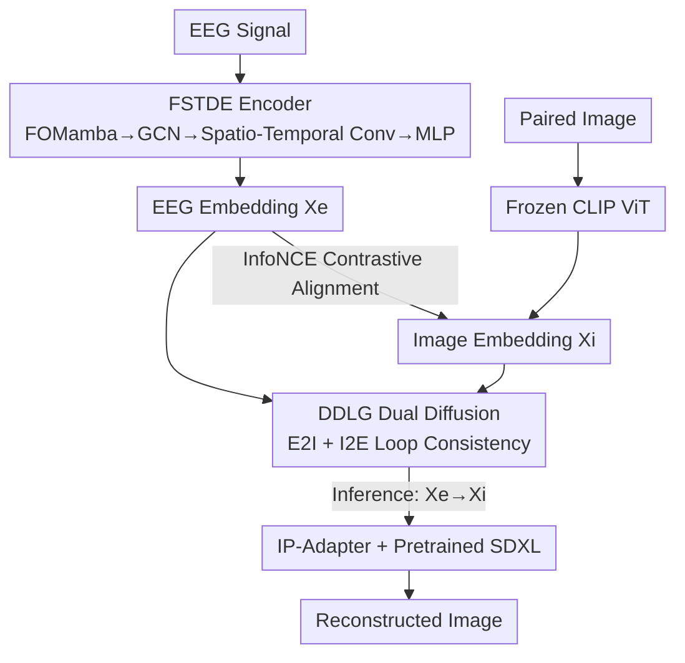

# D$^2$-FOSA: Dual-Diffusion Guided EEG-to-Image Reconstruction with Frequency-Oriented Semantic Alignment

**Conference**: CVPR 2026  
**Paper**: [CVF Open Access](https://openaccess.thecvf.com/content/CVPR2026/html/Yu_D2-FOSA_Dual-Diffusion_Guided_EEG-to-Image_Reconstruction_with_Frequency-Oriented_Semantic_Alignment_CVPR_2026_paper.html)  
**Code**: None (Source code provided with supplementary material)  
**Area**: Medical Imaging / Brain-Computer Interface (EEG Visual Decoding)  
**Keywords**: EEG-to-Image, Brain-Computer Interface, Frequency-Aware Mamba, Cross-Modal Alignment, Dual Diffusion

## TL;DR
D2-FOSA utilizes a "frequency-aware state-space encoder, FOMamba" to encode noisy, low-SNR EEG signals into highly discriminative EEG embeddings. It then employs a pair of symmetric "dual diffusion latent generators, DDLG" in the shared CLIP latent space to enforce loop-consistent alignment between EEG and images, and finally renders images via IP-Adapter + SDXL. On the THINGS-EEG reconstruction task, its FID is over 17 lower than the concurrent MB2C.

## Background & Motivation
**Background**: Decoding visual perception from non-invasive EEG is one of the core objectives of Brain-Computer Interfaces (BCIs). The current mainstream philosophy is to encode EEG into the CLIP visual semantic space, align EEG and image features using contrastive learning, and then feed the aligned EEG embeddings as conditions into a diffusion model to generate images. Commonly used encoders have evolved from early CNNs (such as EEGNet) and RNNs to GNNs, Transformers, and most recently, the state-space model Mamba.

**Limitations of Prior Work**: The authors point out two long-ignored issues. First, mainstream EEG encoders are 'frequency-agnostic,' treating EEG signals as general time series without explicitly modeling specific neural oscillations critical for visual cognition (e.g., Beta 13–30 Hz, Gamma 30–60 Hz). These oscillations are actually key to extracting discriminative information from low-SNR EEG. Second, relying solely on contrastive loss for EEG-image alignment only brings high-level semantics closer, resulting in a 'weak alignment.' While acceptable for retrieval tasks, it lacks structural consistency when bridging the massive modality gap for high-fidelity generation, leading to poor image reconstruction quality.

**Key Challenge**: EEG is an oscillatory signal superimposed by multiple damped oscillatory modes, whereas the diagonal state matrix of the standard SSM/Mamba can only model independent decay and fails to express a 'coupled oscillatory' structure. Meanwhile, there is a tension between the two goals of discriminative contrastive alignment and generative high-fidelity—optimizing only for contrastive alignment leaves the latent space lacking in generative capability.

**Goal**: (1) Enable the encoder to explicitly model and amplify task-relevant frequency band neural oscillations; (2) Make the EEG-image alignment both highly discriminative and generative (bidirectional and bijective).

**Key Insight**: Redesigning the state matrix of the state-space model from 'diagonal' to a 'block-diagonal 2x2 oscillatory block' where each block corresponds to a complex conjugate pair (damping + frequency), thereby making 'frequency' an explicitly learnable and adjustable parameter; also, repositioning the diffusion model from a 'final generative decoder' to a 'loop-consistent regularizer in the latent space.'

**Core Idea**: Utilizing the frequency-oriented FOMamba to replace frequency-agnostic encoders for capturing oscillations, and employing bidirectional diffusion loop-consistency constraints to replace simple contrastive alignment for cross-modal alignment.

## Method

### Overall Architecture
D2-FOSA is an end-to-end EEG-to-image translation framework containing both training and inference pathways. During training, the EEG signal is processed by the **FSTDE encoder** to obtain the EEG embedding $X_e$, and the paired image is processed by the frozen CLIP ViT to obtain the image embedding $X_i$. Both are first pulled into the same semantic space using the InfoNCE contrastive loss. Simultaneously, **DDLG (Dual-Diffusion Latent Generator)** uses two symmetric modules, E2I-DLG (EEG-to-Image) and I2E-DLG (Image-to-EEG), to mutually reconstruct each other's embeddings in the latent space, enforcing loop consistency as a strong regularization to tie together the latent spaces of the two modalities bijectively. During inference, only the forward pass is executed: FSTDE encodes the EEG into $X_e$, DDLG translates it into the image embedding $X_i$ via reverse diffusion, and $X_i$ is fed as a condition into IP-Adapter to drive the pretrained SDXL to render the final pixel image.

### Key Designs

**1. FOMamba: Redesigning the State-Space Model into a Frequency-Oriented Mamba to Explicitly Model Neural Oscillations**

The limitation is clear: EEG is a signal superimposed by multiple 'damped oscillatory modes.' The standard SSM, which uses a diagonal state matrix $A$, can only describe mutually independent exponential decays and fails to capture the coupled nature of oscillations. Consequently, standard encoders remain 'blind' to critical frequency bands like Beta and Gamma. FOMamba's approach is to structure $A$ as a **block-diagonal matrix**, where each $2\times2$ sub-block $A_k$ explicitly encodes a damped oscillatory mode:

$$A_k = \begin{pmatrix} -\rho_k & -\omega_k \\ \omega_k & -\rho_k \end{pmatrix}$$

where $\rho_k>0$ is the damping factor and $\omega_k>0$ is the angular frequency, corresponding to a pair of complex conjugate eigenvalues $\lambda_k=-\rho_k\pm j\omega_k$—which physically represents a neural oscillator that 'oscillates at frequency $\omega_k$ and decays with damping $\rho_k$.' To make the model adapt to different frequency bands, the authors add a learnable log-frequency bias $F_{\log,k}$ to each mode for dynamic frequency tuning: $\tilde{\omega}_k=\mathrm{softplus}(\omega_k+F_{\log,k})$. During discretization with a learnable step size $\Delta t$, applying the exact matrix exponential $e^{A_k\Delta t}$ yields an elegant closed-form solution:

$$A_{d,k} = e^{-\rho_k\Delta t}\begin{pmatrix} \cos(\tilde{\omega}_k\Delta t) & -\sin(\tilde{\omega}_k\Delta t) \\ \sin(\tilde{\omega}_k\Delta t) & \cos(\tilde{\omega}_k\Delta t) \end{pmatrix}$$

This discretized matrix represents a precise combination of 'rotation (oscillation) $\times$ exponential decay,' perfectly preserving the oscillatory dynamics. Then, the model updates the hidden state on the block-diagonal $A_d=\mathrm{blkdiag}(A_{d,k})$ using Mamba's hardware-efficient selective scan. Why it works: Power Spectral Density (PSD) analysis reveals that compared with the baseline Mamba, FOMamba **selectively amplifies** energy in the Beta/Gamma bands instead of globally suppressing high frequencies like normal Mamba. That is, it learns to 'enhance task-relevant frequencies,' which is the fundamental reason why FOMamba alone boosts the Top-1 retrieval accuracy from 27.75% of Mamba to 31.18% in the ablation study.

**2. FSTDE: A Three-Stage EEG Encoder Stacking Graph Structure and Spatio-Temporal Modeling atop FOMamba**

Temporal-frequency modeling alone is insufficient—EEG consists of multi-channel electrode signals with spatial topological relationships between channels. The Frequency-Spatio-Temporal Dynamics Encoder (FSTDE) chains three processes into a hierarchical pipeline: first, several FOMamba blocks capture the oscillatory temporal sequence to obtain $H_t$; next, the **Neural Graph Structure Extractor** takes the physical electrode graph $G$ constructed via the 10-20 system and uses a GCN to propagate information across channels: $H_s=\sigma(D^{-1/2}AD^{-1/2}H_tW^{(l)})$ (where $A$ is the adjacency matrix and $D$ is the degree matrix), integrating spatial content from adjacent channels; finally, a **Spatio-Temporal Feature Extractor** inspired by EEGNet and built using depthwise separable convolutions captures local spatio-temporal patterns. The output is flattened and projected via a gated MLP into the final embedding $X_e\in\mathbb{R}^d$. These three stages respectively cover 'frequency oscillation $\to$ channel topology $\to$ local spatio-temporal features,' synergistically compressing raw, low-SNR brain waves into a highly discriminative and noise-robust embedding for downstream alignment.

**3. DDLG: Replacing Pure Contrastive Alignment with Bidirectional Diffusion Loop-Consistency Constraint for 'Bijective-Grade' Cross-Modal Alignment**

Contrastive loss only brings high-level semantics closer and lacks fine-grained structural alignment, which is inadequate for spanning the huge modality gap between EEG and images. The key innovation of DDLG (Dual Diffusion Latent Generator) is: **rather than treating diffusion as the final generative decoder, it utilizes it as a generative regularizer in the latent space**. It consists of two symmetric modules: E2I-DLG reconstructs the image embedding $X_i$ from Gaussian noise conditioned on the EEG embedding $X_e$ (using $X_e$ as condition $c$); I2E-DLG conversely reconstructs EEG from images. The core of each module is the conditional reverse process:

$$p_\theta(z_{t-1}\mid z_t, c) = \mathcal{N}\big(z_{t-1}; \mu_\theta(z_t, c, t), \sigma_t^2 I\big)$$

The mean function $\mu_\theta$ is implemented via a U-Net, injecting the conditional embedding ($X_e$ or $X_i$) into the network through FiLM layers. This symmetric dual-path design forces the EEG and image embeddings to be not only 'discriminatively similar' but also 'generatively mutually reconstructable.' This is equivalent to establishing a compact, bijective correspondence between the two latent spaces—upgrading the alignment from a weak to a structurally consistent strong alignment. Why it works: Ablations demonstrate that while a unidirectional DDLG (E2I only) already brings improvements, the **fully bidirectional DDLG** pushes the Top-1 of FOMamba from 31.18% to 37.96%, proving that loop-consistency constraints are the key to learning a latent space that is optimized 'for both retrieval and generation.'

### Loss & Training
The total objective consists of the contrastive alignment loss and the bidirectional diffusion loss. The contrastive term uses InfoNCE to pull paired EEG-images closer and push mismatched pairs apart ($\tau$ is a learnable temperature):

$$\mathcal{L}_{align} = -\log \frac{\exp(\mathrm{sim}(X_e, X_i)/\tau)}{\sum_j \exp(\mathrm{sim}(X_e, X_i^j)/\tau)}$$

The bidirectional diffusion term is the standard DDPM noise prediction error, computed for EEG-to-image (condition $X_e$, target $X_i$) and image-to-EEG (condition $X_i$, target $X_e$):

$$\mathcal{L}_{E2I} = \mathbb{E}_{z_0\sim X_i,\,\epsilon,\,t}\big[\lVert \epsilon - \epsilon_\theta(\sqrt{\bar\alpha_t}z_0 + \sqrt{1-\bar\alpha_t}\epsilon,\, X_e,\, t)\rVert_2^2\big]$$

$\mathcal{L}_{I2E}$ shares the same mathematical form but with the roles of $X_e$ and $X_i$ swapped. The final loss is formulated as $\mathcal{L}_{total}=\mathcal{L}_{align}+\lambda_{E2I}\mathcal{L}_{E2I}+\lambda_{I2E}\mathcal{L}_{I2E}$, set to $\lambda_{E2I}=\lambda_{I2E}=0.5$ in experiments. In terms of implementation: FSTDE chains 3 FOMamba blocks + two GCN layers + EEGNetV4-style feature extraction + projection MLP; the damping factor $\rho_k$ is constrained to $[0.5, 0.995]$ to guarantee stability; DDLG uses a 5-block MLP-U-Net with a 1000-step linear variance schedule; trained on a single NVIDIA L40S GPU using AdamW (weight decay $10^{-2}$), with a learning rate of $10^{-4}$ for the main framework and $5\times10^{-5}$ for the diffusion modules under cosine decay and up to 1000 epochs with early stopping.

## Key Experimental Results

### Main Results
Evaluated zero-shot retrieval and image reconstruction across four public benchmarks: THINGS-EEG, THINGS-MEG, EEGCVPR40, and EEGImageNet.

THINGS-EEG 200-way zero-shot retrieval (average of 10 subjects, Top-1/Top-5 %):

| Setting | Method | Year | Top-1 | Top-5 |
|------|------|------|-------|-------|
| Intra-subject | MB2C | 2024 | 28.5 | 60.4 |
| Intra-subject | VE-SDN | 2025 | 37.2 | 69.9 |
| Intra-subject | **D2-FOSA** | 2025 | **38.0** | **70.7** |
| Inter-subject | MB2C | 2024 | 11.9 | 32.0 |
| Inter-subject | UBP | 2025 | 12.4 | 33.4 |
| Inter-subject | **D2-FOSA** | 2025 | **13.1** | **34.6** |

Cross-benchmark retrieval (selected results, Top-1/Top-5 %): THINGS-MEG intra 27.5/55.7 (UBP 26.7/55.2); EEGImageNet 31.05/63.10 (MB2C 29.65/61.30); EEGCVPR40 (raw) 89.20/98.35 (MB2C 88.73/98.24).

THINGS-EEG image reconstruction quality (Table 3):

| Method | IS ↑ | FID ↓ | KID ↓ | SSIM ↑ | PCC ↑ |
|------|------|-------|-------|--------|-------|
| MB2C | 10.19 | 163.94 | 0.027 | 0.333 | 0.188 |
| **D2-FOSA** | **11.81** | **146.33** | **0.025** | **0.350** | **0.193** |

FID drops from 163.94 to 146.33 (a reduction of >17), validating the "over 17 FID lower than concurrent MB2C" claim in the TL;DR. All distribution metrics (IS/FID/KID) and pixel-level metrics (SSIM/PCC) are comprehensively superior.

### Ablation Study
Ablation of backbone encoders and DDLG on THINGS-EEG ($\times$ No DDLG, $\dagger$ Unidirectional E2I only, $\checkmark$ Fully bidirectional):

| Encoder | DDLG | 200-way Top-1 | 200-way Top-5 |
|--------|------|--------------|--------------|
| Transformer | × | 25.30 | 57.20 |
| Mamba | × | 27.75 | 58.45 |
| FOMamba | × | 31.18 | 63.73 |
| FOMamba | † | 35.36 | 67.46 |
| FOMamba | ✓ | **37.96** | **70.67** |

### Key Findings
- **Both components yield large and complementary contributions**: simply replacing the encoder (without DDLG) with FOMamba achieves 31.18%, significantly outperforming Mamba (27.75%) and Transformer (25.30%), illustrating that frequency-awareness alone provides a substantial performance boost. Fixing FOMamba, adding the bidirectional DDLG further elevates accuracy from 31.18% to 37.96%, demonstrating that loop-consistent alignment is the second major source of gain.
- **Bidirectional > Unidirectional**: While the unidirectional DDLG (E2I only) brings certain gains, the fully bidirectional formulation yields the highest improvements across all backbones, validating the necessity of a 'bijective' alignment.
- **Visual evidence for the mechanism of FOMamba**: PSD and time-frequency difference maps demonstrate a net enhancement of Beta and high-Gamma bands (whereas ordinary Mamba suppresses high frequencies). This suggests the gains stem from 'amplifying task-relevant frequencies' rather than general noise reduction.
- **Damping boundary sensitivity**: The retrieval accuracy is optimal when $\rho_{max}=0.995$ (close to 1 to avoid instability at 1.0) and $\rho_{min}\approx0.5$–$0.7$, indicating the model favors oscillatory modes with 'slow decay and long-term dependency'.

## Highlights & Insights
- **Parametersizing 'frequency' as an explicit learnable term in SSMs**: Utilizing $2\times2$ complex conjugate oscillatory blocks with learnable log-frequency biases transforms the capture of neural oscillations from 'hoping the network learns it implicitly' into 'hardcoding the physical structure and letting the model tune the frequency,' providing an exact discretized closed-form solution. This 'oscillatory-block SSM' methodology is highly transferable to any time-series data with periodic/oscillatory patterns (e.g., audio, physiological signals, or periodic sensor signals).
- **Repositioning the role of diffusion models**: Shifting from a 'final target decoder' to a 'loop-consistent regularizer in the latent space' represents a highly reusable design philosophy. When two modalities demand strict alignment rather than loose similarity, leveraging bidirectional generative reconstruction as a regularizer is much more effective than pure contrastive alignment in forcing a structurally consistent, bijective latent space.
- **Decoupling of retrieval and generation bypassed**: DDLG ensures that the same set of embeddings benefits both retrieval and generation tasks, circumventing the disjointed paradigm of training one system for retrieval and another for generation.

## Limitations & Future Work
- Author-acknowledged limitations: **Computational efficiency** (dual-diffusion + 1000 steps + SDXL rendering is expensive) and **inter-subject generalization** (the absolute accuracy across subjects remains low, with Top-1 at only 13.1% compared to intra's 38.0%). Future research plans to mitigate these via adaptive decoding strategies and multi-subject training paradigms.
- Reviewer-identified limitations: Despite state-of-the-art results, the absolute fidelity of reconstructed images is still limited (FID of 146, SSIM of 0.35), which is far from 'faithfully retrieving the exact viewed image.' The evaluation mainly centers around ImageNet category-level semantics, raising questions about fine-grained instance restoration. Additionally, the generative pipeline relies heavily on the frozen CLIP and pretrained SDXL, meaning the end-to-end optimization space is constrained by these two external modules.
- The bidirectional diffusion of DDLG operates in the latent space, introducing two diffusion pathways during training along with balancing coefficients ($\lambda = 0.5$ set empirically). Robustness against hyperparameters and different noise schedules is not fully elaborated.

## Related Work & Insights
- **vs. Frequency-agnostic encoders (EEGNet / ordinary Mamba / Transformer)**: These treat EEG as a general time series, whereas FOMamba explicitly models damped oscillations and selectively amplifies Beta/Gamma bands; in ablations, FOMamba alone outperforms Mamba and Transformer by 3–6 percentage points.
- **vs. Pure contrastive alignment (CLIP-alignment pathways such as NICE, ATM, MB2C, etc.)**: These only utilize contrastive losses for weak alignment. In contrast, this work adds bidirectional diffusion loop-consistency constraints for strong alignment, leading in both retrieval and reconstruction (on THINGS-EEG, outperforming MB2C by +9.5 on Top-1 retrieval and reducing reconstruction FID by over 17).
- **vs. Neural decoding works treating diffusion as the final decoder (e.g., fMRI/EEG diffusion generation)**: This work moves diffusion upstream as a latent space regularizer, followed by IP-Adapter + SDXL for rendering, highlighting the role shift of 'diffusion for alignment' rather than 'diffusion for raw generation'.

## Rating
- Novelty: ⭐⭐⭐⭐⭐ Extremely solid counter-intuitive designs in both the oscillatory-block SSM (FOMamba) and utilizing bidirectional diffusion as alignment regularization (DDLG).
- Experimental Thoroughness: ⭐⭐⭐⭐ Evaluated on four benchmarks + dual task of retrieval/reconstruction + dual-axis ablation on encoder × DDLG + visualization of spectral mechanisms; however, performance on inter-subject generalization remains weak.
- Writing Quality: ⭐⭐⭐⭐ The logic flow of motivation-mechanism-evidence is highly transparent, reinforced by solid math formulations and visualization.
- Value: ⭐⭐⭐⭐ Advances the SOTA in EEG visual decoding; both FOMamba and the 'diffusion-as-regularizer' ideology possess high paradigm transfer value.

<!-- RELATED:START -->

## Related Papers

- [\[AAAI 2026\] NeuroBridge: Bio-Inspired Self-Supervised EEG-to-Image Decoding via Cognitive Priors and Bidirectional Semantic Alignment](../../AAAI2026/medical_imaging/neurobridge_bio-inspired_self-supervised_eeg-to-image_decoding_via_cognitive_pri.md)
- [\[CVPR 2026\] SemiGDA: Generative Dual-distribution Alignment for Semi-Supervised Medical Image Segmentation](semigda_generative_dual-distribution_alignment_for_semi-supervised_medical_image.md)
- [\[CVPR 2026\] EEGiT: Teaching Vision Transformers to Understand the EEG signal](eegit_teaching_vision_transformers_to_understand_the_eeg_signal.md)
- [\[ICML 2026\] Plug-and-Play Diffusion Meets ADMM: Dual-Variable Coupling for Robust Medical Image Reconstruction](../../ICML2026/medical_imaging/plug-and-play_diffusion_meets_admm_dual-variable_coupling_for_robust_medical_ima.md)
- [\[AAAI 2026\] Shrinking the Teacher: An Adaptive Teaching Paradigm for Asymmetric EEG-Vision Alignment](../../AAAI2026/medical_imaging/shrinking_the_teacher_an_adaptive_teaching_paradigm_for_asymmetric_eeg-vision_al.md)

<!-- RELATED:END -->
