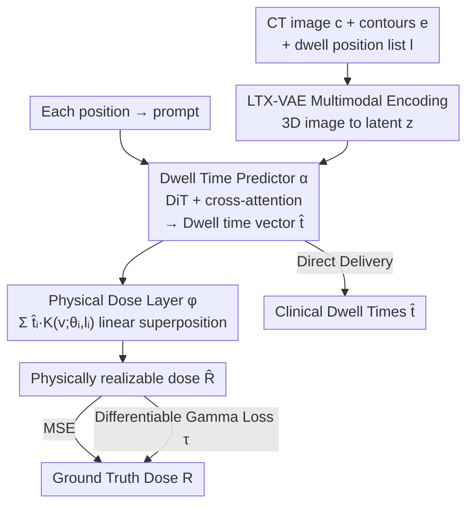

# D2T2 - Multimodal Automated Planning for Brachytherapy

**Conference**: CVPR 2026  
**Paper**: [CVF Open Access](https://openaccess.thecvf.com/content/CVPR2026/html/Moore_D2T2_-_Multimodal_Automated_Planning_for_Brachytherapy_CVPR_2026_paper.html)  
**Code**: None (Unreleased; dataset is internal/private)  
**Area**: Medical Imaging  
**Keywords**: Brachytherapy, Automated Planning, Physics-Constrained Networks, Concept Bottleneck, Differentiable Gamma Loss

## TL;DR
D2T2 utilizes a two-stage network—where a DiT predicts dwell times for each position and a physical layer linearly combines these into dose—to directly predict clinically deliverable brachytherapy machine parameters. Combined with a proxy network that renders the Gamma index into a differentiable loss, the model achieves higher accuracy than current SOTA and reduces planning time from tens of minutes to 0.1 seconds in a single forward pass.

## Background & Motivation

**Background**: Brachytherapy involves delivering radiation sources to pre-determined "dwell positions" $l_i$ inside the patient via applicators, shaping the dose distribution by controlling the "dwell time" $t_i$ at each position. Clinically, physicians perform manual trial-and-error on CT scans to adjust dwell times, often taking over 60 minutes while the patient remains sedated. Existing automation (common in external beam radiotherapy) typically trains CNNs/Transformers to regress voxel-level dose maps $\hat R$ directly from CT scans and organ contours.

**Limitations of Prior Work**: There is a significant disconnect in direct dose prediction—clinical delivery requires dwell times $t_i$, not dose maps. Extracting $t_i$ from a predicted $\hat{R}$ requires post-processing optimization (OPT), which averages several minutes while the patient waits; worse, the predicted $\hat{R}$ is not guaranteed to be physically realizable (it may not be a possible linear combination of $t_i$), leading to optimization failure or suboptimal parameters as prediction and optimization errors accumulate.

**Key Challenge**: Directly predicting dwell times is ill-posed because dwell times lack a unique ground truth. Source positions $l_i$ vary by patient, and dose kernels of adjacent positions overlap significantly, meaning many different sets of $t_i$ can produce nearly identical doses. Conversely, isolated positions are extremely sensitive to local dose. This "imbalance in importance and inconsistency across cases" makes direct $t_i$ regression cross-case unstable.

**Goal**: To develop a model that outputs physically realizable doses while simultaneously providing dwell times as an intermediate output, eliminating the need for post-processing optimization.

**Key Insight**: Dose formation follows a clear physical model: total dose is a linear superposition of dose kernels from each dwell position $R(v)\propto\sum_i t_i K(v;\theta_i,l_i)$. Since the physics is known, it can be integrated into the network architecture, making the network responsible only for predicting the physical parameters $t_i$, while the dose is calculated by a physical layer.

**Core Idea**: Treat dwell time as a "concept bottleneck" for dose prediction. The network first predicts a dwell time vector, which an unlearnable physical layer then deterministically maps to a dose. The system is trained end-to-end using MSE against ground truth dose; dwell times are obtained as a "free" intermediate product, and the dose is inherently physically realizable.

## Method

### Overall Architecture
D2T2 (Direct Dwell Time Transformer) formulates dose prediction as a two-stage composition: $\hat R = \phi \circ \alpha$. The first stage $\alpha$ is a multimodal Transformer that takes CT images $c$, organ/target contours $e$, and a list of dwell positions $l$ to output a dwell time vector $\hat t = \alpha(c,e,l)$. The second stage $\phi$ is a hard-coded physical layer that linearly combines $\hat t$ and positions $l$ with dose kernels to produce the final dose $\hat R$. The entire network is trained end-to-end using MSE (fitting ground truth dose) and a differentiable Gamma proxy loss. Given the heterogeneous input (3D images + 3D coordinate sequences) and varying source counts (15 to 250+), $\alpha$ adopts a vision-language approach: a pretrained VAE compresses the 3D images into low-dimensional latents, and each dwell position is treated as a "prompt," using cross-attention to query image features.

### Key Designs

**1. Two-Stage Physical Bottleneck: Baking Physics into the Architecture**

To bridge the gap where direct dose prediction yields physically unrealizable results requiring slow post-optimization, D2T2 restricts the network to only predicting physical parameters—the dwell time vector $\hat t$. The second stage $\phi$ is implemented as a physical layer without learnable parameters, strictly following the TG-43 dose kernel linear combination:

$$\hat R(v) \propto \sum_{i=1}^{S} \hat t_i\, K(v;\theta_i,l_i)$$

where $K(v)$ is the radiation profile of a single source, and $K(v;\theta_i,l_i)$ is its translation to $l_i$ and rotation to $\theta_i$. This ensures $\hat R$ is always a valid superposition of dwell times. This is equivalent to a Radial Basis Function (RBF) network where basis functions are determined by physics. This design aligns with Concept Bottleneck Models (CBM): dwell time is the "bottleneck concept" for dose, providing interpretability, reliability, and controllability through the machine-delivetable physical parameters.

**2. Multimodal Dwell Time Predictor: Positions as Image Prompts**

The first stage $\alpha$ addresses three challenges: heterogeneous inputs (3D volumes vs. coordinate sequences), variable source counts, and high CT dimensionality. For dimensionality, the model uses a VAE $\gamma$ to compress 3D images into $z\in\mathbb{R}^{\frac{H}{32}\times\frac{W}{32}\times\frac{D}{8}}$, repurposing the pretrained VAE from the LTX-Video diffusion model. This VAE supports 1:8192 compression, enabling full attention on 3D volumes. For heterogeneity, a DiT Transformer embeds each dwell position as a separate prompt token, interacting with image patches via cross-attention. An MLP head with absolute value activation ensures non-negative dwell times. Variable lengths are naturally handled by the attention mechanism.

**3. Differentiable Gamma Loss: Distilling the Gold Standard into a Proxy Network**

In radiotherapy, the gold standard for dose comparison is the Gamma index—a spatially relaxed error metric. For each voxel $v$, it identifies the minimum combined distance from all reference voxels $v'$:

$$\gamma(\hat R(v)) = \min_{v'} \sqrt{\frac{\lVert v-v'\rVert^2}{\Delta d^2} + \frac{(\hat R(v)-R(v'))^2}{\Delta D^2}}$$

where $\Delta d$ (3mm) and $\Delta D$ (3%) are clinical tolerances. The Gamma index is non-differentiable and computationally expensive ($O(V^2)$). The authors train a proxy network $\tau$ to predict the Gamma index $\hat\gamma = \tau(R, \hat R)$. $\tau$ is pre-trained on a synthetic dataset $D'=\{R_n, \hat R_n\}$ where $\hat R_n$ is generated using random $\hat t_n$. Once frozen, $\tau$ provides a differentiable gradient for the main model $\alpha$ using $L = \sum_n L_2(R_n,\hat R_n) + \lambda \sum_n L_\Gamma(R_n,\hat R_n)$.

### Loss & Training
The primary loss is voxel-wise MSE $L_2(R,\hat R)$ plus the weighted Gamma proxy loss $L_\Gamma$, with $\tau$ frozen. Data is split 70/15/15 by patient. Ablation identified $\lambda=0.05$ as optimal. Notably, direct supervision on dwell times (L2(Dwell)) was excluded from the final loss due to the ambiguity of dwell times hindering training.

## Key Experimental Results

The dataset comprises ~5,000 clinical plans, including cervical (2002), breast (483), endometrial (1171), vaginal (252), and other (1081) cases. This is the first "site-agnostic" model for brachytherapy.

### Main Results
Compared against the SOTA "Optimization-based" method (OPT: dose prediction followed by post-optimization), implemented with an equivalent DiT backbone.

| Site | Model | Dose MAE (%)↓ | Dwell Time MAE (s)↓ | Avg Time (s)↓ |
|------|------|---------------|-------------------|---------------|
| Breast | OPT | 5.45 | 8.84 | 49.12 |
| Breast | **D2T2** | **4.31** | **7.25** | **0.12** |
| Cervical | OPT | 3.70 | 13.00 | 25.87 |
| Cervical | **D2T2** | **3.12** | **7.56** | **0.10** |
| Endometrial | OPT | 4.50 | 13.07 | 25.17 |
| Endometrial | **D2T2** | **3.42** | **8.72** | **0.10** |
| Other | OPT | 5.09 | 10.52 | 50.57 |
| Other | **D2T2** | **3.75** | **6.57** | **0.11** |
| Overall | OPT | 4.41 | 11.79 | 35.07 |
| Overall | **D2T2** | **3.54** | **7.41** | **0.10** |

Ours outperforms OPT across all sites. The overall dose MAE dropped from 4.41% to 3.54%, dwell time MAE from 11.79s to 7.41s, and inference time was reduced from ~35s to 0.1s (hundreds of times faster). The gain is most prominent in "Other" sites with sparse data, indicating the regularization benefits of the physical constraint.

### Ablation Study

**Loss Combination (Table 2, unweighted sum)**:

| L2(Dose) | L2(Dwell) | L_Γ | Dose MAE (%)↓ | Dwell Time MAE (s)↓ |
|:--:|:--:|:--:|---------------|-------------------|
| ✓ | | | 3.68 | 7.41 |
| | ✓ | | 4.34 | 7.66 |
| | | ✓ | **3.64** | 7.76 |
| ✓ | | ✓ | 4.67 | 7.49 |
| ✓ | ✓ | | 3.69 | 7.85 |

Gamma loss alone provides the best Dose MAE (3.64). Direct L2(Dwell) supervision performed poorly due to dwell time "multi-solution" ambiguity.

**Weight $\lambda$ Ablation (Table 3)**:

| $\lambda$ | Dose MAE (%)↓ | Dwell Time MAE (s)↓ |
|:--:|---------------|-------------------|
| **0.05** | **3.54** | **7.41** |
| 1 | 3.69 | 7.85 |
| 10 | 3.63 | 7.70 |

### Key Findings
- Physical realizability constraints act as implicit regularization, particularly effective when data is sparse.
- Direct dwell time supervision is detrimental due to the ambiguity of dwell time solutions.
- The Gamma proxy network $\tau$ scales effectively with synthetic data volume.

## Highlights & Insights
- **Physics Layer = Architecture**: Instead of using physics as a soft loss regularizer, the model uses a hard-coded physical layer. This structural guarantee ensures valid outputs and provides machine parameters as a byproduct.
- **Learning the Loss**: This approach of "learning a differentiable proxy for non-differentiable clinical metrics" is highly transferable to tasks involving expensive or non-derivable evaluation standards.
- **Cross-modal Transfer**: Repurposing a video VAE for 3D medical volumes (by treating the volume as a video sequence) proves to be a practical and efficient strategy.

## Limitations & Future Work
- **Private Data**: No public brachytherapy datasets exist, and the internal dataset/code remain private, complicating reproducibility.
- **Fixed l_i**: The model does not plan applicator placement; it only optimizes time for given positions.
- **Proxy Precision**: The accuracy of $\tau$ depends on whether synthetic "dwell time samples" cover the true distribution of prediction errors.
- **Clinical Metrics**: Only MAE is reported; clinical Dose-Volume Histogram (DVH) metrics (like D90 or D2cc) are not explicitly detailed.

## Related Work & Insights
- **vs. OPT**: D2T2 avoids the accumulation of prediction and optimization errors by using a single forward pass.
- **vs. External Beam Planning**: Unlike methods that stop at voxel doses for external beams, D2T2 capitalizes on the specific physics of brachytherapy to output deliverable parameters.
- **vs. Concept Bottleneck Models**: D2T2's bottleneck is defined by physics rather than subjective semantic labels, ensuring a deterministic relationship between the concept and the output.

## Rating
- Novelty: ⭐⭐⭐⭐⭐ 
- Experimental Thoroughness: ⭐⭐⭐⭐ 
- Writing Quality: ⭐⭐⭐⭐⭐ 
- Value: ⭐⭐⭐⭐⭐ 

<!-- RELATED:START -->

## Related Papers

- [\[CVPR 2026\] Any2Any 3D Diffusion Models with Knowledge Transfer: A Radiotherapy Planning Study](any2any_3d_diffusion_models_with_knowledge_transfer_a_radiotherapy_planning_stud.md)
- [\[CVPR 2026\] PETAR: Localized Findings Generation with Mask-Aware Vision-Language Modeling for PET Automated Reporting](petar_localized_findings_generation_with_mask-aware_vision-language_modeling_for.md)
- [\[NeurIPS 2025\] Demo: Generative AI helps Radiotherapy Planning with User Preference](../../NeurIPS2025/medical_imaging/demo_generative_ai_helps_radiotherapy_planning_with_user_preference.md)
- [\[CVPR 2025\] Automated Detection of Malignant Lesions in the Ovary Using Deep Learning Models and XAI](../../CVPR2025/medical_imaging/automated_detection_of_malignant_lesions_in_the_ovary_using_deep_learning_models.md)
- [\[CVPR 2026\] EMAD: Evidence-Centric Grounded Multimodal Diagnosis for Alzheimer's Disease](emad_evidence-centric_grounded_multimodal_diagnosis_for_alzheimers_disease.md)

<!-- RELATED:END -->
