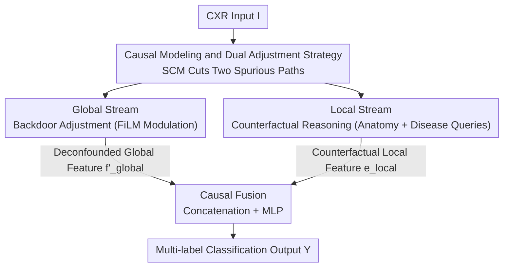

# DARC: Dual Adjustment Reasoning with Counterfactuals for Trustworthy Chest X-ray Classification

**Conference**: CVPR 2026  
**Paper**: [CVF Open Access](https://openaccess.thecvf.com/content/CVPR2026/html/Liao_DARC_Dual_Adjustment_Reasoning_with_Counterfactuals_for_Trustworthy_Chest_X-ray_CVPR_2026_paper.html)  
**Code**: To be confirmed  
**Area**: Medical Imaging  
**Keywords**: Chest X-ray classification, Causal inference, Counterfactual reasoning, Backdoor adjustment, Multi-label classification  

## TL;DR
DARC separately treats two types of spurious correlations in multi-label chest X-ray classification—shortcut learning from non-pathological visual confounders and feature entanglement caused by pathological co-occurrence—using a global stream for backdoor adjustment and a local stream for counterfactual reasoning. These are fused at the logit level, leading to superior classification performance, interpretability, and robustness.

## Background & Motivation
**Background**: Multi-label chest X-ray (CXR) classification is a traditional strength of CNNs/ViTs, with AUCs already high on standard benchmarks. However, these models essentially fit the observational distribution $P(Y|I)$, maximizing the statistical likelihood of "co-occurrence of image pixels and labels" without regard for the causal mechanisms behind image generation.

**Limitations of Prior Work**: The authors categorize spurious correlations in CXRs into two types. First is **pathological co-occurrence**: pneumonia often accompanies pleural effusion, and pulmonary edema often accompanies cardiomegaly. Models thus treat "cardiomegaly" as evidence for "pleural effusion," an issue especially severe when the target lesion is atypical, causing cross-disease interference. Second is **non-pathological visual confounders**: medical devices or postoperative residuals such as pacemakers, catheters, PICCs, and electrodes change image appearance and are statistically correlated with certain diseases. Models take these as positive evidence via shortcut learning, leading to high false positives. Once deployed in real clinical settings with slight distribution shifts, these non-causal dependencies cause performance to collapse.

**Key Challenge**: Existing causal methods have two shortcomings. When handling non-pathological confounders, they rely on coarse-grained assumptions like "uniform distribution" for confounder variables $Z'$ due to the lack of precise definitions and pixel-level labels, which limits intervention accuracy. In terms of decoupling strategies, existing causal models focus on only one source of confounding at a time, failing to address heterogeneous confounding types within a unified framework.

**Goal**: Block two spurious correlation paths simultaneously within one framework and achieve pixel-level precision in modeling non-pathological confounders.

**Key Insight**: Starting from Pearl's Causal Ladder—where traditional models stay at the Association layer and existing causal works reach the Intervention layer for a single confounder—this work advocates climbing to the highest Counterfactual layer for finer-grained, high-order reasoning. Concurrently, $Z'$ is redefined as an **observable** variable (locatable using segmentation models), making the backdoor criterion truly applicable.

**Core Idea**: Construct the first pixel-level non-pathological confounder dataset, CheXconf, and design a "dual adjustment" dual-stream architecture—using backdoor adjustment for observable non-pathological confounders and counterfactual reasoning for pathological co-occurrence caused by unobservable common causes—effectively dividing and conquering before fusion.

## Method

### Overall Architecture
DARC first places CXR classification within a Structural Causal Model (SCM): target pathology $X$, co-occurrence pathology $Z$, non-pathological confounder $Z'$, unobservable deep common cause $U$, image feature $F$, and prediction $Y$. Besides the desired causal path $X\to F\to Y$, two spurious paths must be blocked: the non-pathological backdoor path $X\leftarrow Z'\to F\to Y$ and the pathological backdoor path $X\leftarrow U\to Z\to F\to Y$. The goal is not to maximize $P(Y|X=x)$ but to estimate the total causal effect $P(Y|do(X=x))$ by severing both paths.

Since the confounders of the two paths differ in nature ($Z'$ is observable, $U$ is unobservable), DARC adopts a "divide and conquer" dual-stream design: input images pass in parallel through a **Global Stream** (applying backdoor adjustment to $Z'$ to produce deconfounded global features $\mathbf{f}'_{global}$) and a **Local Stream** (applying counterfactual reasoning to $Z$ to produce local features $\mathbf{e}_{local}$ representing direct effects). Finally, the **Causal Fusion** module concatenates the features and uses an MLP for non-linear fusion to obtain the causal representation $\mathbf{f}_{fused}$ for classification. The process is completed in a single forward pass, maintaining inference efficiency.

### Key Designs

**1. Causal Modeling and Dual Adjustment: Translating "Spurious Correlations" into "Backdoor Paths to be Severed"**

This step serves as the blueprint for the entire paper, addressing the limitation that "existing methods only handle one type of confounder." The authors explicitly map the CXR generation and prediction process with an SCM and rewrite the task from fitting $P(Y|X=x)$ to estimating $P(Y|do(X=x))$. The key observation is the fundamental difference between the two spurious paths: the locations of non-pathological confounders $Z'$ (devices, electrodes, etc.) can be directly observed via segmentation models, thus satisfying the backdoor criterion and allowing for backdoor adjustment. In contrast, pathological co-occurrence stems from unobservable deep common causes $U$ (e.g., heart failure causing both effusion and cardiomegaly), which cannot be directly intervened upon and must be addressed at the counterfactual level to estimate the Total Direct Effect (TDE) of pathological $X$. This division of "observable uses backdoor, unobservable uses counterfactual" is the causal basis for the dual-stream architecture.

**2. CheXconf: First Pixel-level Non-pathological Confounder Dataset for Effective Backdoor Adjustment**

For the backdoor criterion to be effective, the confounder variable $Z'$ must be observable and stratifiable. Prior work, lacking fine-grained labels, could only assume $Z'$ follows a uniform distribution, rendering interventions ineffective. The authors randomly selected 10,000 images from ChestX-ray14, which were annotated by personnel trained by two radiologists through two rounds of cross-checking. They labeled **40,213 instances across 11 classes** of clinically common non-pathological visual confounders (mark, pacemaker, conduit, porta-cath, picc, electrode, cerclage-wire, clip, device, cvc, wearable). 10% of samples were sampled for radiologist inspection, with unqualified batches re-processed. Using pixel-level contours instead of bounding boxes allows the Global Stream to obtain precise masks for each confounder class, turning the abstract formula of "stratified summation over $Z'$" into a computable module.

**3. Global Stream — Backdoor Adjustment: Recalibrating Global Features with Known Confounders via FiLM**

According to the backdoor formula, when $Z'$ is observable, the true causal effect is $P(Y|do(X=x))=\sum_{z'}P(Y|X=x,Z'=z')P(Z'=z')$. The Global Stream implements this via an **Identify–Embed–Modulate** pipeline: first, a Confounder Segmentation (C.S.) model fine-tuned on CheXconf generates class-wise masks $\mathbf{M}_{conf}$. After aligning masks with global feature maps, mask-normalized weighted pooling $\mathbf{h}_c=\sum_{h,w}\mathbf{F}_{map}\odot \tilde{\mathbf{M}}'_c$ yields confounder embeddings. These are aggregated into a state vector $\mathbf{e}_{agg}=\sum_c p_{conf,c}\cdot\mathbf{E}_{conf}[c]$ based on occurrence probabilities $p_{conf}$. Finally, this is fed into a FiLM layer to generate affine parameters to recalibrate the original global features: $\mathbf{f}'_{global}=(1+\gamma)\odot \mathbf{f}_{vec}+\beta$ (Confounder Handler, C.H.). This step suppresses shortcut paths by recalibrating features under the condition of known confounders, approximating the backdoor summation as a feature modulation with minimal computational overhead.

**4. Local Stream — Counterfactual Reasoning: Computing Evidence Scores after "Neutralizing" Co-occurring Lesions**

To address the pathological co-occurrence path $X\leftarrow U\to Z\to F\to Y$, the authors estimate the Total Direct Effect: $\text{TDE}=P(Y=1|X=x,Z=z)-P(Y=1|X=x_0,Z=z)$, representing the change in output when $X$ is hypothetically removed but $Z$ remains. Since difference-based forms are unstable for optimization, the authors rewrite it under a local linear response assumption (as modern CNN activations like ReLU/SiLU are affine within fixed activation patterns and counterfactual operations are local with small $\|\Delta h\|$) into a monotonically equivalent additive form, resulting in a computable debiased score:

$$\text{Score}_p(y)\propto P(y|X=x,Z=z)+\lambda\cdot P(y|X=x,\text{do}(Z=z_0))$$

The first term retains original observational information, while the second term represents the pure direct effect of $X$ when visual features of $Z$ are removed in the input layer; $\lambda$ adjusts the causal correction strength. This is implemented via a **Locate–Decouple–Aggregate** pipeline: first, an Anatomy Landmark Detector (A.L.D.) performs dynamic anatomical cropping; then, a disease query matrix $\mathbf{Q}_{disease}$ uses anatomic-causal attention (A.C.A.) to filter visual evidence $\mathbf{e}_k=\text{Attention}(q_k,\mathbf{M}_{local},\mathbf{M}_{local})$ containing only the target pathology from these local patches. This approximates a counterfactual intervention of "masking co-occurring lesions" without modifying pixels, thereby suppressing co-occurrence bias.

### Loss & Training
The total loss is a weighted sum of three terms: $\mathcal{L}_{total}=w_1\mathcal{L}_{MLC}+w_2\mathcal{L}_{PC}+w_3\mathcal{L}_{Ortho}$:

- $\mathcal{L}_{MLC}$: Main classification loss using Asymmetric Loss (ASL) to handle class imbalance, applied to the final prediction $z_{final}$.
- $\mathcal{L}_{PC}$: Causal consistency loss using KL divergence to constrain the final prediction distribution to match the decoupled prediction of the Local Stream: $D_{KL}(\sigma(z_{final})\|\sigma(\text{sg}[z_{local}]))$ (with stop-gradient on the local stream), injecting counterfactual direct effects as regularization into the main branch.
- $\mathcal{L}_{Ortho}$: Confounder-disease representation orthogonality loss. For samples where confounder $c$ is absent ($m_{ic}=0$), it minimizes the expected squared cosine similarity between confounder embedding $\mathbf{e}_{conf,ic}$ and all disease queries $\mathbf{q}_{disease,k}$, reinforcing backdoor adjustment and suppressing non-pathological shortcuts.

The backbone is ConvNeXt pre-trained on ImageNet, trained for 50 epochs using AdamW, with an initial learning rate of $5\times10^{-5}$ and cosine annealing down to $5\times10^{-7}$ on a single RTX 4090.

## Key Experimental Results

### Main Results
Evaluated on ChestX-ray14 (14 classes) and CheXpert (14 pathology observations) benchmarks across three categories: architectural innovations, recent SOTA, and causal inference methods. The primary metric is mAUC.

| Dataset | Metric | DARC | Prev. Best Baseline | Description |
|--------|------|------|------|------|
| ChestX-ray14 | mAUC | **0.857** | 0.849 (CDCL, Causal) | Ranked 1st in 14-class avg AUC |
| CheXpert | mAUC | **0.907** | 0.896 (PTRN / CDCL) | Overall lead across 5 pathologies |
| ChestX-ray14 | mAP / F1 | 0.326 / 0.428 | — | Multi-label comprehensive metrics |
| CheXpert | mAP / F1 | 0.427 / 0.594 | — | Multi-label comprehensive metrics |

DARC notably outperforms causal methods (CDCL, Nie et al.) that only handle a single type of confounding, indicating that the dual adjustment clears confounding more thoroughly.

### Ablation Study

| ID | Local(A.L.D.+A.C.A.) | Global(C.S.+C.H.) | mAUC | Description |
|----|------|------|------|------|
| S0 | - | - | 0.828 | Pure ConvNeXt Baseline |
| S2 | ✓ | - | 0.835 | Local Stream only (Counterfactual) |
| S4 | - | ✓ | 0.837 | Global Stream only (Backdoor) |
| S1 | w/o A.L.D. | ✓ | 0.846 | No anatomy landmarks, -1.1% |
| S3 | ✓ | w/o C.S. | 0.842 | No precise segmentation, -1.5% |
| S5 | ✓ | ✓ | **0.857** | Full DARC |

### Key Findings
- Both streams individually provide gains (+0.7%~0.9% over S0) and play complementary roles; the full model (S5) significantly outperforms either single stream, confirming that "a single intervention is insufficient."
- Removing precise confounder segmentation C.S. (S3) drops mAUC by 1.5%, while removing anatomical landmarks A.L.D. (S1) drops it by 1.1%—**fine-grained confounder modeling is more critical than anatomical priors**, validating the value of CheXconf pixel-level labels.
- Interpretability: Grad-CAM shows DARC locks attention on true lesions (e.g., pneumothorax lines, nodules), while the baseline is distracted by surgical fixations or electrode pads. In "pacemaker -> cardiomegaly" confounding attack experiments, the baseline entangles TP and clean negative (CN) samples with pacemakers, whereas DARC's feature manifold decouples from the confounder.
- Co-occurrence bias: Using cTPR/cFPR on 8 high-frequency co-occurring pathology pairs, DARC consistently shows higher cTPR (no missed true lesions) and lower cFPR (no "hallucinating" co-occurring diseases), proving reduced reliance on co-occurrence statistics.

## Highlights & Insights
- **"Visible -> Backdoor, Invisible -> Counterfactual" division is elegant**: By mapping spurious correlations to specific SCM paths and selecting causal tools based on confounder observability, it avoids the awkwardness of forcing a single intervention model on all confounders.
- **Rewriting counterfactual differences as additive fusion scores is practical**: $\text{Score}_p=P(y|x,z)+\lambda P(y|x,do(z_0))$ is monotonically equivalent to TDE under local linear response, bypassing the instability of difference-based optimization and reducing high-order reasoning to end-to-end logit fusion.
- **Implementing backdoor adjustment via FiLM is clever**: Instead of explicitly calculating $\sum_{z'}$, it aggregates class-wise embeddings into a condition vector to generate affine parameters for feature recalibration, achieving "re-calculating features under known confounding conditions" with near-zero inference overhead.
- **Dataset as a major contribution**: CheXconf is the first pixel-level non-pathological confounder dataset (11 classes, 40k instances), breaking the long-standing assumption that "$Z'$ is unobservable" and providing the foundation for precise backdoor adjustment.

## Limitations & Future Work
- The counterfactual rewrite relies on the **local linear response assumption** (affine features within fixed activation patterns, small $\|\Delta h\|$). When counterfactual perturbations are large or activation patterns switch frequently, the first-order approximation error $\tfrac{L}{2}\|\Delta h\|^2$ may become loose.
- CheXconf is limited to 10k images and 11 confounder types from ChestX-ray14; coverage and generalization across different equipment/hospitals were not fully validated. The Global Stream's effectiveness depends on segmentation accuracy on new distributions.
- Robustness evaluation via "confounding attack" uses **synthetic overlays** of pacemakers on negative samples (CN group), which may differ from natural coupling of confounders and anatomy in clinical settings.
- The method introduces multiple sub-modules (segmentation, landmark detection, dual-stream attention), leading to a heavy training pipeline. Training/annotation costs relative to a single-backbone baseline were not reported.

## Related Work & Insights
- **vs. Backdoor Intervention Causal Methods (Nie et al. [28], [3])**: They also use backdoor criteria for non-pathological confounders but assume a uniform distribution for $Z'$ due to a lack of labels. DARC makes $Z'$ observable and stratifiable via CheXconf, leading to higher intervention precision.
- **vs. Counterfactual/Co-occurrence Decoupling (CDCL [19], etc.)**: These isolate the causal effect of a single pathology but typically handle one type of confounding at a time. DARC handles heterogeneous confounders simultaneously in a unified framework, outperforming them on mAUC.
- **vs. Anatomy-aware Models ([1, 17])**: They guide attention to correct regions but struggle with in-image confounding interference. DARC embeds anatomical priors into a local counterfactual stream, achieving both anatomical guidance and explicit causal debiasing.

## Rating
- Novelty: ⭐⭐⭐⭐⭐ First to decouple two types of CXR spurious correlations from a causal mechanism perspective; provides the first pixel-level non-pathological confounder dataset.
- Experimental Thoroughness: ⭐⭐⭐⭐ Extensive validation across benchmarks, ablations, Grad-CAM, and cTPR/cFPR; however, attacks were synthetic and cross-domain generalization was not tested.
- Writing Quality: ⭐⭐⭐⭐ Clear chain of logic from causal modeling to implementation; formulas and algorithms are well-coordinated.
- Value: ⭐⭐⭐⭐⭐ Highly representative work for trustworthy medical image classification; the dataset and dual-adjustment framework have practical significance for clinical deployment.

<!-- RELATED:START -->

## Related Papers

- [\[AAAI 2026\] A Disease-Aware Dual-Stage Framework for Chest X-ray Report Generation](../../AAAI2026/medical_imaging/a_disease-aware_dual-stage_framework_for_chest_x-ray_report_.md)
- [\[CVPR 2026\] Phrase-grounded APO for Improving Chest X-ray Report Generation](phrase-grounded_apo_for_improving_chest_x-ray_report_generation.md)
- [\[CVPR 2026\] Dual-Level Hypergraph Generation for Addressing Feature Scarcity in Whole-Slide Image Classification](dual-level_hypergraph_generation_for_addressing_feature_scarcity_in_whole-slide_.md)
- [\[CVPR 2026\] Clinically-Grounded Counterfactual Reasoning for Medical Video Diagnosis](clinically-grounded_counterfactual_reasoning_for_medical_video_diagnosis.md)
- [\[ICML 2026\] PaCX-MAE: Physiology-Augmented Chest X-Ray Masked Autoencoder](../../ICML2026/medical_imaging/pacx-mae_physiology-augmented_chest_x-ray_masked_autoencoder.md)

<!-- RELATED:END -->
