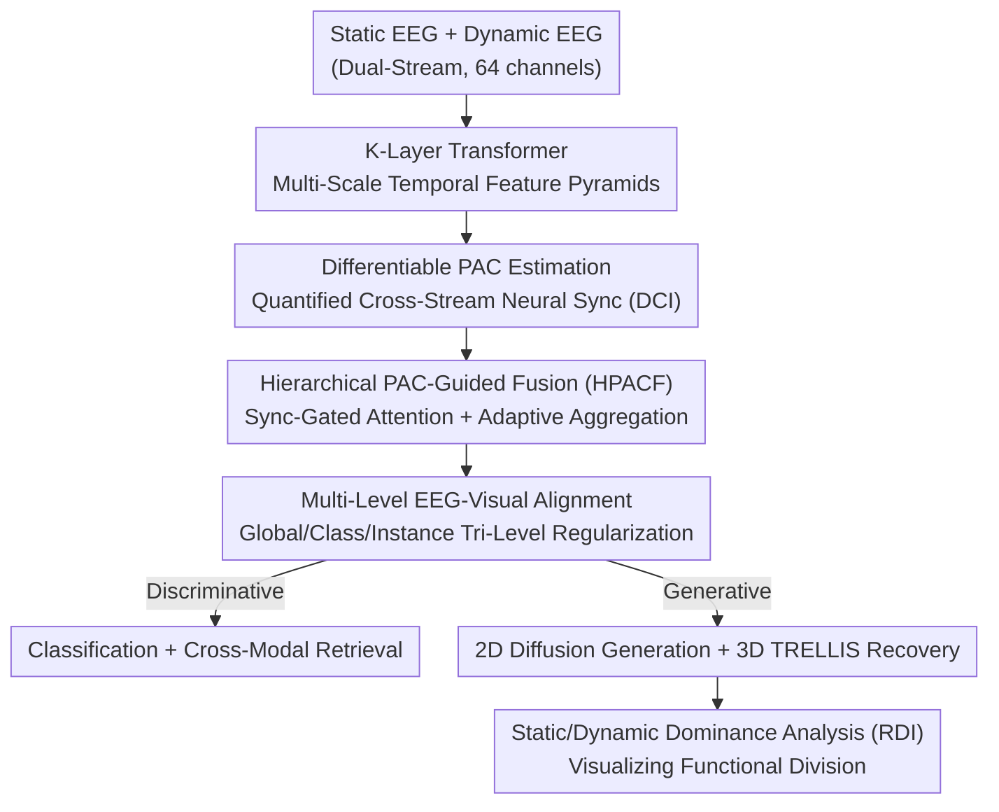

# Decoding 3D Perception via BrainSSD: Synergistic Fusion of EEG Representations from Static and Dynamic Visual Streams

**Conference**: CVPR 2026  
**Paper**: [CVF Open Access](https://openaccess.thecvf.com/content/CVPR2026/html/Yao_Decoding_3D_Perception_via_BrainSSD_Synergistic_Fusion_of_EEG_Representations_CVPR_2026_paper.html)  
**Code**: https://github.com/vziacq/BrainSSD  
**Area**: Medical Imaging / Brain Signal Decoding (EEG)  
**Keywords**: EEG Decoding, 3D Perception, Phase-Amplitude Coupling, Dual-Stream Fusion, Cross-Modal Alignment

## TL;DR
BrainSSD utilizes a neuro-inspired Hierarchical PAC-Guided Fusion (HPACF) module to synergistically fuse two sets of EEG signals from subjects viewing **static 3D object images** and **rotating object videos**. This system decodes semantically rich 3D visual representations, setting a new SOTA across classification/retrieval and 2D/3D generative reconstruction, and provides the first direct visual evidence that the "static stream captures global shape, while the dynamic stream encodes fine geometric details."

## Background & Motivation

**Background**: Decoding human visual experiences from brain activity (fMRI / EEG) typically aligns neural signals with the embedding space of visual-language foundation models like CLIP, utilizing contrastive learning for classification, retrieval, or conditional reconstruction. However, this line of work relies almost entirely on **static 2D image** stimuli.

**Limitations of Prior Work**: The static image paradigm natively fails to capture neural dynamics necessary for constructing real 3D perception, such as multi-view observation and motion parallax. A few pioneered works (e.g., Mind-3D for fMRI, Neuro-3D for EEG) have begun leveraging rotating videos for 3D reconstruction, demonstrating that neural signals from continuous observation contain richer information. However, EEG signals induced by rotating videos have a lower signal-to-noise ratio and are highly complex, making them unstable when used in isolation.

**Key Challenge**: Cognitive neuroscience repeatedly shows that robust perception arises from integrating information across **systematically complementary processing pathways** in the brain. Yet, existing EEG decoding research focus almost exclusively on a **single type of stimulus** (either static or dynamic), lacking mechanisms to effectively fuse these heterogeneous neural signals. How these two streams cooperate and what roles they play remain mostly unknown.

**Goal**: This work decomposes "3D perceptual decoding" into three research questions: RQ1: Do neural representations from dynamic observation encode richer 3D geometric information than static ones? RQ2: What "neuro-inspired" computational architecture can effectively coordinate these two streams? RQ3: Is there a functional division of labor between the two streams in constructing final 3D perceptions?

**Key Insight**: The authors build on two fundamental principles of neural computation: **hierarchical processing** (multi-stage brain processing of information) and **neural synchronization** (rhythmic coupling to "bind" information across brain regions). The former is implemented via multi-level cross-attention, while the latter is quantified and dynamically used to guide fusion via a differentiable Phase-Amplitude Coupling (PAC) estimator.

**Core Idea**: Use "PAC-quantified neural synchronization $\times$ hierarchical cross-attention" to guide the fusion of static and dynamic EEG streams, explicitly integrating neural synchronization into attention mechanisms to decode high-fidelity 3D visual representations.

## Method

### Overall Architecture

BrainSSD is a multi-stage pipeline composed of three main parts. **Encoding stage**: Static EEG $x_{stat}\in\mathbb{R}^{C\times T_{stat}}$ and dynamic EEG $x_{dyn}\in\mathbb{R}^{C\times T_{dyn}}$ ($C=64$ channels) are first processed by separate $K$-layer Transformers to obtain multi-scale temporal feature pyramids. Then, the core module, **HPACF**, synergistically fuses them into dense embeddings $L_{fused}$, which are projected into the visual feature space and compressed into $z\in\mathbb{R}^d$ through a multi-level alignment strategy. **Decoding stage**: The embedding $z$ is fed to two linear classifiers and a retrieval head for discriminative tasks, while simultaneously serving as the sole condition to drive a diffusion model to generate 2D images, from which TRELLIS restores 3D geometry. **Analysis stage**: By measuring the difference between the full fusion reconstruction and single-stream reconstructions, a representation dependency map is calculated to visualize the functional division of labor between the static and dynamic streams.

The pipeline transitions from raw dual-stream EEG to 3D point clouds, with HPACF fusion encoding and EEG-visual alignment as the most critical bottlenecks. Below is the step-by-step breakdown of the data flow.

### Key Designs

**1. Differentiable Phase-Amplitude Coupling Estimation: Making neuro-synchronization highly end-to-end learnable**

This addresses the limitation that while Phase-Amplitude Coupling (PAC) in brain science—low-frequency phase modulating high-frequency amplitude—is considered a hallmark of information binding, traditional KL Modulation Index (KL-MI) is a non-differentiable statistic that cannot be optimized end-to-end. The authors design a differentiable alternative. First, Short-Time Fourier Transform (STFT) is applied to each EEG stream to extract low-frequency phase $\phi_{LF}(c,t)$ and high-frequency amplitude $A_{HF}(c,t)$ for each channel $c$. Then, a differentiable phase-amplitude distribution is constructed by assigning high-frequency amplitudes to $N_{bins}$ phase bins using Gaussian kernel weighting:

$$\tilde{P}_c(j)=\sum_{t=1}^{T_{win}}A_{HF}(c,t)\cdot\exp\!\left(-\frac{(\phi_{LF}(c,t)-\mu_j)^2}{2\sigma_c^2}\right)$$

where $\mu_j$ is the center of the $j$-th phase bin, and $\sigma_c$ is a **channel-wise learnable** kernel width. Normalizing $\tilde{P}_c$ using L1 norm yields the probability distribution $P_c$. The **Differentiable Coupling Index (DCI)** is then defined as the KL divergence between $P_c$ and a uniform distribution $U$:

$$\text{DCI}_c=\log(N_{bins})+\sum_{j=1}^{N_{bins}}P_c(j)\log P_c(j)$$

Intuition: The more concentrated the amplitude is on a specific phase (deviating further from a uniform distribution), the stronger the coupling, leading to a larger DCI. Crucially, the authors compute **cross-stream** coupling, resulting in channel-wise vectors $\text{DCI}_{S\to D}\in\mathbb{R}^C$ (static phase/dynamic amplitude) and $\text{DCI}_{D\to S}\in\mathbb{R}^C$ (dynamic phase/static amplitude), directly quantifying the sync relationship between the two streams for downstream gating.

**2. Hierarchical PAC-Guided Fusion (HPACF): Utilizing neural synchronization to dynamically gate cross-stream attention**

With synchronization quantified, the question becomes how to use it to guide fusion. HPACF employs a dedicated **PAC-Guided Attention Layer** at each hierarchy, extending standard multi-head cross-attention to a sync-adjustable version: holding static EEG as Query $Q$ and the $k$-th level of dynamic EEG as Key/Value, the raw attention matrix $S_{raw}\in\mathbb{R}^{H\times T_{align}\times T_{align}}$ is computed first. Concurrently, the cross-stream DCI vectors are fed to a small MLP $g_{pac}$ to learn a set of head-wise modulation factors for **multiplicative gating**:

$$S_{modulated}=S_{raw}\odot\sigma\big(g_{pac}(\text{DCI}_{S\to D},\text{DCI}_{D\to S})\big)$$

where $\sigma$ is sigmoid, $\odot$ denotes broadcast multiplication. Thus, the information flow intensity of each attention head is dynamically determined by the baseline neural synchronization (passing high-sync directions and suppressing low-sync ones), effectively incorporating the biological "binding" phenomenon into attention rather than forcing the model to naively concatenate features. This process is repeated across all $K$ levels, yielding a set of level-specific representations $\{O_1,\dots,O_K\}$. To aggregate these into a coherent representation, an **adaptive aggregation** is used with a softmax-normalized learnable parameter $\alpha\in\Delta^{K-1}$ to formulate a convex combination $L_{fused}=\sum_k\alpha_k O_k$, behaving as a task-related "attention filter" on feature levels. Ablations indicate this "hierarchical + PAC-gated" approach is the major contributor to performance (see below).

**3. Multi-Level EEG-Visual Alignment: Pulling brain representation into the visual space across global, class, and instance scales**

For the fused $L_{fused}$ to decode visual semantics, it must be aligned with the visual domain. However, the distribution gap between EEG and visual features is massive, making simple sample-wise mapping insufficient. The authors propose three levels of alignment. **Global Spectral Calibration (GSC)** first matches second-order statistics between modalities: computing the covariance $C_{EEG}=\frac{1}{n-1}(Z^\top Z-\frac{1}{n}(\mathbf{1}^\top Z)^\top(\mathbf{1}^\top Z))$ on the batch of EEG embeddings $Z\in\mathbb{R}^{n\times d}$, and aligning it with the momentum-updated, stable visual covariance $\bar{C}_{Vision}$ using the loss $L_{GSC}=\frac{1}{4d^2}\|C_{EEG}-\bar{C}_{Vision}\|_F^2$. This aligns the correlation structure of EEG features with the visual domain, with momentum updating mitigating single-batch noise. **Prototype Distribution Alignment (PDA)** addresses sparse single-batch sampling in high-cardinality class spaces by maintaining momentum-updated class prototypes and minimizing the Maximum Mean Discrepancy (MMD) between prototype distributions across modalities: $L_{PDA}=\|\mathbb{E}_{p\sim P_{EEG}}[\phi(p)]-\mathbb{E}_{q\sim P_{Vision}}[\phi(q)]\|_{\mathcal{H}_k}^2$. This maintains structural consistency of concepts across modalities. **Instance-level alignment** further aligns paired instances point-to-point via CLIP contrastive loss $L_{CLIP}$ and MSE loss $L_{MSE}$ to retain local discriminability. The total objective is the weighted sum of these terms along with the class-weighted cross-entropy loss: $L_{total}=\sum_i\lambda_i L_i$.

**4. Static-Dynamic Dominance Analysis: Inferring functional division of labor using single-stream ablation reconstructions**

This step addresses RQ3 in a scientifically insightful way. Instead of directly interpreting brain signals, the authors analyze **how much the reconstruction changes when one stream is omitted**. For each cognitive trial, three 3D objects are reconstruction-generated: the full-fusion baseline $I_{fused}$, static-only $I_{stat}$, and dynamic-only $I_{dyn}$ (using ORB homography alignment). The dynamic stream dependency map $A_{dyn}$ is defined as the multi-scale cosine distance between "full fusion vs. omitting dynamic (meaning static only)" across multiple layers of a pre-trained image encoder:

$$A_{dyn}(i,j)=\sum_{l=1}^{L}w_l\cdot D_{cos}\big(\phi_l(I_{fused}),\phi_l(I_{stat})\big)_{(i',j')}$$

and $A_{stat}$ is computed analogously. A normalized **Representation Dependency Index (RDI)** is calculated for relative comparison:

$$\text{RDI}(i,j)=\frac{N(A_{dyn})_{i,j}-N(A_{stat})_{i,j}}{N(A_{dyn})_{i,j}+N(A_{stat})_{i,j}+\epsilon}$$

Finally, SAM is used to segment the object into semantic components, and the RDI is averaged within each component to yield a part-level map indicating static vs. dynamic reliance. The results are clear: global shape and coarse geometry rely heavily on the static stream (negative/blue RDI), while highly complex geometric details (such as camera lenses, aircraft wings, and tire treads) show a strong reliance on the dynamic stream (positive/red RDI).

### Loss & Training

The total loss is $L_{total}=\lambda_{GSC}L_{GSC}+\lambda_{PDA}L_{PDA}+\lambda_{CLIP}L_{CLIP}+\lambda_{MSE}L_{MSE}+\lambda_{CLS}L_{CLS}$, where $L_{CLS}$ utilizes class-weighted cross-entropy to address class imbalance. The HPACF encoder uses a 3-layer Transformer trained via AdamW + OneCycleLR. On the generation side, a lightweight IP-Adapter is fine-tuned (50 epochs) on frozen SDXL-Turbo to inject EEG representations into the diffusion cross-attentions, and 3D shapes are reconstructed using frozen TRELLIS. All baselines are adapted for dual-stream (feature concatenation) to ensure fair comparison.

## Key Experimental Results

The dataset is EEG-3D (currently the only public EEG benchmark with paired static/dynamic 3D perception): 64 channels, 12 subjects, 72 object classes, each featuring static images and rotating video stimuli. The implementation is on PyTorch 2.1 using 4×RTX 3090. Discriminative evaluation uses Top-K accuracy, while generative tasks use PSNR/SSIM/LPIPS (for 2D) and Chamfer Distance/F-score (for 3D).

### Main Results

BrainSSD achieves SOTA performance on discriminative tasks. Below is a subset of key columns (%):

| Method | Object 2-Way Top-1 | Object 72-Way Top-1 | Retrieval Top-1 | Retrieval Top-5 |
|------|------|------|------|------|
| Chance level | 50.00 | 1.39 | 1.39 | 5.56 |
| BrainAlign (2025) | 83.12 | 16.39 | 5.70 | 16.39 |
| Neuro-3D (2025) | 81.33 | 16.25 | 5.42 | 16.25 |
| BrainSSD (Static-Only) | 80.25 | 14.76 | 4.98 | 14.76 |
| BrainSSD (Dynamic-Only) | 79.80 | 14.47 | 4.80 | 14.47 |
| **BrainSSD (Full)** | **88.06** | **21.76** | **6.65** | **21.76** |

Top-1 retrieval improves from the previous best of 5.70% to 6.65%, representing a relative gain of 16.67%. Compared to the stronger Static-Only baseline (4.98%), it exhibits a 33.53% relative gain, providing direct evidence that the static and dynamic streams are complementary and non-redundant—single-stream approaches are consistently outperformed by fusion.

Generative Reconstruction (Table 2):

| Method | PSNR↑ | SSIM↑ | LPIPS↓ | CD↓ | F-score↑ |
|------|------|------|------|------|------|
| Static-Only | 13.437 | 0.666 | 0.702 | 0.130 | 0.255 |
| Dynamic-Only | 13.546 | 0.672 | 0.694 | **0.096** | 0.273 |
| **BrainSSD** | **13.561** | **0.693** | **0.647** | 0.113 | **0.304** |

The full model scores the lowest LPIPS (0.647) and highest 3D F-score (0.304). A telling comparison: while Static-Only yields perceptually cleaner images, **Dynamic-Only achieves significantly better geometric accuracy** (CD 0.096 vs 0.130, F-score 0.273 vs 0.255)—directly answering RQ1: the dynamic stream indeed encodes more precise 3D structures.

### Ablation Study

| Configuration | Phenomenon | Explanation |
|------|------|------|
| Full model | Top-1 Retrieval 6.65% | Complete model |
| w/o Hierarchy | 6.65 → 5.15% | Removing hierarchical fusion drops performance by 1.5% |
| w/o PAC-guided attention | 6.65 → 4.75% | Removing PAC gating drops performance by nearly 1.9% (most severe) |
| w/o PDA / GSC | Significant drop | Removing alignment strategies also leads to notable performance drops |

Complexity Analysis (Table 3): The full model has only 4.42M parameters and 0.36G FLOPs, offering a >16% relative gain in Top-1 retrieval compared to baselines of similar complexity. The PAC module incurs negligible cost (+7% parameters, +3% FLOPs) while bringing a ~40% relative retrieval improvement; Hierarchy brings a ~29% improvement at a moderate cost (+27% parameters, +16% FLOPs).

### Key Findings
- **PAC gating contributes the most**: Removing it results in the steepest performance drop in Top-1 retrieval (down to 4.75%), though it incurs almost zero computational overhead, marking it as the most cost-effective component.
- **Frequency bands matter**: Gating performance peaks when PAC couples theta-alpha phase with gamma amplitude, and the vision encoder behaves best using OpenCLIP—aligning perfectly with the known roles of theta-alpha/gamma synchronization in memory and information integration.
- **Functional division of labor is visibly real**: Part-level analysis consistently shows that the object's overall average RDI is negative (static stream dominates the global framework), while fine parts like ties or cabin interiors score strongly positive RDI (dynamic stream captures detail), mirroring the classical "two-stream hypothesis" in visual neuroscience.

## Highlights & Insights
- **Transforming non-differentiable neuroscientific metrics into learnable modules**: PAC, traditionally an offline statistical analysis tool (KL-MI), is redesigned with Gaussian kernel weighting + STFT to become end-to-end differentiable (DCI) and serve as an attention gating signal. This paradigm of "explicitly encoding neuroscientific priors into model structures" holds immense promise for other physiological signal modeling tasks requiring synchronization priors.
- **Analyzing functional division via ablation-reconstruction differences**: The counterfactual RDI metric bypasses the difficulty of directly interpreting EEG channels by mapping abstract functional specialization onto pixel/part-level visualizations, offering an excellent framework for using discriminative networks for scientific discovery.
- **Quantifying complementary properties**: The static stream excels at discrimination and global shape, whereas the dynamic stream dominates geometric accuracy. Their fusion outperforms either stream in isolation, providing rigorous evidence for why multi-stimulus paradigms are superior, rather than just showing arbitrary performance improvements.

## Limitations & Future Work
- The authors acknowledge that due to the scarcity of large-scale 3D perceptual EEG datasets, the current work is limited to **subject-specific and single-object** decoding, without exploring cross-subject generalization or compositional scene reconstruction.
- Validated only on a single dataset, EEG-3D (as it is currently the only one available), leaving cross-dataset generalization under-explored, which is a key area for future validation.
- The functional division analysis relies heavily on the generative reconstruction pipeline (SDXL-Turbo + TRELLIS + VGG-19 features). Because RDI is affected by the inductive biases of these pre-trained models, "neurological division" should be interpreted with some caveat.
- Future directions: Cross-subject generalization, scaling up from single objects to computational scenes, and making PAC frequency bands/kernel widths more adaptive.

## Related Work & Insights
- **vs. Neuro-3D (2025)**: Although Neuro-3D also reconstructs 3D shapes from EEG using rotating videos, it focuses on single dynamic stimuli. BrainSSD utilizes PAC-guided fusion to merge static and dynamic dual streams, yielding consistently higher metrics in 72-Way Top-1 (68.06% vs. 61.40%) and Retrieval Top-1 (6.65% vs. 5.42%).
- **vs. BrainAlign (2025)**: BrainAlign was the best-performing discriminative baseline (Retrieval Top-1 of 5.70%), but relies on single-stream alignment. BrainSSD yields a >16% relative improvement at a similar parameter scale, while additionally offering generative reconstruction and functional division analysis.
- **vs. Static Paradigms (CLIP-based methods)**: These methods align brain signals to the CLIP space for classification, retrieval, or generation but only use static 2D stimuli, failing to capture motion parallax. BrainSSD retains the CLIP-alignment philosophy (retaining $L_{CLIP}$), but incorporates dynamic streams and neural synchronization modeling specifically targeted at 3D perception.

## Rating
- Novelty: ⭐⭐⭐⭐⭐ First to perform static/dynamic dual-stream EEG fusion with differentiable PAC-gated attention, and first to provide direct visual evidence for functional divisions in 3D perception.
- Experimental Thoroughness: ⭐⭐⭐⭐ Comprehensively covers discrimination, generation, ablation, complexity, and interpretability, but is constrained to the single EEG-3D dataset under subject-specific settings.
- Writing Quality: ⭐⭐⭐⭐⭐ Highly structured around three RQs, closely integrating methods with neuroscientific motivations under clear logical flows.
- Value: ⭐⭐⭐⭐ Sets a new SOTA for EEG-to-3D decoding and establishes an interpretable paradigm utilizing discriminative models as neuroscientific discovery tools.

<!-- RELATED:START -->

## Related Papers

- [\[CVPR 2026\] NeuroFlow: Toward Unified Visual Encoding and Decoding from Neural Activity](neuroflow_toward_unified_visual_encoding_and_decoding_from_neural_activity.md)
- [\[ICLR 2026\] Towards Interpretable Visual Decoding with Attention to Brain Representations](../../ICLR2026/medical_imaging/towards_interpretable_visual_decoding_with_attention_to_brain_representations.md)
- [\[ICLR 2026\] Autoregressive Visual Decoding from EEG Signals](../../ICLR2026/medical_imaging/autoregressive_visual_decoding_from_eeg_signals.md)
- [\[CVPR 2026\] EEGiT: Teaching Vision Transformers to Understand the EEG signal](eegit_teaching_vision_transformers_to_understand_the_eeg_signal.md)
- [\[CVPR 2026\] Learning Generalizable 3D Medical Image Representations from Mask-Guided Self-Supervision](learning_generalizable_3d_medical_image_representations_from_mask-guided_self-su.md)

<!-- RELATED:END -->
