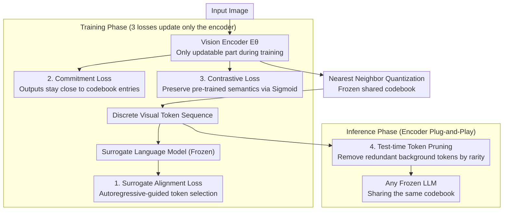

# Decoupling Vision and Language: Codebook Anchored Visual Adaptation

**Conference**: CVPR2026  
**arXiv**: [2602.19449](https://arxiv.org/abs/2602.19449)  
**Code**: To be confirmed  
**Area**: Medical Imaging / Vision-Language Models  
**Keywords**: Discrete visual tokens, codebook, vision encoder adaptation, domain transfer, token pruning, LVLM

## TL;DR

Ours proposes CRAFT, which decouples the vision encoder from the language model through a discrete codebook. By fine-tuning only the vision encoder, domain adaptation is achieved in a way that allows the adapted encoder to be seamlessly reused across different LLM architectures, resulting in an average improvement of 13.51% across 10 domain benchmarks.

## Background & Motivation

1. Vision encoders in Large Vision-Language Models (LVLMs) perform poorly in long-tail domains such as medical imaging and fine-grained classification. Perceptual errors in the encoder cascade to the language model, leading to incorrect reasoning.
2. Existing adaptation methods typically modify the continuous feature interface between the encoder and the LLM (projector tuning / LoRA). This creates coupling, necessitating re-alignment whenever the encoder or LLM is replaced.
3. Fine-tuning both the vision encoder and the LLM is computationally expensive and prone to forgetting instruction-following capabilities; domain data scarcity further exacerbates these issues.
4. Fine-tuning the encoder alone is insufficient: once feature distributions shift, a frozen LLM cannot correctly interpret the new visual embeddings.
5. Recent discretized LVLMs (e.g., VILA-U, Janus) demonstrate performance comparable to or better than continuous approaches, providing a natural "shared language" interface.
6. Core Problem: **Can domain adaptation for LVLMs be completed without modifying the original LLM?**

## Method

### Overall Architecture

CRAFT (Codebook RegulAted Fine-Tuning) addresses the practical question of whether domain adaptation can be performed without touching the original LLM. It operates on discrete LVLMs: after the vision encoder $E_\theta$ outputs continuous features, they undergo nearest-neighbor quantization via a **frozen shared codebook** $\mathcal{C}=\{c_k\}_{k=1}^K$ to obtain a discrete token sequence, which is then fed into the LLM through a projector. Only the vision encoder is updated during training; both the codebook and the LLM remain frozen. Because the interface relies on a discrete codebook rather than continuous features, the adapted encoder can be plugged into any LLM sharing the same codebook.

The workflow consists of two phases: **Training**, where domain knowledge is injected into the encoder using a frozen **surrogate language model** and three losses (surrogate alignment / commitment / contrastive); and **Inference**, where **test-time token pruning** compresses redundant tokens before deploying the adapted encoder into any frozen LLM sharing the codebook.

### Key Designs

**1. Surrogate Alignment Loss ($\mathcal{L}_{\text{SAL}}$): Guiding token selection with a teacher model**

The encoder must learn to select codebook tokens useful for domain tasks without modifying the actual inference LLM. A surrogate language model $\mathcal{M}$ (which can be very small) is utilized to perform autoregressive prediction on image-text sequences. Gradients are backpropagated to the vision encoder to guide its discrete token selection, thereby injecting domain knowledge into the encoder while leaving the large inference LLM untouched.

**2. Commitment Loss ($\mathcal{L}_{\text{commit}}$): Anchoring encoder outputs near the codebook**

Since the codebook is frozen, significant quantization distortion occurs if the encoder output drifts too far. The commitment loss constrains encoder outputs to remain close to their assigned codebook entries. This constraint applies only to the encoder and not the codebook. Ablations indicate this is the most critical component; without it, the mean performance drops from 64% to 14%.

**3. Contrastive Loss ($\mathcal{L}_{\text{con}}$): Preserving pre-trained semantic structures**

Domain adaptation should not destroy existing semantic structures. Sigmoid contrastive learning is applied using image descriptions and label-extended text to maintain the pre-trained semantic space. This contributes significantly to classification tasks, while SAL is more impactful for reasoning tasks. The non-differentiable nature of quantization is handled via a **straight-through estimator**.

**4. Test-time Token Pruning: Training-free redundancy removal via rarity**

Many background tokens are redundant during inference. Global frequencies $p_{\text{dom}}(k)$ of codebook entries are calculated on the training set to define rarity weights $\rho_k = 1/p_{\text{dom}}(k)$. High-frequency background tokens are heavily pruned, preserving rare tokens with high information content. Within specific entries, tokens are prioritized based on large quantization residuals (high information/difficulty) and spatial isolation to encourage diverse spatial coverage. A 1D search for $\gamma$ controls the retention ratio $M/N$ (default keep ratio = 0.8). Incremental gains were observed: random selection 62.10% → rarity-weighted 63.55% → residual-sorted 63.86% → spatial-isolated 64.05%.

### Loss & Training

The total loss is a weighted sum of three terms:

$$\mathcal{L}_{\text{CRAFT}} = \lambda_{\text{con}}\mathcal{L}_{\text{con}} + \lambda_{\text{commit}}\mathcal{L}_{\text{commit}} + \mathcal{L}_{\text{SAL}}$$

Where $\lambda_{\text{con}}=0.1$ for VQA tasks, $\lambda_{\text{con}}=1.0$ for classification tasks, and $\lambda_{\text{commit}}=0.1$.

## Key Experimental Results

### Main Results (Table 1, 10 benchmarks, Exact Match Accuracy %)

| Method | Visual Token | PlantVillage | VQARAD | EuroSAT | Cars | Dogs | 10-bench Mean |
|---|---|---|---|---|---|---|---|
| Zero-shot VILA-U-7B | Discrete | 43.83 | 35.67 | 69.15 | 72.50 | 82.40 | 55.07 |
| Zero-shot VILA-7B | Continuous | 47.20 | 41.67 | 79.48 | 76.30 | 78.33 | 59.89 |
| Vision FT (Continuous) | Continuous | 62.13 | 43.67 | 67.35 | 86.80 | 71.43 | 61.76 |
| **CRAFT (7B surr.)** | **Discrete** | **77.27** | **45.67** | **77.80** | **92.74** | **84.77** | **68.58** |

CRAFT achieves optimal performance using VILA-U-7B as the surrogate: **68.58% average, a +13.51% Gain over zero-shot**, and +6.82% higher than the strongest continuous baseline.

### Inference Quality Retention (Table 2, VQARAD Dataset)

| Method | Accuracy | Expl. Presence | Relevance | Faithfulness | Overall |
|---|---|---|---|---|---|
| VILA-LLM-LoRA | 44.65 | 6.34 | 0.26 | 0.25 | -0.98 |
| Projector FT | 44.89 | 4.01 | 0.28 | 0.22 | -0.61 |
| **CRAFT** | **47.34** | **75.98** | **2.95** | **1.99** | **3.21** |

Continuous fine-tuning methods result in a severe loss of instruction-following and explanation capabilities (Presence drops to 4–6%). CRAFT maintains an explanation generation rate of 76%.

### Ablation Study (Table 5, VILA-U-7B backbone)

| Configuration | VQARAD | Dogs | PlantVillage | IconQA | Mean |
|---|---|---|---|---|---|
| w/o $\mathcal{L}_{\text{commit}}$ | 10.33 | 16.53 | 25.97 | 3.31 | 14.04 |
| w/o $\mathcal{L}_{\text{SAL}}$ | 37.87 | 83.66 | 75.03 | 15.49 | 53.01 |
| w/o $\mathcal{L}_{\text{con}}$ | 45.13 | 71.57 | 45.69 | 47.24 | 52.41 |
| **Full CRAFT** | **45.67** | **84.77** | **77.27** | **48.50** | **64.05** |

The commitment loss is the most critical; its removal causes performance to collapse to 14%. SAL contributes significantly to reasoning, while contrastive loss is vital for classification.

### Cross-LLM Transfer (Table 3)

An encoder trained with Qwen2-0.5B was directly paired with Qwen2.5-3B for inference: mean accuracy improved from 46.74% → 59.98% (+13.24%). When paired with Qwen2-1.5B, results improved from 49.06% → 63.25% (+14.19%). These results validate the feasibility of codebook-level modularity.

### Efficiency (Table 4)

- Using Qwen2-0.5B as a surrogate: VRAM usage 10.7 GiB (61.6% reduction), training time 1.35 min (73.5% reduction).
- Inference with keep ratio = 0.8: FLOPs reduced by 16%, latency reduced by 7%.

## Highlights & Insights

- **True Vision-Language Decoupling**: The adapted encoder is plug-and-play for any LLM sharing the same codebook (verified across 5 architectures/scales), a feat unachievable by continuous methods.
- **Zero LLM Forgetting**: The LLM is completely frozen, preserving full reasoning and explanation capabilities without requiring additional instruction data.
- **Ultra-Lightweight Training**: Surrogate models can be as small as 0.5B. Only the vision encoder is trained, requiring only minutes on 8x A100 GPUs and as little as 10.7 GiB VRAM.
- **Test-time Token Pruning**: A training-free pruning scheme based on rarity improves efficiency and robustness; performance is stable above a 0.6 keep ratio.
- **Advocacy for Discrete Tokens**: This work provides the first systematic proof that discrete visual tokens support modular, transferable visual adaptation, opening new application scenarios for discrete LVLMs.

## Limitations & Future Work

- Dependency on the quality and scale of pre-trained discrete codebooks (e.g., VILA-U's 16,384 entries). Reducing the codebook to 10% drops mean performance from 76.71% to 32.28%.
- Performance on fine-grained tasks (Flowers, Dogs) may degrade if the surrogate model is significantly weaker than the inference backbone.
- The current codebook is assumed to be fixed; backward compatibility during codebook expansion or merging remains an open question.
- Evaluation is limited to Classification and VQA, lacking open-ended generation, detection, or segmentation tasks.
- Discrete tokens inherently involve information loss, which may be unsuitable for tasks requiring pixel-level precision.

## Related Work & Insights

- **Projector FT / Vision FT**: These operate in continuous space; any change in the encoder requires re-alignment with the LLM. CRAFT achieves zero-cost transfer via discrete codebook isolation.
- **LLM LoRA**: While accurate, it severely damages instruction-following capabilities (explanation presence ~2%). CRAFT avoids this by keeping the LLM frozen.
- **LDIFS (Mukhoti et al.)**: Uses $\ell_2$ regularization to prevent CLIP feature drift in continuous space. CRAFT's commitment loss achieves a similar goal more stably in discrete space.
- **Discrete LVLMs (VILA-U, Janus)**: CRAFT is the first to utilize discrete codebooks for domain adaptation rather than generation, revealing unique advantages in modularity and transferability.

## Rating

- Novelty: ⭐⭐⭐⭐ — The use of discrete codebooks for decoupled vision-language adaptation is innovative.
- Experimental Thoroughness: ⭐⭐⭐⭐ — Comprehensive evaluation across 10 benchmarks and 5 backbones.
- Writing Quality: ⭐⭐⭐⭐ — Clear problem definition and intuitive comparisons.
- Value: ⭐⭐⭐⭐ — Highly practical for resource-constrained domain adaptation (e.g., medical).

<!-- RELATED:START -->

## Related Papers

- [\[CVPR 2026\] MedCLIPSeg: Probabilistic Vision-Language Adaptation for Data-Efficient and Generalizable Medical Image Segmentation](medclipseg_probabilistic_vision-language_adaptation_for_data-efficient_and_gener.md)
- [\[CVPR 2026\] Tell2Adapt: A Unified Framework for Source Free Unsupervised Domain Adaptation via Vision Foundation Model](tell2adapt_a_unified_framework_for_source_free_unsupervised_domain_adaptation_vi.md)
- [\[CVPR 2026\] From Panel to Pixel: Zoom-In Vision-Language Pretraining from Biomedical Scientific Literature](from_panel_to_pixel_zoom-in_vision-language_pretraining_from_biomedical_scientif.md)
- [\[CVPR 2026\] MedKCO: Medical Vision-Language Pretraining via Knowledge-Driven Cognitive Orchestration](medkco_medical_vision-language_pretraining_via_knowledge-driven_cognitive_orches.md)
- [\[CVPR 2026\] Attention Consistent Longitudinal Medical Visual Question Answering Guided by Vision Foundation Models](attention_consistent_longitudinal_medical_visual_question_answering_guided_by_vi.md)

<!-- RELATED:END -->
