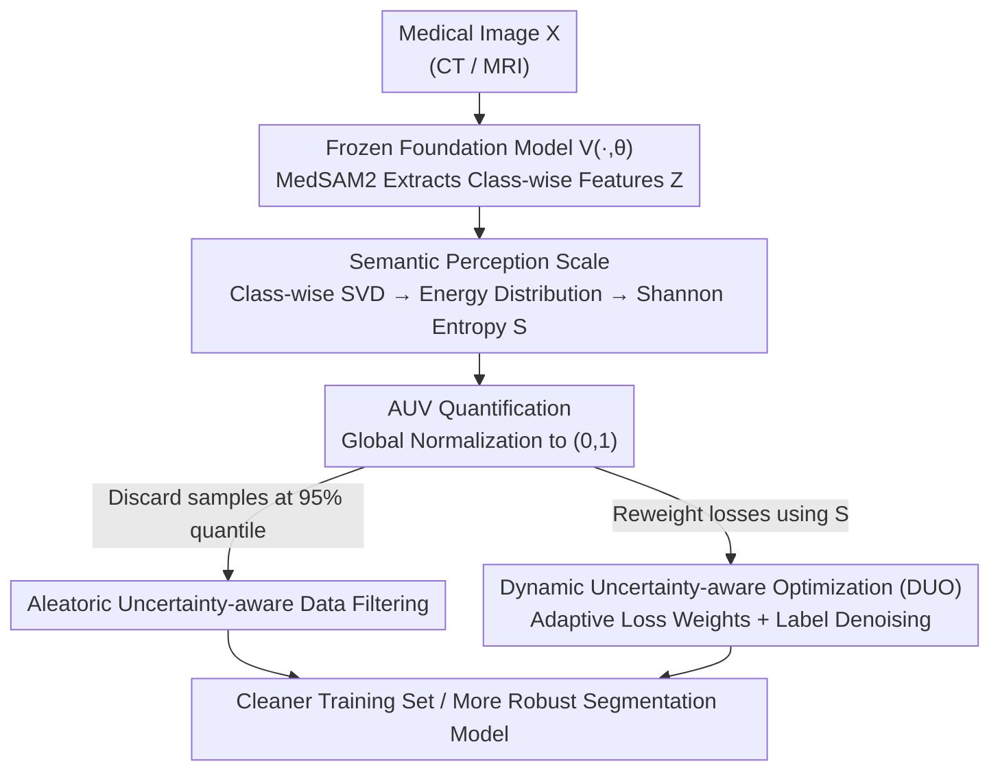

# Delving Aleatoric Uncertainty in Medical Image Segmentation via Vision Foundation Models

**Conference**: CVPR 2026  
**Paper**: [CVF Open Access](https://openaccess.thecvf.com/content/CVPR2026/html/Li_Delving_Aleatoric_Uncertainty_in_Medical_Image_Segmentation_via_Vision_Foundation_CVPR_2026_paper.html)  
**Code**: The paper states it is open-sourced, but no link is provided in the text. ⚠️  
**Area**: Medical Image Segmentation  
**Keywords**: Aleatoric Uncertainty, Vision Foundation Models, Singular Value Energy, Data Filtering, Adaptive Loss  

## TL;DR
This work utilizes a frozen medical vision foundation model (MedSAM2) to extract features, performs Singular Value Decomposition (SVD) on class-wise feature matrices, and quantifies the Shannon entropy of their energy distribution. This yields a label-free "Aleatoric Uncertainty Value (AUV)" to characterize sample difficulty and noise. This value drives two plug-and-play strategies—"Data Filtering" and "Dynamic Uncertainty-aware Optimization (DUO)"—achieving consistent segmentation performance gains across five CT/MRI datasets.

## Background & Motivation
**Background**: Medical image segmentation provides the objective basis for diagnosis, surgical navigation, and treatment planning. However, current research on "uncertainty" almost exclusively focuses on **epistemic uncertainty** (model limitations), characterizing the degree of model "hesitation" through MC dropout, multiple inferences, or predictive reliability estimation.

**Limitations of Prior Work**: The actual contamination of training comes from **aleatoric uncertainty** inherent in the data itself—multi-center device differences, imaging noise, and ambiguity or inconsistency in expert annotations. If a model learns directly from these noisy/ambiguous samples, it can be misled or become overconfident. Moreover, existing methods for quantifying aleatoric uncertainty mostly rely on models trained on task-specific datasets, which are prone to overfitting and produce unreliable uncertainty estimates.

**Key Challenge**: To reliably measure "how difficult/dirty the data is," a **task-agnostic, stable, and discriminative feature space** is required. Task-specific models fail here as their features are overfitted to a specific dataset.

**Goal**: (1) To identify a label-free method for quantifying the aleatoric uncertainty of each sample without requiring multiple inferences; (2) To practically apply this quantitative value within the training pipeline to enhance robustness.

**Key Insight**: Leveraging the ability of foundation models to map multi-source heterogeneous data into a unified, stable, task-agnostic feature space, the authors propose using a **pretrained medical vision foundation model as a fixed feature extractor**. The observation is that discriminative "easy" samples possess features with a rich and uniform energy distribution across the singular value spectrum (high rank), whereas "hard/noisy" samples with blurred boundaries or artifacts exhibit low-rank features where energy concentrates in a few directions.

**Core Idea**: The dispersion of the "singular value energy distribution of the feature matrix" is used as a proxy for sample difficulty. A **semantic perception scale ($\mathcal{S}$)** is defined using normalized Shannon entropy, which is then globally normalized into the **AUV**, all without accessing labels.

## Method

### Overall Architecture
The method consists of two main stages: **uncertainty quantification** and **integrating uncertainty into training**.

Quantification: For a given medical image $X$, it is fed into a **frozen** medical foundation model $V(\cdot,\theta)$ (MedSAM2 performed best in experiments) to obtain class-wise feature tensors $Z$. For each class $c$, the 3D feature map is reshaped into a 2D matrix for SVD. The squared singular values are normalized into an "energy distribution," from which the normalized Shannon entropy is calculated to derive the semantic perception scale $\mathcal{S}$. Finally, this is globally normalized to obtain a sample-level AUV $\in(0,1)$, where values closer to 1 indicate "harder/dirtier" samples.

Application: The AUV serves as an "additional annotation" for training data, driving two independent, plug-and-play branches: (a) **Data Filtering**, which discards the dirtiest samples based on AUV quantiles; (b) **Dynamic Uncertainty-aware Optimization (DUO)**, which uses $\mathcal{S}$ to adaptively adjust class-wise loss weights and incorporates a label denoising head.

### Key Designs

**1. Semantic Perception Scale: Quantifying Difficulty Without Labels Using Singular Value Energy Entropy**

This is the foundation of the work, addressing the limitation that task-specific features are overfitted. The authors use a frozen medical foundation model as the feature extractor: input image volume $X\in\mathbb{R}^{D\times H\times W}$ yields $Z = V(X,\theta)\in\mathbb{R}^{C\times D\times H\times W}$. For class $c$, the feature map is reshaped to $z_c\in\mathbb{R}^{D\times(H\cdot W)}$. Instead of explicitly calculating the covariance matrix to find eigenvalues, the authors perform SVD directly on $z_c=US_cV^{\mathrm T}$, as squared singular values $\lambda^c_j=(\sigma^c_j)^2$ are numerically more stable.

The squared singular values are normalized into an energy distribution, and the normalized Shannon entropy measures its dispersion:

$$p_j(z_c)=\frac{(\sigma^c_j)^2}{\sum_{j=1}^{r}(\sigma^c_j)^2+\varepsilon},\qquad \mathcal{S}(Z_i|c)=\frac{-\sum_{j=1}^{r}p_j(Z_i|c)\log p_j(Z_i|c)}{\log(r)}$$

Intuition: Slow singular value decay $\to$ high rank, evenly distributed energy $\to$ high entropy $\to$ diverse features, noise robustness $\to$ low uncertainty. Fast decay $\to$ low rank, concentrated energy $\to$ low entropy $\to$ poor features $\to$ high uncertainty. Total sample uncertainty is $\mathcal{S}(Z_i)=\sum_{c=1}^{C}\mathcal{S}(Z_i|c)$. Finally, AUV is derived via log transformation and min-max normalization:

$$\text{AUV}(Z_i)=1-\frac{\log(\mathcal{S}(Z_i))-\min\{\log\mathcal{S}(Z_i)\}}{\max\{\log\mathcal{S}(Z_i)\}-\min\{\log\mathcal{S}(Z_i)\}}$$

**2. Aleatoric Uncertainty-aware Data Filtering: Discarding the Dirtiest Samples by Quantile**

To address noisy samples misleading the training, the AUV distribution is used to set a threshold. For AUV cumulative distribution function $F$, the quantile function is $F^{-1}(\tilde p)=\inf\{\text{AUV}:\tilde p\le F(\text{AUV}(Z_i))\}$. By default, $\tilde p=95\%$ (discarding the top 5% highest AUV samples), retaining the set $\mathcal{D}^{*}=\{\tilde x_i\mid \text{AUV}\le F^{-1}(\tilde p)\}$.

**3. Dynamic Uncertainty-aware Optimization (DUO): Loss Reweighting via Semantic Scale + Label Denoising**

This addresses difficult classes and noisy labels. The authors note that medical segmentation is a Bernoulli problem; Gaussian assumptions introduce mismatch bias. Thus, they avoid density estimation and use the semantic perception scale $\mathcal{S}$ of predicted features to reveal cognitive bias.

Mechanism: (i) **Label Denoising**—A noise estimation head $f(x)_{\theta_2}$ is added in parallel to the main head $f(x)_{\theta_1}$ to learn a noise $\hat\epsilon_i$, purifying the label to $\tilde y_i = y_i-\hat\epsilon_i\cdot f(x_i)_{\theta_2}$. (ii) **Adaptive Reweighting**—$\mathcal{S}$ is used as a regularizer to dynamically adjust class weights:

$$\mathcal{L}_{\text{total}}=\frac{1}{N}\sum_{i=1}^{N}\sum_{c=1}^{C}\frac{\mathcal{L}_{\text{seg}}\big(f(x_i)_{\theta_1},\,y_i-\hat\epsilon_i\cdot f(x_i)_{\theta_2}\big)}{1+\alpha\cdot\mathcal{S}(f(x_i|c)_{\theta_1})},\quad \text{s.t.}\ \tfrac1N\sum_i\hat\epsilon_i=0,\ \tfrac1N\sum_i\hat\epsilon_i^2=1$$

Larger $\mathcal{S}$ (more "certain" class) $\to$ smaller weight, shifting attention to classes that are harder to learn.

### Loss & Training
All experiments use nnU-Net preprocessing. Models are trained for 100 epochs using SGD (initial LR 0.01, Poly strategy), patch size $96^3$, and batch size 2 on a single RTX 4090. Segmentation loss is a weighted combination of Dice and BCE.

## Key Experimental Results

### Main Results
Evaluation on five datasets: LiTS (Liver/Tumor CT), TotalSegmentator (104 structures CT), WORD (16 organs CT), FeTA 2022 (Fetal brain MRI), and KiTS23 (Kidney/Tumor CT).

**Data Filtering (Table 1, nnU-Net baseline, average Dice across 5 datasets):**

| Method | Retained Ratio | Avg Dice (%) | vs 100% baseline |
|--------|----------------|--------------|------------------|
| Baseline | 100% | 75.10 | — |
| Data Variance | 90% | 75.39 | +0.29 |
| Task-specific nnU-Net | 95% | 75.33 | +0.23 |
| SegVol (Foundation) | 90% | 76.11 | +1.01 |
| **MedSAM2 (Foundation)** | **90%** | **76.45** | **+1.35** |

Conclusion: Measuring uncertainty via variance or task-specific models yields negligible gains. Foundation models, specifically MedSAM2, provide significant gains by removing only 10% of dirty samples.

**DUO Optimization (Table 2, across three backbones):**

| Backbone | DUO | Avg Dice (%) | Gain |
|----------|-----|--------------|------|
| nnU-Net (CNN) | ✗ | 75.10 | — |
| nnU-Net (CNN) | ✓ | 75.69 | +0.59 |
| Swin-UNETR (VIT) | ✗ | 73.09 | — |
| Swin-UNETR (VIT) | ✓ | 73.64 | +0.55 |
| U-Mamba (Mamba) | ✗ | 74.13 | — |
| U-Mamba (Mamba) | ✓ | 74.66 | +0.53 |

DUO provides consistent gains of ~0.5% across all architectures.

### Ablation Study

**Quantization Comparison (Table 3, LiTS Tumor Dice%):**
The proposed $\mathcal{S}(\cdot)$ outperforms Fisher and Mahalanobis (MD) significantly, improving tumor Dice by **+4.97%** under filtering.

**Correlation with Predicted Dice (Table 4):** The proposed $\mathcal{S}$ shows much higher Pearson (0.6267) and Spearman (0.7471) correlation with segmentation performance compared to Fisher and MD.

### Key Findings
- Difficulty is concentrated in **small targets and low-contrast classes** (e.g., tumors). Gains on liver segmentation were minimal, while tumor Dice improved significantly.
- **Foundation model selection matters**: CLIP-Driven models actually decreased performance on some datasets, whereas medical-specific MedSAM2 was optimal.
- MD combined with DUO even resulted in a negative gain (-0.03%), whereas the proposed $\mathcal{S}$ remained consistently positive, indicating better alignment with actual model behavior.

## Highlights & Insights
- **Translating "Feature Rank/Energy" to "Sample Difficulty"**: Using the Shannon entropy of SVD singular value energy to characterize aleatoric uncertainty avoids expensive MC sampling/multiple inferences and explicit covariance calculation.
- **AUV as an "Additional Annotation"**: The quantification is decoupled from application, allowing filtering and DUO to be used independently or together with zero extra training overhead and no structural changes to the backbone.
- **Transferability**: The paradigm of using frozen foundation models to extract class-wise features for SVD-based difficulty scoring can theoretically be applied to any segmentation/detection task suffering from noisy labels or sample difficulty variance.

## Limitations & Future Work
- AUV reliability is highly dependent on the **choice of foundation model**; its generalizability across modalities without medical-specific pretraining is unproven. ⚠️
- Overall gains are modest (avg +0.5% for DUO, +1.35% for filtering), with most benefit occurring in difficult classes like tumors.
- The label denoising head is relatively simple, using only statistical constraints ($\mu=0, \sigma^2=1$). Its effectiveness against structured annotation bias (e.g., systematic boundary shifts) is not fully explored.

## Related Work & Insights
- **vs. Epistemic Uncertainty**: While epistemic methods characterize model state via multiple forwards, this method characterizes data state via class-wise feature geometry, requiring only a single forward with a frozen model.
- **vs. Task-specific Feature Uncertainty**: This work demonstrates that task-agnostic spaces from foundation models are more reliable because they do not overfit to the training set distribution.

## Rating
- Novelty: ⭐⭐⭐⭐
- Experimental Thoroughness: ⭐⭐⭐⭐
- Writing Quality: ⭐⭐⭐⭐
- Value: ⭐⭐⭐⭐

<!-- RELATED:START -->

## Related Papers

- [\[CVPR 2026\] Simple-ViLMedSAM: Simple Text Prompts Meet Vision-Language Models for Medical Image Segmentation](simple-vilmedsam_simple_text_prompts_meet_vision-language_models_for_medical_ima.md)
- [\[CVPR 2026\] Revisiting 2D Foundation Models for Scalable 3D Medical Image Classification](revisiting_2d_foundation_models_for_scalable_3d_medical_image_classification.md)
- [\[ICLR 2026\] CUPID: A Plug-in Framework for Joint Aleatoric and Epistemic Uncertainty Estimation with a Single Model](../../ICLR2026/medical_imaging/cupid_a_plug-in_framework_for_joint_aleatoric_and_epistemic_uncertainty_estimati.md)
- [\[CVPR 2026\] Forging a Dynamic Memory: Retrieval-Guided Continual Learning for Generalist Medical Foundation Models](forging_a_dynamic_memory_retrieval-guided_continual_learning_for_generalist_medi.md)
- [\[CVPR 2026\] LATA: Laplacian-Assisted Transductive Adaptation for Conformal Uncertainty in Medical VLMs](lata_laplacian-assisted_transductive_adaptation_for_conformal_uncertainty_in_med.md)

<!-- RELATED:END -->
## Related Papers

- [\[CVPR 2026\] Attention Consistent Longitudinal Medical Visual Question Answering Guided by Vision Foundation Models](attention_consistent_longitudinal_medical_visual_question_answering_guided_by_vi.md)
- [\[CVPR 2026\] Revisiting 2D Foundation Models for Scalable 3D Medical Image Classification](revisiting_2d_foundation_models_for_scalable_3d_medical_image_classification.md)
- [\[CVPR 2026\] Are General-Purpose Vision Models All We Need for 2D Medical Image Segmentation? A Cross-Dataset Empirical Study](are_general-purpose_vision_models_all_we_need_for_2d_medical_image_segmentation_.md)
- [\[CVPR 2026\] Forging a Dynamic Memory: Retrieval-Guided Continual Learning for Generalist Medical Foundation Models](forging_a_dynamic_memory_retrieval-guided_continual_learning_for_generalist_medi.md)
- [\[CVPR 2026\] TANGO: Learning Distribution-wise Foundation Prior Consistency and Instance-wise Style Calibration for Medical Image Generalization](tango_learning_distribution-wise_foundation_prior_consistency_and_instance-wise_.md)

<!-- RELATED:END -->
