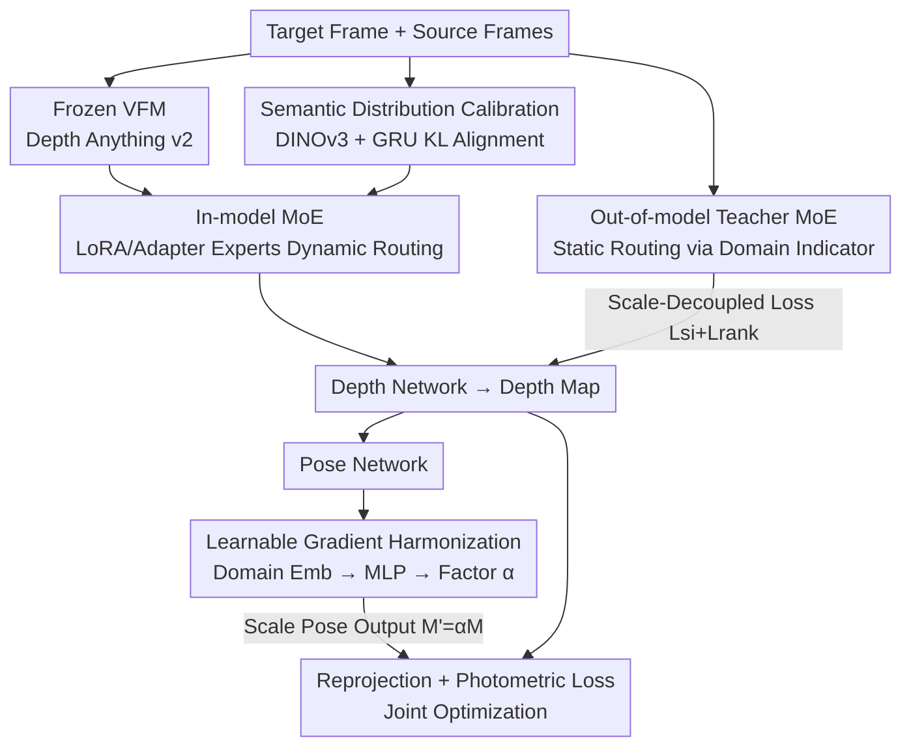

# Depth Any Endoscopy: Towards Self-Supervised Generalizable Depth Estimation in Monocular Endoscopy

**Conference**: CVPR 2026  
**Paper**: [CVF Open Access](https://openaccess.thecvf.com/content/CVPR2026/html/Shao_Depth_Any_Endoscopy_Towards_Self-Supervised_Generalizable_Depth_Estimation_in_Monocular_CVPR_2026_paper.html)  
**Code**: https://github.com/ShuweiShao/DAE  
**Area**: Medical Imaging  
**Keywords**: Endoscopic depth estimation, self-supervised, cross-domain generalization, Mixture-of-Experts (MoE), Vision Foundation Model (VFM) adaptation  

## TL;DR
DAE transforms a Vision Foundation Model (Depth Anything v2) into a unified self-supervised endoscopic depth network through "Dual-layer MoE adaptation + Learnable Gradient Harmonization + Semantic Distribution Calibration." Without depth annotations, it achieves State-of-the-Art (SOTA) performance in both zero-shot and in-domain depth estimation across diverse procedures like laparoscopy and colonoscopy.

## Background & Motivation

**Background**: In minimally invasive endoscopic surgery, monocular depth estimation is core to 3D reconstruction and AR navigation. Due to barriers in collecting ground-truth depth annotations (safety, privacy, surgical protocols), the mainstream approach is **self-supervised**—formulating depth estimation as a "novel view synthesis" problem. Depth and pose networks are jointly predicted using photometric loss from reprojected adjacent frames as the supervision signal.

**Limitations of Prior Work**: Existing self-supervised methods are almost exclusively trained **in-domain**—trained and tested on the same surgical procedure. When applied cross-domain (e.g., Laparoscopy ↔ Colonoscopy ↔ Arthroscopy), the drastic differences in depth distribution, lighting, and tissue texture prevent network convergence. Another approach adapts general depth foundation models (like Depth Anything) using LoRA, but these works target only a **single domain**, leaving cross-domain generalization insufficient.

**Key Challenge**: Under self-supervised settings, there is no direct depth supervision, only photometric loss. Different procedures present varying "learning difficulties," leading to two issues: (i) sharp differences in depth/lighting/texture hinder convergence; (ii) depth and pose networks share the same photometric loss, but different procedures cause **gradient magnitude imbalances** between the two networks, disrupting collaborative optimization. Empirical findings show that the pose network gradient scaling factor is **dataset-dependent**—requiring 0.001 for SCARED to converge (0.01 leads to collapse), while SimCol3D requires 0.01. A fixed factor inevitably fails on hybrid data.

**Goal**: To build a **unified model** providing reliable depth across multiple procedures under a self-supervised (no depth annotation) premise.

**Key Insight**: Rather than adapting to each procedure individually, it is better to let a foundation model "choose its own adaptation method" based on input characteristics—**Dual-layer MoE** (in-model dynamic LoRA/Adapter experts + out-of-model domain-routed teacher experts), complemented by a **Learnable Gradient Harmonization** factor to resolve depth-pose imbalances, and DINOv3 semantic distribution calibration to enforce consistency.

## Method

### Overall Architecture

The backbone of DAE is a frozen Depth Anything v2 (ViT) with trainable depth heads and pose networks, following the self-supervised "depth network + pose network + photometric loss" paradigm. Four components work in synergy: for a target frame, the **in-model MoE** dynamically routes LoRA/Adapter experts within Transformer blocks to adjust internal features; simultaneously, an **out-of-model Teacher MoE** (statically routed via domain indicators with frozen weights) provides domain-specific depth guidance supervised by a scale-decoupled loss. The pose network output is scaled by a **Learnable Gradient Harmonization** factor before reprojection for photometric loss to balance depth-pose gradients. Finally, encoder features are aligned with high-level semantics via the **Semantic Distribution Calibration (SDC)** module.

### Key Designs

**1. Dual-layer MoE Adaptation: Dynamic expert selection based on input characteristics**

To address the failure of single LoRA adaptation in handling cross-procedure differences, DAE splits adaptation into **in-model** and **out-of-model** layers. The in-model layer treats LoRA and Adapters as MoE: the MoE-LoRA layer uses a set of low-rank matrices with **varying ranks** $r$ as experts $E_L=\{E_{L1},\dots,E_{LN}\}$. A lightweight selector $S_L(\cdot)$ routes the input $I_{in}$ to the Top-$\kappa$ experts. The output is:

$$I_{out}=W_{q,k,v}(I_{in})+\sum_{n=1}^{N}S_L(I_{in})\cdot E_{Ln}(I_{in}),\quad E_{Ln}(I_{in})=B_nA_nI_{in}$$

where $W_{q,k,v}$ are frozen attention weights and $B_n, A_n$ are trainable matrices of rank $r_n$. Routing is defined as $S_L(I_{in})=\mathrm{Top}_\kappa(\mathrm{softmax}(W_{sel}I_{in}/\tau))$. Since ViT lacks local inductive bias, the **MoE-Adapter** layer adds convolutional blocks with **different kernel sizes** to compensate for structural details. Empirically, SCARED prefers ranks 4/16 and kernel size 3, while SimCol3D prefers ranks 4/32 and kernel size 7, confirming data-dependent selection.

The out-of-model layer is a **Domain-specific Teacher MoE** $E_G=\{E_{G1},\dots,E_{GZ}\}$. Each teacher is **pre-trained via self-supervision** on specific domain data with frozen weights. Static **one-to-one routing** $E_{Gz}=E_G[\zeta\in D]$ is performed based on the domain indicator $D$. This provides explicit depth guidance, which is crucial for stabilizing training on hybrid data where pure photometric loss might fail.

**2. Scale-Decoupled Loss: Learning meaningful structures without scale bias**

Monocular systems suffer from inherent scale ambiguity. Directly using teacher depth as ground truth would bias the student towards the teacher's scale. The loss consists of two parts. **Scale-invariant loss** aligns the prediction to the teacher's scale via the median before calculating L1:

$$\mathcal{L}_{si}=\sum_p\|\tilde D_t-E_{Gz}(f_t)\|_1,\quad \ell=\frac{\mathrm{median}(E_{Gz}(f_t))}{\mathrm{median}(D_t)+\epsilon},\ \tilde D_t=\ell\cdot D_t$$

**Ranking loss** focuses only on the ordinal relationship (which pixel is closer/farther). For paired pixels $(p_{i,1},p_{i,2})$, pseudo-order labels $\eta_i\in\{+1,-1,0\}$ are set based on teacher depth ratios with a threshold $\gamma=0.03$. Penalties are applied using $\log(1+\exp[-\eta_i(d_{i,1}-d_{i,2})])$ for $\eta_i\neq0$ and $(d_{i,1}-d_{i,2})^2$ for $\eta_i=0$. To prevent misleading the student, the **top 10% of pixels with the largest errors** are discarded.

**3. Learnable Gradient Harmonization (LGH): Automatic balancing of depth-pose gradients**

This directly addresses the issue of dataset-dependent pose scaling factors. DAE mapping the domain indicator $\zeta$ through an embedding layer and an MLP to generate a **domain-specific harmonization factor** $\alpha$, which scales the pose output $M'=\alpha\cdot M$. The gradient of photometric loss with respect to $M$ becomes:

$$\frac{\partial\mathcal{L}_{ph}}{\partial M}=\frac{\partial\mathcal{L}_{ph}}{\partial M'}\cdot\frac{\partial M'}{\partial M}=\alpha\cdot\frac{\partial\mathcal{L}_{ph}}{\partial M'}$$

Since $\alpha$ is independent of $M$, it modulates the pose network's gradient magnitude to match the depth gradient's range. $\alpha$ is learned end-to-end (multiplied by an empirical factor of 0.01 for speed). Learned $\alpha$ values for SCARED (~0.45) and SimCol3D (~0.78) automatically replicate the heuristic that different domains require different scaling.

**4. Semantic Distribution Calibration (SDC): Consistency via DINOv3 semantic priors**

High-level semantics benefit depth estimation, but DAE and pre-trained semantic encoder features reside in different spaces. SDC uses a frozen DINOv3 for semantic priors $F^{sp}_t$ and a **GRU projector** $T(\cdot)$ initialized with $\tanh(F^{sp}_t)$ to map them into the DAE feature space. The mapping error $\mathbb{E}_p[\|T(F^{sp}_t(p))-F_t(p)\|_1]$ is minimized. The projected semantic features and DAE features are normalized into distributions $\hat F^{sp}_t, \hat F_t$, and their KL divergence is minimized:

$$\mathcal{L}_{sdc}=\sum_p \mathrm{KL\_div}(\hat F^{sp}_t,\hat F_t)$$

This injects semantic structure into depth predictions, reinforcing semantic consistency.

### Loss & Training

The total loss is a weighted sum:

$$\mathcal{L}_{total}=\mathcal{L}_{ph}+\lambda_1\mathcal{L}_{si}+\lambda_2\mathcal{L}_{rank}+\lambda_3\mathcal{L}_{sdc}+\lambda_4\mathcal{L}_{es}$$

$\mathcal{L}_{ph}$ is photometric loss (SSIM weight 0.85), $\mathcal{L}_{es}$ is edge-aware smoothness loss. $\lambda_{1\sim4}$ are set to 0.1 / 0.01 / 0.01 / 0.001. The depth network uses Depth Anything v2 with an improved head; the pose network follows Monodepth2/AF-SfMLearner. Appearance and flow networks handle brightness fluctuations, and an intrinsic network estimates camera parameters. Training uses RTX A5000, AdamW with LR $1\times10^{-4}$ (decayed by 0.1 after 10 epochs), for 20 epochs. Each MoE has 4 experts (Top-1); ranks are {4,8,16,32}, kernels are {3,5,7,9}. Only VFM layers [2,4,5,7,8,10,11] are tunable. Training data includes SCARED + Hamlyn + SimCol3D + Colondepth (56,934 frames).

## Key Experimental Results

### Main Results

Zero-shot generalization (tested on **unseen** datasets: C3VD/C3VDv2/SERV-CT) shows DAE leads in all metrics:

| Dataset | Metric | DAE | EndoDAC† (Re-trained) | Depth Anything v2 |
| :--- | :--- | :--- | :--- | :--- |
| C3VD | AbsRel ↓ | **0.086** | 0.114 | 0.208 |
| C3VD | RMSE ↓ | **4.397** | 7.328 | 11.995 |
| C3VD | δ ↑ | **0.934** | 0.877 | 0.707 |
| C3VDv2 | AbsRel ↓ | **0.132** | 0.150 | 0.184 |
| SERV-CT | AbsRel ↓ | **0.078** | 0.132 | 0.164 |

> Note: † indicates re-training with the same hybrid data as DAE for fairness. General models like Depth Anything suffer significant degradation due to the gap between natural and surgical scenes.

In-domain evaluation (SCARED Laparoscopy + SimCol3D Colonoscopy; DAE uses **one unified model** for both, while competitors train separately):

| Dataset | Metric | DAE | EndoDAC | Endo-FASt3r |
| :--- | :--- | :--- | :--- | :--- |
| SCARED | AbsRel ↓ | **0.047** | 0.052 | 0.051 |
| SCARED | RMSE ↓ | **4.156** | 4.464 | 4.480 |
| SimCol3D | AbsRel ↓ | **0.088** | 0.099 | 0.104 |
| SimCol3D | RMSE ↓ | **0.450** | 0.477 | 0.506 |

### Ablation Study

Component-wise analysis (SCARED, ID 0 is vanilla-LoRA baseline):

| ID | Configuration | AbsRel ↓ | RMSE ↓ | δ ↑ | Description |
| :--- | :--- | :--- | :--- | :--- | :--- |
| 0 | In-domain Baseline | 0.053 | 4.769 | 0.977 | vanilla LoRA |
| 1 | + Hybrid Data | 0.108 | 8.842 | 0.889 | Performance collapse |
| 2 | + Out-of-model MoE | 0.052 | 4.555 | 0.979 | Convergence rescued |
| 3 | + In-model MoE | 0.050 | 4.365 | 0.981 | Dynamic adaptation |
| 4 | + Gradient Harmonization (LGH) | 0.048 | 4.263 | 0.982 | Balanced depth-pose |
| 5 | + Semantic Calibration (SDC) | **0.047** | **4.156** | **0.983** | Complete DAE |

### Key Findings

- **Dramatic Collapse in ID 1**: Directly mixing data causes AbsRel to jump from 0.053 to 0.108, proving that cross-procedure heterogeneity indeed causes self-supervised networks to fail.
- **Teacher MoE is Crucial**: Adding out-of-model teachers (ID 1→2) recovers performance, showing that explicit depth guidance is essential for stabilizing hybrid training.
- **Interpretable Expert Selection**: SCARED prefers lower rank (4/16) and smaller kernels (3), confirming that the network adapts to data characteristics.
- **Complementary Experts**: Using both LoRA (global low-rank) and Adapter (local convolution) outperforms either used individually.

## Highlights & Insights

- **Manual Tuning to End-to-End Learning**: LGH converts the dataset-dependent "pose scaling factor" into a learnable parameter, a clean trick transferable to any multi-domain self-supervised joint training task.
- **Scale-Decoupled Teacher Guidance**: Using scale-invariant and ranking losses allows students to learn structures without being misled by teacher-specific scale bias or noisy outliers.
- **Clear MoE Hierarchy**: In-model MoE handles intra-domain variation (dynamic), while out-of-model MoE handles inter-domain differences (static), providing both flexibility and stability.
- **Transferability**: The dual-layer MoE and LGH framework can be applied to other dense prediction tasks involving VFM adaptation and multi-domain self-supervision.

## Limitations & Future Work

- **Discrete Domain Indicators**: Routing depends on pre-defined domain labels. Generalization to entirely unseen procedures (e.g., arthroscopy) is limited as no teacher expert exists.
- **Teacher Training Cost**: New procedures require their own self-supervised pre-trained teachers, increasing the linear cost of expansion.
- **System Complexity**: The architecture is heavy (multiple MoEs, DINOv3, GRU). Real-time clinical deployment feasibility regarding latency and VRAM remains to be fully explored.
- **Future Direction**: Transitioning from discrete indicators to **soft-routed domain inference** from image content would enable continuous interpolation for unseen procedures ("True Any Endoscopy").

## Related Work & Insights

- **vs EndoDAC / Endo-FASt3r**: These adapt Depth Anything using fixed-rank, single-domain LoRA. DAE's dynamic dual-layer MoE and teacher guidance outperform them in both zero-shot and hybrid settings.
- **vs General VFMs (Depth Anything v1/v2)**: While strong in natural scenes, they suffer in surgery due to the domain gap. DAE "tames" these models for the endoscopic domain via self-supervision.
- **vs Standard SfM-Learner/Monodepth2**: DAE replaces the heuristic fixed gradient scaling (0.01) with a domain-conditioned learnable factor, directly improving self-supervised joint optimization.

## Rating
- Novelty: ⭐⭐⭐⭐ The combination of dual-layer MoE and learnable gradient harmonization for self-supervised endoscopy is novel.
- Experimental Thoroughness: ⭐⭐⭐⭐⭐ Comprehensive testing across 4 training sets, 3 zero-shot sets, and 2 in-domain sets.
- Writing Quality: ⭐⭐⭐⭐ Clear structure and mathematical grounding; some procedure-specific quantitative results are missing.
- Value: ⭐⭐⭐⭐⭐ High clinical value for navigation/reconstruction using a unified model without needing ground-truth depth.

<!-- RELATED:START -->

## Related Papers

- [\[CVPR 2026\] Real2Sim2Real: RetinalDepth-64K for Depth Estimation in Posterior Segment Ophthalmic Surgery](real2sim2real_retinaldepth-64k_for_depth_estimation_in_posterior_segment_ophthal.md)
- [\[CVPR 2026\] SPECTRE: Scaling Self-Supervised and Cross-Modal Pretraining for Volumetric CT Transformers](scaling_self-supervised_and_cross-modal_pretraining_for_volumetric_ct_transforme.md)
- [\[CVPR 2026\] Learning Generalizable 3D Medical Image Representations from Mask-Guided Self-Supervision](learning_generalizable_3d_medical_image_representations_from_mask-guided_self-su.md)
- [\[CVPR 2026\] Dual-Level Confidence based Implicit Self-Refinement for Medical Visual Question Answering](dual-level_confidence_based_implicit_self-refinement_for_medical_visual_question.md)
- [\[CVPR 2026\] Virtual Full-stack Scanning of Brain MRI via Imputing Any Quantized Code](virtual_full-stack_scanning_of_brain_mri_via_imputing_any_quantised_code.md)

<!-- RELATED:END -->
