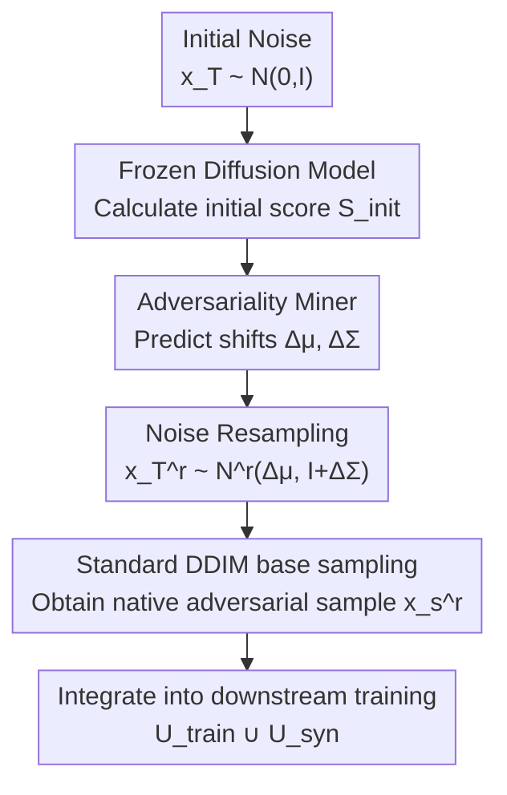

# Diffusion-Based Native Adversarial Synthesis for Enhanced Medical Segmentation Generalization

**Conference**: CVPR 2026  
**Paper**: [CVF Open Access](https://openaccess.thecvf.com/content/CVPR2026/html/Zhang_Diffusion-Based_Native_Adversarial_Synthesis_for_Enhanced_Medical_Segmentation_Generalization_CVPR_2026_paper.html)  
**Code**: None  
**Area**: Medical Imaging  
**Keywords**: Diffusion enhancement, Adversarial synthesis, Noise resampling, Medical segmentation, Generalization  

## TL;DR
This paper points out that when diffusion models are used for medical segmentation data augmentation, the true driver of generalization is not visual realism but "synthetic adversariality" (the empirical loss induced by synthetic samples). Furthermore, only **native adversariality** residing on the manifold is effective. Based on this, a lightweight plugin, Adversariality Miner, is proposed. By resampling initial noise without modifying or retraining the frozen diffusion model, it amplifies native adversariality, further improving downstream Dice gains by 4–5 points across multiple medical segmentation benchmarks.

## Background & Motivation

**Background**: To reliably generalize medical image segmentation to unseen clinical data, a scaling law suggests the need for more data. However, medical data expansion is constrained by privacy, annotation costs, and long-tail distributions. Recently, large-scale diffusion models (e.g., Stable Diffusion) have transferred network-scale visual priors to limited medical corpora, enabling the synthesis of realistic, diverse, and demographically balanced samples. Consequently, "synthetic augmentation" has become a practical path for data expansion.

**Limitations of Prior Work**: The core problem is that **high visual realism does not necessarily lead to downstream gains**. Existing approaches generally fall into three categories: empirical heuristics (selecting rare/blurry/diverse samples), trial-and-error pipelines (filtering or refining via downstream validation), and joint training frameworks (training the diffusion model and downstream model together). However, none clearly answer two fundamental questions: (Q1) **What should be synthesized?** There is no measurable standard to determine which synthetic attributes improve generalization. (Q2) **How to synthesize efficiently?** Current methods often rely on expensive retraining, unstable post-hoc filtering, or complex sampling.

**Key Challenge**: The authors perform a geometric decomposition of generalization gain and find it proportional to the "projection of the synthetic data loss gradient onto the real data loss gradient." This is determined by two orthogonal factors: the gradient angle (corresponding to generation quality) and the gradient norm (termed **synthetic adversariality** by the authors). Modern diffusion models already achieve high quality (small angles), leading to diminishing marginal returns from further quality improvements. The untapped lever is adversariality (the norm term). However, empirical observations show that the distribution of adversariality in diffusion-generated data is **highly skewed**, with only a few samples exhibiting high adversariality.

**Goal**: (1) Demonstrate that adversariality is the primary driver of generalization gain; (2) Find an efficient method to actively amplify adversariality without retraining the diffusion model.

**Key Insight**: The authors further distinguish between two types of adversariality: **artificial adversariality** (injected via adversarial attacks, off-manifold, damaging quality) and **native adversariality** (naturally occurring hard samples within the diffusion model's distribution, on-manifold, reflecting real downstream failure modes). The key insight is: **Only native adversariality improves generalization, while artificial adversariality is harmful.**

**Core Idea**: Instead of modifying sampling trajectories to inject adversarial perturbations, act only at the "seed" stage—**resample the initial noise** to mine naturally occurring on-manifold hard samples from the native distribution of the frozen diffusion model.

## Method

### Overall Architecture

The method addresses "how to generate more native adversarial samples without touching the diffusion model." The logic consists of two layers: the **theoretical layer** decomposes generalization gain to argue that "amplifying adversariality + staying on-manifold" is the correct goal; the **mechanism layer** uses a lightweight module called Adversariality Miner to shift a standard Gaussian initial noise $\hat x_T$ to a shifted Gaussian $N^r(\Delta\mu, I+\Delta\Sigma)$. A "more adversarial" initial noise $\hat x_T^r$ is resampled from this distribution, followed by **unmodified DDIM base sampling** to obtain native adversarial samples $\hat x_s^r$, which are added to the downstream segmentation training set.

The entire synthesis pipeline is unidirectional and serial. The following diagram shows the flow from initial noise to adversarial samples:

Note that the **diffusion model $q_\phi$ and downstream segmentation model $f_\vartheta$ are frozen** throughout; only the Miner $M_\xi$ is trained.

### Key Designs

**1. Generalization Gain Decomposition: Quantifying "What to Synthesize" into Quality × Adversariality**

This step answers Q1, providing a measurable standard for synthetic data. The authors define the generalization gain from the synthetic set $U_{syn}$ as the decrease in empirical loss of the downstream model on an unseen real set $U_{real}$. Performing a first-order Taylor expansion on a single-step parameter update $\Delta\vartheta_{syn}=-\gamma\nabla_\vartheta\ell_{seg}(U_{syn};\vartheta)$ yields the inner product form:

$$G_\vartheta(U_{syn}) \approx \gamma\,\nabla_\vartheta\ell_{seg}(U_{syn};\vartheta)^\top \nabla_\vartheta\ell_{seg}(U_{real};\vartheta) = \gamma\,\big\|\nabla_\vartheta\ell_{seg}(U_{syn};\vartheta)\big\|_2 \big\|\nabla_\vartheta\ell_{seg}(U_{real};\vartheta)\big\|_2 \cos\zeta$$

Since the real gradient term is independent of $U_{syn}$ and acts as a fixed reference vector, the gain is proportional to $\|\nabla_\vartheta\ell_{seg}(U_{syn};\vartheta)\|_2\cos\zeta$. The angle $\cos\zeta$ measures the "information deviation introduced by substituting real with synthetic," reflecting generation quality ($\text{deviation} \to 0$ as $U_{syn}\approx U_{real}$); the norm $\|\nabla_\vartheta\ell_{seg}(U_{syn};\vartheta)\|_2$ is the **synthetic adversariality**—the expected empirical loss induced by synthetic samples. The conclusion is: quality is already high in modern models, but adversariality is the untapped lever. Empirically, the authors also verified that the adversariality distribution is highly skewed (only ~7.62% of high-adversarial samples contribute ~66.7% of the total gain), and per-sample gain increases monotonically with adversariality.

**2. Native vs. Artificial Adversariality: Only On-manifold Hard Samples Count**

The most straightforward way to amplify adversariality is via adversarial attacks on diffusion (collectively termed Adversarial Guidance, AG). By modeling "high adversariality" as a Gibbs preference distribution $q^{adv}_\phi(x|\hat y_s)\propto q_\phi(x|\hat y_s)\cdot\exp(\lambda\,\ell_{seg}(f_\vartheta(x),\hat y_s))$ and taking the log-derivative along the reverse trajectory, AG effectively adds an adversarial preference gradient to the base score during inference: $s^{adv}_\phi(x_t,t) = s_\phi(x_t,t) + \lambda\nabla_{x_t}\ell_{seg}(f_\vartheta(\hat x_{0|t}),\hat y_s)$, without needing retraining.

However, the authors prove this is a **false hope**: using the same initial noise for comparison, AG samples $\hat x_s^{adv}$ and base samples $\hat x_s$ are semantically identical, differing only by imperceptible perturbations $|\hat x_s^{adv}-\hat x_s|$. t-SNE and FID (AG pushes FID from 65 to 90–102) show these perturbations push samples off the real manifold. According to the formula in Design 1, AG increases the norm but simultaneously increases the angle (poor alignment), thus **reducing** generalization gain. The authors name this **artificial adversariality** (off-manifold artifacts), whereas the truly useful factor is **native adversariality**—on-manifold samples naturally generated by the diffusion model that are inherently difficult, revealing true downstream blind spots.

**3. Adversariality Miner: Resampling Initial Noise without Touching the Frozen Diffusion Model**

This is the core mechanism for "how to synthesize." Since adversarial preferences cannot be injected into the sampling trajectory (due to manifold departure), the authors act only at the **initial seed** stage. A lightweight plugin $M_\xi$ is trained to map the diffusion prior $N(0,I)$ to a shifted Gaussian $N^r(\Delta\mu, I+\Delta\Sigma)=(M_\xi)_\#N(0,I)$. Noise $\hat x_T^r\sim N^r$ is resampled, followed by **completely unmodified DDIM base sampling** $\hat x_s^r = \text{DDIM}_{[T\to0]}(s_\phi;\hat x_T^r,\hat y_s)$. Because the sampling process itself is unchanged, the output remains on-manifold (FID in Fig. 5 only increases slightly from 65.21 to 67.39, far better than AG).

A key engineering choice is the input to the Miner: the authors use the **initial denoising score** of the diffusion model for the initial noise, $S^{Init}_\phi = \text{sg}(s_\phi(\hat x_T,T|\hat y_s))$ (where sg is stop-gradient), to predict the shift $(\Delta\mu,\Delta\Sigma)\leftarrow M_\xi(S^{Init}_\phi)$. The rationale is that the initial score encodes the diffusion model's denoising response to the seed, providing informative signal for noise adjustment, whereas the raw noise itself is semantically uninformative. Using this single-step feedforward-feedback minimizes computational overhead.

**4. Clipped Adversarial Objective + KL Regularization + Temporal Stop-gradient**

To ensure the resampled distribution consistently produces high adversariality without drifting, the objective updates only $M_\xi$:

$$\xi^* = \arg\max_\xi \mathbb{E}_{\hat y_s,\hat x_T}\Big[\underbrace{\min\big(\kappa_{up},\,\ell_{seg}(f_\vartheta(\hat x_s^r),\hat y_s)\big)}_{\ell_{adv}} - \beta\cdot\underbrace{\ell_{KL}\big(N^r(\Delta\mu,I+\Delta\Sigma)\,\|\,N(0,I)\big)}_{\ell_{KL}}\Big]$$

$\ell_{adv}$ is a clipped adversarial term with an upper bound $\kappa_{up}$: the loss saturates once the threshold is reached, preventing over-optimization from damaging quality. $\ell_{KL}$ pulls $N^r$ back to the diffusion prior. $M_\xi$ uses zero-initialization, ensuring $(\Delta\mu,\Delta\Sigma)\approx0$ at the start for stable optimization.

Direct optimization is computationally prohibitive due to the recursive gradient path ($\partial\hat x_s^r/\partial\hat x_T^r$ requires chain rule over the whole trajectory). The authors employ a **temporal stop-gradient** heuristic: treating the score as locally temporal and freezing it during backpropagation, i.e., setting $\partial s_\phi(\hat x_t^r,t)/\partial\hat x_t^r\equiv0$. The Jacobian collapses to a closed-form constant $\partial\hat x_s^r/\partial\hat x_T^r\approx\sqrt{1/\alpha_T}$, which is memory-friendly and prevents gradient explosion. For optimization, DDIM is truncated to 10 steps (inference still uses 50), as the trajectory has a "structure stabilization phase" (approx. 0–15 steps) and a "detail refinement phase" (15–50 steps); truncating at ~15 steps is sufficient.

### Loss & Training

Downstream segmentation loss $\ell_{seg}$ uses Cross-Entropy. The Miner is optimized with AdamW (LR $1\times10^{-4}$) for 3K steps; $\beta=0.001$, $\kappa_{up}=0.5$. Sampling uses DDIM ($\eta=0$) with 50 steps for inference and 10-step truncated rollouts for optimization. Default synthesis budget $N_s=1\times N$. Only $M_\xi$ is updated; $q_\phi$ and $f_\vartheta$ remain frozen.

## Key Experimental Results

Datasets: ACDC (Cardiac MRI), Synapse (Abdominal CT), Polyps (Endoscopic RGB; cross-domain via EndoScene/ColonDB/ETIS), MMWHS (CT↔MRI cross-modality). Downstream models: nnU-Net and SwinUNet. Diffusion backbones: SegDiff/FairDiff/SiameseDiff/DiffBoost (all frozen). Metrics: DSC↑ / ASD↓. Gains $\Delta$ are relative to the $U_{train}$-only baseline.

### Main Results: Plug-and-play Compatibility (Selected $\Delta$DSC↑ Gains on nnU-Net)

| Diffusion Backbone | ACDC | Synapse | Polyps | aFID↓ |
|----------|------|---------|--------|-------|
| SegDiff | +1.83 | +2.05 | +2.36 | 149.3 |
| SegDiff +Ours | **+5.19** | **+6.43** | **+5.88** | 157.8 |
| SiameseDiff | +3.06 | +4.13 | +5.05 | 104.7 |
| SiameseDiff +Ours | **+8.14** | **+7.22** | **+10.25** | 115.0 |
| DiffBoost | +3.50 | +4.09 | +3.98 | 97.8 |
| DiffBoost +Ours | **+8.56** | **+9.12** | **+7.36** | 109.1 |

All four backbones consistently gain several points. FID increases only slightly (e.g., SiameseDiff 104.7→115.0), confirming that the tension between specificity (high adversariality) and realism is acceptable in training-oriented synthesis. Gains increase with backbone capability (SiameseDiff > SegDiff), echoing the formula in Design 1: higher quality (smaller angle) allows for a larger adversarial projection.

### Ablation Study: Adversariality Drives Gain (Subsets by threshold $\tau$, Polyps / nnU-Net)

| Subset | Sample Count | Ratio | DSC↑ ($\Delta$) | Per-sample Gain $\Delta/|U|$ |
|------|--------|------|----------|------------------------|
| $U_{train}$ Baseline | 1,128 | — | 78.83 | — |
| $U_{syn}$ ($\tau=0$ Full set) | 1,128 | 100% | 83.88 (+5.05) | 4.48×10⁻³ |
| $\tau=0.3$ | 264 | 23.40% | 83.02 (+4.19) | 15.87×10⁻³ |
| $\tau=0.4$ | 86 | 7.62% | 82.20 (+3.37) | 39.19×10⁻³ |
| $\tau=0.5$ | 25 | 2.22% | 79.96 (+1.13) | 45.20×10⁻³ |

Just 7.62% of high-adversarial samples ($\ell_{seg}>0.4$) contribute ~66.7% of the total gain, and per-sample gain increases monotonically with adversariality—direct evidence for the "adversariality > realism" argument.

### Key Findings: Cross-domain and Comparative Experiments

- **Cross-domain Robustness**: Under hardware shift (Polyps→ETIS), SiameseDiff+Ours achieves a $\Delta$DSC of +7.8 (vs +2.5 for base). For modality shift (MMWHS, CT↔MRI), the average $\Delta$DSC nearly doubles from +10.0 to +19.0. This suggests adversarial synthesis emphasizes under-represented hard modes, fostering more robust features.
- **Comparison with SOTA**: Comparing 10 retraining-free augmentation methods on Synapse (DiffBoost) and Polyps (SiameseDiff), Ours ranks first in $\Delta$DSC (e.g., Polyps/nnU-Net +10.25 vs next-best GAL +6.99). AG-based methods (AdvDiffuser/P2P/Diff-PGD) gain less than the random baseline, and DiffAug shows negative gains across several benchmarks, confirming that "artificial adversarial perturbations destroy spatial consistency required for dense prediction."
- **Budget & Overhead**: Base sampling gains saturate or drop after $2\times$ budget due to mode redundancy/overfitting. Ours, by amplifying high-adversarial synthesis, shows continuous gains with budget ($6\times$ on Polyps yields $\Delta$DSC ≈ 14.89 vs base 3.90). Generating one 256×256 image takes 4.09s (Ours) vs 3.42s (base DDIM), only ~1.20× overhead.
- **$\kappa_{up}$ Sensitivity**: If $\kappa_{up}$ is too small (0.1), adversarial signal is weak; if too large, over-optimization inflates FID (at 97.90, $\Delta$DSC drops to −2.9). 0.5 is recommended. ⚠️ Some values are estimated from paper plots.

## Highlights & Insights
- **Measurable Geometric Formulation**: Generalization gain = Quality (angle) × Adversariality (norm). This explains "why realism $\neq$ utility" and provides a highly transferable decomposition.
- **Native vs. Artificial Adversariality**: On-manifold hard samples reveal real blind spots, while off-manifold perturbations are mere artifacts. The counter-intuitive finding that adversarial attacks are harmful is supported by clear FID vs. gain trade-offs.
- **"Seed-only" Engineering**: No retraining, no sampling changes. Learning a noise shift distribution achieves significant gains with only ~1.2× overhead, offering high practical value.
- **Temporal Stop-gradient**: Collapsing recursive gradients into a closed-form $\sqrt{1/\alpha_T}$ is a valuable memory-saving trick for optimization through denoising trajectories.

## Limitations & Future Work
- **Dependency on Downstream Model $f_\vartheta$**: Since $\ell_{seg}(f_\vartheta(\cdot))$ defines adversariality, the "hard samples" mined might reflect specific biases of $f_\vartheta$ rather than universal difficulty. ⚠️ This self-referential risk is not fully discussed.
- **Systematic FID Increase**: While justified as a "realism-specificity tension," this trade-off might not hold for applications sensitive to generation fidelity.
- **Hyperparameter Details**: Miner architecture and some curves ($\kappa_{up}/\beta$) are relegated to supplementary materials; some values here are approximated from figures.
- **Future Directions**: Exploring adaptive scheduling of synthesis budgets or $\kappa_{up}$ based on adversariality, and extending "native adversariality" to other tasks like classification or detection.

## Related Work & Insights
- **vs. Adversarial Guidance (AdvDiffuser / P2P / Diff-PGD)**: They inject adversarial gradients into the sampling trajectory, which pushes samples off-manifold; Ours resamples initial noise to stay on-manifold, which is the "correct" way to amplify adversariality.
- **vs. Post-hoc Filtering (GAL) / Diversity Enhancement (CIG, Da-fusion, DiffAug)**: These methods indirectly steer sampling toward "hard regions" but are either computationally expensive or yield limited gains. Ours directly and actively amplifies native adversariality with negligible overhead.
- **vs. Joint Training**: Joint training avoids the "what/how to synthesize" questions but requires retraining or architecture changes; Ours keeps the diffusion backbone frozen as a plug-and-play plugin.

## Rating
- Novelty: ⭐⭐⭐⭐⭐ Combines gain decomposition, native/artificial distinction, and noise resampling into a theoretically grounded paradigm.
- Experimental Thoroughness: ⭐⭐⭐⭐⭐ 4 backbones × 2 downstream models × 4 datasets, including cross-domain tests and 10 baselines.
- Writing Quality: ⭐⭐⭐⭐ Theoretical decomposition and control experiments are clear, though some implementation details are in the supplementary.
- Value: ⭐⭐⭐⭐⭐ Retraining-free, ~1.2× overhead, and plug-and-play—high utility for medical segmentation augmentation.

<!-- RELATED:START -->

## Related Papers

- [\[CVPR 2026\] MUST: Modality-Specific Representation-Aware Transformer for Diffusion-Enhanced Survival Prediction with Missing Modality](must_modality-specific_representation-aware_transformer_for_diffusion-enhanced_s.md)
- [\[CVPR 2026\] SD-FSMIS: Adapting Stable Diffusion for Few-Shot Medical Image Segmentation](sd_fsmis_adapting_stable_diffusion_for_few_shot_medical_image_segmentation.md)
- [\[CVPR 2025\] Noise-Consistent Siamese-Diffusion for Medical Image Synthesis and Segmentation](../../CVPR2025/medical_imaging/noise-consistent_siamese-diffusion_for_medical_image_synthesis_and_segmentation.md)
- [\[CVPR 2026\] TANGO: Learning Distribution-wise Foundation Prior Consistency and Instance-wise Style Calibration for Medical Image Generalization](tango_learning_distribution-wise_foundation_prior_consistency_and_instance-wise_.md)
- [\[CVPR 2026\] SPEGC: Continual Test-Time Adaptation via Semantic-Prompt-Enhanced Graph Clustering for Medical Image Segmentation](spegc_continual_test-time_adaptation_via_semantic-prompt-enhanced_graph_clusteri.md)

<!-- RELATED:END -->
