# Diffusion MRI Transformer with a Diffusion Space Rotary Positional Embedding (D-RoPE)

**Conference**: CVPR 2026  
**Paper**: [CVF Open Access](https://openaccess.thecvf.com/content/CVPR2026/html/Kung_Diffusion_MRI_Transformer_with_a_Diffusion_Space_Rotary_Positional_Embedding_CVPR_2026_paper.html)  
**Code**: https://github.com/gustavochau/D-RoPE (Available)  
**Area**: Medical Imaging  
**Keywords**: Diffusion MRI, Representation Learning, Rotary Positional Embedding, Masked Autoencoder, Transformer  

## TL;DR
To address the unique geometric structure of diffusion MRI (dMRI) data—where each volume corresponds to a sampling direction on a sphere and protocols vary across subjects—this paper proposes D-RoPE, a generalization of Rotary Positional Embedding (RoPE) to the diffusion spherical space. Combined with a Transformer using alternating spatial/diffusion attention and Masked Autoencoder (MAE) pre-training, the learned general representations achieve approximately 6% higher accuracy in Mild Cognitive Impairment (MCI) classification and a 0.05 improvement in correlation coefficients for cognitive score regression compared to baselines.

## Background & Motivation
**Background**: Diffusion Magnetic Resonance Imaging (dMRI) is a routine clinical tool for detecting water molecule diffusion in the brain and characterizing white matter integrity and microstructure. It is highly sensitive to early signals of diseases such as Alzheimer's and Multiple Sclerosis. However, while "foundation models/general representations" have been established for T1/T2 structural MRI and fMRI, general representation learning for dMRI has lagged behind. Existing methods are either task-specific (super-resolution, microstructure reconstruction, tractography) or fail to learn general representations from raw dMRI data.

**Limitations of Prior Work**: The data structure of dMRI is unique. An acquisition is not a single image but a **stack** of brain volumes, where each volume corresponds to a diffusion-sensitive gradient determined by a b-value (diffusion weighting strength, defining the sphere's radius) and a b-vector (gradient direction, a point on the sphere). Signal decay varies significantly across different directions and strengths. Modeling dMRI require capturing the coupling of **spatial structure**, **diffusion weighting intensity**, and **directional dependence**. Furthermore, varying acquisition protocols (different numbers of directions and b-values) make traditional models with fixed input channels or fixed direction counts incompatible with variable per-subject inputs.

**Key Challenge**: Existing positional embeddings (learnable/sinusoidal embeddings in ViT or RoPE in videos) assume tokens are arranged in a **linear, ordered** sequence using integer relative distances like $m-n$. However, dMRI volumes are distributed in a **sphere + radius** space, where distances are defined by spherical angles and continuous b-value differences rather than linear indices. Directly applying linear RoPE discards the geometric relationships between directions.

**Goal**: To develop an architecture that (1) jointly models spatial and diffusion space dependencies, (2) accepts an arbitrary number of directions/protocols, and (3) learns transferable general representations.

**Key Insight**: Starting from the physical geometry of dMRI—where each volume corresponds to a point $(b, v)$ in diffusion space $\mathbb{R}^+ \times S^2$—positional embeddings should be designed based on the true distance in this space rather than token indices.

**Core Idea**: Replace the linear relative distance $m-n$ in RoPE with a **distance designed for diffusion spherical space** $D(m,n)$ (integrating b-value differences and spherical angles). This yields D-RoPE, which, combined with a Transformer using alternating spatial/diffusion attention and MAE pre-training, learns protocol-invariant general dMRI representations.

## Method

### Overall Architecture
The input is a stack of $N_d$ dMRI volumes, each with dimensions $(N_x, N_y, N_z)$. Each volume is divided into 3D patches $(P_x, P_y, P_z)$ and linearly projected into tokens, resulting in patch embeddings of size $S \times N_d \times d$ (where $S$ is the number of spatial patches). **Absolute positional embeddings** are then added to each token: spatial coordinates $(x,y,z)$ are encoded using 3D sinusoidal functions into a $d/2$ vector $p_s$, and diffusion directions in spherical coordinates $(\rho,\theta,\phi)$ are encoded via a learnable linear layer into a $d/2$ vector $p_d$. These are concatenated and added to the patch embeddings. The tokens enter a modified ViT encoder where attention blocks **alternate between spatial and diffusion dimensions** (similar to space-time alternating attention in Video Transformers). Relative positional information is injected via D-RoPE during attention, allowing the model to explicitly utilize inter-dependencies between diffusion volumes. The CLS token from the encoder serves as the latent representation for downstream tasks.

Pre-training uses an MAE loop: a portion of tokens is masked, and a lightweight decoder (consisting of the same Transformer blocks + 3D convolutional blocks) reconstructs the original volumes. The overall pipeline follows: "Patching → Absolute PE → Alternating Attention + D-RoPE Encoder → (Pre-training) MAE Reconstruction / (Downstream) Latent Representation Extraction."

```mermaid
%%{init: {'flowchart': {'rankSpacing': 24, 'nodeSpacing': 28, 'padding': 6, 'wrappingWidth': 400}}}%%
flowchart TD
    A["Input: Stack of dMRI volumes<br/>Each mapped to (b-value, b-vector)"] --> B["3D Patching + Linear Projection<br/>→ S×Nd×d tokens"]
    B --> C["Spatial-Diffusion Absolute PE<br/>3D Sine (Space) ⊕ Learnable (Spherical)"]
    C --> D["dMRI Transformer<br/>Alternating Spatial/Diffusion Attention"]
    D --> E["D-RoPE<br/>Relative Encoding via Spherical Distance D(m,n)"]
    E -->|Pre-training| F["MAE Reconstruction<br/>Alternating Masking + 3D Conv Decoder"]
    E -->|Downstream| G["CLS Latent Representation<br/>Age/Sex/MCI/ADAS"]
```

### Key Designs

**1. Spatial-Diffusion Absolute PE + Alternating Attention: Protocol Flexibility**
dMRI directions and b-values vary across subjects. Standard ViT fixed embeddings fail under variable protocols. This work splits absolute PE into two components: spatial positions $(x,y,z)$ via fixed 3D sine encoding $p_s \in \mathbb{R}^{d/2}$, and diffusion directions via spherical coordinates $(\rho,\theta,\phi)$ through a linear layer $p_d \in \mathbb{R}^{d/2}$. By alternating attention between spatial and diffusion dimensions rather than using full attention over flattened tokens, the model separately models spatial structure and directional dependence. Since diffusion-dimension attention makes no structural assumptions about token count, the encoder naturally supports **arbitrary numbers of diffusion volumes**.

**2. D-RoPE: Generalizing RoPE to Diffusion Spherical Space**
Standard RoPE uses a block-diagonal rotation matrix $R^d_{\alpha,m-n}$ to encode the **linear relative distance** $m-n$ into attention: $\langle q_m,k_n\rangle = q_m^\top R^d_{\alpha,m-n} k_n$. D-RoPE replaces $m-n$ with a **distance designed for diffusion geometry** $D(m,n)$:

$$D(m,n) = D\big((b_m,v_m),(b_n,v_n)\big) = \sqrt{\gamma\,(b_m-b_n)^2 + \arccos^2(|v_m \cdot v_n|)}$$

The first term represents the b-value difference, and the second represents the squared spherical angle between b-vectors. A key insight is using the **absolute value** $|v_m\cdot v_n|$ inside the arccos to enforce 180° symmetry, as opposite gradients ($v$ and $-v$) produce physically identical diffusion encoding. Unlike linear RoPE, this distance cannot be pre-multiplied into Query/Key matrices and must be computed pairwise, increasing complexity from $O(lh)$ to $O(lh^2)$.

**3. Alternating Masking for MAE: Forcing Dual Learning**
Three masking strategies were compared for MAE pre-training: (i) spatial masking (75% patches), (ii) diffusion masking (50% of random directions entirely masked), and (iii) **alternating** between the two per epoch. The reconstruction loss is a weighted MSE:

$$L = (1-\tau)L_{\text{unmasked}} + \tau L_{\text{masked}}$$

The parameter $\tau$ ramps from 0.05 to 0.95, focusing the model on global reconstruction initially and completion of masked content later. Alternating masking forces the model to recover both spatial and directional information.

### Loss & Training
The pre-training uses the weighted MSE loss described above with a cosine/linear ramp for $\tau$. The encoder has 10 layers, and the decoder has 3 layers plus 3D convolutional blocks. The embedding dimension is 384, with patch sizes of $(8,8,4)$. To save VRAM during pre-training, only 4 slices and 15 random directions are used per epoch. Downstream evaluation includes: (1) fine-tuning the last layer/head, (2) linear probing, and (3) MLP heads on frozen representations.

## Key Experimental Results

### Main Results
Data: Pre-training on HCP-YA (n=1065); Downstream on HCP-D (612), HCP-A (708), and ADNI Phase 4 (276). Downstream tasks include brain age regression, sex classification, CN vs. MCI classification, and ADAS cognitive score regression.

Reconstruction Quality (HCP-YA test set, b=2000):

| Configuration | Masking | PSNR ↑ | SSIM ↑ | FID ↓ |
|---------------|---------|--------|--------|-------|
| MAE           | Spatial | 14.91  | 0.969  | 13.49 |
| MAE           | Diffusion| 10.07  | 0.844  | 39.86 |
| MAE           | Alternating| 15.07  | 0.968  | 10.81 |
| MAE w/D-RoPE  | Spatial | 15.26  | 0.972  | 9.61  |
| MAE w/D-RoPE  | Diffusion| 15.31  | 0.973  | 9.99  |
| **MAE w/D-RoPE** | **Alternating** | **15.37** | **0.973**| **8.05** |

D-RoPE + Alternating masking achieves the lowest FID, reducing it by ~37–40% compared to spatial-only masking. Without D-RoPE, diffusion masking fails (PSNR ~10), indicating the necessity of directional relationship modeling.

Clinical Tasks (ADNI, CN vs. MCI Classification + ADAS Regression):

| Method | Feature/Head | MCI BA ↑ | MCI AUROC ↑ | ADAS ρ ↑ | ADAS MSE ↓ |
|--------|--------------|----------|-------------|----------|------------|
| HC Features (Tract FA,MD) | Linear | 61.9% | 0.69 | 0.06 | 10.92 |
| 3D ResNet (FA/MD) | MLP, Full | 58.4% | 0.68 | 0.33 | 0.86 |
| ViT w/RoPE (Raw dMRI) | MLP, Full | 47.4% | 0.46 | -0.05 | 1.08 |
| **Ours** | **Frozen + MLP** | **64.7%** | 0.67 | **0.38** | **0.77** |
| Ours | Last-layer FT | 60.9% | 0.66 | 0.32 | 0.88 |

*Ours* (Frozen + MLP) achieves the highest MCI Balanced Accuracy (64.7%) and best ADAS indicators, significantly outperforming standard ViT on raw dMRI.

### Ablation Study

| Configuration | Observation |
|---------------|-------------|
| Full (D-RoPE + Alternating) | Best overall reconstruction and DTI metrics (FID 8.05, FA error 0.055). |
| w/o D-RoPE (Spatial) | FID increases by ~40% due to lack of relative directional modeling. |
| w/o D-RoPE (Diffusion) | Reconstruction intensity fails (PSNR ~10) without spatial constraints. |
| Diffusion Mask + D-RoPE | D-RoPE makes diffusion-only masking viable (FID 9.99). |

D-RoPE + Alternating/Diffusion masking yields the lowest Fractional Anisotropy (FA) error (0.055 vs. 0.074 without D-RoPE), indicating better preservation of microstructural information.

### Key Findings
- **D-RoPE is the primary factor for reconstruction quality**: Removing it increases FID by ~40% and causes diffusion-masked training to fail.
- **Alternating masking and D-RoPE are complementary**: Alternating masking forces the model to learn both domains simultaneously.
- **Superior in data-limited scenarios**: On the small ADNI dataset, frozen features outperformed fully supervised ResNet/ViT, suggesting pre-training captures patterns relevant to cognitive decline.

## Highlights & Insights
- **Positional Embedding as a Geometric Prior**: D-RoPE replaces linear sequence assumptions with the physical geometry of dMRI (sphere + radius). This principle of matching PE to the data's true topology is applicable to other non-linear layouts.
- **180° Symmetry**: Using $|v_m\cdot v_n|$ integrates the physical domain knowledge that opposite gradients are equivalent.
- **Protocol Robustness**: Support for arbitrary directions and per-subject protocols makes the model highly practical for multi-center clinical data without requiring resampling.

## Limitations & Future Work
- **Computational Complexity**: D-RoPE cannot be factored like standard RoPE, leading to $O(lh^2)$ complexity.
- **Absolute PSNR**: Numerical PSNR is low (~15), though typical for dMRI. FID/DTI metrics are more appropriate here.
- **Clinical Performance**: While state-of-the-art, absolute performance (MCI BA 64.7%) still has room for improvement.
- **Future Directions**: Exploring factorized approximations for D-RoPE; extension to multi-shell or spinal/body dMRI; and multi-modal foundation models (MRI + fMRI).

## Related Work & Insights
- **vs. Standard RoPE / 3D-RoPE ViT**: These models ignore directional geometry, causing them to fail on clinical dMRI tasks.
- **vs. Video Transformers**: While borrowing the alternating attention framework, this work replaces the temporal dimension with a diffusion dimension and applies spherical D-RoPE.
- **vs. Task-specific dMRI Models**: Unlike models requiring fixed protocols or resampling, the proposed encoder natively supports arbitrary dMRI sampling schemes for general representation learning.

## Rating
- Novelty: ⭐⭐⭐⭐⭐ (Generalizing RoPE to spherical diffusion space is highly innovative and physically grounded)
- Experimental Thoroughness: ⭐⭐⭐⭐ (Solid reconstruction and downstream tasks, though clinical data is limited)
- Writing Quality: ⭐⭐⭐⭐ (Clear motivation-to-math logic)
- Value: ⭐⭐⭐⭐ (Provides a protocol-agnostic pre-training framework for raw dMRI)

<!-- RELATED:START -->

## Related Papers

- [\[CVPR 2026\] Masked-Diffusion Autoencoders for 3D Medical Vision Representation Learning](masked-diffusion_autoencoders_for_3d_medical_vision_representation_learning.md)
- [\[CVPR 2026\] MUST: Modality-Specific Representation-Aware Transformer for Diffusion-Enhanced Survival Prediction with Missing Modality](must_modality-specific_representation-aware_transformer_for_diffusion-enhanced_s.md)
- [\[CVPR 2026\] SPECTRE：面向体积 CT Transformer 的自监督与跨模态预训练](scaling_self-supervised_and_cross-modal_pretraining_for_volumetric_ct_transforme.md)
- [\[NeurIPS 2025\] Scalable Diffusion Transformer for Conditional 4D fMRI Synthesis](../../NeurIPS2025/medical_imaging/scalable_diffusion_transformer_for_conditional_4d_fmri_synthesis.md)
- [\[CVPR 2026\] Prospective Dynamic 3D MRI Reconstruction via Latent-Space Motion Tracking from Single Measurement](prospective_dynamic_3d_mri_reconstruction_via_latent-space_motion_tracking_from_.md)

<!-- RELATED:END -->
