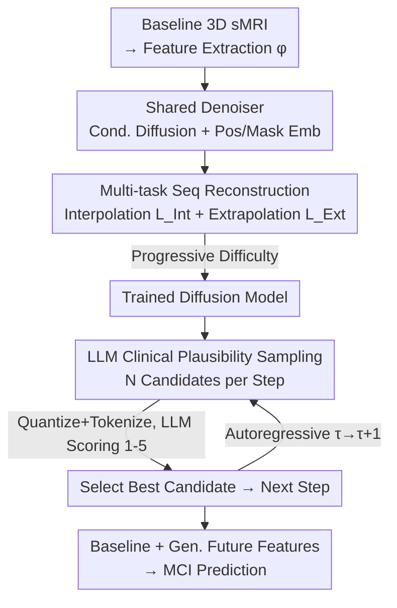

# Diffusion with a Linguistic Compass: Steering the Generation of Clinically Plausible Future sMRI Representations for Early MCI Conversion Prediction

**Conference**: CVPR 2026  
**Paper**: [CVF Open Access](https://openaccess.thecvf.com/content/CVPR2026/html/Tang_Diffusion_with_a_Linguistic_Compass_Steering_the_Generation_of_Clinically_CVPR_2026_paper.html)  
**Code**: None (Not publicly available)  
**Area**: Medical Imaging / Diffusion Models  
**Keywords**: MCI Conversion Prediction, Longitudinal sMRI Generation, Diffusion Models, LLM Clinical Plausibility, Autoregressive Generation  

## TL;DR
MCI-Diff utilizes a baseline sMRI to "reconstruct" longitudinal imaging features for the future 6–36 months. It trains a diffusion model via multi-task sequence reconstruction to address irregular follow-up intervals and employs a fine-tuned LLM as a "linguistic compass" to score candidate features based on clinical biomarkers. This steers autoregressive generation toward clinically plausible trajectories, improving early MCI conversion prediction accuracy by 5–12% while maintaining immediacy.

## Background & Motivation
**Background**: Mild Cognitive Impairment (MCI) follows two paths: progressing to Alzheimer's (pMCI) or remaining stable (sMCI). Predicting this progression early is vital for personalized treatment and clinical trial stratification. Structural MRI (sMRI) approaches are divided into **cross-sectional methods** (using only baseline scans at month 0) and **longitudinal methods** (modeling temporal evolution via multiple follow-ups from 0–36 months).

**Limitations of Prior Work**: A fundamental trade-off exists between **immediacy vs. accuracy**. Cross-sectional methods offer high immediacy by providing results at baseline but suffer from limited accuracy due to the lack of disease progression signals. Longitudinal methods achieve higher accuracy through temporal trajectories but sacrifice immediacy, as they require up to 36 months of follow-up data before a prediction can be made—a delay patients cannot afford.

**Key Challenge**: Accuracy stems from longitudinal dynamics, whereas immediacy requires relying solely on baseline data. These two requirements are inherently conflicting. The objective is to achieve both simultaneously. The authors propose **directly generating longitudinal latent features from baseline scans**, essentially "completing" future follow-ups to enable accurate longitudinal-style prediction at the earliest time point.

**Key Insight**: Generating realistic longitudinal sMRI sequences is challenging. First, GANs are unstable and VAEs suffer from posterior collapse; combined with high-dimensional sMRI data, naive models struggle with subtle, heterogeneous MCI patterns. Thus, the authors use **diffusion models** in a low-dimensional feature space for better stability and efficiency. Second, vanilla diffusion fails with **irregular temporal sampling** (missed visits) and **error accumulation** during autoregressive generation at uneven intervals.

**Core Idea**: A multi-task sequence reconstruction approach trains the diffusion model to handle irregular time steps. Subsequently, an LLM serves as an **external clinical referee**. During each step of autoregressive generation, the LLM selects the most clinically plausible candidate from multiple options, steering the trajectory toward authentic neurodegeneration patterns and suppressing error propagation.

## Method

### Overall Architecture
The input to MCI-Diff is a 3D sMRI baseline (compressed into a latent vector via a pre-trained feature extractor $\phi$). The output is an autoregressively generated sequence of future sMRI features $\hat{Z}^{(p)}_{1:|\mathcal{T}|-1}$ for months $\{6, 12, 18, 24, 36\}$. Finally, the "baseline + generated" features are fed into a classifier to predict pMCI/sMCI. The method comprises two stages: **Stage 1 (Training)** uses multi-task sequence reconstruction to train a shared denoiser as a "trajectory completer" capable of both interpolation and extrapolation. **Stage 2 (Sampling)** introduces an instruction-tuned LLM as a "linguistic compass" to score $N$ candidates per step, ensuring clinical consistency.

### Key Designs

**1. Multi-task Sequence Reconstruction: Handling Irregular Follow-ups**
To address irregular MCI follow-up sampling, the authors decompose trajectory completion into two tasks using a shared denoiser $\epsilon_\theta$. For a fixed sequence of length $|\mathcal{T}|$, the input at index $\tau$ is $c_\tau = Z^{(p)}_\tau + P_\tau + M_\tau$, combining sMRI features $Z^{(p)}_\tau$ (or mask tokens), position embeddings $P_\tau$ (encoding time $\tau$), and mask embeddings $M_\tau$. A target position embedding $T_i$ specifies the point to predict. The denoiser follows the standard L2 objective: $L=\mathbb{E}_{\epsilon,t}[\|\epsilon-\epsilon_\theta(x_t,T_i,t)\|_2^2]$.

Two tasks are defined: **Interpolation** ($L_{\text{Int}}$) randomly masks an intermediate point $i\in\{1,\dots,|\mathcal{T}|-2\}$ to be reconstructed using surrounding data. **Extrapolation** ($L_{\text{Ext}}$) masks all points from $i$ to the end, forcing the model to predict the future based solely on past information. This transforms "missing visits" from a drawback into natural training samples.

**2. Progressive Difficulty Curriculum: Aligning Training with Autoregressive Inference**
To avoid suboptimal convergence when predicting far-future points from baseline only, the authors implement a progressive difficulty schedule (Algorithm 1). Starting with full sequences (difficulty $d=1$), the model performs interpolation (masking $d$ points) and extrapolation. Difficulty $d$ incremented up to $D_{\max}$. At $d=D_{\max}$, the extrapolation task requires the model to predict next steps using **only the baseline and previously generated features**, perfectly aligning the training objective with the autoregressive inference requirements.

**3. LLM Linguistic Compass: Anchoring Features via Clinical Plausibility**
To prevent autoregressive error accumulation, an **external clinical referee** is introduced. First, **clinically-oriented instruction fine-tuning** is performed: latent sMRI features $Z^{(p)}_\tau$ are quantized and tokenized. A dataset is constructed pairing these tokens with FreeSurfer structural measurements (e.g., hippocampal volume, ventricular size). The LLM is fine-tuned to "translate" abstract features into interpretable clinical biomarkers.

During **LLM-guided Sampling** (Algorithm 2), the diffusion model generates $N$ candidates $\{\hat{Z}^{(p,n)}_\tau\}_{n=1}^N$ at each step. The LLM predicts biomarkers for each and scores them (1–5) based on MCI progression logic (e.g., "progressive hippocampal atrophy and ventricular expansion"). The top-rated candidate is selected for the next autoregressive step. This "compass" filters out candidates that are numerically plausible but clinically impossible.

### Loss & Training
The model uses two L2 denoising losses: $L_{\text{Int}}$ and $L_{\text{Ext}}$, managed by a progressive curriculum with self-completion data augmentation. The LLM undergoes separate instruction fine-tuning (Feature-to-FreeSurfer measurement supervision) decoupled from the diffusion model. Features are extracted via pre-trained HFCN, and FreeSurfer 7.4.1 is used for structural grounding.

## Key Experimental Results

### Main Results
Evaluation was conducted on ADNI (ADNI-1 Train / ADNI-2 Test), AIBL (Generalization), and merged ADNI1+2 (5-fold cross-validation) against cross-sectional, longitudinal, and generative baselines.

| Dataset | Metric | MCI-Diff (Ours) | Best Baseline | Gain |
|--------|------|------|----------|------|
| ADNI | ACC | **0.950** | 0.899 (HFCN+) | +5.1% |
| ADNI | AUC | **0.948** | 0.897 (HFCN+) | +5.1% |
| AIBL | ACC | **0.936** | 0.873 (HFCN+) | +6.3% |
| AIBL | AUC | **0.914** | 0.853 (HFCN+) | +9.6% |
| ADNI1+2 (5-fold) | ACC | **0.954 ± 0.008** | 0.904 (HFCN+) | +5.0% |

MCI-Diff, using only a baseline scan, outperformed the strongest longitudinal baseline (HFCN+), which requires actual follow-up scans. It also significantly exceeded generative baselines like VAE (0.730) and Temp-GAN (0.791).

### Ablation Study
| Configuration | ADNI ACC | Note |
|------|---------|------|
| Full Model (Ours) | **0.950** | Complete model |
| w/o Interpolation Task | 0.841 | Drop of ~10.9% |
| w/o Extrapolation Task | 0.838 | Drop of ~11.2% |
| w/o LLM-Guidance | 0.870 | Drop of ~8.0% |

### Key Findings
- **Extrapolation contributes most**: Its removal causes the steepest drop (to 0.838), as it directly maps to future prediction capabilities.
- **LLM guidance is critical**: Removing it drops accuracy to 0.870, validating its role in suppressing error accumulation.
- **Sensitivity Analysis**: Optimal performance is found at diffusion steps $T=40$, termination difficulty $d=4$, and candidate pool size $N=20$.

## Highlights & Insights
- **Turning "Missing Data" into a Resource**: Instead of viewing irregular follow-ups as a defect, the multi-task reconstruction treats them as natural samples for learning interpolation and extrapolation.
- **LLM as Referee, Not Generator**: The LLM doesn't generate medical features directly; rather, it translates them into clinical metrics to provide "direction." This paradigm of "Generator proposes, LLM selects" is applicable to other domains requiring clinical or physical constraints.
- **Training/Inference Alignment**: The progressive curriculum ensures the model is eventually trained on the exact "baseline-only" scenario it encounters during real-world inference.

## Limitations & Future Work
- **Closed Source**: Implementation details for batch sizes and hardware are limited to the Appendix, raising the bar for reproduction.
- **Dependency on FreeSurfer**: The "compass" relies on the quality of FreeSurfer extractions for training, which can be noisy.
- **Latent-only Generation**: The model generates features rather than 3D images, which saves computation but prevents direct visual clinical review of the "imagined" future scans.
- **Inference Cost**: Autoregressive steps multiplied by $N$ LLM calls increases computational overhead per patient compared to simple classifiers.

## Related Work & Insights
- **vs. Cross-sectional**: Ours provides identical immediacy but captures temporal dynamics, resulting in ~14% higher accuracy.
- **vs. Longitudinal**: Ours matches or exceeds accuracy without requiring the multi-year wait for follow-up scans.
- **vs. Generative**: Diffusion provides more stable generation than GANs/VAEs, while the LLM compass provides the clinical grounding that prior generative models lacked.

## Rating
- Novelty: ⭐⭐⭐⭐⭐ 
- Experimental Thoroughness: ⭐⭐⭐⭐ 
- Writing Quality: ⭐⭐⭐⭐ 
- Value: ⭐⭐⭐⭐⭐ 

<!-- RELATED:START -->

## Related Papers

- [\[ICLR 2026\] COMPASS: Robust Feature Conformal Prediction for Medical Segmentation Metrics](../../ICLR2026/medical_imaging/compass_robust_feature_conformal_prediction_for_medical_segmentation_metrics.md)
- [\[CVPR 2026\] Clinically-Grounded Counterfactual Reasoning for Medical Video Diagnosis](clinically-grounded_counterfactual_reasoning_for_medical_video_diagnosis.md)
- [\[CVPR 2026\] Sketch2CT: Multimodal Diffusion for Structure-Aware 3D Medical Volume Generation](sketch2ct_multimodal_diffusion_for_structure-aware_3d_medical_volume_generation.md)
- [\[CVPR 2026\] MUST: Modality-Specific Representation-Aware Transformer for Diffusion-Enhanced Survival Prediction with Missing Modality](must_modality-specific_representation-aware_transformer_for_diffusion-enhanced_s.md)
- [\[CVPR 2026\] Few-Shot Synthetic Data Generation with Diffusion Models for Downstream Vision Tasks](few-shot_synthetic_data_generation_with_diffusion_models_for_downstream_vision_t.md)

<!-- RELATED:END -->
