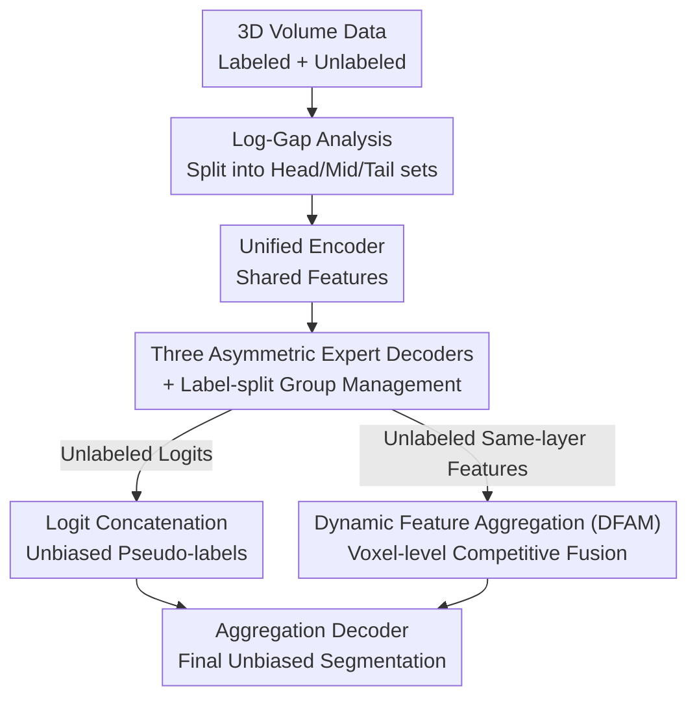

# Divide, Conquer, and Aggregate: Asymmetric Experts for Class-Imbalanced Semi-Supervised Medical Image Segmentation

**Conference**: CVPR 2026  
**Paper**: [CVF Open Access](https://openaccess.thecvf.com/content/CVPR2026/html/Liu_Divide_Conquer_and_Aggregate_Asymmetric_Experts_for_Class-Imbalanced_Semi-Supervised_Medical_CVPR_2026_paper.html)  
**Code**: https://github.com/PHPJava666/DCA (Available)  
**Area**: Medical Imaging  
**Keywords**: Semi-supervised segmentation, Class imbalance, Multi-organ segmentation, Expert decoders, Pseudo-labels  

## TL;DR
To address the "small organs drowned by large organs" issue in multi-organ semi-supervised segmentation, DCA employs a "divide and conquer" strategy using a shared encoder and three asymmetric expert decoders tailored for head, medium, and tail classes. By integrating predictions and features through logit concatenation and a Dynamic Feature Aggregation Module (DFAM), it produces unbiased results, pushing the average Dice from 68.4 to 73.2 on the Synapse 20% labeled benchmark.

## Background & Motivation
**Background**: Semi-supervised medical image segmentation (SSMIS) aims to approach fully supervised performance using a small amount of labeled data and a large amount of unlabeled data. Mainstream approaches focus on generating high-quality pseudo-labels for unlabeled data (e.g., Mean-teacher, CPS, BCP).

**Limitations of Prior Work**: These general methods are mostly tuned on datasets with few foreground classes (like ACDC or LA). They often fail on multi-organ CT datasets with 13–15 organs—where large organs like the liver or spleen occupy significant voxel percentages, while small organs like the adrenal glands or esophagus occupy less than 1%. As shown in Table 1, UA-MT and URPC yield a Dice of 0 for the esophagus (Es) and adrenal glands (RAG/LAG) on Synapse.

**Key Challenge**: The authors point out that existing work on "class-imbalanced semi-supervised learning" (e.g., CReST, SimiS, Adsh) mostly focuses on **class distribution mismatch between labeled and unlabeled subsets**. While typical in natural images, medical imaging reveals nearly identical organ size proportions between labeled and unlabeled subsets (validated in Figure 2). The real bottleneck is structural: methods like DHC, GA, and SKCDF rely on a **single decoder to output all classes**. Using one set of shared parameters to simultaneously fit organs with scale differences of several orders of magnitude causes gradients to be dominated by majority classes, leaving tail organs poorly learned.

**Goal**: Break the structural bottleneck of "one decoder for all classes" by assigning experts to different organ scales while unbiasedly aggregating their capabilities into a complete segmentation map.

**Key Insight**: Following the "divide and conquer" paradigm—since organs naturally cluster into "large, medium, and small" groups based on anatomical priors (Figure 2 shows the ranking of head and tail organs remains fixed even as labeling ratios change)—the authors assign an asymmetric expert decoder to each tier.

**Core Idea**: Divide (data-driven grouping of foreground classes into head/medium/tail) → Conquer (three asymmetric experts managing one group each with isolated backpropagation) → Aggregate (logit concatenation for unbiased pseudo-labels + dynamic feature aggregation for final prediction).

## Method

### Overall Architecture
DCA consists of a **unified encoder**, three **asymmetric expert decoders** (Head/Medium/Tail), and an **aggregation decoder**. The pipeline follows three steps: "Divide → Conquer → Aggregate."

The input is 3D volume data $x \in \mathbb{R}^{H\times W\times D}$. The dataset $D = D_l \cup D_u$ contains labeled and unlabeled portions. In the **Divide** phase, a "log-gap analysis" is performed offline on the labeled set to partition $K$ foreground classes into three fixed sets: $S_H$ (head), $S_M$ (medium), and $S_T$ (tail). In the **Conquer** phase, both labeled and unlabeled volumes pass through the shared encoder and are fed in parallel to the three expert decoders. Each expert is supervised only by its corresponding label subset (**label-split**), ensuring independent supervision losses. For unlabeled data, the raw logits from the three experts are assembled into one unbiased fused pseudo-label via **logit concatenation**. In the **Aggregate** phase, an aggregation decoder uses the DFAM module at each upsampling stage to perform voxel-level competitive fusion of the experts' features, finally supervised by the fused pseudo-label.

### Key Designs

**1. Log-Gap Analysis: Auto-partitioning via Distribution "Cliffs" instead of Heuristic Thresholds**

The challenge is how to group organs. Fixed thresholds (e.g., <1% for tail) are sensitive and inconsistent across datasets. The authors use a data-driven approach: they calculate the total voxel count $V_k = \sum_i \sum_p \mathbb{I}(y^l_i(p)=k)$ for each class in the labeled set, then normalize it to $P_k = V_k / V_{fg}$. Key step: instead of looking at absolute values, they look at the "steep slopes" between sorted proportions. Defining $P_{(1)} \ge P_{(2)} \ge \cdots \ge P_{(K)}$, the log-gap is:

$$G_j = \log P_{(j)} - \log P_{(j+1)} = \log\left(\frac{P_{(j)}}{P_{(j+1)}}\right)$$

A large $G_j$ indicates a natural boundary between rank $j$ and $j+1$. The two most significant peaks in the $G_j$ sequence are used as split points: $k_{HM} = \arg\max_j G_j$ (Head/Medium boundary) and $k_{MT} = \arg\max_{j>k_{HM}} G_j$ (Medium/Tail boundary), yielding three **permanent** sets $S_H, S_M, S_T$. This partitioning naturally fits anatomical priors (e.g., liver/spleen in head; adrenal/esophagus in tail) and remains consistent across datasets without extra hyperparameters. Ablations (Table 4) show that log-gap grouping outperforms uniform grouping by ~4.4% Dice and fixed thresholds by ~1.95% on 2% labeled AMOS.

**2. Asymmetric Expert Decoders + Label-split Supervision: Specialized Pathways without Gradient Conflict**

To address scale variance, each decoder (based on V-Net) uses a different architecture. The Head decoder $D_H$ uses dilated convolutions (dilation=2) to expand the receptive field for large organs while reducing layers to $\{2,2,1,1\}$ to prevent overfitting on details. The Medium decoder $D_M$ maintains the standard V-Net configuration $\{3,3,2,1\}$ with dilation=1. The Tail decoder $D_T$ deepens layers to $\{4,4,3,2\}$ with dilation=1 to capture fine-grained details of small targets.

Specialization is enforced via **label-split**: the label $y^l$ is split into three partial labels. For $y^l_H$, any voxel not in $S_H$ is remapped to background class 0:

$$y^l_H(p) = \begin{cases} y^l(p) & \text{if } y^l(p) \in S_H \\ 0 & \text{otherwise} \end{cases}$$

The same applies to $y^l_M$ and $y^l_T$. Each expert backpropagates independently using its partial label: $\mathcal{L}_{sup}=\mathcal{L}^H_{sup}+\mathcal{L}^M_{sup}+\mathcal{L}^T_{sup}$. The essence is that the tail expert's gradients are **restricted to the tail class set**, preventing large organ gradients from interfering with minority class learning. Adding the expert structure alone increases Dice by 7.46% (Esophagus 0→46.3%), but adding label-split triggers a massive 14.51% jump—the true catalyst for specialization.

**3. Logit Concatenation: Prediction-level "Best-of-both-worlds" without Averaging Conflicts**

Standard semi-supervised methods average softmax probabilities across branches. However, since experts are only proficient in their assigned tiers, averaging would dilute good predictions with "unskilled" opinions. Instead, DCA concatenates **raw logits** based on class ownership. For any foreground class $c$, the logit is taken only from its responsible expert:

$$p^u_{fuse}(p)[c] = \begin{cases} p^u_H(p)[c] & c \in S_H \\ p^u_M(p)[c] & c \in S_M \\ p^u_T(p)[c] & c \in S_T \end{cases}$$

The background channel ($c=0$) is the only one trained by all experts (since non-target classes are mapped to 0); thus, the background logit is the average of all three: $p^u_{fuse}(p)[0]=\frac{1}{3}(p^u_H(p)[0]+p^u_M(p)[0]+p^u_T(p)[0])$. The final fused pseudo-label is $\hat{y}^u_{fuse}=\arg\max(p^u_{fuse})$.

**4. Dynamic Feature Aggregation Module (DFAM): Voxel-level Feature Competition**

While pseudo-labels are fused at the prediction level, the aggregation decoder $D_A$ injects expert prior knowledge at the feature level using DFAM. DFAM takes four inputs: the upsampling stream feature $F_{up}$ and same-layer features $F_H, F_M, F_T$. After $1\times1\times1$ convolutions for channel alignment, features are concatenated: $F_{con}=\text{Concat}(\text{Conv}(F_H),\text{Conv}(F_M),\text{Conv}(F_T))$. A lightweight gate ($3\times3\times3$ Conv → ReLU → $1\times1\times1$ Conv) outputs three channels, which pass through a channel-wise softmax to generate spatial attention maps:

$$\{A_H, A_M, A_T\} = S(\text{Conv}_{1\times1\times1}(R(\text{Conv}_{3\times3\times3}(F_{con}))))$$

These satisfy $A_H(p)+A_M(p)+A_T(p)=1$ per voxel, representing a **competition** among experts. The aggregated feature is $F_{expert}=A_H\otimes F_H + A_M\otimes F_M + A_T\otimes F_T$, which is then fused with the residual $F_{DFAM}=F_{expert}+F_{up}$. This naturally gives the tail expert higher attention in small organ regions. DFAM adds another 3.31% to the Dice.

### Loss & Training
The aggregation decoder output $p^u_A$ is supervised by the fused pseudo-labels: $\mathcal{L}_{un}=\mathcal{L}_{seg}(p^u_A, \hat{y}^u_{fuse})$. Total objective: $\mathcal{L}_{total}=\mathcal{L}_{sup}+\lambda\mathcal{L}_{un}$ (where $\lambda=10$ with warm-up). Using a 3D V-Net backbone and SGD (initial LR 0.01), patches of $96^3$ are trained with batch size 4 (2 labeled + 2 unlabeled) on an RTX 6000. Stop-gradient is applied to the expert branches when training the aggregation decoder to prevent backward contamination of expert specialization.

## Key Experimental Results

### Main Results
Evaluation on Synapse (13 classes, 20% labeled) and AMOS (15 classes, 5% labeled).

| Dataset | Setting | Metric | DCA (Ours) | Next Best (GA) | Gain |
|--------|------|------|-----------|---------|------|
| Synapse | 20% Labeled | Avg. Dice | **73.20** | 68.43 | +4.77 |
| Synapse | 20% Labeled | Avg. ASD | 1.78 | 3.11 | Better |
| AMOS | 5% Labeled | Avg. Dice | **69.90** | 63.51 | +6.39 |
| AMOS | 5% Labeled | Avg. ASD | 2.66 | 4.58 | Better |

DCA achieved the highest scores for small organs (RAG: 51.8, LAG: 63.7) on Synapse while remaining top-3 for large/medium organs. In the extreme case of 5% AMOS, DCA achieved the highest Dice across **all 15 organs**. Most general methods (UA-MT: 20.26, URPC: 25.68) nearly collapsed on Synapse, whereas DCA even outperformed the fully supervised V-Net (62.09).

### Ablation Study
Component Ablation (Synapse 20%, Table 3):

| Configuration | Avg. Dice | Description |
|------|-----------|------|
| V-Net baseline (Labeled only) | 47.92 | Single decoder; tail organs Es/RAG/LAG are all 0 |
| + Three Expert Decoders | 55.38 | +7.46; tail organs start activating (Es 46.3) |
| + Log-Gap label-split | 69.89 | +14.51; specialization truly takes effect |
| + DFAM (Full) | **73.20** | +3.31; feature-level aggregation refinement |

Grouping and Architecture Ablation (AMOS 5%, Table 4/5):

| Dimension | Configuration | Avg. Dice |
|----------|------|-----------|
| Grouping | Uniform Grouping | 67.79 |
| Grouping | Fixed Threshold | 69.90* |
| Grouping | Log-Gap (Ours) | 69.90 |
| Architecture | V1 All Symmetric | 60.25 |
| Architecture | V2 Layers Only | 67.33 |
| Architecture | V3 Dilation Only | 64.96 |
| Architecture | V2+V3 (Ours) | **69.90** |

> ⚠️ Note: In Table 4 (5% AMOS), fixed thresholding and log-gap are tied at 69.90. The paper shows log-gap's advantage primarily in the 2% setting (59.88 vs 57.93), indicating its robustness in extreme data scarcity.

### Key Findings
- **Label-split is the core driver**: Simply adding three experts only grants a 7.46% gain, but adding Log-Gap label-split adds 14.51%. Locking gradients to specific class sets is the key to activating specialization.
- **Asymmetric design is essential**: Adjusting depth (V2) improved Dice by 7.08%, and dilation (V3) by 4.71%. The combination is optimal, supporting the hypothesis that deeper $D_T$ handles details while shallower $D_H$ handles context.
- **Tail organs benefit most**: While general methods consistently score 0 on Es/RAG/LAG, DCA raises them to 50–64. t-SNE shows tighter intra-class clusters and clearer boundaries.

## Highlights & Insights
- **Problem Reformulation**: The authors correctly identified that class distribution mismatch is not the main issue in medical imaging; rather, it is the structural conflict of the "single decoder." This framing makes the motivation much more solid than simply applying natural image techniques.
- **Log-Gap Grouping**: Using log-differences of proportions to find distribution "cliffs" is a clever trick. It is more robust than fixed thresholds, dataset-agnostic, and hyperparameter-free.
- **Logit Concatenation vs. Softmax Averaging**: When branches have specific expertise, concatenating raw logits prevents "non-experts" from diluting the performance of the expert in charge.
- **Voxel-level Competition in DFAM**: Forcing the sum of three expert attentions to 1 per voxel allows the model to automatically select the most "knowledgeable" expert for each pixel, leading to cleaner activation maps and t-SNE results.

## Limitations & Future Work
- **Fixed Expert Count**: The choice of three tiers (Head/Medium/Tail) is manually set. Whether this is optimal for more complex distributions or if the number of experts can be self-adaptive is not explored.
- **Computational Overhead**: Using three expert decoders plus an aggregation decoder significantly increases parameter count. The paper lacks a FLOPs/parameter comparison.
- **Aggregation Dependency**: The aggregation decoder $D_A$ relies entirely on unlabeled data and the quality of the fused pseudo-labels. If experts fail on a specific tier, the pseudo-labels will carry systematic errors without a correction mechanism.
- **Generalization**: Since grouping is determined offline on the labeled set, if the organ distribution in deployment varies significantly, the fixed grouping may become suboptimal.

## Related Work & Insights
- **Comparison to DHC / GA / SKCDF**: These methods focus on the "single decoder + loss/head modification" route. DCA’s fundamental difference is **decoupling the task at the architectural level**, leading to much larger improvements on tail organs (+4.77 on Synapse, +6.39 on AMOS).
- **Comparison to CReST / SimiS / Adsh**: These natural image methods handle distribution mismatch. DCA proves this mismatch is minimal in SSMIS and instead attacks scale conflicts, significantly outperforming them on multi-organ CT.
- **MoE / Divide & Conquer Paradigm**: DCA can be seen as an instantiation of "divide and conquer" for decoders. Unlike standard MoE (homogeneous experts + routing), DCA uses **bespoke architectures for different scales + static routing (label-split)**, combined with two-stage aggregation.

## Rating
- Novelty: ⭐⭐⭐⭐ Reformulates the single-decoder bottleneck as a scale conflict; uses log-gap grouping and asymmetric experts effectively.
- Experimental Thoroughness: ⭐⭐⭐⭐ Extensive comparisons across two datasets and 18 SOTA methods, though lacks efficiency analysis.
- Writing Quality: ⭐⭐⭐⭐ Clear narrative structure (Divide/Conquer/Aggregate); formulas align well with diagrams.
- Value: ⭐⭐⭐⭐ Significant gains in high-value clinical tasks (small organ segmentation) with transferable grouping tricks.

<!-- RELATED:START -->

## Related Papers

- [\[CVPR 2025\] Semantic Class Distribution Learning for Debiasing Semi-Supervised Medical Image Segmentation](../../CVPR2025/medical_imaging/semantic_class_distribution_learning_for_debiasing_semi-supervised_medical_image.md)
- [\[CVPR 2026\] SemiGDA: Generative Dual-distribution Alignment for Semi-Supervised Medical Image Segmentation](semigda_generative_dual-distribution_alignment_for_semi-supervised_medical_image.md)
- [\[CVPR 2026\] Semi-supervised Echocardiography Video Segmentation via Anchor Semantic Awareness and Continuous Pseudo-label Reforging](semi-supervised_echocardiography_video_segmentation_via_anchor_semantic_awarenes.md)
- [\[CVPR 2026\] SegMoTE: Token-Level Mixture of Experts for Medical Image Segmentation](segmote_token-level_mixture_of_experts_for_medical_image_segmentation.md)
- [\[AAAI 2026\] Divide, Conquer and Unite: Hierarchical Style-Recalibrated Prototype Alignment for Federated Medical Segmentation](../../AAAI2026/medical_imaging/divide_conquer_and_unite_hierarchical_style-recalibrated_prototype_alignment_for.md)

<!-- RELATED:END -->
