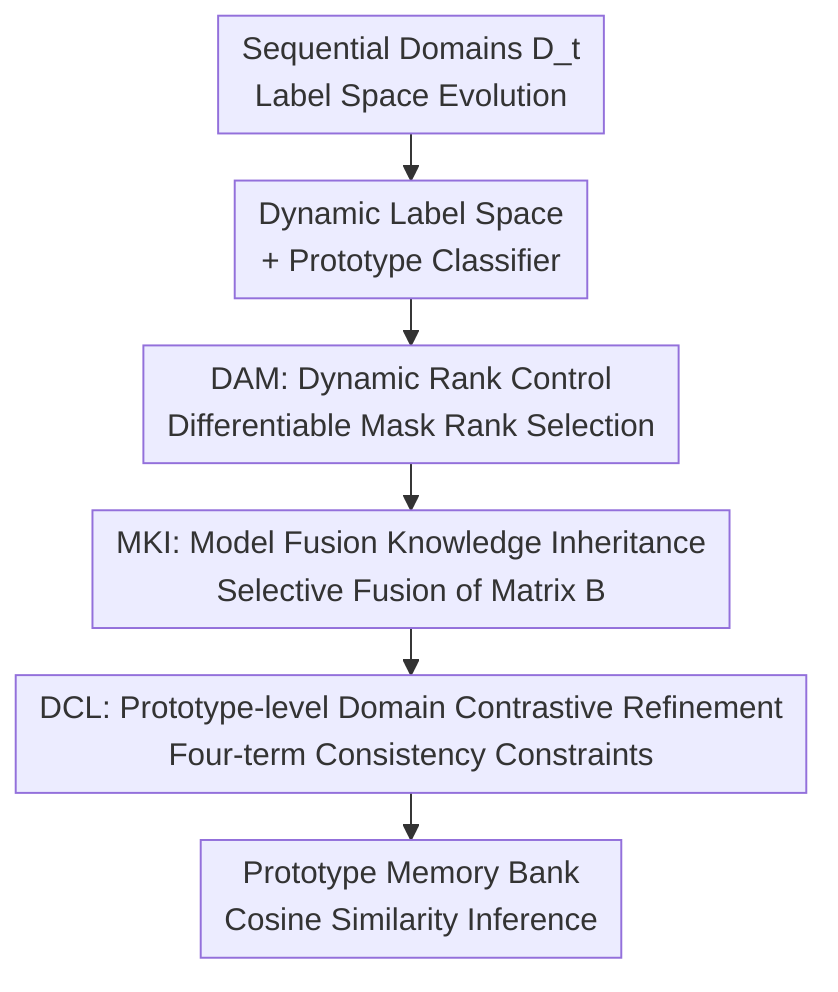

# DK-DDIL: Adaptive Knowledge Retention for Dynamic Domain-Incremental Learning in Medical Imaging

**Conference**: CVPR 2026  
**Paper**: [CVF Open Access](https://openaccess.thecvf.com/content/CVPR2026/html/Ma_DK-DDIL_Adaptive_Knowledge_Retention_for_Dynamic_Domain-Incremental_Learning_in_Medical_CVPR_2026_paper.html)  
**Code**: Not available  
**Area**: Medical Imaging / Continual Learning  
**Keywords**: Domain Incremental Learning, Continual Learning, LoRA, Dynamic Rank, Knowledge Retention

## TL;DR
Addressing dynamic domain-incremental scenarios in real-world clinical practice where "imaging equipment/institutions/diseases constantly change and label spaces expand," DK-DDIL introduces a differentiable dynamic-rank LoRA adapter (DAM) to automatically scale model capacity based on domain complexity. It utilizes a knowledge inheritance mechanism (KIR) combining model fusion and prototype contrastive learning to suppress catastrophic forgetting. Without replaying historical data, it outperforms existing DIL methods on skin pathology, 3D MRI, and OfficeHome benchmarks while training only 0.26% of parameters.

## Background & Motivation
**Background**: Foundation models (e.g., ViT, CLIP) in medical imaging possess strong generalization but are trained on static, closed datasets. Real-world clinical data is generated as a stream—new equipment, institutions, and disease types continuously emerge, causing models to collapse when distributions shift. Retraining large models is computationally prohibitive, and cross-institutional data sharing is restricted by privacy regulations. Consequently, research has shifted toward **Domain Incremental Learning (DIL)**: sequentially adapting to new domains without replaying historical data. Mainstream approaches branch into prototype-based and prompt-based methods.

**Limitations of Prior Work**: Existing DIL methods almost all assume a **fixed label space** and pre-defined domain boundaries. However, in real clinical settings, labeling protocols, diagnostic classifications, and inclusion criteria vary across institutions, causing the label space to **expand**. New lesion types like AK or SCC may only appear in later stages, making it impossible to define a unified classifier covering all categories beforehand.

**Key Challenge**: Dynamic DIL must simultaneously handle three tasks: balancing stability/plasticity (learning the new without forgetting the old), adaptively allocating capacity based on domain complexity, and effectively integrating knowledge from "old + new classes." The baseline LoRA is ill-suited here: fixed-rank adapters cannot handle the varying intrinsic complexity of different domains, and adapters trained independently for each domain interfere with shared representations, destabilizing cross-domain learning.

**Goal**: To develop a **replay-free** dynamic DIL framework capable of handling evolving label spaces and heterogeneous domain shifts while operating within privacy constraints.

**Key Insight**: Address the two bottlenecks of LoRA separately—make the rank **differentiable and dynamically selected** to solve inflexibility, and **selectively fuse** historical adapters followed by prototype-level contrastive refinement to resolve interference.

**Core Idea**: Replace fixed-rank, isolated LoRA with "Dynamic-rank LoRA (capacity scaling by domain) + Dual-level Consistency Knowledge Inheritance (parameter fusion + prototype contrastive)." This achieves both plasticity and stability without data replay.

## Method

### Overall Architecture
DK-DDIL is built on a frozen ViT-B/16 backbone. For each new domain $t$, only lightweight inserted modules are trained; the backbone and historical data remain untouched. Inputs consist of domain data $D_t$ with evolving label spaces arriving sequentially; the output is a prototype classifier capable of recognizing all cumulative classes. Two components work in synergy: **DAM** manages "how to absorb new domains" by attaching dynamic-rank LoRA branches to the Q/K/V and projection layers of attention, automatically determining the active rank based on domain complexity. **KIR** ensures "how to not forget old domains," featuring **MKI** (selective parameter fusion of current and historical DAMs to inherit domain-invariant priors) and **DCL** (prototype-level contrast for refinement in embedding space to suppress prototype drift and cross-domain semantic confusion). Instead of a standard linear head, the classifier serves as a **prototype memory bank**, matching via cosine similarity during inference, naturally supporting dynamic label space expansion.

### Key Designs

**1. Dynamic Label Space Modeling and Prototype Memory Bank Classifier: Growing the Classifier with New Classes**

Existing DIL assumes a fixed label space, which fails in clinical realities where new diseases emerge later. Ours formalizes each domain as $D_t=\{(x_i^{(t)},y_i^{(t)})\}$ with label set $\mathcal{Y}_t$, explicitly allowing label space evolution: $\mathcal{Y}_{t-1}\cap\mathcal{Y}_t\neq\varnothing$ and $|\mathcal{Y}_t\cup\mathcal{Y}_{t-1}|\ge|\mathcal{Y}_{t-1}|$—retaining old classes while appending new ones. Subject to the **replay-free constraint** $D_i\cap D_j=\varnothing\ (\forall i\neq j)$, the model must maintain performance on all historical domains while training only on $D_t$.

To allow painless classifier expansion, the authors avoid linear classifiers with independent weight vectors, instead interpreting the classifier head $W^{(t)}=[p_1,\dots,p_{C_t}]$ as a **prototype memory bank**. Each prototype $p_c$ is the normalized centroid of that class in embedding space $p_c^{(t)}=\frac{1}{|\cdot|}\sum \frac{f_\theta(x_i)}{\|f_\theta(x_i)\|_2}$, updated cumulatively across domains. When new classes arrive, the classifier expands to $W^{(t)}=[\,W^{(t-1)};\,\Delta W^{(t)}\,]$. Inference uses $\hat y=\arg\max_{c}\cos(f_\theta(x),p_c)$. This prototype representation naturally accommodates label expansion and paves the way for DCL contrastive refinement.

**2. DAM Dynamic Rank Control: Differentiable Scaling of LoRA Rank by Domain Complexity**

Fixed-rank LoRA face a dilemma in dynamic DIL: low ranks lack expressivity, while high ranks introduce redundancy and exacerbate forgetting. DAM adds residual branches $W'=W+\Delta W,\ \Delta W=AB$ ($A\in\mathbb{R}^{d_{out}\times r_{max}},B\in\mathbb{R}^{r_{max}\times d_{in}}$) to each linear projection. Crucially, it uses a **learnable rank score vector** $s\in\mathbb{R}^{r_{max}}$ with STE (Straight-Through Estimator) for discrete rank selection: $\tilde m_i=\sigma(s_i)$, $m_i=\mathbb{I}[\tilde m_i>\tau]+(\tilde m_i-\text{stopgrad}(\tilde m_i))$. In the forward pass, $m_i$ is binary 0/1 (the threshold $\tau$ is also learnable); in the backward pass, gradients flow normally, enabling discrete sampling while remaining differentiable. To prevent excessive rank reduction, a minimum rank floor is enforced $\sum_i m_i\ge r_{min}$ (activating the top $r_{min}$ scores if necessary).

The masked update $\Delta W_m=A\,\text{diag}(m)\,B$ retains only active latent dimensions, paired with a dynamic scaling factor $\alpha_t=r_{max}/\sum_i m_i$ tied to the effective rank. The output $h=Wx+\alpha_t\cdot\Delta W_m x$ ensures that with fewer active ranks, the contribution of individual components increases, matching adaptation strength to actual capacity. Finally, a sparsity regularization $L_{reg}=\lambda_{reg}\cdot\frac{1}{r_{max}}\sum_i\sigma(s_i)$ encourages activating only critical ranks. Unlike previous methods that partition ranks coarsely by domain, DAM provides **per-domain, fine-grained, continuous** capacity regulation guided by data statistics.

**3. MKI Model Fusion Knowledge Inheritance: Fusing Only "Domain-Invariant" Parts to Stabilize Cross-Domain Transfer**

Directly reusing historical adapters causes interference due to domain misalignment. MKI's strategy is **selective parameter fusion** between the current DAM and historical DAMs—but not blind fusion. The observation is that in low-rank decomposition, the $B$ matrix encodes the **global subspace structure** of feature interactions, which is more consistent across domains and resembles domain-invariant priors, whereas $A$ is more domain-specific. Thus, only $B$ is fused: $B^{(t)}\leftarrow\alpha_e B^{(t)}+\frac{1-\alpha_e}{t-1}\sum_{k=1}^{t-1}B^{(k)}$, while $A$ optimizes independently to preserve domain plasticity.

Fusion strength $\alpha_e$ follows a **cosine annealing** schedule by epoch: $\alpha_e=\alpha_{final}+(\alpha_{init}-\alpha_{final})\cdot\frac{1+\cos(\pi e/E)}{2}$ ($\alpha_{final}=1-\alpha_{init}$). Early in training, a larger $\alpha_e$ emphasizes inheriting old knowledge; as training progresses, it decays, shifting toward domain-specific learning. Compared to linear/exponential decay, cosine annealing provides smoother transitions and fewer parameter shocks—critical in replay-free DIL without historical data to fall back on, improving convergence stability.

**4. DCL Prototype-level Domain Contrastive Refinement: Suppressing Drift and Confusion with Four Constraints**

While MKI stabilizes parameters, embedded features may still suffer from **prototype drift** (centroid shift) and **semantic confusion** (new domain features misaligning with old prototypes), especially when label spaces partially overlap. DCL operates at the representation level with four complementary terms: ① **Positive Alignment** $L_{pos}=\frac{1}{B}\sum_i(1-\cos(f_i,p_{y_i}^{(t)}))$ pulls features toward their class prototypes; ② **Intra-domain Contrastive Separation** $L_{neg\text{-}intra}$ uses an InfoNCE-style $-\log\frac{\exp\cos(f_i,p_{y_i})}{\sum_j\exp\cos(f_i,p_j)}$ for prototype-level (rather than hard negative mining) inter-class separation, which is more stable under domain drift; ③ **Cross-domain Negative Suppression** $L_{neg\text{-}cross}$ explicitly penalizes new domain features misaligning with semantically unrelated historical prototypes (using indicator $\mathbb{I}[y_i\neq c_j^{(t-1)}]$ to mask same-class prototypes), reducing cross-domain misclassification; ④ **Intra-class Compactness** $L_{intra}=\frac{1}{|P|}\sum_{(i,j)\in P}[1-\cos(f_i,f_j)]$ pulls intra-class samples together at the instance level, independent of prototype stability.

The total objective is integrated via **curriculum weighting**: $L_{DCL}=L_{pos}+\frac{s}{S_t}(L_{neg\text{-}intra}+L_{neg\text{-}cross})+L_{intra}$, where $s$ is the current optimization step and $S_t$ is the total domain steps—negative contrastive regularization strengthens as more samples are seen.

### Loss & Training
The final training objective is: $L=L_{CE}+L_{reg}+L_{DCL}$, corresponding to classification, rank sparsity regularization, and cross-domain representation alignment. The backbone is a frozen ViT-B/16 (12 blocks) pre-trained on ImageNet-21K. Ranks are dynamically adjusted between $r_{min}=4$ and $r_{max}=128$. $\lambda_{reg}=1$, $\alpha_{init}=0.1$ (⚠️ the text mentions $\alpha_{init}=0.1$, but ablation Fig. 3(b) shows $\alpha_{init}=0.3$ is optimal; deferring to original text). Results are averaged over 5 runs.

## Key Experimental Results

### Main Results
Three benchmarks cover different domain dynamics: **Skin Pathology Diagnosis** (aggregation of multiple public dermoscopy datasets reflecting clinical temporal evolution, 7 sequential domains, expanding label space), **Cyst-X** (multi-center 3D MRI, IPMN risk stratification, high cross-institutional domain gap), and **OfficeHome** (standard natural image DIL). Metrics are Average Accuracy $\bar A$ and Final Accuracy $A_T$.

| Method | Trained Params% | Skin $\bar A$ | Skin $A_T$ | Cyst-X $\bar A$ | Cyst-X $A_T$ | OfficeHome $\bar A$ | OfficeHome $A_T$ |
|------|-----------|--------------|-----------|----------------|-------------|--------------------|------------------|
| Finetune | 100.00 | 68.77 | 67.60 | 33.45 | 23.02 | 78.38 | 79.85 |
| L2P | 0.15 | 69.94 | 64.54 | 31.60 | 32.37 | 78.80 | 81.24 |
| DualPrompt | 0.39 | 72.58 | 67.06 | 49.32 | 49.64 | 77.30 | 80.42 |
| CODA-Prompt | 4.37 | 73.17 | 67.11 | 49.02 | 48.92 | 81.37 | 84.18 |
| RanPAC | 2.03 | 74.79 | 66.89 | 52.56 | 48.20 | 82.22 | 84.70 |
| DUCT | 100.00 | 71.44 | 66.40 | 52.51 | 49.64 | 81.88 | 85.80 |
| CL-LoRA | 0.62 | 72.53 | 68.91 | 40.82 | 33.09 | 79.20 | 84.04 |
| **DK-DDIL (Ours)** | **0.26** | **77.03** | **71.52** | **53.34** | **51.08** | **84.35** | **86.29** |

All $\bar A$/$A_T$ metrics are optimal across three benchmarks, with trained parameters at 0.26%—nearly an order of magnitude less than typical baselines. Improvement on Cyst-X is ~1% over the second best, indicating resistance to drift in cross-institutional gaps. OfficeHome results demonstrate efficacy beyond medical domains. Paired t-tests ($p<0.05$) confirm significant gains.

### Ablation Study
Fig. 3(a) decomposes components on Skin ($\bar A$/$A_T$, FT = Classifier only, frozen backbone):

| Config | $\bar A$ | $A_T$ | Description |
|------|---------|-------|------|
| FT | 52.96 | 44.68 | Classifier only, near collapse |
| FT+DCL | 52.98 | 44.69 | DCL alone is ineffective without domain-aware adaptation |
| FT+DAM | 75.56 | 68.68 | Adding DAM yields +22.6 boost |
| FT+DAM+DCL | 76.04 | 70.88 | DCL becomes effective only on top of DAM |
| FT+DAM+MKI | 75.57 | 68.68 | MKI promotes knowledge transfer |
| **FT+DAM+MKI+DCL** | **77.03** | **71.52** | Full model is optimal |

### Key Findings
- **DAM is the primary driver**: Jumping from FT's 52.96 to 75.56 (+22.6) suggests dynamic rank adaptation solves the biggest bottleneck of "not learning new domains." DCL alone on FT has negligible effect (52.96→52.98), requiring domain-aware adaptation to function.
- **Complementarity of MKI and DCL**: Both add incremental gains on DAM, reaching 77.03 only when combined, validating the "parameter-level fusion + prototype-level refinement" dual-consistency design.
- **Insertion and Hyperparameters**: Inserting DAM in all layers is best, though odd layers alone yield close results (more compute-efficient). Injecting DAM into all projection layers (Q/K/V/Proj.) is more stable than single projections. $\alpha_{init}=0.3$, moderate $\lambda_{reg}$, and small $r_{min}$ with moderate $r_{max}$ constitute the optimal range; rank ranges are robust across large intervals.

## Highlights & Insights
- **Formally incorporating "evolving label spaces" into DIL sets**: While most DIL assumes fixed labels, Ours explicitly models $|\mathcal{Y}_t\cup\mathcal{Y}_{t-1}|\ge|\mathcal{Y}_{t-1}|$ and uses a prototype memory bank for seamless expansion—better reflecting the clinical reality of emerging disease types.
- **Elegant Rank Selection via STE**: Using learnable scores with STE balances "discrete selection" and "differentiability," with a minimum rank floor preventing over-pruning—a trick transferable to other PEFT continual learning scenarios.
- **Insights on Fusing Only Matrix B**: Fusing LoRA's $B$ (global subspace, domain-invariant) while keeping $A$ (domain-specific) for independent optimization avoids smoothing out domain-specific plasticity, key to MKI's stability.
- **0.26% Parameters + Replay-free**: SOTA performance with minimal parameters and no historical data storage offers high value for privacy-sensitive clinical deployment.

## Limitations & Future Work
- The authors acknowledge a desire to expand to **cross-modal continual learning** and integrate with foundation models for lifelong learning—indicating current frameworks are limited to single modality and relatively short domain sequences.
- ⚠️ The text hyperparameter $\alpha_{init}=0.1$ conflicts with the ablation Fig. 3(b) showing $\alpha_{init}=0.3$ as optimal; no explanation is provided.
- DCL contains four contrastive terms plus curriculum weighting, involving many terms/weights. The paper only provides sensitivity analysis for $\lambda_{reg}$, missing individual ablations for DCL's internal components.
- Among benchmarks, only Cyst-X is true 3D multi-center medical data; skin data is an aggregate of public sets rather than a single clinical temporal flow. OfficeHome has limited domains; performance under long sequences (dozens of domains) regarding prototype bank bloat is unverified.

## Related Work & Insights
- **vs CL-LoRA / CoDyRA / DoRA (Dynamic Rank LoRA)**: These usually prune or block ranks coarsely by domain under fixed labels. DK-DDIL uses STE for **per-domain, continuous, differentiable** fine-grained masking while handling evolving labels—mapping to 53.34 on Cyst-X compared to CL-LoRA's 40.82.
- **vs DUCT / GC² (Consolidation/Expert Subnets)**: DUCT uses dual consolidation and GC² uses expert subnets to suppress forgetting but requires 100% of parameters. DK-DDIL achieves comparable or better results with 0.26% parameters using MKI's selective B-fusion and DCL contrastive refinement.
- **vs Prompt-based (L2P / DualPrompt / CODA-Prompt)**: Prompt methods are efficient but limited by expressivity and fixed retrieval structures. DK-DDIL's adapter approach with dynamic capacity better captures distribution shifts in complex medical domains like Skin/Cyst-X.

## Rating
- Novelty: ⭐⭐⭐⭐ Integrating "evolving label space + heterogeneous domain shift + replay-free" into one DIL setting is significant. The combination of dynamic rank + dual-level inheritance is novel, though individual components (STE, fusion, prototypes) exist in literature.
- Experimental Thoroughness: ⭐⭐⭐⭐ Three benchmarks cover 2D/3D medical and natural images with extensive baselines and ablations (position/rank/params), though DCL internal ablation and long-sequence verification are absent.
- Writing Quality: ⭐⭐⭐⭐ Clear motivation and complete formulas, though hyperparameter inconsistencies exist between text and figures.
- Value: ⭐⭐⭐⭐ Replay-free, minimal parameters, and privacy-friendly, providing high value for clinical deployment.

<!-- RELATED:START -->

## Related Papers

- [\[CVPR 2026\] Forging a Dynamic Memory: Retrieval-Guided Continual Learning for Generalist Medical Foundation Models](forging_a_dynamic_memory_retrieval-guided_continual_learning_for_generalist_medi.md)
- [\[CVPR 2026\] TopoCL: Topological Contrastive Learning for Medical Imaging](topocl_topological_contrastive_learning_for_medical_imaging.md)
- [\[CVPR 2026\] Universal-to-Specific: Dynamic Knowledge-Guided Multiple Instance Learning for Few-Shot Whole Slide Image Classification](universal-to-specific_dynamic_knowledge-guided_multiple_instance_learning_for_fe.md)
- [\[CVPR 2025\] Residual SODAP: Residual Self-Organizing Domain-Adaptive Prompting with Structural Knowledge Preservation for Continual Learning](../../CVPR2025/medical_imaging/residual_sodap_residual_self-organizing_domain-adaptive_prompting_with_structura.md)
- [\[CVPR 2026\] Human Knowledge Integrated Multi-modal Learning for Single Source Domain Generalization](human_knowledge_integrated_multi-modal_learning_for_single_source_domain_general.md)

<!-- RELATED:END -->
