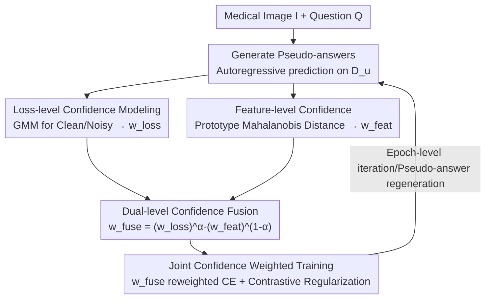

# Dual-Level Confidence based Implicit Self-Refinement for Medical Visual Question Answering

**Conference**: CVPR 2026  
**Paper**: [CVF Open Access](https://openaccess.thecvf.com/content/CVPR2026/html/Pan_Dual-Level_Confidence_based_Implicit_Self-Refinement_for_Medical_Visual_Question_Answering_CVPR_2026_paper.html)  
**Code**: https://github.com/pmhDL/DuCoR.git  
**Area**: Medical Imaging / Multimodal VLM  
**Keywords**: Medical VQA, Pseudo-labeling, Confidence estimation, Cross-domain generalization, Transductive learning

## TL;DR
To address the train/test distribution drift in Medical VQA, DuCoR introduces pseudo-answers from test samples into training. It adaptively fuses dual-level complementary signals—"loss-level confidence" (modeling clean/noisy loss distributions) and "feature-level confidence" (measuring the distance from sample representations to pseudo-answer prototypes)—to estimate per-sample reliability weights for weighted pseudo-supervision. This improves performance across multiple Medical VQA benchmarks and significantly enhances cross-domain generalization.

## Background & Motivation
**Background**: Medical VQA aims to derive clinical answers from "medical images + questions." Recent generative multimodal large models (e.g., LLaVA-Med) have successfully modeled answers through autoregressive text generation. However, these models exhibit limited generalization under domain drift (e.g., different imaging modalities or linguistic descriptions).

**Limitations of Prior Work**: A natural approach to mitigate domain drift is transductive/pseudo-supervision—utilizing unlabeled test samples by having the model generate pseudo-answers for training. However, these pseudo-answers are often unreliable. Treating them as ground truth introduces confirmation bias and error amplification. Thus, the critical task is "estimating the reliability of each pseudo-labeled sample."

**Key Challenge**: While pseudo-label reliability estimation is well-studied in discriminative tasks (classification, detection, segmentation), these tasks have discrete and finite label spaces. Medical VQA is an open-ended generative task with free-form text output, involving much higher uncertainty. Traditional confidence metrics that "only look at loss or prediction probability" are insufficient. The authors empirically find in Figure 1(a) a clear misalignment between loss and semantic consistency: some samples have low loss but poor semantic similarity, while others have high loss but high semantic similarity. Loss alone cannot faithfully reflect the correctness of pseudo-answers.

**Goal**: In a generative Medical VQA setting, estimate more reliable weights for each pseudo-labeled sample to guide pseudo-supervised optimization, allowing the model to progressively align its predicted distribution with the target distribution.

**Key Insight**: Since the loss (supervision signal space) and semantic consistency (representation space) originate from different information sources and can cross-correct each other, both levels of confidence should be calculated and fused.

**Core Idea**: Utilize a dual-level confidence approach ("loss-level + feature-level") instead of a single fixed pseudo-label, adaptively fusing them into a per-sample weight $w^{fuse}$ for weighted pseudo-supervision to achieve implicit self-refinement.

## Method

### Overall Architecture
DuCoR superimposes a "transductive pseudo-supervision + dual-level confidence weighting" optimization process onto standard generative Medical VQA training. The input consists of a labeled training set $D_t=\{(I_i,Q_i,A_i)\}$ and an unlabeled test set $D_u=\{(I_j,Q_j)\}$. For each test sample, the model first generates a pseudo-answer $\tilde A_j=f_\theta(I_j,Q_j)$, and then they are incorporated into a joint objective:

$$L = \sum_{(I_i,Q_i,A_i)\in D_t}\ell(f_\theta(I_i,Q_i),A_i) + \sum_{(I_j,Q_j,\tilde A_j)\in D_u} w_j\,\ell(f_\theta(I_j,Q_j),\tilde A_j)$$

where $w_j$ is the adaptive reliability weight for each pseudo-labeled sample. The core mechanism lies in computing $w_j$: one signal is estimated from the **supervision space** (autoregressive loss distribution), and the other from **input semantics** (distance from multimodal representations to pseudo-answer prototypes). These are fused and fed back into the weighted training. Pseudo-answers are regenerated each epoch, enabling the model to self-refine through a loop of "generation → reliability estimation → weighted training → representation alignment."

### Key Designs

**1. Loss-level Confidence: GMM for Clean/Noisy Separation**

Treating pseudo-answers directly as ground truth can be biased by noise. The authors observe that correctly generated answers often have lower autoregressive loss. They model "pseudo-label reliability" as a clean/noisy separation problem over the loss distribution. First, the autoregressive loss $\ell^{ce}_i = -\sum_{t=1}^T \log p_\theta(a_{it}\mid I_i,Q_i,a_{i,<t})$ is computed. A log-transform $u_i=\log(\ell^{ce}_i+\varepsilon)$ is applied for scale smoothing, followed by standardization $z_i=(u_i-\mu_{tr})/\sigma_{tr}$ using training set statistics. A two-component Gaussian Mixture Model (GMM) is then fitted to $z_i$: $p(z_i)=\pi_c\mathcal N(z_i;\mu_c,\sigma_c^2)+\pi_n\mathcal N(z_i;\mu_n,\sigma_n^2)$, representing clean and noisy modes respectively.

An "anchoring" trick is used: training samples are forced to the clean component ($\gamma_{i,c}=1$), while test samples' clean/noisy status is a latent variable solved via EM. The E-step calculates the clean posterior $\gamma_{j,c}$, and the M-step semi-supervisely updates the mean/variance. The loss-level confidence is defined as the posterior clean probability $w^{loss}_i=p(\text{clean}\mid z_i;\hat\Theta)$.

**2. Feature-level Confidence: Prototypes and Mahalanobis Energy**

Loss only reflects how well a prediction matches its own pseudo-label, not necessarily semantic correctness. Thus, a signal from the representation space is added. Multimodal aggregated representations $h_i=\phi(f_\theta(Q_i,I_i))$ are extracted. For each answer category $k$, a prototype $p_k=\frac1{|S_k|}\sum_{h_i\in S_k}h_i$ is constructed, primarily using clean embeddings from the training set. For unknown classes (key for cross-domain), pseudo-labeled test embeddings are used. Mahalanobis energy $E_j=(h_j-p_{k_j})^\top\Sigma_k^{-1}(h_j-p_{k_j})$ measures the distance to the prototype. Correct pseudo-labels should be close to prototypes, so the confidence is $w^{feat}_j=\exp(-\beta E_j)$.

This signal complements the loss-level confidence because its source is "input semantics" rather than "supervision signals": a sample might have low loss (model confidence) but a representation far from the prototype (semantic inconsistency).

**3. Prototype Contrastive Regularization**

Feature-level confidence depends on reliable prototypes, which in turn require a well-structured feature space. A prototype-based InfoNCE loss is added: $\ell^{ctr}_i=-\log\frac{\exp(\mathrm{sim}(h_i,p_{k_i})/\tau)}{\sum_{j\in\mathcal A}\exp(\mathrm{sim}(h_i,p_j)/\tau)}$, pulling sample embeddings toward their answer prototypes and pushing them away from others. This ensures semantically related samples cluster around prototypes, making Mahalanobis distance estimation more stable.

**4. Dual-Level Confidence Fusion and Joint Weighted Training**

The two confidences from different spaces are fused via geometric weighting: training samples have a weight of 1, while for test samples $w^{fuse}_i=(w^{loss}_i)^\alpha\cdot(w^{feat}_i)^{1-\alpha}$, where $\alpha\in[0,1]$ balances the contributions. The final joint objective reweights each pseudo-loss by the fused confidence and includes contrastive regularization:

$$L_{total}=\sum_{i=1}^{|D_t\cup D_u|} w^{fuse}_i\,\ell^{ce}_i + \lambda\, w^{fuse}_i\,\ell^{ctr}_i$$

Geometric fusion means if either source deems a sample "unreliable," the weight is suppressed, making it more robust than simple thresholding (e.g., FixMatch) or single-source filtering (e.g., DivideMix).

### Loss & Training
The visual encoder is CLIP-ViT/B16, and answer inference uses four LLMs (GPT-2 1.5B / StableLM 1.6B / Mistral 7B / Llama2 7B). Alignment pre-training is performed on 600k pairs from PMC-15M, followed by joint training on Medical VQA benchmarks. Parameters: $\beta=\tau=1.0, \alpha=\lambda=0.5$. Training lasts 30 epochs with transductive pseudo-supervision, batch size 32, AdamW optimizer, $lr=2\times10^{-5}$ with a 500-step linear warmup, and pseudo-answers regenerated every epoch.

## Key Experimental Results

### Main Results
On three benchmarks (VQA-RAD, SLAKE, PathVQA), DuCoR outperforms Prev. SOTA by 1%–4% in open-ended recall and 1%–2% in closed-ended accuracy. Specifically, it exceeds Prev. SOTA by 3.63% in PathVQA open-ended recall.

| Method | VQA-RAD Open/Closed | SLAKE Open/Closed | PathVQA Open/Closed |
|------|------|------|------|
| LLaVA-Med (BioMedCLIP) | 64.75 / 83.09 | 87.11 / 86.78 | 39.60 / 91.09 |
| FAVP (Llama2) | 68.10 / **89.00** | 85.60 / 87.90 | − / − |
| MUMC (Discriminative) | 71.50 / 84.20 | − | 39.00 / 90.40 |
| DuCoR (Mistral) | 67.95 / 86.48 | 88.67 / 88.36 | **43.63** / 88.67 |
| DuCoR (Llama2) | 68.87 / 87.13 | **88.87** / 87.52 | 42.95 / 89.84 |

The Llama2 version shows the most balanced improvement, while the Mistral version gains the most on open-ended questions.

Comparison with 4 representative pseudo-labeling methods:

| Dataset | Paradigm | Method | Close | Open | Overall |
|------|------|------|------|------|------|
| VQA-RAD | TTA | AdaContrast | 83.61 | 63.52 | 74.70 |
| VQA-RAD | SSL | CoDis | 81.54 | 63.39 | 73.49 |
| VQA-RAD | PL+ST | **DuCoR** | **85.34** | **67.81** | **77.56** |
| PathVQA | SSL | FixMatch | 78.14 | 33.26 | 55.77 |
| PathVQA | PL+ST | **DuCoR** | **87.62** | **40.13** | **63.94** |

### Ablation Study
Step-wise ablation on PathVQA (PL=Naive Pseudo-label, LL=Loss-level, FL=Feature-level, CR=Contrastive Reg.):

| Config | Accuracy | Recall | F1 | BLEU-1 | Notes |
|------|------|------|------|------|------|
| Baseline | 87.22 | 39.73 | 40.64 | 56.12 | Standard autoregressive supervision |
| + PL | 85.41 | 40.16 | 40.38 | 55.99 | Naive PL harms closed-ended accuracy |
| + PL + LL | 87.95 | 41.22 | 41.97 | 57.25 | Significant recovery via Loss-level |
| + PL + LL + FL | 89.37 | 42.43 | 41.45 | 56.83 | Feature-level adds complementary Gain |
| + PL + LL + FL + CR | **89.84** | **42.95** | 41.83 | **58.14** | Complete model, best overall |

### Key Findings
- **Naive pseudo-labels are harmful**: Using pseudo-answers as ground truth (+PL) dropped closed-ended accuracy from 87.22 to 85.41, validating that pseudo-supervision without reliability estimation introduces significant noise.
- **Dual levels are indeed complementary**: Adding loss-level confidence recovered accuracy to 87.95, and adding feature-level confidence further pushed it to 89.37. Semantic signals complement loss signals.
- **Cross-domain gains are prominent**: Under radiology-to-pathology drifts (SLAKE↔PathVQA), where zero-shot performance collapses, DuCoR consistently performs best. Open-ended F1 increased by 7.75% for SLAKE→PathVQA and 13.35% for PathVQA→SLAKE relative to zero-shot.
- **Quantified reliability improvement**: Post-training pseudo-label AUROC improved from 0.6827 to 0.8575 (+0.1747). The fused confidence $w^{fuse}$ exhibits a bimodal distribution, successfully suppressing noisy samples.

## Highlights & Insights
- **The "dual-source error correction" is the core insight**: Loss comes from supervision signals, while prototype distance comes from input semantics. Their orthogonality allows one to intervene when the other is deceived. 
- **Anchoring training samples to the clean component**: This engineering detail is crucial. While pure unsupervised GMM fitting can easily flip clean/noisy modes, using labeled training loss as a hard anchor ($\gamma=1$) provides a reliable starting point for EM.
- **Geometric vs. Additive Fusion**: $(w^{loss})^\alpha(w^{feat})^{1-\alpha}$ ensures that if either level rejects a sample, the weight is suppressed, which is more conservative and suitable for high-noise pseudo-labeling.
- **Prototype fallback strategy for unknown classes**: Using pseudo-labeled test embeddings when training data is unavailable allows the framework to inherently support cross-domain scenarios.

## Limitations & Future Work
- **Dependency on the self-reinforcing cycle**: Feature-level confidence relies on reliable prototypes. If test samples for an unknown category are predominantly incorrect, the prototypes will be contaminated.
- **Fixed hyperparameters**: Coefficients $\alpha, \lambda, \beta, \tau$ were fixed across benchmarks. Whether the relative trust in loss vs. features should be adaptive remains an open question.
- **Transductive overhead**: Regenerating all test pseudo-answers and fitting GMMs every epoch incurs additional computational costs compared to purely inductive methods.

## Related Work & Insights
- **vs. DivideMix / CoDis**: While these use loss for clean/noisy modeling, DivideMix requires dual networks and CoDis relies on prediction disagreement. DuCoR uses a single model with dual-level (loss + representation) confidence for more accurate estimation in open-ended generation.
- **vs. FixMatch**: FixMatch uses a fixed confidence threshold which is hard to tune in imbalanced medical VQA. DuCoR's soft reliability weights are more robust.
- **vs. PLCM (Pseudo-Loss Confidence Modeling)**: DuCoR extends the idea from discriminative tasks to autoregressive generative loss distributions and adds semantic consistency constraints.

## Rating
- Novelty: ⭐⭐⭐⭐ Systematically applying dual-level "Loss GMM + Prototype Mahalanobis" confidence to generative MedVQA pseudo-supervision is a convincing approach.
- Experimental Thoroughness: ⭐⭐⭐⭐ Comprehensive across 3 benchmarks, 4 backbones, cross-domain tests, and reliability quantification.
- Writing Quality: ⭐⭐⭐⭐ Motivated by empirical evidence, with clear logic and complete formulations.
- Value: ⭐⭐⭐⭐ Significant cross-domain improvements. Techniques like anchored GMM and geometric fusion are highly transferable.

<!-- RELATED:START -->

## Related Papers

- [\[CVPR 2026\] Attention Consistent Longitudinal Medical Visual Question Answering Guided by Vision Foundation Models](attention_consistent_longitudinal_medical_visual_question_answering_guided_by_vi.md)
- [\[CVPR 2026\] MR-RAG: Multimodal Relevance-Aware Retrieval-Augmented Generation for Medical Visual Question Answering](mr-rag_multimodal_relevance-aware_retrieval-augmented_generation_for_medical_vis.md)
- [\[ICLR 2026\] Q-FSRU: Quantum-Augmented Frequency-Spectral Fusion for Medical Visual Question Answering](../../ICLR2026/medical_imaging/q-fsru_quantum-augmented_frequency-spectral_for_medical_visual_question_answerin.md)
- [\[CVPR 2026\] Dual-Level Hypergraph Generation for Addressing Feature Scarcity in Whole-Slide Image Classification](dual-level_hypergraph_generation_for_addressing_feature_scarcity_in_whole-slide_.md)
- [\[CVPR 2026\] IBISAgent: Reinforcing Pixel-Level Visual Reasoning in MLLMs for Universal Biomedical Object Referring and Segmentation](ibisagent_reinforcing_pixel-level_visual_reasoning_in_mllms_for_universal_biomed.md)

<!-- RELATED:END -->
