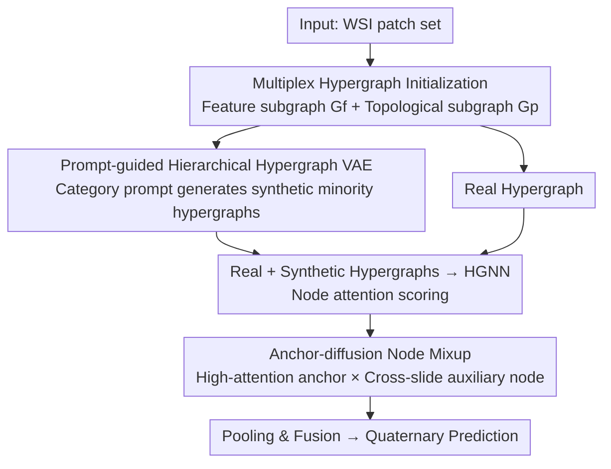

# Dual-Level Hypergraph Generation for Addressing Feature Scarcity in Whole-Slide Image Classification

**Conference**: CVPR 2026  
**Paper**: [CVF Open Access](https://openaccess.thecvf.com/content/CVPR2026/html/Yao_Dual-Level_Hypergraph_Generation_for_Addressing_Feature_Scarcity_in_Whole-Slide_Image_CVPR_2026_paper.html)  
**Code**: https://github.com/YAOSL98/Dual-HG  
**Area**: Medical Imaging  
**Keywords**: Whole-slide pathology, hypergraph generation, category scarcity, lymph node metastasis, variational autoencoder  

## TL;DR
Addressing the dual scarcity of minority class samples (ITC, micrometastasis) and positive nodes in quaternary lymph node metastasis classification, this paper proposes Dual-HGNet. It uses a category-prompt-guided hierarchical hypergraph VAE at the **hypergraph level** to synthesize topologically consistent minority hypergraphs and employs anchor-diffusion mixup at the **node level** to enhance high-attention positive node features. This approach significantly improves minority class recognition (e.g., ITC F1 on NIMM increased from 52.7 to 57.1).

## Background & Motivation
**Background**: Whole-Slide Images (WSIs) are enormous in size and typically divided into thousands of patches. Mainstream approaches treat each patch as a node and use Multi-Instance Learning (MIL), GNNs, or recent Hypergraph Neural Networks (HGNNs) to aggregate them into slide-level representations for classification. Hypergraphs excel over standard graphs by allowing one hyperedge to connect multiple nodes simultaneously, which is naturally suited for modeling high-order interactions in the tumor microenvironment.

**Limitations of Prior Work**: Lymph node metastasis diagnosis is a clinically relevant **quaternary classification** task—Negative, Isolated Tumor Cells (ITC), Micrometastasis, and Macrometastasis—representing progressive severity tiers. This task is plagued by two types of scarcity: (i) **Inter-class scarcity**: Slides for ITC and micrometastasis are rare (e.g., in NIMM, there are only 40 ITC and 76 micrometastasis slides, compared to 282 macrometastasis and 231 negative slides); (ii) **Intra-slide node scarcity**: Early-stage lesions like ITC/micrometastasis consist of only a few scattered positive cells within a slide, while the vast majority of patches are normal tissue. The overlap of these factors leads to severely insufficient feature representation for minority classes.

**Key Challenge**: Existing methods to mitigate feature scarcity in WSIs (e.g., selecting positive nodes, using LLM text priors for semantics, or pseudo-bag mixup) mostly operate at the **node level**, focusing on "increasing or improving positive nodes within a single slide." This neither addresses the narrow distribution coverage of minority classes across the training set (inter-class scarcity) nor accounts for **high-order topological dependencies**. Biologically, early-stage peripheral lesions like ITC exist in heterogeneous environments where multi-regional interaction patterns are more complex than the concentrated macrometastases; discarding topology means losing critical discriminative information.

**Key Insight**: To truly supplement minority classes, feature synthesis must occur at **two granularities simultaneously**, and the generation process must preserve the topological structure of the hypergraph (i.e., which nodes should be connected by the same hyperedge). Since hypergraphs provide a container for high-order dependencies, "generating new minority hypergraphs" becomes a natural choice for simultaneously alleviating inter-class scarcity and preserving topology.

**Core Idea**: A dual-level generation framework—**hypergraph-level** "generating entire minority class hypergraphs" + **node-level** "generating high-attention positive nodes"—is used to fill both inter-class and intra-slide scarcity. Topological consistency is maintained through positional encoding matching during generation.

## Method

### Overall Architecture
Dual-HGNet is an end-to-end quaternary classification pipeline. The input is a batch of WSIs, and the output is the diagnosis of the four metastasis categories. The process involves three steps: **First, initialize each WSI as a multiplex hypergraph** (encoding relationships in both feature and topological spaces); **second, use HGVAE at the hypergraph level** to synthesize new hypergraphs for minority classes (ITC/micrometastasis) to expand their distribution in the training set; **finally, feed both real and synthetic hypergraphs into an HGNN for classification training**. During training, each node is assigned an attention score, and **anchor-diffusion mixup is applied at the node level** to further enrich the features of high-attention positive nodes. During prediction, node and hyperedge features are fused via pooling for quaternary output.

The core mechanism is that HGVAE and node mixup address different levels of scarcity: HGVAE supplements inter-class scarcity (creating entire graphs), while node mixup addresses intra-slide node scarcity (creating key nodes). Both rely on dual-space matching of features and positional encodings to ensure new elements are inserted into topologically correct positions.

### Key Designs

**1. Multiplex Hypergraph Initialization: Splitting a WSI into "Feature Similar" and "Spatially Adjacent" Hyperedges**

This step solves the conflict where a single graph structure struggles to express both semantic similarity and spatial topology. Each patch is a node $v_i=(v_{f,i}, v_{p,i})$, carrying a visual feature vector $v_f$ and a positional embedding $v_p$. Instead of a single graph, the hypergraph $G=\langle V,E,H\rangle$ is decomposed into two sub-hypergraphs: a **feature space sub-hypergraph** $G_f$ connected by feature similarity, and a **topological space sub-hypergraph** $G_p$ connected by spatial proximity. The distances are defined as:

$$d^{(f)}_{ii'}=\lVert v_{f,i}-v_{f,i'}\rVert_2,\qquad d^{(p)}_{ii'}=\lVert v_{p,i}-v_{p,i'}\rVert_2$$

Each node is connected to its $k$-nearest neighbors in their respective spaces to form local hyperedges, resulting in incidence matrices $H_f$ and $H_p$, combined as $H=[H_f \mid H_p]$. The feature/position of each hyperedge $e_j=(e_{f,j}, e_{p,j})$ is the mean of its constituent nodes. This "dual-subgraph + positional encoding" setup is the foundation for all subsequent generation and interpolation—synthetic elements can be matched back to topologically correct positions because nodes and hyperedges both carry positional encodings.

**2. Prompt-Guided Hierarchical Hypergraph VAE (HGVAE): Generating Topologically Consistent Graphs for Minority Classes**

This is the primary component for addressing **inter-class scarcity**. HGVAE is trained only on real hypergraphs of ITC and micrometastasis to learn their specific feature and topological distributions. After training, the generator synthesizes new hypergraphs to expand the distribution. HGVAE uses a **hierarchical** structure: the encoder (a three-layer MLP) first infers a graph-level latent variable $z_g$,

$$q_\phi(z_g\mid V,E)=\mathcal{N}\!\big(\mu_g(V,E),\Sigma_g(V,E)\big)$$

Then, node-level latent variables $z_v$ and hyperedge-level latent variables $z_e$ are derived from $z_g$, forming a generation chain $z_g \to \{z_v,z_e\} \to (\hat v_f,\hat v_p),(\hat e_f,\hat e_p),\hat g$. This hierarchy allows a global prior to unify constraints across graph, hyperedge, and node granularities, thereby modeling both feature and topological dependencies.

"Prompt-guiding" injects pathological semantic priors: a **frozen CONCH text encoder** is paired with learnable category prompts. Each latent variable $z$ is mapped via an MLP to a text-space bias $r=h(z)$, added to prompt tokens to get $p(z)=[p_1+r,\dots,p_k+r]$, and concatenated with a category embedding $e_c$ to form the text representation $t=\{p(z),e_c\}$. Finally, $\text{Gen}(z)=T(t)$. The training objective is reconstruction plus KL regularization:

$$\mathcal{L}_{\text{HGVAE}}=\mathcal{L}_{rec}+\mathcal{L}_{kld}$$

Where $\mathcal{L}_{rec}$ applies MSE to the five outputs $\hat g,\hat e_f,\hat e_p,\hat v_f,\hat v_p$, and $\mathcal{L}_{kld}$ constrains $z_g$ and the conditional $z_v,z_e$ to a prior. During synthesis, $n$ samples are drawn from the prior $p(z_g)$ and mapped to $n$ sets of $(z_v^{(t)},z_e^{(t)})$, each corresponding to a new hypergraph $G'^{(t)}$.

**3. Dual-Space Nearest Neighbor Interpolation: Mapping Generated Elements to Topologically Correct Positions**

Simply generating node and hyperedge features is insufficient; the connectivity ("who connects to whom") must be reconstructed, otherwise, the synthetic hypergraph topology remains chaotic. Ours performs $k$-NN matching in both **feature** and **topological spaces**: for each reconstructed hyperedge feature $\hat e_{f,j}$, the $k$ nearest node features $\{\hat v_{f,i}\}$ are connected to form a feature-driven hyperedge ($\hat H_f$). For the hyperedge position $\hat e_{p,j}$, the $k$ nearest node positions are connected to form a position-driven hyperedge ($\hat H_p$). The synthetic hypergraph is $\hat G=\langle \hat V,\hat E,\hat H_f\mid \hat H_p\rangle$. This ensures the generation of hypergraphs with valid structures rather than isolated point clouds.

**4. Anchor-Diffusion Node Mixup: Supplementing Critical Intra-Slide Positive Nodes**

This component addresses **intra-slide node scarcity** during classifier training. Each node $v_i$ is assigned an attention score $\alpha_i$, where positive nodes typically receive higher scores. Within each graph (real $G$ or synthetic $\hat G$), the node with the highest attention is selected as the **anchor** $v_{anc}$. An **auxiliary node** $v_{aux}$ is sampled from high-attention nodes across **all slides of the same class** (cross-slide sampling is key to introducing new information). A new node is generated via interpolation:

$$(v_{f,syn}, v_{p,syn})=(v_{f,anc}, v_{p,anc})+(v_{f,aux}, v_{p,aux})$$

To preserve topology, $v_{syn}$ is assigned to the most similar hyperedge in both feature and spatial domains:

$$\arg\min_{e_j\in E}\big(\lVert v_{f,syn}-e_{f,j}\rVert_2,\ \lVert v_{p,syn}-e_{p,j}\rVert_2\big)$$

This step updates both node and hyperedge representations. Unlike standard mixup, this **diffuses only around high-attention anchors** and pulls auxiliary nodes cross-slide, effectively performing a targeted expansion of the most discriminative positive regions. ⚠️ Equation (11) in the original text uses a simple vector addition rather than weighted interpolation; coefficients should follow the original paper/code.

### Loss & Training
Hypergraphs pass through a single hypergraph convolution layer. After node mixup and pooling, slide-level representations are used to calculate cross-entropy:

$$\mathcal{L}_{CE}=\mathbb{E}_{(G,y)}[-y\log\hat y(G)]+\mathbb{E}_{(G',y)}[-y\log\hat y(G')]$$

The total objective combines classification loss with HGVAE generative regularization: $\mathcal{L}_{total}=\mathcal{L}_{CE}+\mathcal{L}_{HGVAE}$. The backbone uses CONCH pre-training for images and text, with $256\times256$ patches at 20× magnification. Optimized with Adam (lr $1\times10^{-4}$, weight decay $1\times10^{-5}$) for 300 epochs, batch size 1, reporting mean and variance from three-fold cross-validation.

## Key Experimental Results

### Main Results
Performance comparison on the NIMM quaternary dataset (629 lymph node slides) focusing on minority classes (ITC and Micrometastasis):

| Method | Overall AUC | Overall F1 | ITC F1 | Micro F1 |
|------|------|------|------|------|
| TransMIL (NeurIPS'21) | 96.15 | 71.50 | 47.87 | 47.82 |
| Patch-GCN (MICCAI'21) | 96.84 | 72.87 | 50.30 | 49.48 |
| HGNN (CVPR'23) | 96.34 | 72.88 | 49.64 | 49.25 |
| HGSurvNet (PAMI'23) | 96.45 | 74.01 | 52.29 | 51.06 |
| MRePath (IJCAI'25) | 96.21 | 74.09 | 52.69 | 51.63 |
| **Ours** | **96.95** | **77.19** | **57.13** | **58.30** |

Improvements are most notable in minority classes: ITC F1 increased from 52.69 to 57.13, and Micrometastasis F1 from 51.63 to 58.30, validating that dual-level generation effectively supplements minority classes.

Ours also leads in few-shot subtyping on TCGA datasets:

| Dataset | Shot | Metric | Prev. SOTA | Ours |
|------|------|------|------|------|
| TCGA-NSCLC | 2-shot | AUC | 84.31 (ViLa-MIL) | **86.73** |
| TCGA-NSCLC | 8-shot | AUC | 92.80 (MOC) | **94.21** |
| TCGA-RCC | 2-shot | F1 | 80.77 (CoCoOp) | **83.86** |
| TCGA-RCC | 8-shot | F1 | 91.95 (MOC) | **93.97** |

### Ablation Study
Component ablation (B=baseline, HGVAE, N-Aug=anchor-diffusion mixup), evaluating NIMM ITC F1 and TCGA-NSCLC 2-shot F1:

| Configuration | NIMM ITC F1 | NSCLC 2-shot F1 | Description |
|------|------|------|------|
| (a) B | 51.29 | 74.59 | Baseline only |
| (b) B+HGVAE | 55.53 | 80.46 | Hypergraph-level generation, supplements inter-class scarcity |
| (c) B+N-Aug | 54.49 | 75.32 | Node-level augmentation only |
| (d) Full | **57.13** | **80.96** | Best results with dual-level synergy |

The gain from HGVAE (b) is significantly higher than node mixup (c)—on NSCLC, the former provides +5.87 while the latter provides +0.73. This suggests that **inter-class scarcity (generating whole graphs) is the primary bottleneck** in this quaternary task, while node-level enhancement provides incremental value.

HGVAE internal variant ablation:

| Variant | Conditional | Hierarchical | $\hat H_p$ | NIMM ITC F1 | NSCLC 2-shot F1 |
|------|------|------|------|------|------|
| Vanilla VAE | ✗ | ✗ | ✗ | 40.00 | 65.37 |
| Conditional VAE | ✓ | ✗ | ✗ | 52.42 | 77.53 |
| + class prompt | ✓† | ✗ | ✗ | 54.62 | 79.51 |
| + Topology Gen | ✓† | ✗ | ✓ | 54.49 | 79.90 |
| Hierarchical VAE | ✓ | ✓ | ✗ | 54.87 | 78.96 |
| **HGVAE (full)** | ✓† | ✓ | ✓ | **55.53** | **80.46** |

### Key Findings
- **Vanilla VAE without conditions leads to performance drops** (ITC F1 40.0, far below baseline 51.3): Blind generation can disrupt the minority distribution; category conditions/prompt guiding are essential for positive gains.
- **Category prompt (†), hierarchy, and topological subgraphs all contribute independently**, with full HGVAE reaching 55.53. The category condition (✗→✓) provides the largest jump.
- Gains are concentrated in minority classes and few-shot scenarios. On standard large-scale TCGA tasks, performance is near saturation, but the advantages of Ours become clear in "true scarcity" scenarios like 2-shot or ITC.

## Highlights & Insights
- **Upgrading Feature Augmentation to Hypergraph Generation**: Previous WSI augmentation only patched features at the node level. This paper recognizes that topology itself is discriminative and that inter-class scarcity cannot be solved by intra-slide enhancement. Directly generating entire topologically consistent minority hypergraphs is a paradigm shift from "patching points" to "patching graphs."
- **Positional Encoding Consistency**: Positional embeddings for both nodes and hyperedges ensure that synthetic elements are mapped back to topologically valid positions using dual-space nearest neighbor matching.
- **Pathological Semantic Prior**: Using a frozen CONCH text encoder and learnable prompts gives the generator a "domain knowledge steering wheel," preventing unconditional generation from deviating from realistic distributions.
- **Restricted Anchor-Diffusion**: By using cross-slide auxiliary nodes only near high-attention anchors, the method performs a targeted proliferation of the most discriminative regions, avoiding signal dilution by the massive amount of negative nodes.

## Limitations & Future Work
- HGVAE is trained and synthesized only for specific minority classes (ITC, micrometastasis), relying on prior knowledge of which classes are scarce. Scalability in massive or continuous long-tail distributions remains to be explored. ⚠️
- Equation (11) for mixup lacks explicit weighted coefficients in the text; the sensitivity to the mixing ratio is not clearly analyzed.
- Validation is primary on lymph node metastasis and specific TCGA subtypes. Generalization to larger-scale, more diverse, or non-pathological WSI tasks is unverified.
- Sensitivity analysis for the number of synthetic samples $n$ relative to real samples was not reported; further analysis on when the number of synthetic samples becomes noisy would be beneficial.

## Related Work & Insights
- **vs. Node-level Augmentation (Pseudo-bag Mixup / Top-k Sampling / Diffusion, e.g., Liu'24, Zhao'40)**: These methods only mitigate intra-slide scarcity and ignore topology or inter-class distribution shifts. Ours addresses both through dual-level generation.
- **vs. Text-prior Enhanced MIL (ViLa-MIL, TOP, MOC)**: These use LLM/VLM text priors for semantic alignment but remain discriminative frameworks. Ours embeds the CONCH text prior into a **generator** to guide synthesis.
- **vs. Traditional HGNN (HGNN'23, HGSurvNet'23, MRePath'25)**: These model high-order dependencies but maintain the original node distribution. Ours adds a generative layer on top of HGNN specifically to address distribution coverage for minority classes.

## Rating
- Novelty: ⭐⭐⭐⭐⭐ First to apply dual-granularity "hypergraph + node" generation to WSI class imbalance with a focus on topological consistency.
- Experimental Thoroughness: ⭐⭐⭐⭐ Complete evaluation across NIMM, TCGA, and few-shot tasks, though sensitivity for $n$ and mixup coefficients is missing.
- Writing Quality: ⭐⭐⭐⭐ Framework and formulas are clear, though some notation in Equation (11) is potentially ambiguous.
- Value: ⭐⭐⭐⭐ Directly addresses the clinical pain point of minority class diagnosis in metastasis with high practical utility.

<!-- RELATED:START -->

## Related Papers

- [\[CVPR 2026\] Contrastive Cross-Bag Augmentation for Multiple Instance Learning-based Whole Slide Image Classification](contrastive_cross-bag_augmentation_for_multiple_instance_learning-based_whole_sl.md)
- [\[CVPR 2026\] Universal-to-Specific: Dynamic Knowledge-Guided Multiple Instance Learning for Few-Shot Whole Slide Image Classification](universal-to-specific_dynamic_knowledge-guided_multiple_instance_learning_for_fe.md)
- [\[CVPR 2026\] MUSE: Harnessing Precise and Diverse Semantics for Few-Shot Whole Slide Image Classification](muse_harnessing_precise_and_diverse_semantics_for_few-shot_whole_slide_image_cla.md)
- [\[CVPR 2026\] Act Like a Pathologist: Tissue-Aware Whole Slide Image Reasoning](act_like_a_pathologist_tissue-aware_whole_slide_image_reasoning.md)
- [\[CVPR 2026\] TopoSlide: Topologically-Informed Histopathology Whole Slide Image Representation Learning](toposlide_topologically-informed_histopathology_whole_slide_image_representation.md)

<!-- RELATED:END -->
## Related Papers

- [\[CVPR 2026\] Contrastive Cross-Bag Augmentation for Multiple Instance Learning-based Whole Slide Image Classification](contrastive_cross-bag_augmentation_for_multiple_instance_learning-based_whole_sl.md)
- [\[CVPR 2026\] Universal-to-Specific: Dynamic Knowledge-Guided Multiple Instance Learning for Few-Shot Whole Slide Image Classification](universal-to-specific_dynamic_knowledge-guided_multiple_instance_learning_for_fe.md)
- [\[CVPR 2026\] MUSE: Harnessing Precise and Diverse Semantics for Few-Shot Whole Slide Image Classification](muse_harnessing_precise_and_diverse_semantics_for_few-shot_whole_slide_image_cla.md)
- [\[CVPR 2026\] Act Like a Pathologist: Tissue-Aware Whole Slide Image Reasoning](act_like_a_pathologist_tissue-aware_whole_slide_image_reasoning.md)
- [\[CVPR 2026\] TopoSlide: Topologically-Informed Histopathology Whole Slide Image Representation Learning](toposlide_topologically-informed_histopathology_whole_slide_image_representation.md)

<!-- RELATED:END -->
