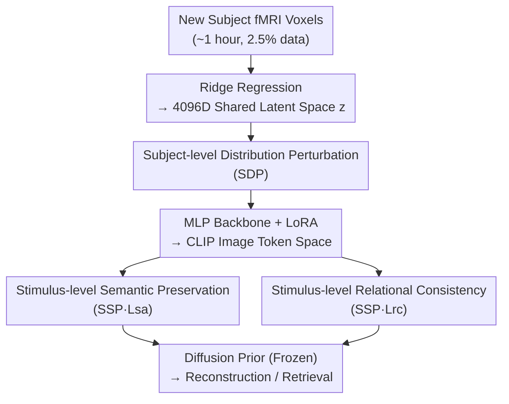

# Duala: Dual-Level Alignment of Subjects and Stimuli for Cross-Subject fMRI Decoding

**Conference**: CVPR 2026  
**Paper**: [CVF Open Access](https://openaccess.thecvf.com/content/CVPR2026/html/Li_Duala_Dual-Level_Alignment_of_Subjects_and_Stimuli_for_Cross-Subject_fMRI_CVPR_2026_paper.html)  
**Code**: https://github.com/ShumengLI/Duala  
**Area**: Medical Imaging / Brain-Computer Interface / Cross-Subject fMRI Decoding  
**Keywords**: fMRI Visual Decoding, Cross-Subject, Semantic Alignment, Distribution Perturbation, Data-Limited Fine-Tuning

## TL;DR
Addressing the pain point of performance collapse when transferring pre-trained fMRI-to-image decoding models to a new subject with only about 1 hour of data, Duala simultaneously performs **stimulus-level semantic preservation** (maintaining category boundaries using triplet alignment loss + relational consistency loss) and **subject-level distribution perturbation** (perturbing the representation of new subjects using the covariance of source subjects) during the fine-tuning stage. By introducing only 4.68M trainable parameters, it pushes the cross-subject image-to-brain and brain-to-image retrieval accuracies to 84.5% and 81.1% respectively, outperforming the previous SOTA, MindTuner, by 1.4% and 5.1%.

## Background & Motivation

**Background**: fMRI visual decoding (reconstructing or retrieving viewed images from brain activity) has made significant progress with the emergence of cross-modal large models such as CLIP and Stable Diffusion. The prevailing paradigm involves projecting voxel responses into the latent space of a pre-trained large model, and then reconstructing images using a diffusion prior. However, the vast majority of works adopt a **single-subject paradigm**, where a decoder is trained individually for each subject.

**Limitations of Prior Work**: Due to individual differences in cortical anatomy and cognitive patterns, single-subject decoders can hardly generalize to other individuals. Meanwhile, collecting a sufficient amount of fMRI data for each new subject is extremely expensive (scanning a single subject in the NSD dataset for high-quality data requires 40 hours). Thus, cross-subject decoding—adapting pre-trained models to new subjects with limited data—has become a critical issue. Current cross-subject methods (e.g., MindEye2, MindTuner) perform well during pre-training, but once fine-tuned on a new subject, **the image-to-brain retrieval accuracy drops by 41%**.

**Key Challenge**: The authors observed that fine-tuning **disrupts** the robust mapping between "brain activity $\leftrightarrow$ visual representation" learned during the pre-training stage, which is rooted in two aspects. First, **stimulus-level inconsistency**: t-SNE visualizations show that while the pre-trained subjects have clear category boundaries for different stimuli, those of the new subject become blurred after fine-tuning, hindering the model from distinguishing different stimuli viewed by the new subject. Second, **subject-level mismatch**: In the NSD dataset, over 90% of the visual stimuli differ across subjects (even for the same category "cat", the specific images viewed by each person are different), making strict one-to-one stimulus alignment impossible and preventing the model from establishing stable cross-subject correspondences.

**Goal**: Under data-limited conditions (a single scanning session of about 1 hour, accounting for 2.5% of the full dataset), the goal is to adapt the pre-trained decoding model $F_\theta$ into $F_{\theta'}$ for the new subject, while simultaneously addressing the problems at both levels.

**Key Insight**: The "alignment" is decoupled into two independent but complementary levels: the stimulus level must **preserve the semantic structure** (compact intra-class and separated inter-class), while the subject level must **accommodate individual differences** without being diminished by the alignment. Addressing only one of these aspects is insufficient: solely preserving semantics overrides the source subject geometry, whereas solely aligning subjects blurs the category boundaries.

**Core Idea**: Dual-level Alignment: using semantic and relational constraints at the stimulus level to preserve category geometry, and utilizing covariance-driven distribution perturbation based on source subject statistics at the subject level to make the model robust to individual variations. These two levels are jointly fine-tuned.

## Method

### Overall Architecture

Instead of redesigning the decoder backbone, Duala directly reuses the pre-training pipeline of MindEye2, inserting two alignment modules during the **fine-tuning stage**. The pipeline is as follows: voxel responses $V^{s_N}$ of the new subject (approximately 13,000–18,000 voxels per subject) are first linearly projected via ridge regression into a 4096-dimensional shared latent space to obtain embeddings $z^{s_N}$. These are then mapped to the image token space ($256\times1664$) of OpenCLIP ViT-bigG/14 by an MLP backbone consisting of four residual blocks. Finally, the outputs are simultaneously fed into a diffusion prior (to align with the CLIP image latent distribution) and two lightweight MLP heads (for low-level reconstruction and image retrieval). During fine-tuning, the diffusion prior and most modules are **frozen**, with only rank-8 LoRA adapters inserted into the MLP backbone being trained.

Along this backbone, Duala introduces two modules: **Subject-level Distribution Perturbation (SDP)**, which applies covariance-driven Gaussian perturbation on the latent space embedding after ridge regression to allow the representations of the new subject to cover potential cross-individual variations; and **Stimulus-level Semantic Preservation (SSP)**, which imposes two constraints on the representations adapted by the MLP—the semantic alignment loss $L_{sa}$ (triplet) and the relational consistency loss $L_{rc}$ (prototype similarity matrix alignment). The overall fine-tuning objective is given by:

$$L_{ft} = L_{dec} + \lambda_1 L_{sa} + \lambda_2 L_{rc},$$

where $L_{dec}$ represents the decoding loss inherited from MindEye2 (diffusion prior + bidirectional contrastive retrieval + low-level reconstruction).

### Key Designs

**1. Stimulus-level Semantic Alignment: Preserving Intra-/Inter-class Geometry of the New Subject with Triplet Loss**

This item directly addresses the pain point where the category boundaries of the new subject become blurred after fine-tuning. The goal is to make the fMRI embeddings of similar stimuli within the same subject closer, and those of different stimuli farther apart. For the embedding $z^{s_N}$ after ridge regression, the authors sample an anchor $z^{s_N}_a$, a positive sample $z^{s_N}_p$ of the same class ($y_a = y_p$), and a negative sample $z^{s_N}_n$ of a different class ($y_n \neq y_a$). Replacing Euclidean distance with cosine similarity $s(\cdot,\cdot)$, we assume $s(z^{s_N}_a, z^{s_N}_p) > s(z^{s_N}_a, z^{s_N}_n)$ and formulate the triplet loss as:

$$L_{sa} = \sum_a \max\!\big(0,\ m - s(z^{s_N}_a, z^{s_N}_p) + s(z^{s_N}_a, z^{s_N}_n)\big),$$

where $m>0$ is a margin hyperparameter ensuring a minimum gap between classes. The role of this loss is to organize the embeddings of the new subject into a semantically aligned space. However, ablation studies show that when used alone, it tends to be "overly restrictive"—while intra-class cohesion is enhanced and brain retrieval accuracy jumps to 92.38%, it biases the forward (image) matching, causing a slight drop in image retrieval accuracy. Thus, it must be paired with subject-level perturbation.

**2. Stimulus-level Relational Consistency: Transferring "Inter-class Similarity Structure" Learned from Source Subjects to the New Subject**

Since different subjects view different images (even for the same category of bird/bus/clock, the actual photos vary), sample-wise alignment cannot be performed. However, **the similarity relationships across categories should remain consistent across subjects**. The authors calculate a prototype $p^s_c$ for each category $c$ of each subject $s$ (the mean of all normalized embeddings in that category), and then compute the pairwise cosine similarity between class prototypes to construct a class similarity matrix $S^s \in \mathbb{R}^{C\times C}$, where $S^s_{c_1,c_2}=s(p^s_{c_1}, p^s_{c_2})$. The matrices of all source subjects are aggregated to form a reference semantic similarity matrix $S^{ref}$. During adaptation to the new subject $s_N$, its similarity matrix $S^{s_N}$ is constructed, and the discrepancy to the reference is minimized:

$$L_{rc} = \frac{1}{|\Omega|}\sum_{(c_1,c_2)\in\Omega}\big(S^{s_N}_{c_1,c_2} - S^{ref}_{c_1,c_2}\big)^2,$$

where $\Omega$ is the set of class pairs for which reference similarity is available. Consequently, the new subject inherits the inter-class similarity patterns learned during pre-training, preventing fine-tuning from distorting the semantic geometry. This acts as a "global regularizer," and its weight $\lambda_2$ is relatively sensitive: too large a value (0.5) forces excessive alignment to the source subject geometry, which hinders adaptation to the new subject.

**3. Subject-level Distribution Perturbation: Generating "Variants" for New Subject Representations with Source Covariance to Combat Individual Differences**

SDP targets "subject-level mismatch"—it decomposes fMRI representations into **stimulus-driven factors** that reflect shared semantics and **subject-specific factors** that capture individual anatomical/functional characteristics. The authors use source subjects $\{s_1,\dots,s_K\}$ to calculate the class mean $\mu_c=\frac{1}{K}\sum_s \bar z^s_c$ for each class $c$ (approximating the shared stimulus factor) and the subject-specific deviation $\sigma^s_c=\sqrt{\mathrm{Var}(\bar z^s_c)}$. During adaptation, the representation is first centered using the class mean $z^{s_N}_i - \mu_c$ to isolate the subject-specific factor, which is then augmented through Gaussian perturbation using the source subjects' deviations:

$$\tilde z^{s_N}_i = \mu_c + \frac{1}{K}\sum_{s=1}^{K}\sigma^s_c \odot (z^{s_N}_i - \mu_c),$$

where $\odot$ denotes element-wise scaling (for details regarding sampling/scaling of $\sigma$ in the formula, ⚠️ refer to the original paper). Intuitively, this preserves the semantic structure provided by the stimulus factor while simulating plausible variations in "how it would look in another individual." This makes the model robust to subject-specific variations, allowing a smooth adaptation with only one hour of data, without washing away the uniqueness of the new subject. In ablation studies, adding SDP alone consistently improves retrieval and reconstruction performance, and helps $L_{sa}$ recover the forward matching accuracy that was otherwise sacrificed.

### Loss & Training

The overall fine-tuning objective is $L_{ft}=L_{dec}+\lambda_1 L_{sa}+\lambda_2 L_{rc}$, with $\lambda_1=1.0$ and $\lambda_2=0.1$. The implementation is based on PyTorch using a single A800 GPU. The diffusion prior and MLP modules are frozen, with only rank-8 LoRA adapters inserted into the MLP backbone being trained. The new subject's data from a single scanning session (approx. 1 hour) is trained with a batch size of 10, using AdamW (lr=3e-4) paired with a OneCycle scheduler for 150 epochs. In the first 1/3 of the iterations, the BiMixCo loss is replaced with the SoftCLIP loss.

## Key Experimental Results

### Main Results

The dataset used is the Natural Scenes Dataset (NSD, 7T fMRI, stimuli from MSCOCO-2017). Fine-tuning is conducted on subjects 1, 2, 5, and 7 using 1 hour of data each, and the results are averaged. Low-level metrics include PixCorr/SSIM/AlexNet(2)/AlexNet(5); high-level semantic metrics include Inception/CLIP/EfficientNet/SwAV, alongside bidirectional image/brain retrieval.

| Method | Source | PixCorr↑ | AlexNet(2)↑ | Incep↑ | CLIP↑ | Image Retrieval↑ | Brain Retrieval↑ |
|------|------|---------|------------|--------|-------|----------|--------|
| MindEye2 | ICML'24 | 0.195 | 84.2% | 81.2% | 79.2% | 79.0% | 57.4% |
| MindAligner | ICML'25 | 0.206 | 85.6% | 81.1% | 82.0% | 79.0% | 75.3% |
| MindTuner | AAAI'25 | 0.224 | 87.8% | 84.8% | 83.5% | 83.1% | 76.0% |
| **Duala (Ours)** | - | **0.230** | **87.9%** | **85.4%** | **83.5%** | **84.5%** | **81.1%** |

Duala outperforms MindTuner by 1.4% and 5.1% in average Image Retrieval (84.5%) and Brain Retrieval (81.1%), respectively, achieving consistent improvements across all four subjects on both forward (brain-to-image) and backward (image-to-brain) retrieval. For reconstruction, it achieves the best results across multiple metrics, including PixCorr, AlexNet(2), Inception, and CLIP. t-SNE visualizations demonstrate that its category boundaries are significantly clearer than those of MindEye2 after fine-tuning.

Parameter efficiency (calculated with ridge regression parameters of Subject 1):

| Method | Total Fine-Tuning Parameters |
|------|-----------|
| MindEye2 | 2.2G |
| MindAligner | 139.23M |
| MindTuner | 76.71M |
| **Duala (Ours)** | **69.09M** (Only 4.68M trainable MLP parameters) |

Duala achieves the best decoding performance with the fewest parameters, exhibiting superior parameter efficiency and fine-tuning stability.

### Ablation Study

On Subject 1 with 1 hour of data, adding the three components (SDP, SSP-$L_{sa}$, SSP-$L_{rc}$) step-by-step:

| SDP | $L_{sa}$ | $L_{rc}$ | Incep↑ | CLIP↑ | Image Retrieval↑ | Brain Retrieval↑ |
|-----|---------|---------|--------|-------|----------|--------|
| ✘ | ✘ | ✘ | 84.24% | 83.35% | 93.31% | 89.92% |
| ✔ | ✘ | ✘ | 84.45% | 83.68% | 93.84% | 90.59% |
| ✘ | ✔ | ✘ | 86.16% | 84.00% | 91.89% | **92.38%** |
| ✔ | ✔ | ✘ | 85.33% | 83.92% | 93.86% | 91.43% |
| ✔ | ✔ | ✔ | **86.62%** | **85.11%** | **94.77%** | 91.22% |

Loss weight sensitivity (Table 4) shows that varying $\lambda_1$ from 0.5 to 1.0 results in very minor changes, demonstrating that the model is robust to it. However, $\lambda_2$ is more sensitive, with 0.1 being optimal; a value of 0.5 leads to over-regularization, dropping performance in both retrieval tasks.

### Key Findings
- **Using $L_{sa}$ alone leads to "imbalanced" performance**: Adding only semantic alignment pushes brain retrieval to 92.38% (the highest in the table), but image retrieval drops to 91.89%. This suggests that excessively tight intra-class representations bias the forward match, requiring SDP to restore balance.
- **The complete model achieves the best trade-off**: The combination of SDP + $L_{sa}$ + $L_{rc}$ yields the highest high-level semantic scores, lowest EfficientNet/SwAV distances, and highest image retrieval accuracy, while maintaining highly competitive brain retrieval.
- **$\lambda_2$ primarily shapes semantic geometry rather than pixel structures**: PixCorr and SSIM remain virtually unchanged across different values of $\lambda_2$, indicating that the relational consistency constraint functions specifically at the semantic level.
- **Functional alignment visualization (TQ heatmap)**: The Transfer Quantity (TQ) heatmap of Duala shows clear regional hotspots in typical visual areas such as EarlyVis, OPA, EBA, and PPA, aligning well with models trained on the full 40 hours of data. In contrast, MindEye2 distributes high TQ uniformly across the cortex, losing regional structure.

## Highlights & Insights
- **"Dual-level alignment" directly targets the true failure modes of cross-subject fine-tuning**: The authors first quantify the two issues ("stimulus-level blur" and "subject-level mismatch") using a 41% retrieval degradation and t-SNE, and then address them with tailored solutions. This makes the motivation highly solid rather than arbitrary.
- **The design of relational consistency loss is ingenious**: Since subjects view different images, sample-wise alignment is impossible. However, the second-order constraint that "inter-class similarity matrices should be consistent" successfully slips past the obstacle of one-to-one alignment. This provides an applicable concept for any unpaired cross-domain alignment scenarios.
- **Distribution perturbation as data augmentation**: Using the intra-class variance of source subjects to generate plausible variations for the new subject essentially injects "cross-individual priors" into data-scarce fine-tuning. This approach can be extended to other few-shot domain adaptation tasks.
- **Extremely lightweight**: Outperforming the 2.2G MindEye2 with only 4.68M trainable parameters and 69.09M total parameters proves that the bottleneck of cross-subject performance lies in the "alignment objective" rather than the "parameter capacity."

## Limitations & Future Work
- Evaluations are restricted to four subjects (1, 2, 5, and 7) on the NSD dataset; the number of subjects is relatively small, and generalization across datasets or scanners remains unverified.
- Relational consistency depends on **class labels** to compute class prototypes and reference similarity matrices. The applicability to stimulus sets without clear class structures or open-world classes remains undiscussed.
- The scaling method of $\sigma$ in the Gaussian perturbation equation of SDP (Eq. 8) is described briefly; implementation details ⚠️ should refer to the original paper or code.
- The paper reports improvements in retrieval and reconstruction metrics, but perceptual-level validation of "whether it truly reconstructs the subject's subjective perception more faithfully" still relies primarily on a few qualitative visualization examples.

## Related Work & Insights
- **vs MindEye2**: MindEye2 projects each subject into a shared latent space via ridge regression for shared decoding, serving as Duala's pre-training backbone and baseline. However, it disrupts the semantic structure when fine-tuning on a new subject, yielding a brain retrieval of only 57.4%. Duala adds dual-level alignment on top of it, lifting the brain retrieval to 81.1%.
- **vs MindTuner**: MindTuner models non-linear cross-subject relationships using LoRA + SkipLoRA, representing the previous SOTA (image/brain retrieval of 83.1%/76.0%). Duala retains its LoRA fine-tuning strategy but supplements it with stimulus-level semantic preservation and subject-level distribution perturbation, boosting retrieval by 1.4% and 5.1% respectively, with even fewer parameters.
- **vs MindAligner / MindBridge**: These methods rely on synthesizing pseudo-shared stimuli or paired responses to perform alignment, which is constrained by the "requirement of shared stimuli." Duala's relational consistency loss bypasses this dependency on shared stimuli by employing an inter-class similarity matrix.

## Rating
- Novelty: ⭐⭐⭐⭐ Decoupling into dual-level alignment and utilizing relational consistency constraints directly address the pain points of unpaired cross-subject alignment; the logic is highly clear.
- Experimental Thoroughness: ⭐⭐⭐⭐ The main table, ablations, weight sensitivity, parameter efficiency, and TQ visualization are highly comprehensive, though subject and dataset coverage is somewhat narrow.
- Writing Quality: ⭐⭐⭐⭐ The motivation is driven by quantitative phenomena, and the illustrations match the text well, though some mathematical details are slightly simplified.
- Value: ⭐⭐⭐⭐ A highly practical solution for data-limited cross-subject decoding that is extremely lightweight and achieves SOTA, demonstrating significant value for the real-world deployment of brain-computer interfaces.

<!-- RELATED:START -->

## Related Papers

- [\[ICLR 2026\] Seeing Through the Brain: New Insights from Decoding Visual Stimuli with fMRI](../../ICLR2026/medical_imaging/seeing_through_the_brain_new_insights_from_decoding_visual_stimuli_with_fmri.md)
- [\[NeurIPS 2025\] MoRE-Brain: Routed Mixture of Experts for Interpretable and Generalizable Cross-Subject fMRI Visual Decoding](../../NeurIPS2025/medical_imaging/more-brain_routed_mixture_of_experts_for_interpretable_and_generalizable_cross-s.md)
- [\[CVPR 2026\] Dual-Level Confidence based Implicit Self-Refinement for Medical Visual Question Answering](dual-level_confidence_based_implicit_self-refinement_for_medical_visual_question.md)
- [\[CVPR 2026\] Dual-Level Hypergraph Generation for Addressing Feature Scarcity in Whole-Slide Image Classification](dual-level_hypergraph_generation_for_addressing_feature_scarcity_in_whole-slide_.md)
- [\[CVPR 2026\] SemiGDA: Generative Dual-distribution Alignment for Semi-Supervised Medical Image Segmentation](semigda_generative_dual-distribution_alignment_for_semi-supervised_medical_image.md)

<!-- RELATED:END -->
