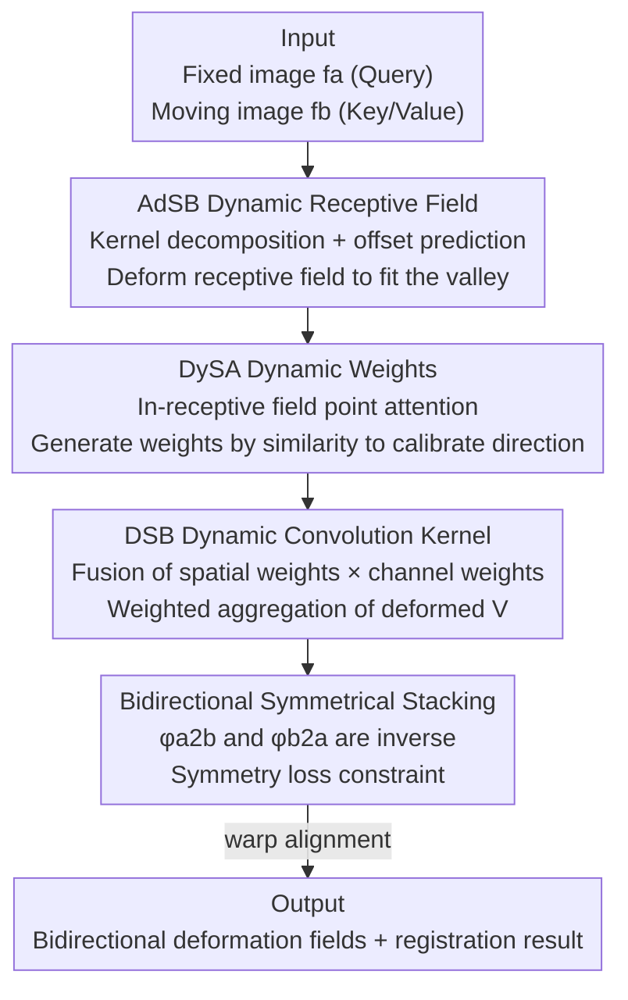

# Dynamic Stream Network for Combinatorial Explosion Problem in Deformable Medical Image Registration

**Conference**: CVPR 2026  
**Paper**: [CVF Open Access](https://openaccess.thecvf.com/content/CVPR2026/html/Bi_Dynamic_Stream_Network_for_Combinatorial_Explosion_Problem_in_Deformable_Medical_CVPR_2026_paper.html)  
**Code**: https://github.com/ShaochenBi/DySNet  
**Area**: Medical Imaging  
**Keywords**: Deformable Registration, Dynamic Receptive Field, Dynamic Weights, Combinatorial Explosion, Attention Mechanism  

## TL;DR
Addressing the combinatorial explosion of feature relationships in Deformable Medical Image Registration (DMIR) caused by "dual-image inputs," this paper proposes DySNet. It utilizes an AdSB module to dynamically deform the receptive field (shrinking the search space) and a DySA module to dynamically generate attention weights (calibrating the search direction). These two dynamic mechanisms are unified into a single dynamic convolution kernel. On 3D cardiac CT and 3D/2D brain MRI tasks, it achieves an average Dice of 82.0%, outperforming 8 SOTA methods.

## Background & Motivation
**Background**: Deformable Medical Image Registration (DMIR) aims to estimate a non-rigid deformation field pixel-by-pixel for two images (fixed and moving) to align their anatomical structures. The core step is "feature modeling"—finding the correspondence for each pixel in the other image. Prevailing approaches use CNNs (VoxelMorph, LKU-Net) or Transformers (XMorpher, ModeT) to model these cross-image feature relationships.

**Limitations of Prior Work**: A fundamental difference between DMIR and "single-image input" tasks like segmentation or classification is that DMIR processes two images simultaneously. Consequently, the number of pairwise feature combinations expands exponentially with resolution. Representing the image as $N=H\times W$ feature points, the candidate relationship set size for each point is $c=\alpha HW-1$. Assuming independent matching for each point, the total number of possible feature combinations for the whole image is:

$$|\mathcal{H}| = c^N = (\alpha HW-1)^{HW}$$

This explodes exponentially with resolution. To capture accurate relationships, models are forced to **expand the search space and search directions**, which inadvertently incorporates massive irrelevant relationships, leading to sub-optimal matching.

**Key Challenge**: The "static" structures of existing methods are the root cause: ① **Static Receptive Fields** (fixed shapes in convolution kernels or Transformer patch/window partitioning) fix the number and range of relationships considered per pixel. Improving accuracy requires expanding the global search space, allowing interference features to flood in. ② **Static Weights** (frozen after training, not adjusted per data during inference) fix the search direction. Once the search space expands, fixed directions miss more potential relationships. Existing works either add dynamics only to the receptive field (e.g., DCN, DAT) or only to the weights; **none make both dynamic simultaneously**.

**Core Idea**: Make both the receptive field and weights "dynamically change with the input image." Receptive field deformation → excludes irrelevant features from the search space (smaller, more focused space); Dynamic weight generation → adjusts search direction based on image similarity (more accurate direction). Multiplying the two reduces the number of modeled feature combinations from $|U_{N^d}(i)|\times|W(i)|$ to $|D_{N^d}(i)|\times|A(i)|$, suppressing the combinatorial explosion at its source. The authors liken this mechanism to "water flowing along a valley," naming it the Dynamic Stream Network (DySNet).

## Method

### Overall Architecture
The fundamental building block of DySNet is the **Dynamic Stream Block (DSB)**, which serially connects two dynamic modules: AdSB first deforms the receptive field into a "valley shape fitting the input," and DySA then calculates attention weights based on similarity within this deformed receptive field. Both are fused into a **dynamic convolution kernel** to aggregate features. The entire network **symmetrically stacks** multiple DSBs into a bidirectional registration framework (where $x_a\to x_b$ and $x_b\to x_a$ are inverse mappings), constrained by a symmetry loss.

Inputs are fixed image features $f^a$ (Query) and moving image features $f^b$ (Key/Value). The DSB outputs attention features, which, after layer-wise modeling, regress the bidirectional deformation fields $\phi_{a2b}$ and $\phi_{b2a}$ to warp the images for alignment. The authors replace the CAT blocks in XMorpher and the ModeT modules in ModeT with DSB as plug-and-play components, resulting in DySNet-X and DySNet-M, respectively.

### Key Designs

**1. AdSB (Adaptive Stream Basin): Deforming the receptive field to squeeze irrelevant features out of the search space**

Addressing the "static receptive field fixes search space shape" pain point, AdSB allows the receptive field of each pixel to adaptively deform according to input image differences. It first performs **kernel decomposition**: treating the base convolution kernel $K_{N^d,\theta}(i)$ as a point attention mechanism, it is split into a receptive field $U_{N^d}(i)$ and weights $\theta_{N^d,C}^i$. The weights are further split into spatial weights $\theta_{N^d,1}^i$ and channel weights $\theta_{1,C}^i$—decoupling them to facilitate injecting dynamics separately.

Deformation is achieved via an **offset prediction network**: concatenating fixed features $f^a$ and moving features $f^b$ along the channel dimension as $X=[f^a,f^b]\in\mathbb{R}^{B\times 2C\times H\times W}$, which is fed into an offset network $\theta_{\text{offset}}$ to predict the offset $\Delta i$ for each sampling point, pushing the static receptive field toward the local optimal neighborhood:

$$D_{N^d}(i) = U_{N^d}(i) + \Delta i$$

Bilinear interpolation $I(\cdot)$ is then used to sample Key/Value at the deformed positions, obtaining deformed $K_j^m=I(K, D_{N^d}(i)_j)$ and $V_j^m=I(V, D_{N^d}(i)_j)$. **Mechanism**: The deformed receptive field $|D_{N^d}(i)|$ covers the effective information of the original static field $|U_{N^d}(i)|$ using fewer pixels ($|D_{N^d}(i)|<|U_{N^d}(i)|$), effectively filtering out irrelevant features outside the valley. Interpolated sampling ensures continuous differentiability, favoring stable training and smooth deformation. This progresses beyond DAT, which is still limited by fixed input receptive fields; AdSB achieves pixel-level continuously variable receptive fields.

**2. DySA (Dynamic Stream Attention): Dynamically generating weights in the deformed receptive field to calibrate search direction**

Addressing the "static weights lock search direction" pain point, DySA calculates weights in real-time based on feature similarity during inference rather than using fixed weights frozen after training. Given Query $Q_i$ at fixed image position $i$ and deformed Key $K_j^m$ from AdSB, it calculates scaled dot-product similarity $e_{ij}=\frac{Q_i^\top K_j^m}{\sqrt{c}}$ ($c$ is the head dimension), then applies softmax normalization over all sampling points in the deformed field to get spatial weights:

$$\rho_{N^d,1}^i(j) = \frac{\exp(e_{ij})}{\sum_{j=1}^{|D_{N^d}(i)|}\exp(e_{ij})}, \quad j=1,\dots,|D_{N^d}(i)|$$

**Mechanism**: This point-wise attention allows weights to be dynamically allocated based on local similarity between the two images, aligning the search direction with the most relevant regions. This reduces the relationships modeled per pixel from $|W(i)|$ to $|A(i)|$ ($|A(i)|<|W(i)|$). Softmax normalization ensures weights form a valid probability distribution, stabilizing training and producing interpretable attention maps that highlight critical regions for registration. AdSB shrinks the space while DySA calibrates the direction; their product suppresses the combination count to $|D_{N^d}(i)|\times|A(i)| \ll |U_{N^d}(i)|\times|W(i)|$.

**3. DSB Dynamic Convolution Kernel + Symmetrical Framework: Unifying two dynamics into one kernel with inverse mapping priors**

AdSB and DySA provide dynamism for the receptive field and weights, respectively. DSB is responsible for **reassembling them into a unified dynamic convolution kernel**: it first combines DySA's spatial weights $\rho_{N^d,1}^i$ with learnable channel weights $\theta_{1,C}^i$ into $\theta_{N^d,C}^i$, then restores the dynamic kernel $K_{N^d,\theta}(i)$ by combining it with the deformed receptive field $D_{N^d}(i)$. Finally, it performs weighted summation on the deformed Value to complete feature aggregation:

$$A_i = \sum_{j=1}^{|D_{N^d}|}\theta_{N^d,C}^i(j)\cdot V_j^m$$

This step is a closed loop of "decomposition for dynamic injection, then fusion into a kernel." At the network level, DMIR is modeled as a **bijective mapping** between shared anatomical content; thus, $x_a\to x_b$ and $x_b\to x_a$ should be inverse. The authors symmetrically stack DSBs and use a symmetry loss to constrain both directions:

$$\mathcal{L}_{bireg} = \mathcal{L}_{reg}(x_b, x_{a2b}, \phi_{a2b}) + \mathcal{L}_{reg}(x_a, x_{b2a}, \phi_{b2a})$$

Each $\mathcal{L}_{reg}$ include a smoothing loss $\mathcal{L}_{smo}$ and a similarity loss $\mathcal{L}_{sim}$ (LNCC). This symmetry prior ensures consistency, allowing DySNet to maintain high Dice while keeping the negative Jacobian ratio low.

### Loss & Training
The total loss is the bidirectional symmetrical registration loss $\mathcal{L}_{bireg}$, where each direction = LNCC similarity loss + deformation field gradient smoothing. Optimizer: AdamW, initial learning rate $10^{-4}$, single NVIDIA RTX 6000 (24GB), implemented in PyTorch.

## Key Experimental Results

### Main Results
Three tasks (3D Cardiac CT, 3D Brain MRI, 2D Brain MRI). Metrics: Dice (DSC %, higher is better) and percentage of non-positive Jacobian volume ($|J_\phi|<0$ %, lower means more reasonable deformation). AVG is the arithmetic mean of the three DSCs.

| Method | Type | Heart CT DSC% | Brain MRI(3D) DSC% | Brain MRI(2D) DSC% | AVG DSC |
|------|------|------------|---------------|---------------|---------|
| Initial (Unregistered) | - | 62.5 | 65.5 | 62.1 | 63.4 |
| VoxelMorph | C | 77.0 | 75.9 | 78.6 | 77.2 |
| SACB | C | 83.0 | 78.9 | 82.5 | 81.5 |
| TransMorph | C+T | 69.0 | 71.7 | 82.3 | 74.3 |
| XMorpher | T | 72.4 | 71.2 | 76.5 | 73.4 |
| **DySNet-X** | T | 74.5 (+2.1) | 77.8 (+6.6) | **83.0 (+6.5)** | 78.4 |
| ModeT | T | 83.6 | 77.4 | 81.9 | 81.0 |
| **DySNet-M** | T | **84.1 (+0.5)** | **79.7 (+2.3)** | 82.2 (+0.3) | **82.0** |

DySNet-M achieves the highest/second-highest Dice (82.0% average) across all tasks. Both DySNet-X and DySNet-M improve over their respective baslines, with DySNet-X gaining +6.6% on fine anatomical structures (3D Brain). Regarding negative Jacobians, DySNet remains at a reasonably low level (0.79% for 2D Brain), whereas SACB/ViT-V-Net/TransMorph reach up to 2.88% with occasional registration failure, achieving a balance between "high precision and smooth deformation."

### Ablation Study (DySNet-X, 2D Brain MRI)
| Config | DSC% | $\|J_\phi\|$% | Description |
|------|------|--------------|------|
| Baseline (XMorpher) | 76.5 | 0.80 | Static Receptive Field + Static Weights |
| + DySA | ~82 | Low | Added dynamic weights; significant semantic matching enhancement |
| + AdSB (Full) | 83.0 | 0.88 | Added dynamic receptive field; optimal precision |

| Kernel Size | DSC% | Description |
|--------|------|------|
| 1×1 ~ 7×7 | 82.9 ~ 83.02 | $\|J_\phi\|$ between 0.848~0.938; almost invariant to kernel size |

### Key Findings
- **DySA is the main performance driver**: Adding DySA (dynamic weights) alone pulls Dice from 76.5% to approximately 82%. AdSB (dynamic receptive field) further increases it to 83.0%, showing "calibrating search direction" contributes more directly than "shrinking search space," though both together are optimal.
- **Insensitive to kernel size**: Dice barely fluctuates (82.9~83.02%) from 1×1 to 7×7. This proves dynamic attention can capture key relationships without large spatial contexts, with params remaining nearly constant. Small kernels suffice for efficiency, aligning with the "suppressing combinatorial explosion" goal.
- **Pyramidal architectures benefit more**: Multi-scale structures like ModeT/SACB show more prominent gains with DySNet's dynamic mechanism, suggesting multi-scale context complements dynamic receptive fields.

## Highlights & Insights
- **Quantifying "Combinatorial Explosion" as an optimizable goal**: Using $|D_{N^d}(i)|\times|A(i)|\ll|U_{N^d}(i)|\times|W(i)|$ to map "receptive field dynamics" and "weight dynamics" to "space reduction" and "direction calibration" factors provides a clean theoretical narrative.
- **Kernel decomposition → Dynamic injection → Reassembly**: The loop of splitting the kernel into components, making them dynamic, and reassembling them via DSB allows simultaneous dynamism for both receptive fields and weights within a single unified operator—a feat previous works could only achieve partially.
- **Plug-and-play**: DSB can directly replace CAT blocks in XMorpher or ModeT modules to achieve gains, indicating the mechanism is a general module-level improvement transferable to other attention-based registration backbones.

## Limitations & Future Work
- The authors acknowledge that extending DySNet to broader medical image analysis tasks is future work; currently, only registration is validated.
- ⚠️ The "+ DySA" entry in the ablation study only provides an approximate value of "around 82%" (from figure readings) without a precise number in the text.
- Potential limitation: The theoretical analysis of combinatorial explosion assumes matching choices are independent across feature points, which might not strictly hold for anatomically correlated medical images.
- DySNet-M's improvement over ModeT in 2D brain MRI is only +0.3%, suggesting diminishing returns. The offset network and interpolation introduce additional FLOPs as kernel size increases.

## Related Work & Insights
- **vs Deformable Convolution DCN / DAT**: These only dynamicize sampling positions (receptive field), while weights remain fixed after training; DAT is still restricted by fixed input receptive fields. DySNet provides pixel-level continuously variable receptive fields (AdSB) and dynamic weights (DySA).
- **vs SACB**: SACB uses feature clustering to adjust sampling and aggregation but struggles with pixel-level continuous receptive fields, which DySNet achieves via offset prediction and interpolation.
- **vs XMorpher / ModeT (Baselines)**: Both use window/patch partitioning in Transformers, which can cause artificial boundary effects. Replacing their core blocks with DSB improves performance and results in smoother deformations.

## Rating
- Novelty: ⭐⭐⭐⭐ First to simultaneously dynamicize receptive field and weights in a unified operator, quantifying combinatorial explosion.
- Experimental Thoroughness: ⭐⭐⭐⭐ Covers 3 modalities/tasks and 8 SOTAs, including component/kernel-size ablations, though absolute inference time comparisons are missing.
- Writing Quality: ⭐⭐⭐⭐ Complete chain from motivation to mechanism; the "valley" metaphor is consistent.
- Value: ⭐⭐⭐⭐ DSB is plug-and-play and provides universal gains for baselines, holding direct utility for the registration community.

<!-- RELATED:START -->

<!-- RELATED:END -->

## Related Papers

- [\[CVPR 2026\] MorphSeek: Fine-grained Latent Representation-Level Policy Optimization for Deformable Image Registration](morphseek_fine-grained_latent_representation-level_policy_optimization_for_defor.md)
- [\[CVPR 2026\] PMRNet: Physics-informed Multi-scale Refinement Network for Medical Image Segmentation](pmrnet_physics-informed_multi-scale_refinement_network_for_medical_image_segment.md)
- [\[CVPR 2026\] Virtual Nodes Guided Dynamic Graph Neural Network for Brain Tumor Segmentation with Missing Modalities](virtual_nodes_guided_dynamic_graph_neural_network_for_brain_tumor_segmentation_w.md)
- [\[NeurIPS 2025\] PolyPose: Deformable 2D/3D Registration via Polyrigid Transformations](../../NeurIPS2025/medical_imaging/polypose_deformable_2d3d_registration_via_polyrigid_transformations.md)
- [\[CVPR 2026\] CRFT: Consistent-Recurrent Feature Flow Transformer for Cross-Modal Image Registration](crft_consistent-recurrent_feature_flow_transformer_for_cross-modal_image_registr.md)

<!-- RELATED:END -->
