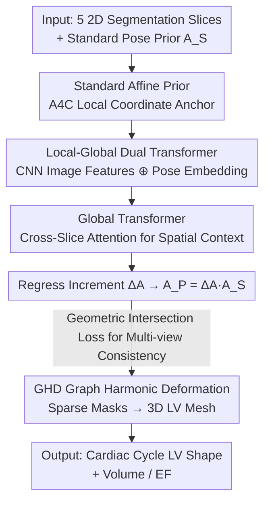

# EchoPOSE: 6D Pose Estimation of Sparse Echocardiograms for Left-Ventricular 3D Shape Reconstruction

**Conference**: CVPR 2026  
**Paper**: [CVF Open Access](https://openaccess.thecvf.com/content/CVPR2026/html/Iijima_EchoPOSE_6D_Pose_Estimation_of_Sparse_Echocardiograms_for_Left_Ventricular_3D_CVPR_2026_paper.html)  
**Code**: None  
**Area**: Medical Imaging  
**Keywords**: Echocardiography, 6D Pose Estimation, Left Ventricular 3D Reconstruction, Transformer, Geometric Consistency Loss  

## TL;DR
This paper proposes EchoPOSE, a Transformer-based network that automatically regresses the 6D pose (3 translations + 3 rotations) of 5 sparse 2D ultrasound slices typically collected in clinical practice. By feeding the posed segmentation masks into a Graph Harmonic Deformation (GHD) algorithm, the 3D shape of the left ventricle (LV) is reconstructed across the cardiac cycle. On synthetic MITEA data, it achieves a pose error of 3.78 mm / 8.65°, 87.5% Dice, and 1.44% Ejection Fraction (EF) error, outperforming the clinical gold standard Simpson’s biplane method without any external tracking hardware.

## Background & Motivation

**Background**: 2D echocardiography is the most widely used cardiac imaging modality due to its safety, low cost, and real-time nature. However, it produces a set of **2D slices with unknown spatial relationships**. To obtain more accurate cardiac function quantification (volume, EF) than 2D methods, 3D ultrasound is required, but 3D probes are rarely used clinically due to operation and visualization difficulties. A compromise is to use 3D reconstruction algorithms to "assemble" the heart shape from 2D slices.

**Limitations of Prior Work**: Reconstruction algorithms require the **position and orientation (6D pose) of each 2D slice in a unified coordinate system**, but standard 2D scans do not record this. The most direct remedy is using external hardware—IMUs or electromagnetic trackers—but these suffer from drift, calibration errors, interference from patient breathing/motion, and are difficult to integrate into clinical workflows. Another approach simply assumes each standard view (A4C, A2C, etc.) sits at a **fixed standard pose**, but real freehand scanning varies significantly, leading to large errors (this baseline achieved only 64% Dice in the paper).

**Key Challenge**: The poses of sparse, freehand 2D ultrasound slices are neither recorded by sensors nor can be assumed to be fixed standard views. Previous pose estimation methods often assume predefined view sets, depend on dense volumetric data, or handle frames locally while **ignoring global spatial relationships between slices**—assumptions that fail for freehand ultrasound with high geometric irregularity and operator dependence.

**Goal**: To decompose the problem into two sub-problems: (1) accurately estimating the 6D pose of each sparse slice based only on 2D image content without external sensors; (2) driving a 3D reconstruction algorithm with the estimated poses to accurately calculate LV shape and clinical metrics.

**Key Insight**: Since a single slice contains insufficient information, the network should **simultaneously observe local image features and global context across slices**. Standard views share fixed anatomical geometric relationships (e.g., intersecting near the apical axis). Utilizing these intersection relationships can resolve single-view ambiguities and serve as a supervision signal for pose consistency.

**Core Idea**: A network using "local features + global Transformer context" regresses pose increments, constrained by a **geometric-aware loss punishing inconsistencies at slice intersections**, followed by differentiable GHD deformation for sparse reconstruction.

## Method

### Overall Architecture

The pipeline transforms "5 2D segmentation masks without poses → one 3D left ventricle" in three steps: first, assigning a **standard pose hypothesis** (geometric prior) to each slice; then, the EchoPOSE network observes image content to **correct** this hypothesis into a real 6D pose; finally, the posed masks are passed to the GHD algorithm to deform a 3D mesh.

Specifically, the input consists of 5 clinical standard views: Apical 4-Chamber (A4C), Apical 3-Chamber (A3C), Apical 2-Chamber (A2C), Short-Axis Apex (SAXA), and Short-Axis Base (SAXB). Poses are **anchored in the local coordinate system of the A4C slice**. A4C is fixed as the reference, and others are defined relative to it. This reduces the problem from "estimating global coordinates" to "estimating relative offsets," significantly lowering learning difficulty. The pose of each slice is denoted as an affine $A=[x,y,z,\alpha,\beta,\gamma]$ (axis-angle rotation). The network regresses an **increment** $\Delta A$, which is converted into a $4 \times 4$ affine matrix and multiplied with the initial standard prior $A_S$ to obtain the predicted pose $A_P$.

### Key Designs

**1. Local-Global Dual Transformer Pose Regression: Leveraging Global Context**

Sparse slices have inherent pose ambiguity, leading to high errors in frame-local methods (e.g., Freitas et al. at 10.83 mm / 15.04°). EchoPOSE uses a two-level Transformer. Each mask passes through a CNN backbone for spatial features and an MLP for pose embeddings of its 6D hypothesis. These are concatenated and refined by a **Small Local Transformer** with self-attention, then a cross-attention layer queries a learnable patch codemap to generate local descriptors. All five descriptors are **stacked into a larger Global Transformer Encoder**, which captures geometric relationships (intersection points, relative angles) via cross-token attention. Finally, concatenated local and global descriptors pass through an FC layer to regress the 6D increment $\Delta A$. Ablations show both levels are essential: adding the Local Transformer improved Dice from 68.2% to 77.1%, and adding the Global Transformer pushed it to 84.3%.

**2. Geometric Intersection Loss: Ensuring Multi-view Consistency**

Regressing 6D parameters ($L_{6D}$ loss) ensures individual slices are close to ground truth but doesn't guarantee **geometric self-consistency** as a group. The paper introduces an intersection loss $L_{Intersec}$: for each pair of slices $(i,j)$ that should intersect in 3D, the intersection line is calculated and mapped back to local coordinates via inverse affines. $K=100$ points are sampled along the line, and intensities $I_i(p_{i,k})$ and $I_j(p_{j,k})$ are extracted via bilinear interpolation to minimize their mean squared error:

$$L_{Intersec}=\frac{1}{|P|}\sum_{(i,j)\in P}\frac{1}{K}\sum_{k=1}^{K}\left[I_i(p_{i,k})-I_j(p_{j,k})\right]^2$$

The intuition is that two slices must observe the same myocardium/cavity at their intersection. This loss improved Dice from 84.3% to 87.5% and reduced pose error to 3.78 mm / 8.65°.

**3. GHD Graph Harmonic Deformation + Differentiable Slicing Supervision**

Reconstructing 3D shapes from sparse inputs is challenging. Unlike voxel-based methods that suffer from artifacts or implicit representations requiring dense data, this method uses Graph Harmonic Deformation (GHD). It starts with a template LV mesh, performs rigid registration using Coherent Point Drift (CPD), and then parameterizes deformation in the **spectral domain** using Fourier coefficients. High-frequency components are discarded to ensure smoothness. Crucially, the process is **end-to-end differentiable** via Differentiable Voxelization and Slicing (DVS), allowing 2D slice supervision of the 3D mesh. Compared to OReX (dense SDF), GHD achieved 87.5% Dice versus OReX's 69.3%, proving template deformation is superior for sparse scenarios.

### Loss & Training
The pose network uses $L_{POSE}=w_{6D}L_{6D}+w_{Intersec}L_{Intersec}$ ($w_{6D}=1.0$, $w_{Intersec}=0.1$). Training data is generated by slicing 5 standard views from MITEA 3D ultrasound volumes with random perturbations: translations in $[-20, 20]$ mm and rotations in $[-15, 15]^\circ$. 200 view combinations per volume were sampled, totaling 42,800 training samples. Optimized with AdamW, 50 epochs, batch size 32, on a single RTX 4070 (16 GB).

## Key Experimental Results

### Main Results (Pose + Reconstruction + Clinical Metrics)

Evaluated on 26 held-out scans (14 healthy / 12 diseased, 260 slices), compared against Freitas et al., a fixed prior baseline, and the Simpson's biplane gold standard:

| Dataset / Method | $d_{3D}$ (mm)↓ | $\theta_{3D}$ (°)↓ | 3D Dice↑ | Vol. Error%↓ | EF Error%↓ |
|---|---|---|---|---|---|
| Freitas et al. [7] | 10.83 | 15.04 | — | — | — |
| MITEA · Simpson Biplane | — | — | — | — | 2.98 |
| MITEA · GHD (Assumed $A_S$) | 15.65 | 12.58 | 64.31 | 18.78 | 13.36 |
| **MITEA · EchoPOSE + GHD** | **3.78** | **8.65** | **87.52** | **3.03** | **1.44** |
| MITEA+AI · GHD (Assumed) | 15.65 | 12.58 | 60.89 | 23.83 | 45.67 |
| **MITEA+AI · EchoPOSE + GHD** | **4.53** | **9.68** | **83.82** | **5.44** | **3.29** |
| Routine TTE · Simpson Biplane | — | — | — | 17.15 | 9.35 |
| **Routine TTE · EchoPOSE + GHD** | — | — | **78.04** | **4.22** | **6.46** |

Key takeaway: EchoPOSE reduces pose error significantly compared to the 10.83 mm baseline. In real freehand TTE, it reduces volume error from Simpson's 17.15% to 4.22% and EF error from 9.35% to 6.46%, which is clinically significant for diagnostic boarderline cases.

### Ablation Study

| AS | TL | TG | $L_{Intersec}$ | Recon | $d_{3D}$↓ | $\theta_{3D}$↓ | 3D Dice↑ | EF%↓ |
|---|---|---|---|---|---|---|---|---|
| ✓ | — | — | — | GHD | 13.84 | 17.78 | 68.20 | 12.93 |
| ✓ | ✓ | — | — | GHD | 11.02 | 11.05 | 77.08 | 3.56 |
| ✓ | ✓ | ✓ | — | GHD | 4.62 | 9.50 | 84.32 | 1.91 |
| ✓ | ✓ | ✓ | ✓ | **GHD** | **3.78** | **8.65** | **87.52** | **1.44** |

(AS = Affine Prior, TL = Local Transformer, TG = Global Transformer)

### Key Findings
- **Global Transformer is the main contributor**: Adding TG to the TL-only baseline reduced orientation error $\theta_{3D}$ from 11.05° to 9.50°. Cross-slice context is key for orientation.
- **Reconstruction algorithm is critical**: Replacing GHD with OReX+marching cubes caused Dice to drop from 87.5% to 69.3%. Spectral-domain smoothing is superior to SDF extrapolation for sparse data.
- **Robustness to view count**: Using 3 apical views (A4C+A2C+A3C) already achieves 85.7% Dice and 1.45% EF error, suggesting the method works even when clinical views are incomplete.

## Highlights & Insights
- **Turning "No Pose Information" into a learning problem**: Instead of adding hardware, the method learns from image content and geometric priors. Anchoring in the A4C coordinate system is a clever way to reduce dimensionality.
- **Intersection loss as a transferable self-supervision**: Any group of supposedly intersecting views can use this "consistency along intersection lines" constraint, providing a label-free signal for multi-view calibration.
- **Clinical Value**: By being robust to non-standard probe placements and missing views, this method lowers the skill barrier for ultrasound, allowing less-trained personnel to acquire scans suitable for 3D quantification.

## Limitations & Future Work
- **Dependency on segmentation**: The network processes LV segmentation masks rather than raw ultrasound. Performance degrades when AI segmentation (nnU-Net) quality drops.
- **Sim-to-real gap**: Training relies on synthetic data from 3D volumes. Real TTE performance (78% Dice) is notably lower than synthetic performance (87.5% Dice).
- **Fixed Prior Dependency**: Relative angles and translations in the standard prior are fixed, which may mismatch with severe anatomical abnormalties.

## Related Work & Insights
- **vs Freitas et al. [7]**: They predict intersection heatmaps but require heavy post-processing. EchoPOSE is end-to-end and leverages global context via Transformers.
- **vs Simpson’s Biplane Method**: Simpson assumes idealized geometry; EchoPOSE reconstructs true 3D shapes, reducing volume error from 17% to 4%.
- **vs SDF Reconstruction (OReX)**: SDF methods focus on extrapolation and are computationally expensive. GHD uses template-based smoothing, which is more robust for sparse clinical samples.

## Rating
- Novelty: ⭐⭐⭐⭐⭐ Combines image-driven 6D pose estimation with differentiable GHD for sparse LV reconstruction; clever use of intersection loss.
- Experimental Thoroughness: ⭐⭐⭐⭐ Solid validation across synthetic, AI-integrated, and real TTE data, though real-world clinical samples are limited to 18 healthy cases.
- Writing Quality: ⭐⭐⭐⭐⭐ Exceptionally clear logic, comprehensive charts, and well-justified clinical significance.
- Value: ⭐⭐⭐⭐⭐ High potential for lowering ultrasound operation barriers and improving quantification accuracy without additional hardware.

<!-- RELATED:START -->

## Related Papers

- [\[CVPR 2026\] GaussianPile: A Unified Sparse Gaussian Splatting Framework for Slice-based Volumetric Reconstruction](gaussianpile_a_unified_sparse_gaussian_splatting_framework_for_slice-based_volum.md)
- [\[ECCV 2024\] Shape-Guided Configuration-Aware Learning for Endoscopic-Image-Based Pose Estimation of Flexible Robotic Instruments](../../ECCV2024/medical_imaging/shape-guided_configuration-aware_learning_for_endoscopic-image-based_pose_estima.md)
- [\[CVPR 2026\] Prospective Dynamic 3D MRI Reconstruction via Latent-Space Motion Tracking from Single Measurement](prospective_dynamic_3d_mri_reconstruction_via_latent-space_motion_tracking_from_.md)
- [\[ICLR 2026\] NAB: Neural Adaptive Binning for Sparse-View CT Reconstruction](../../ICLR2026/medical_imaging/nab_neural_adaptive_binning_for_sparse-view_ct_reconstruction.md)
- [\[CVPR 2026\] Real2Sim2Real: RetinalDepth-64K for Depth Estimation in Posterior Segment Ophthalmic Surgery](real2sim2real_retinaldepth-64k_for_depth_estimation_in_posterior_segment_ophthal.md)

<!-- RELATED:END -->
## Related Papers

- [\[CVPR 2026\] GaussianPile: A Unified Sparse Gaussian Splatting Framework for Slice-based Volumetric Reconstruction](gaussianpile_a_unified_sparse_gaussian_splatting_framework_for_slice-based_volum.md)
- [\[ECCV 2024\] Shape-Guided Configuration-Aware Learning for Endoscopic-Image-Based Pose Estimation of Flexible Robotic Instruments](../../ECCV2024/medical_imaging/shape-guided_configuration-aware_learning_for_endoscopic-image-based_pose_estima.md)
- [\[CVPR 2026\] Prospective Dynamic 3D MRI Reconstruction via Latent-Space Motion Tracking from Single Measurement](prospective_dynamic_3d_mri_reconstruction_via_latent-space_motion_tracking_from_.md)
- [\[CVPR 2026\] Real2Sim2Real: RetinalDepth-64K for Depth Estimation in Posterior Segment Ophthalmic Surgery](real2sim2real_retinaldepth-64k_for_depth_estimation_in_posterior_segment_ophthal.md)
- [\[CVPR 2026\] Depth Any Endoscopy: Towards Self-Supervised Generalizable Depth Estimation in Monocular Endoscopy](depth_any_endoscopy_towards_self-supervised_generalizable_depth_estimation_in_mo.md)

<!-- RELATED:END -->
