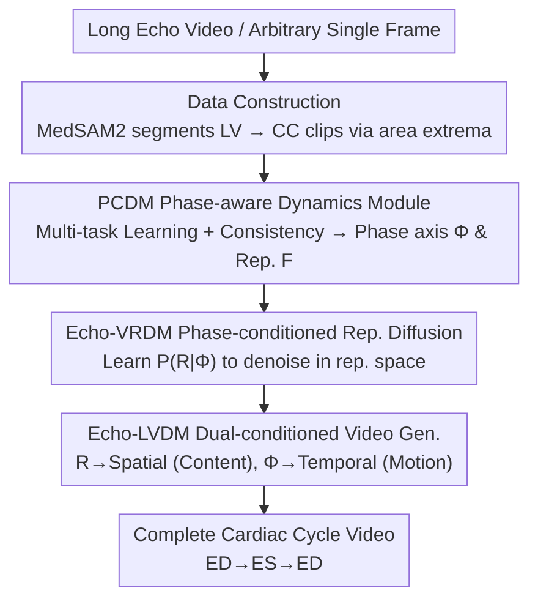

# EchoVDiff: Cardiac-Cycle Echocardiography Video Generation from Arbitrary Single Frame

**Conference**: CVPR 2026  
**Paper**: [CVF Open Access](https://openaccess.thecvf.com/content/CVPR2026/html/Zhang_EchoVDiff_Cardiac-Cycle_Echocardiography_Video_Generation_from_Arbitrary_Single_Frame_CVPR_2026_paper.html)  
**Code**: https://github.com/JsongZhang/Echo-V-Diff  
**Area**: Medical Imaging / Diffusion Models / Video Generation  
**Keywords**: Echocardiography, Cardiac Cycle, Phase-aware, Representation Diffusion, Single-frame Driven Video Generation  

## TL;DR
EchoVDiff explicitly equips echocardiogram video generation with a "cardiac phase axis." By fitting left ventricular area changes into a continuous cyclic phase via multi-task learning, and then using two phase-conditioned diffusion models to reconstruct physiologically consistent ED→ES→ED cardiac cycle videos from an **arbitrary single frame**, it reduces FVD from 630 to 535 on EchoNet-Dynamic.

## Background & Motivation
**Background**: Echocardiography (Echo) is the primary non-invasive, real-time tool for assessing cardiac structure and function. Downstream tasks like chamber segmentation and ejection fraction (EF) estimation rely on **complete, standard, and high-quality** video input. However, clinical acquisition is highly operator-dependent, leading to significant variations in video quality, views, and cycle coverage. Consequently, researchers seek generative models to "complete" cardiac videos from single frames.

**Limitations of Prior Work**: Existing image-to-video (I2V) methods (e.g., DynamiCrafter, Ultrasound-I2V) almost exclusively synthesize motion **unidirectionally forward** along the temporal axis, treating time as a simple frame index. This leads to two major flaws: first, they can only generate from the first frame (usually End-Diastole, ED), failing to reconstruct a full cycle from an arbitrary phase; second, they fail to model the **intrinsic periodicity** of cardiac motion, resulting in insufficient temporal coherence and semantic consistency.

**Key Challenge**: The cardiac cycle is not a uniform loop—the systolic phase (ED→ES, ~1/3 of the cycle) and diastolic phase (ES→ED, ~2/3 of the cycle) are **asymmetric**. Treating physical time directly as phase loses this asymmetric rhythm and prevents the generation process from "knowing" whether it is currently in systole or diastole.

**Goal**: To reconstruct a complete, physiologically plausible cardiac cycle from an **arbitrary single frame**. The authors decompose this into two steps: learning a consistent mapping between temporal dynamics and physiological states, and embedding this consistency into the generative process.

**Core Idea**: Construct an **explicit, learnable cyclic phase axis $\Phi$** to align visual dynamics with physiological states; the diffusion model serves as a carrier to demonstrate that "controllable, physiologically consistent synthesis is achievable with this axis."

## Method

### Overall Architecture
EchoVDiff is a **three-stage serial** framework focused on a consistent phase axis $\Phi$. The input is an arbitrary single echocardiogram frame, and the output is a complete ED→ES→ED cardiac cycle video.

Data preparation involves using the medical foundation model **MedSAM2** to perform left ventricular (LV) segmentation on long videos, then partitioning multi-cycle videos into **cardiac cycle (CC) clips** based on LV area extrema (ED/ES). Following this, three stages work in sequence: ① **PCDM** (Phase-aware Cardiac Dynamics Module) uses multi-task learning and physiological self-consistency constraints to train a universal video encoder $E$ into a "phase-aware encoder," producing per-frame phase $\Phi$ and phase-decodable representations $F$; ② **Echo-VRDM** learns the phase-conditioned distribution $P(R\mid\Phi)$ in representation space, allowing the model to sample a representation sequence from noise; ③ **Echo-LVDM** injects representation $R$ (content) and phase $\Phi$ (motion) into the spatial and temporal layers of a pre-trained video diffuser, respectively, to generate high-fidelity, phase-controllable videos in pixel space.

### Key Designs

**1. PCDM: Replacing "Time Index" with a Learnable Cyclic Phase Axis**

Addressing the limitation of treating time as a simple frame index, PCDM uses a shared video encoder $E$ to extract spatio-temporal features $F=E(I)$, followed by three parallel heads for multi-task learning: LV segmentation, LV area regression, and phase regression. The area is not predicted independently but is calculated via a differentiable sum of the predicted mask $\hat{A}_t=\sum_{x,y}\hat{M}_t(x,y)$, coupling segmentation geometry with the area curve.

Crucially, an **asymmetric temporal warping function** maps normalized physical time $\tau_t$ to a symmetric phase $\theta_t\in[0,2\pi)$:

$$\theta_t = W(\tau_t,\alpha)=\begin{cases}\pi\cdot\dfrac{\tau_t}{\alpha}, & \tau_t\in[0,\alpha]\ (\text{Systole})\\[6pt]\pi\left(\dfrac{\tau_t-\alpha}{1-\alpha}+1\right), & \tau_t\in(\alpha,1]\ (\text{Diastole})\end{cases}$$

This stretches the unequal systolic/diastolic phases ($\alpha\approx 1/3$) into equal phase intervals $[0,\pi)$ and $[\pi,2\pi)$, anchoring ED at $0/2\pi$ and ES at $\pi$. To avoid discontinuity at $0/2\pi$, phase is represented as points on a unit circle $y_t=(\cos\theta_t, \sin\theta_t)$, and the regression head minimizes the L2 distance to the ground truth, creating a **cyclic phase manifold** that distinguishes systole from diastole.

**2. Physiological Self-consistency: Mutual Constraints between Phase and Area without Extra Labels**

To establish a **causal relationship** between phase evolution and LV contraction-diastole, the authors introduce self-consistency constraints that require no external labels: ① **Monotonicity constraint**—using the sine component of the predicted phase $\hat{s}_t$ to partition the cycle and penalizing area differences $\Delta\hat{A}_t$ via $L_{mono}$ to ensure area decreases during systole and increases during diastole; ② **ED/ES Alignment**—using soft-argmax to find area extrema and aligning them to phase $\theta=0$ and $\theta=\pi$ via cosine distance $L_{peak}$; ③ **Area-Phase Mapping**—fitting a MLP $g_\omega$ to the nonlinear mapping $\tilde{A}_t=g_\omega(\hat{y}^{norm}_t)$ to ensure all $(\hat{A}_t,\hat{y}^{norm}_t)$ pairs lie on a learnable curve.

**3. Echo-VRDM: Phase-conditioned Denoising in Representation Space**

To enable de novo synthesis, Echo-VRDM models the distribution in a compact, semantically structured representation space. Per-frame features $F$ are pooled into $D$-dimensional vectors $r_t$ to form sequence $R_0$, and the model learns $P(R_0\mid\Phi)$. The denoising network is a Transformer using temporal self-attention and phase-conditioned cross-attention. Cycle phase $\phi_t$ is injected via cross-attention, while diffusion step $k$ modulates layers via **adaLN**.

**4. Echo-LVDM: Decoupling Content and Motion**

Echo-LVDM fine-tunes a pre-trained VideoLDM using a **dual-condition decoupling** strategy: semantic representation $R$ is injected into **spatial layers** to control anatomical content (replacing text cross-attention), while phase embedding $\Phi$ is injected into **temporal layers** via a new Temporal Cross-Attention module to control motion rhythm. Only the newly injected modules $\Psi$ are fine-tuned.

### Loss & Training
PCDM is trained end-to-end with AdamW. Echo-VRDM uses a Transformer with 1000 diffusion steps and phase-conditioned classifier-free guidance (CFG). Echo-LVDM freezes the U-Net backbone, training only projection layers and temporal cross-attention.

## Key Experimental Results

### Main Results
Evaluated on EchoNet-Dynamic and EchoNet-Pediatric using FVD, FID, tLPIPS, and tSSIM. EchoVDiff outperforms existing methods in single-frame driven generation.

EchoNet-Dynamic Main Results:

| Method | FVD↓ | FID↓ | tLPIPS↓ | tSSIM↑ |
|------|------|------|---------|--------|
| DynamiCrafter (ECCV'24) | 869.70 | 102.67 | 0.331 | 0.753 |
| Ultrasound-I2V (MICCAI'24) | 683.39 | 84.76 | 0.261 | 0.785 |
| VTG (ICCV'25) | 630.78 | 78.92 | 0.245 | 0.799 |
| **EchoVDiff (Ours)** | **535.61** | **71.34** | **0.218** | **0.821** |

Compared to the second-best VTG, EchoVDiff reduces FVD by 15.1% and FID by 9.6%.

Robustness to arbitrary frames: Performance remains nearly constant regardless of whether the prompt frame is from ED, ES, or late diastole (FVD 535.61 vs. 542.17 vs. 540.88).

### Ablation Study
Ablating Phase $\Phi$ and Representation $R$ on EchoNet-Dynamic:

| Configuration | Phase $\Phi$ | Rep. $R$ | FVD↓ | FID↓ |
|------|---------|--------|------|------|
| (A) Baseline Unconditioned | | | 1050.32 | 115.40 |
| (B) Phase Only | ✓ | | 710.22 | 92.15 |
| (C) Rep. Only | | ✓ | 612.45 | 78.50 |
| (D) Full Model | ✓ | ✓ | 535.61 | 71.34 |

### Key Findings
- **Complementary Conditions**: Phase primarily improves temporal coherence, while representation improves spatial fidelity and implicit dynamics.
- **Phase Axis Benefits**: The phase-aware representation allows the model to escape dependency on a fixed starting point.
- **Reader Study**: A double-blind study with three cardiologists gave EchoVDiff the highest scores in visual quality, anatomical fidelity, and temporal consistency.

## Highlights & Insights
- **Explicit modeling of "Time" as a physiological phase axis** is the most significant innovation. Using $W(\tau,\alpha)$ to normalize asymmetric phases and unit circle points to avoid atan2 instability is both physiologically sound and numerically stable.
- **Physiological self-consistency requires no external labels**, acting as "free supervision" by leveraging physical common sense.
- **Decoupled injection** of $R$ into spatial layers and $\Phi$ into temporal layers ensures that "what it looks like" and "how it moves" are handled by distinct parts of the U-Net.

## Limitations & Future Work
- Lack of pixel-level physiological quantitative validation (e.g., assessing generated video EF accuracy).
- Strong dependency on MedSAM2 pseudo-label quality and EchoFM pre-training; robustness to very low-quality clinical inputs remains to be fully explored.
- The fixed $\alpha=1/3$ may not account for heart rate variations or specific pathologies (e.g., heart failure) where the systole-diastole ratio changes.
- The serial three-stage training process is heavy; end-to-end joint training could be explored.

## Related Work & Insights
- **vs Ultrasound-I2V / VTG**: These rely on unidirectional generation and fixed starting points. EchoVDiff supports **arbitrary single-frame** driving with superior FVD.
- **vs DynamiCrafter / VideoCrafter**: General models lack cardiac cycle knowledge. The core difference here is the embedding of physiological priors into the phase axis.
- **vs RCG**: Borrowed the concept of "diffusion in representation space" but extended it to **phase-conditioned** generation $P(R\mid\Phi)$.

## Rating
- Novelty: ⭐⭐⭐⭐⭐ 
- Experimental Thoroughness: ⭐⭐⭐⭐ 
- Writing Quality: ⭐⭐⭐⭐ 
- Value: ⭐⭐⭐⭐⭐ 

<!-- RELATED:START -->

## Related Papers

- [\[CVPR 2026\] OSA: Echocardiography Video Segmentation via Orthogonalized State Update and Anatomical Prior-aware Feature Enhancement](osa_echocardiography_video_segmentation_via_orthogonalized_state_update_and_anat.md)
- [\[CVPR 2026\] Semi-supervised Echocardiography Video Segmentation via Anchor Semantic Awareness and Continuous Pseudo-label Reforging](semi-supervised_echocardiography_video_segmentation_via_anchor_semantic_awarenes.md)
- [\[CVPR 2026\] Unleashing Video Language Models for Fine-grained HRCT Report Generation](unleashing_video_language_models_for_fine-grained_hrct_report_generation.md)
- [\[NeurIPS 2025\] A Unified Solution to Video Fusion: From Multi-Frame Learning to Benchmarking](../../NeurIPS2025/medical_imaging/a_unified_solution_to_video_fusion_from_multi-frame_learning_to_benchmarking.md)
- [\[CVPR 2026\] URICA: A Uniformity Region Affine Identifier Capture Algorithm for Arbitrary Region Retrieval in Pathology Images](urica_a_uniformity_region_affine_identifier_capture_algorithm_for_arbitrary_regi.md)

<!-- RELATED:END -->
