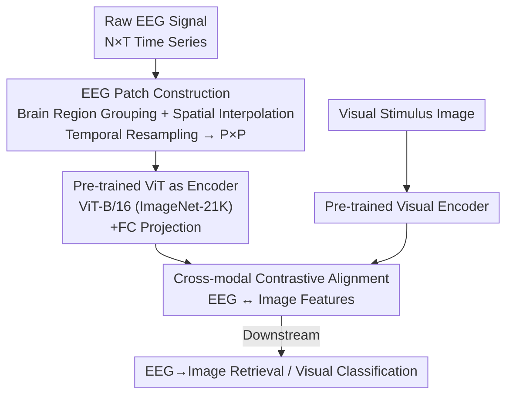

# EEGiT: Teaching Vision Transformers to Understand the EEG signal

**Conference**: CVPR 2026  
**Paper**: [CVF Open Access](https://openaccess.thecvf.com/content/CVPR2026/html/Zhou_EEGiT_Teaching_Vision_Transformers_to_Understand_the_EEG_signal_CVPR_2026_paper.html)  
**Code**: Not disclosed  
**Area**: Brain Signal Decoding / Medical Imaging  
**Keywords**: EEG Decoding, Vision Transformer, Cross-modal Alignment, Visual Prior Transfer, Brain-Computer Interface  

## TL;DR
EEGiT "paints" 1D EEG time-series signals into 2D EEG patches similar to image patches. This allows a ViT pre-trained on ImageNet-21K to be directly used as an EEG encoder, leveraging visual priors from the image domain to alleviate EEG data scarcity. It achieves SOTA performance in both THINGS-EEG retrieval and EEG-3D classification.

## Background & Motivation
**Background**: Decoding what a person sees from non-invasive brain signals is a core task in Brain-Computer Interface (BCI). Compared to fMRI, EEG has high temporal resolution and is cheaper to acquire, making it a more practical medium. Standard approaches treat EEG as raw time-series sequences $e \in \mathbb{R}^{N \times T}$ ($N$ electrodes, $T$ time points), training a custom EEG encoder from scratch or using masked self-supervised pre-training (e.g., LaBraM's vector-quantized tokenizer, ATM-S's channel attention + spatio-temporal convolution), and then projecting EEG and visual features into the same latent space for contrastive alignment.

**Limitations of Prior Work**: EEG paired datasets are extremely small—incomparable to the massive scale of images—leading to encoders trained from scratch failing to learn rich semantics. Worse, EEG has a very low signal-to-noise ratio (SNR), significant inter-subject variability, and varying acquisition devices and preprocessing protocols across datasets, resulting in severe overfitting and poor cross-subject/cross-dataset generalization.

**Key Challenge**: The image domain has powerful ready-made architectures and large-scale pre-trained models, while the EEG domain lacks standardized modeling frameworks and universal pre-trained representations. Every paper reinvents an EEG encoder from zero. Small data $\rightarrow$ no pre-training $\rightarrow$ weak representations, forming a vicious cycle.

**Goal**: To bypass the "no large-scale pre-training for EEG" bottleneck by directly transferring pre-trained visual priors (especially ViT) from the image domain to EEG tasks.

**Key Insight**: ViT partitions images into sequences of patch tokens for self-attention, essentially consuming a "structured 2D grid." If EEG signals can be reorganized into a form isomorphic to image patches, pre-trained ViT can be directly reused—the main obstacle being that the $N \times T$ dimensions of EEG are inconsistent and do not match the $224 \times 224 \times 3$ image format.

**Core Idea**: Represent EEG as "image-like EEG patches," using a pre-trained ViT directly as the EEG encoder, and pulling EEG features into the visual feature space via contrastive learning.

## Method

### Overall Architecture
The input to EEGiT is a raw EEG recording $e \in \mathbb{R}^{N \times T}$ and its corresponding visual stimulus image $v$. The output is aligned EEG and image features in a shared latent space $\mathcal{H}$, used downstream for EEG-to-image retrieval and EEG visual classification. The critical shift in the pipeline is: **transforming 1D EEG time-series signals into a 2D structure resembling image patches, then letting a pre-trained ViT encode it as if it were an image**, allowing visual priors learned in the image domain to transfer directly to neural signals.

The process consists of four steps: ① Z-score normalization of EEG to align numerical distributions with images; ② Grouping electrodes by brain region and applying linear interpolation along the spatial dimension, followed by uniform resampling along the temporal dimension to form $P \times P$ EEG patches, duplicated thrice for RGB channels; ③ Feeding EEG patches into a ViT-B/16 (ImageNet-21K pre-trained) encoder followed by a fully connected layer for projection; ④ Aligning EEG features with image features extracted by a frozen pre-trained visual encoder using contrastive loss.

### Key Designs

**1. EEG Patch: Rearranging 1D Brain Signals into 2D Grids Isomorphic to Image Patches**

This is the foundation of the work, addressing the issue that EEG dimensions $N \times T$ are inconsistent and cannot be consumed by ViT. Instead of a simple reshape, the authors reorganize signals based on **brain anatomy**. First, global z-score normalization $\hat y = (y - \mu) / \sigma$ is applied to align EEG scales with images. Electrodes are then grouped into five functional regions: frontal, central, temporal, parietal, and occipital. Since the number of electrodes $N_r$ varies per region, linear interpolation is used along the **spatial dimension** to resample each region to $P$ electrodes: for the $i$-th new position, $x_i = i \cdot \frac{N_r-1}{P-1}$, with $j = \lfloor x_i \rfloor$ and $\alpha_i = x_i - j$, obtaining $y_i' = (1-\alpha_i) y_j + \alpha_i y_{j+1}$. Simultaneously, signals are uniformly resampled along the **temporal dimension** and sliced into $P$ frames, stacked into non-overlapping $P \times P$ EEG patches.

This design serves two purposes: **Structural alignment** ensures EEG patch dimensions ($P \times P \times 3$) match standard ViT inputs, and **semantic fidelity** ensures that grouping by brain region preserves neurophysiologically meaningful spatial topology (e.g., the occipital lobe handles vision). Visualization shows that representing time on the horizontal axis and brain regions on the vertical axis reveals distinct, discernible texture patterns in EEG signals.

**2. Reusing Pre-trained ViT as EEG Encoder: Transferring Visual Priors to the Neural Domain**

To break the cycle of weak encoders, a 12-layer ViT-B/16 pre-trained on ImageNet-21K is used as the EEG encoder. With patch size $P=16$, ViT processes EEG patches as tokens, applies self-attention to model interactions, and outputs EEG representations. A final projection layer maps the 768-dimensional output to 1024 dimensions.

This is effective because the low-level texture and high-level semantic priors learned by ViT on millions of images function as a powerful "structured grid feature extractor." Using these weights as a starting point suppresses overfitting on small EEG datasets and reduces inter-subject bias compared to random initialization. Abolition studies show a significant performance drop without pre-trained weights, and training curves demonstrate stability at 10 epochs versus 20 for random initialization.

**3. Cross-modal Contrastive Alignment and Task-specific Training**

For **EEG-to-image retrieval**, a symmetric cross-entropy contrastive loss ($\tau = 0.07$, following CLIP) is used:

$$\mathcal{L}_C(f_V, f_E) = -\mathbb{E}_{(v, e)} \log \frac{\exp(f_V(v)^\top f_E(e) / \tau)}{\mathbb{E}_{e^-} \exp(f_V(v)^\top f_E(e^-) / \tau)} - \mathbb{E}_{(v, e)} \log \frac{\exp(f_V(v)^\top f_E(e) / \tau)}{\mathbb{E}_{v^-} \exp(f_V(v^-)^\top f_E(e) / \tau)}$$

It bidirectionally pulls matching pairs together. For **EEG-3D object/color classification**, the Neuro-3D framework is adopted, combining contrastive loss with MSE: $\mathcal{L}_A = \alpha \mathcal{L}_C(f_V, f_E) + (1-\alpha) \text{MSE}(f_V, f_E)$, plus auxiliary cross-entropy for shape and color: $\mathcal{L} = \mathcal{L}_A + \lambda \mathcal{L}_{CE}$.

### Loss & Training
Retrieval was trained on THINGS-EEG for 100 epochs, batch size 1024, learning rates $5 \times 10^{-5}$ for EEG and $5 \times 10^{-6}$ for visual encoders, using AdamW. EEG-3D classification used batch size 128 and initial learning rate $1 \times 10^{-3}$. All experiments were conducted on an RTX A6000.

## Key Experimental Results

### Main Results

EEG-to-image retrieval on THINGS-EEG (Average of 10 subjects, in %):

| Setting | Metric | EEGiT | Best Baseline | Gain |
| :--- | :--- | :--- | :--- | :--- |
| Inter-subject | top-1 | 24.0 | 12.4 (UBP) | +11.6 |
| Inter-subject | top-5 | 55.6 | 33.7 (ATM-S) | +21.9 |
| Intra-subject | top-1 | 70.4 | 48.0 (UBP) | +22.4 |
| Intra-subject | top-5 | 95.1 | 80.6 (UBP) | +14.5 |

Visual classification on EEG-3D (in %):

| Task | Metric | EEGiT | Neuro-3D | Gain |
| :--- | :--- | :--- | :--- | :--- |
| Object (72 classes) | top-1 | 5.95 | 5.91 | +0.04 |
| Object | top-5 | 16.50 | 16.30 | +0.20 |
| Color (6 classes) | top-1 | 41.32 | 39.93 | +1.39 |
| Color | top-2 | 66.94 | 61.40 | +5.54 |

EEGiT significantly leads in retrieval tasks; gains in object classification are marginal, though color classification shows meaningful improvement.

### Ablation Study
Decomposing "Pre-trained ViT weights" and "EEG patch representation" (THINGS-EEG, in %):

| Pre-trained ViT | EEG Patch | Inter top-1 | Inter top-5 | Intra top-1 | Intra top-5 |
| :---: | :---: | :---: | :---: | :---: | :---: |
| ✓ | ✓ | 24.0 | 55.6 | 70.4 | 95.1 |
| ✗ | ✓ | 19.5 | 46.8 | 63.6 | 90.7 |
| ✓ | ✗ | 18.7 | 42.1 | 54.0 | 81.8 |
| ✗ | ✗ | 17.4 | 39.9 | 41.8 | 76.8 |

### Key Findings
- **Components are complementary and indispensable**: Removing either the patch representation or pre-trained weights significantly degrades performance.
- **Pre-training leads to faster and more stable convergence**: Stability reached in 10 epochs vs 20 for scratch training, with lower variance across subjects.
- **Occipital lobe + early time window are critical**: Spatio-temporal analysis shows the strongest response in the occipital region during early stages, consistent with visual processing in neuroscience.
- **Inter-subject generalization improvement is prominent**: Inter-subject top-1 nearly doubled compared to the best baseline, confirming that visual priors effectively mitigate subject-specific bias.

## Highlights & Insights
- **The "change representation, not model" strategy is clever**: Instead of designing new architectures for EEG, the input data is adapted to fit existing ViTs.
- **Brain grouping + interpolation preserves neurophysiological structure**: Grouping by functional regions minimizes cross-channel distribution variance while maintaining spatial topology.
- **Reusable trick**: The paradigm of "aligning non-standard time-series to image-isomorphic grids $\rightarrow$ reusing vision foundation models" is transferable to other data-scarce biological signals like ECG or EMG.

## Limitations & Future Work
- **Limited gain in fine-grained object classification**: Object recognition on EEG-3D improved by only 0.04% top-1, indicating that decoding fine semantics remains difficult. Visual priors help more with low-level attributes like color.
- **Reliance on manual brain region grouping**: Manual division and linear interpolation may not generalize well across different electrode layouts or datasets.
- **Inherent gap between visual priors and neural signals**: EEG remains low-dimensional and noisy; reshaping handles the format but doesn't necessarily reconcile the underlying semantics.
- Code is not publicly available, raising reproduction barriers.

## Related Work & Insights
- **vs ATM-S / NICE / UBP**: These model raw time-series with custom modules. EEGiT outperforms them by directly utilizing large-scale visual priors from the image domain.
- **vs LaBraM**: LaBraM performs self-supervised pre-training within the EEG domain. EEGiT takes a "cross-domain weight borrowing" route, avoiding expensive EEG pre-training.
- **vs CLIP**: This work extends the CLIP paradigm to "image-brain signal alignment," demonstrating the transferability of ViT priors to neural modalities.

## Rating
- Novelty: ⭐⭐⭐⭐ Innovative perspective in reusing pre-trained ViT by reshaping EEG into patches.
- Experimental Thoroughness: ⭐⭐⭐⭐ Complete tasks across two datasets with thorough ablation and spatio-temporal analysis.
- Writing Quality: ⭐⭐⭐⭐ Clear motivation, complete formulas, and intuitive diagrams.
- Value: ⭐⭐⭐⭐ Provides a practical paradigm for data-scarce signal decoding with clear inter-subject benefits.

<!-- RELATED:START -->

## Related Papers

- [\[CVPR 2026\] MuViT: Multi-Resolution Vision Transformers for Learning Across Scales in Microscopy](muvit_multi-resolution_vision_transformers_for_learning_across_scales_in_microsc.md)
- [\[AAAI 2026\] Shrinking the Teacher: An Adaptive Teaching Paradigm for Asymmetric EEG-Vision Alignment](../../AAAI2026/medical_imaging/shrinking_the_teacher_an_adaptive_teaching_paradigm_for_asymmetric_eeg-vision_al.md)
- [\[CVPR 2026\] Turning Pre-Trained Vision Transformers into End-to-End Histopathology Whole Slide Image Models for Survival Prediction](turning_pre-trained_vision_transformers_into_end-to-end_histopathology_whole_sli.md)
- [\[ICML 2026\] Scaling Vision Transformers for Functional MRI with Flat Maps](../../ICML2026/medical_imaging/scaling_vision_transformers_for_functional_mri_with_flat_maps.md)
- [\[ICLR 2026\] HEEGNet: Hyperbolic Embeddings for EEG](../../ICLR2026/medical_imaging/heegnet_hyperbolic_embeddings_for_eeg.md)

<!-- RELATED:END -->
