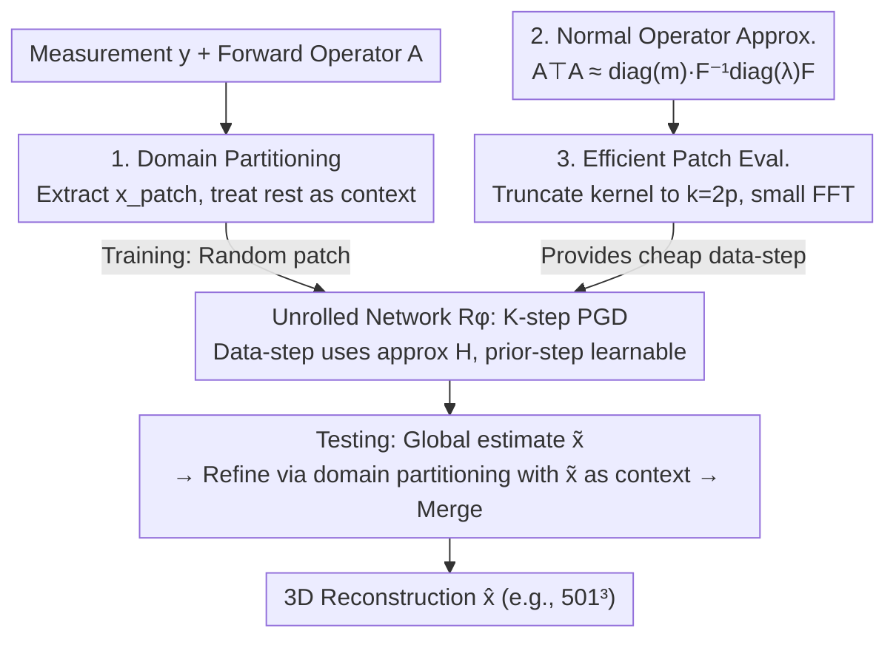

# Efficient Unrolled Networks for Large-Scale 3D Inverse Problems

**Conference**: CVPR 2026  
**Paper**: [CVF Open Access](https://openaccess.thecvf.com/content/CVPR2026/html/Vo_Efficient_Unrolled_Networks_for_Large-Scale_3D_Inverse_Problems_CVPR_2026_paper.html)  
**Code**: https://github.com/romainvo/efficientunrolling  
**Area**: Image Reconstruction / Inverse Problems  
**Keywords**: Unrolled networks, Inverse problems, Domain partitioning, Normal operator approximation, 3D reconstruction  

## TL;DR
Addressing the pain point where unrolled networks for 3D inverse problems cause memory explosion because "network steps must run on the full-resolution volume," this paper employs **domain partitioning** (reconstructing one patch while treating the rest as known context) and a **diagonal-circulant matrix approximation** for the normal operator $A^\top A$. This allows an unrolled network with a forward operator to be trained and deployed on a single GPU for $501^3$ voxel sparse-view CBCT and multi-coil accelerated MRI, achieving SOTA performance.

## Background & Motivation

**Background**: Deep learning solutions for linear inverse problems $y = Ax^* + \varepsilon$ (CT, MRI, remote sensing, etc.) are mainly divided into two categories. One is **post-processing networks**: mapping from a fast, low-quality reconstruction (e.g., adjoint $A^\top y$ or pseudo-inverse $A^\dagger y$) directly to the ground truth. These are simple and scalable to large volumes via patch-based training but ignore knowledge of the forward operator $A$, leading to reconstructions that may lack data consistency. The other is **unrolled networks**: unfolding $K$ iterations of an optimization algorithm (e.g., proximal gradient descent, PGD) into a network, replacing the prior step with learnable modules for end-to-end training. These generally achieve the best performance by embedding $A$ into the architecture.

**Limitations of Prior Work**: In the unrolled iterative step $x_{k+1} = D_\phi\big(x_k - \eta \nabla_x d(Ax_k, y)\big)$, the data-consistency step calculates $Ax_k$ on the **entire volume**, thus requiring the network prior step $D_\phi$ to also perform forward and backward passes at full resolution. Paper Fig.1 highlights a key observation: **the bottleneck is the network step**, as its memory usage explodes with volume size $N^3$, whereas the data-step remains manageable even at high resolutions. While Deep Equilibrium training can reduce memory to the level of a single forward pass, **every iteration still requires evaluating the entire network on the full volume**, which remains infeasible on a single GPU for realistic $512^3$ 3D problems.

**Key Challenge**: Post-processing networks can use patches to scale, but unrolled networks cannot—because their data-step couples all voxels (especially in the cone-beam geometry of CBCT, where the forward operator lacks a "coordinate-friendly" block-diagonal structure $A = \mathrm{blkdiag}$). Naive patching would break data consistency. Consequently, "performance enhancement from forward operators" and "scalability via patches" are mutually exclusive in 3D.

**Goal**: Enable unrolled networks to be trained and deployed on **arbitrarily large** linear inverse problems using a single GPU without sacrificing performance. This is divided into two sub-problems: (1) how to partition large problems during training to fit memory; (2) how to make the global data-step fast after partitioning.

**Core Idea**: Use **domain partitioning** to transform the task into "reconstructing one patch with remaining voxels as known context," an equivalent small-scale inverse problem that permits patch-based training of unrolled networks. Then, use a **diagonal-circulant matrix approximation of the normal operator $A^\top A$** (diagonalizable via FFT) to replace the global operator with cheap FFT-based convolutions. Notably, this approximation can be fitted via gradient descent **independent of any task data**.

## Method

### Overall Architecture

The input is the measurement $y \in \mathbb{R}^m$ and the known forward operator $A \in \mathbb{R}^{m\times n}$; the output is the reconstructed volume $\hat{x} \in \mathbb{R}^n$ (e.g., $501^3$ walnut CBCT or multi-coil MRI). The pipeline revolves around the goal of "converting full-volume unrolling to patch-wise unrolling," combining two complementary techniques:

- **Training Phase**: Decompose the volume into a "target patch" and "known context," running $K$-step unrolled PGD only on the patch (Design 1). The data-step in the unrolling uses a diagonal-circulant approximation $H$ for $A^\top A$ (Design 2), with evaluation restricted to local FFTs on small patches for efficiency (Design 3). This ensures forward and backward passes occur on small patches (e.g., $384^2$ or $8\times128^2$), making memory manageable.
- **Testing Phase**: Since the ground-truth context is unavailable, a two-step process is used: First, a "global initial estimate" is performed (data-step computed on the full volume, network prior $D_\phi$ applied patch-wise and stitched) to obtain $\tilde{x}$. Second, $\tilde{x}$ is used as the context for domain partitioning refinement on each patch before final merging.

### Key Designs

**1. Domain Partitioning: Reformulating "Full Reconstruction" as "Patch Completion under Known Context"**

The bottleneck is direct: the data-step in unrolled networks couples all voxels, preventing naive patching. The approach uses an orthogonal decomposition of the signal space $\mathbb{R}^n = \mathbb{R}^p \oplus \mathbb{R}^q$ with selection operators $S \in \mathbb{R}^{p\times n}$ and $S_\perp \in \mathbb{R}^{q\times n}$ to extract two parts. Assuming ground-truth for the context $x_{\text{context}} = S_\perp x^*$ is known, and only the patch $x_{\text{patch}} \in \mathbb{R}^p$ needs recovery, the ground truth is $x^* = S^\top x_{\text{patch}} + S_\perp^\top x_{\text{context}}$. Leveraging linearity, the original system $y = Ax^*$ is rewritten as an equivalent small system:

$$\tilde{y} = \tilde{A}\,x_{\text{patch}}, \quad \tilde{A} = A S^\top, \quad \tilde{y} = y - A S_\perp^\top x_{\text{context}}.$$

This subtracts the context's contribution to measurements from $y$, leaving an inverse problem solely for the patch. During training, the subspace $\mathbb{R}^p$ (rectangular or cubic patches) is shifted randomly, minimizing $L_{\text{PART}}(\phi) = \mathbb{E}_S\mathbb{E}_{x^*,y}\,\|\tilde{R}_\phi(\tilde{y}, \tilde{A}) - Sx^*\|_2^2$. Crucially, this reformulation **does not require the forward operator to have a coordinate-friendly block structure**, making it applicable to CBCT operators where cone-beam geometry couples all voxels—a more general approach than traditional block-separable decompositions.

**Two-step inference**: In real testing, ground-truth context is missing. Part one ("Initial estimate") performs unrolling $\tilde{x} = R_\phi(y, A)$ without partitioning, where the data-step is global but $D_\phi$ is evaluated patch-wise to avoid full-volume network execution. Part two ("Refinement") uses $\tilde{x}$ as context $x_{\text{context}} = S_\perp \tilde{x}$ and independently solves $\hat{x}_{\text{patch}} = \tilde{R}_\phi(\tilde{y}, \tilde{A})$ for each patch using the same network. It is observed that refinement consistently improves CBCT quality, whereas the initial estimate for MRI is often sufficient.

**2. Normal Operator Approximation: Replacing $A^\top A$ with a Diagonal-Circulant Approximation**

Even after partitioning, the sub-problem data-step requires $\tilde{A}^\top\tilde{A}\,x_{\text{patch}} = S A^\top A S^\top x_{\text{patch}}$, essentially hitting the global operator $A^\top A$. For a gradient-descent data-step $h(x) = x - \eta(A^\top A)x + \eta A^\top y$, stripping the pre-computable constant $A^\top y$ leaves $A^\top A x$ as the core repeated operation. This is approximated as a diagonal-circulant product:

$$A^\top A \approx H = \mathrm{diag}(m)\, F^{-1}\mathrm{diag}(\lambda)\, F,$$

where $F, F^{-1}$ are DFT operators, $\lambda$ is the frequency response of the convolution kernel, and $m$ is a spatial sensitivity map/mask. The intuition: if $A$ is shift-invariant, $A^\top A$ is a convolution diagonalizable in the Fourier domain; adding spatial diagonal $\mathrm{diag}(m)$ covers non-shift-invariant operators (e.g., inpainting, CT Cartesian resampling). For CT, the Fourier Slice Theorem ensures each forward projection corresponds to a radial line in frequency space, which is a Fourier-diagonal operation, while $\mathrm{diag}(m)$ compensates for sampling maps. For multi-coil MRI, the author uses a symmetric form $H = \mathrm{diag}(m) F^{-1}\mathrm{diag}(\lambda)F\,\mathrm{diag}(m)$.

A key advantage is that **fitting requires no task data**: $(m, \lambda)$ are optimized by minimizing $\mathcal{L}(m,\lambda) = \mathbb{E}_{x\sim\mathcal{N}(0,I)}\|A^\top A x - H(m,\lambda)x\|_2^2$ over standard Gaussian vectors, which is equivalent to minimizing the squared Frobenius norm $\|A^\top A - H(m,\lambda)\|_F^2$. As long as the matrix-free implementation of $A$ is known, the approximation is pre-fitted **without using any training samples**.

**3. Efficient Patch-wise Evaluation: Truncating the Kernel to $k = 2p$**

Replacing the operator with an approximation is insufficient if $F^{-1}\mathrm{diag}(\lambda)F$ still requires full-volume FFTs. By observing that the input is a zero-padded patch, the convolution results **remain exact** in the patch region even if the kernel is truncated to size $k = 2p \ll n$. This is formulated as:

$$\tilde{A}^\top\tilde{A}\,x_{\text{patch}} \approx \mathrm{diag}(Sm)\, F_k^{-1}\mathrm{diag}(\lambda_k)\, F_k\, x_{\text{patch}},$$.

This allows the data-step to be computed entirely on the local patch neighborhood without ever returning to the full volume. Table 1 shows this accelerates data-consistency by ~3x on Walnut-CBCT ($4.19 \to 12.5$ step/s).

### Loss & Training
The unrolled network uses tied weights with $K=5$ iterations for MC-MRI and $K=3$ for CBCT. The backbone is DRUNet (residual UNet-style, ~36.2M parameters for 2D, ~96.5M for 3D). For CBCT, training uses a batch size of 1 with gradient accumulation over 4 steps. Approximation parameters $(m, \lambda)$ are pre-fitted. All experiments were conducted on a single H100 (80GB).

## Key Experimental Results

### Main Results

Sparse-view Walnut-CBCT ($501^3$ voxels, 30/50/100 projections): Standard 3D unrolled networks OOM (Out of Memory). Ours is trainable and achieves SOTA.

| Method | SSIM↑ (30/50/100) | PSNR↑ (30/50/100) | VRAM↓(GB) | s/step↓ |
|------|-------------------|-------------------|-----------|---------|
| FDK (Analytical) | 0.197 / 0.263 / 0.375 | 18.53 / 21.16 / 24.74 | N/A | N/A |
| TV (Variational) | 0.799 / 0.850 / 0.893 | 27.88 / 29.72 / 31.63 | N/A | N/A |
| INR[3D] | 0.805 / 0.862 / 0.913 | 29.97 / 32.18 / 33.74 | N/A | N/A |
| PnP-αPGD[3D] | 0.803 / 0.868 / 0.884 | 28.63 / 31.69 / 33.72 | 67.50 | 1.39 |
| DRUNet[3D] (Post-proc) | 0.857 / 0.905 / 0.931 | 29.47 / 32.49 / 35.22 | 67.50 | 1.39 |
| Unrolled[3D] (Standard) | ✗ / ✗ / ✗ | ✗ | **OOM** | ✗ |
| **Unrolled[3D] - Ours** | **0.877 / 0.926 / 0.947** | **31.17 / 34.21 / 37.07** | 44.70 | 1.20×4 |

Multi-coil accelerated MRI (Calgary-Campinas, R=5/10): Ours saves significant memory vs. standard unrolling with comparable performance.

| Method | SSIM↑ (R5/R10) | PSNR↑ (R5/R10) | VRAM↓(GB) | s/step↓ |
|------|----------------|----------------|-----------|---------|
| DRUNet[3D] (Post-proc) | 0.930 / 0.900 | 35.02 / 32.67 | 17.85 | 0.610 |
| Unrolled[3D] (Standard) | **0.952 / 0.926** | **37.74 / 34.72** | 75.93 | 2.16 |
| **Unrolled[3D] - Ours** | 0.948 / 0.919 | 37.36 / 34.25 | **37.02** | 1.10 |

### Ablation Study

Table 4: Dissecting contributions of domain partitioning and approximation (average PSNR).

| Config | Calgary MC-MRI PSNR↑ / VRAM↓ / s·step | Walnut-CBCT PSNR↑ / VRAM↓ / s·step |
|------|------|------|
| Unrolled[3D] (Baseline) | 36.23 / 75.93 / 2.16 | ✗ / **OOM** / ✗ |
| + Approx only | 35.12 / 74.48 / 2.15 | OOM |
| + Partitioning only | 35.85 / 37.02 / 1.10 | 34.11 / 44.70 / 1.65×4 |
| + Partitioning + Approx | 35.09 / 37.04 / 1.09 | **34.15 / 44.70 / 1.21×4** |

### Key Findings
- **Domain partitioning is the decisive factor for 3D unrolling viability**: On CBCT, it resolves OOM issues, reducing memory to 44.70GB to achieve SOTA. On MRI, it nearly halves memory (75.93 to 37.02 GB) with only a ~0.38 dB drop.
- **Approximation gains depend on data-step cost**: CBCT data-steps are expensive; approximation speeds up training by ~30% without performance loss. For MRI, where the data-step is already efficient FFT, the gain is negligible.
- **Data-free fitting**: $(m, \lambda)$ can be fitted on Gaussian vectors alone, which is advantageous for "known operator, scarce data" scenarios.

## Highlights & Insights
- **The "Patch completion under context" reformulation is ingenious**: It bypasses block-separability constraints for global inverse problems, bringing patch training to unrolled networks.
- **Integration of approximation and patch evaluation**: Truncating the kernel to $k=2p$ to maintain exactness while staying on the patch is the critical engineering detail that saves both memory and time.
- **Transferable insight on data-independent fitting**: Using Gaussian vectors to minimize operator approximation errors (Frobenius norm) is a strategy applicable to any scenario needing an FFT-proxy for a known operator.

## Limitations & Future Work
- The method focuses on **Gaussian noise** models (L2 data term). While Poisson noise might be more accurate for low-dose CT, Gaussian unrolled networks often provide SOTA results regardless.
- Normal operator approximation is **less accurate for multi-coil MRI**, leading to slight performance drops. Its benefits are most pronounced when the original operator is computationally expensive.
- The two-step inference (initial estimate + refinement) could potentially introduce stitching artifacts at patch boundaries, which wasn't deeply analyzed.

## Related Work & Insights
- **vs. Post-processing (DRUNet)**: Post-processing scales well but lacks data consistency. Ours brings patch scalability to unrolled networks while retaining the forward operator, outperforming 3D post-processing on CBCT.
- **vs. Deep Equilibrium / Checkpointing**: These reduce memory to the "single forward" level but still require full-volume network evaluation. Ours reduces the problem size itself.
- **vs. INR (Implicit Neural Representation)**: INR requires per-sample optimization and lacks data priors. Ours is feed-forward and utilizes training data for significantly higher quality.

## Rating
- Novelty: ⭐⭐⭐⭐⭐ Enables first $501^3$ single-GPU unrolled 3D reconstruction via partitioning.
- Experimental Thoroughness: ⭐⭐⭐⭐ Broad testing across CBCT/MRI, though patch size sensitivity is in the appendix.
- Writing Quality: ⭐⭐⭐⭐⭐ Clear derivation and excellent bottleneck analysis.
- Value: ⭐⭐⭐⭐⭐ Highly practical for medical imaging reconstruction under resource constraints.

<!-- RELATED:START -->

## Related Papers

- [\[CVPR 2026\] MSPT: Efficient Large-Scale Physical Modeling via Parallelized Multi-Scale Attention](mspt_efficient_large-scale_physical_modeling_via_parallelized_multi-scale_attent.md)
- [\[CVPR 2026\] Large-scale Robust Enhanced Ensemble Clustering via Outlier Decoupling](large-scale_robust_enhanced_ensemble_clustering_via_outlier_decoupling.md)
- [\[CVPR 2026\] Adaptive Bayesian Early-Exit Networks for Efficient Non-Transferable Learning](adaptive_bayesian_early-exit_networks_for_efficient_non-transferable_learning.md)
- [\[CVPR 2026\] Electromagnetic Inverse Scattering from a Single Transmitter](electromagnetic_inverse_scattering_from_a_single_transmitter.md)
- [\[ICML 2026\] Torus Graphs for Large-Scale Neural Phase Analysis](../../ICML2026/others/torus_graphs_for_large_scale_neural_phase_analysis.md)

<!-- RELATED:END -->
