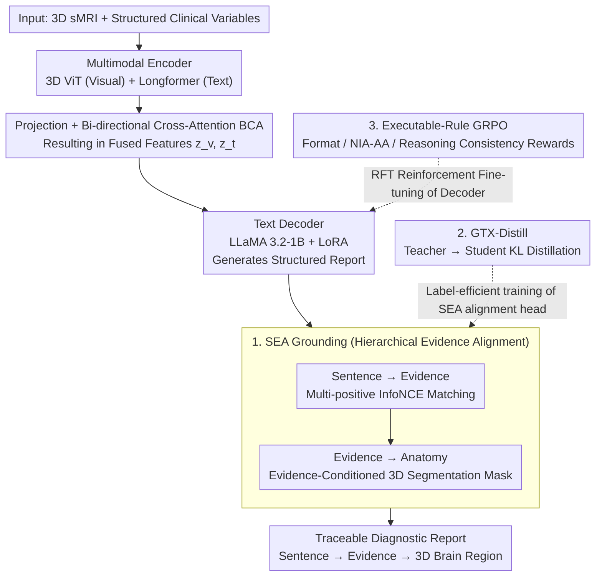

# EMAD: Evidence-Centric Grounded Multimodal Diagnosis for Alzheimer's Disease

**Conference**: CVPR 2026  
**arXiv**: [2602.19178](https://arxiv.org/abs/2602.19178)  
**Code**: Coming soon (including grounding annotations)  
**Area**: Medical Imaging  
**Keywords**: Alzheimer's Disease diagnosis, Multimodal Vision-Language Models, Evidence Alignment, Reinforced Fine-Tuning, 3D Brain Segmentation

## TL;DR

Ours proposes EMAD, an end-to-end multimodal vision-language framework that generates structured reports for AD diagnosis. It explicitly associates each diagnostic statement with clinical evidence and 3D brain anatomy through hierarchical Sentence–Evidence–Anatomy (SEA) Grounding and ensures clinical consistency via executable rule-driven GRPO reinforcement fine-tuning.

## Background & Motivation

Clinical diagnosis of Alzheimer's Disease (AD) requires the integration of multimodal data, including structural MRI (sMRI), neuropsychological tests, APOE genotypes, and CSF biomarkers. Existing AI methods face three core challenges:

**Black-box Problem**: Most models only output labels or risk scores, failing to explain why a decision was made and what evidence supports it.

**Limitations of Prior Work**: Many approaches still operate on a single modality, ignoring cross-modal dependencies.

**Clinical Guideline Disconnection**: Medical reports generated by existing MLLMs rarely (i) link generated sentences to specific clinical items, (ii) ground statements in 3D brain anatomy, or (iii) enforce diagnostic frameworks like NIA-AA.

The core motivation of EMAD is to build a **transparent, traceable, and anatomically faithful** AD report generation system where every diagnostic statement is supported by an evidence chain.

## Method

### Overall Architecture

EMAD addresses the black-box problem where AD diagnostic models provide labels without evidence. The approach enables a multimodal VLM to generate structured diagnostic reports while pinning every sentence in the report to clinical evidence and 3D brain regions. It consists of four parts: a multimodal encoder, a projection and fusion layer, a text decoder (report generation), and a hierarchical SEA Grounding head. The input is $\mathcal{X}=\{x_v, x_t\}$, where $x_v \in \mathbb{R}^{D \times H \times W}$ is a 3D sMRI and $x_t$ represents structured clinical variables. The visual encoder $E_v$ (3D ViT) extracts patch-level embeddings $h_v$, and the text encoder $E_t$ (Longformer) encodes clinical text $h_t$. Both are projected into a common dimensional space and fused via Bi-directional Cross-Attention (BCA), alternating between Q/KV roles:

$$\mathbf{A}_{t \to v} = \text{Attn}(h_t', h_v', h_v'), \quad \mathbf{A}_{v \to t} = \text{Attn}(h_v', h_t', h_t')$$

Residual connections are used to preserve modality-specific information: $z_v = h_v' + \mathbf{A}_{v \to t}$ and $z_t = h_t' + \mathbf{A}_{t \to v}$. The fused features replace the `<sMRI>` and `<clinical>` placeholders in the prompt, and reports are generated autoregressively by LLaMA 3.2-1B + rank-8 LoRA. After report generation, the SEA Grounding head pins it sentence-by-sentence to evidence and brain regions. GTX-Distill and Executable-Rule GRPO are employed during training to make alignment capabilities transferable at low cost and to ensure the output adheres to clinical rules.

### Key Designs

**1. Sentence–Evidence–Anatomy (SEA) Grounding: Pinning Diagnostic Sentences to Evidence and Anatomy**

To address the black-box challenge, SEA decomposes interpretability into two levels of alignment. Sentence-to-Evidence performs many-to-many matching between each generated sentence $\hat{s}_i$ and the clinical evidence set $\mathcal{E}=\{e_1,\ldots,e_K\}$, using a bi-directional multi-positive InfoNCE loss $\mathcal{L}_{\text{SE}} = \frac{1}{N}\sum_{i=1}^{N}(\ell_i^{e \to s} + \ell_i^{s \to e})$ to bring sentences closer to their supporting evidence. Evidence-to-Anatomy then localizes evidence with anatomical pointers to specific brain regions. A lightweight cross-attention block is inserted after each self-attention layer in the Segformer3D decoder, allowing visual tokens to attend to evidence text tokens, outputting voxel-level probability masks $\hat{\mathbf{M}}_i = \sigma(\text{Head}(\mathbf{Y}^{(L)}))$, trained with Dice + BCE. This forms a dual-traceable evidence chain: "Sentence → Evidence → 3D Anatomy."

**2. GTX-Distill (Grounding Transfer Distillation): Retaining 95% Alignment Capability with 25% Annotation**

Voxel-level grounding annotations are extremely expensive. GTX-Distill bypasses the need for full annotation through two-stage distillation. Stage 1 trains a Teacher Grounder $G_T$ on a small annotated subset to learn the $q(e|s_i)$ distribution and anatomical masks. Stage 2 freezes $G_T$ and trains a Student Grounder $G_\theta$ on reports generated by the large-scale model, using temperature-scaled KL divergence distillation $\mathcal{L}^{\text{distill}} = \tau^2 \sum_i \text{KL}(q_\tau(\cdot|\hat{s}_i) \| p_{\theta,\tau}(\cdot|\hat{s}_i))$. As a result, only 25% grounding annotation is needed to maintain 95% of the teacher's R@3, significantly reducing annotation costs.

**3. Executable-Rule GRPO: Encoding Clinical Guidelines as Programmatically Verifiable Rewards**

Medical reports must adhere to diagnostic frameworks, but manual preference annotations are costly and subjective. Clinical rules are thus encoded as executable rewards for GRPO reinforcement fine-tuning. The total reward aggregates three verifiable components $R = w_F R_F + w_{\text{NIA}} R_{\text{NIA-AA}} + w_C R_{\text{consistency}}$. The format reward $R_F$ check if the Reasoning/Diagnosis/Confidence tags are complete. The NIA-AA diagnostic reward $R_{\text{NIA-AA}}$ checks category alignment (CN/MCI/Dementia), biomarker consistency (Aβ/tTau/pTau thresholds), and clinical feature coverage. The reasoning consistency reward $R_{\text{consistency}}$ uses an NLI model to verify the entailment of Reasoning ⇒ Diagnosis, preventing logical contradictions. This reward suite injects compliance, faithfulness, and self-consistency directly into the model without manual preference labels.

### Loss & Training

Progressive three-stage training:

- **Stage 1 (PT)**: Contrastive learning + reconstruction learning to align multimodal representations: $\mathcal{L}_{\text{PT}} = \mathcal{L}_{\text{itc}} + \lambda_{\text{res}}(\mathcal{L}_{\text{res}}^v + \mathcal{L}_{\text{res}}^t)$.
- **Stage 2 (SFT + GTX-Distill)**: Freezing the lower layers of the encoder while fine-tuning the top layers, projection layer, and decoder LoRA: $\mathcal{L}_{\text{SFT}} = \mathcal{L}_{\text{txt}} + \lambda_{\text{KL}} \mathcal{L}^{\text{distill}}$.
- **Stage 3 (RFT)**: GRPO reinforcement fine-tuning with group size $G=4$, clipping $\epsilon=0.2$, and KL coefficient $\beta=0.1$.

## Key Experimental Results

### Main Results

Dataset: AD-MultiSense (based on ADNI + AIBL, 10,378 samples / 2,619 subjects)

| Task | Metric | EMAD | M3D-LaMed (best baseline) | Gain |
|------|------|------|--------------------------|------|
| CN vs CI | ACC | 93.33% | 91.28% | +2.05 |
| CN vs CI | AUC | 91.83% | 89.16% | +2.67 |
| CN vs CI | BERTScore | 0.9120 | 0.8748 | +0.037 |
| CN vs MCI | ACC | 92.82% | 89.47% | +3.35 |
| CN vs MCI | AUC | 90.09% | 88.06% | +2.03 |
| Tri-classification | ACC / Macro-F1 | 89.4% / 87.8% | 84.7% / 82.5% (Alifuse) | +4.7 / +5.3 |

Report quality metrics (CN vs CI): BLEU 0.5422, METEOR 0.6790, ROUGE 0.7781 — significantly outperforming all baselines.

### Ablation Study

| Configuration | ACC (CN vs CI) | AUC | Description |
|------|---------------|-----|------|
| sMRI only | 71.24% | 54.76% | Visual unimodality is severely insufficient |
| Clinical only | 88.83% | 82.69% | Text modality contributes significantly |
| Image + Clinical (EMAD) | 93.33% | 91.83% | Multimodal fusion is optimal |
| EMAD w/o RFT | 91.28% | — | No reinforcement fine-tuning |
| + Format reward only | 91.45% | — | Format validity 85.3 → 97.8% |
| + Format + NIA-AA | 92.10% | — | NIA-AA consistency 74.1 → 86.7% |
| Full EMAD | 92.82% | — | Entailment 68.2 → 87.6% |

### Key Findings

- Using only visual features resulted in an ACC of only 71.24% (high SEN of 95.33% but SPE of only 12.31%), indicating unimodal models tend to predict all cases as positive.
- GTX-Distill retains 95% R@3 with only 25% annotation and matches the fully supervised teacher with 50% annotation.
- Evidence-conditioned segmentation improved the hippocampal Dice score from 0.78 to 0.84.
- Supervision under NIA-AA standards performed slightly better than IWG-2 standards (93.33 vs 92.93 ACC).

## Highlights & Insights

- **Evidence Chain Traceability**: SEA Grounding achieves hierarchical interpretability from "Sentence → Clinical Evidence → 3D Anatomy," providing dual evidence support for each diagnostic statement.
- **Label Efficiency**: GTX-Distill significantly reduces the requirement for grounding annotations, transferring teacher alignment capabilities to the student via KL distillation.
- **Verifiable Reward Design**: Executable-Rule GRPO encodes clinical guidelines into programmatically verifiable reward functions (Format/NIA-AA/Entailment), eliminating the need for manual preference labels.
- **Sophisticated Training Strategy**: Successive three-stage training (PT → SFT → RFT) builds alignment, faithfulness, and verification capabilities step-by-step.

## Limitations & Future Work

- The dataset is limited to ADNI + AIBL, with restricted sample diversity (primarily Western Caucasian populations).
- 3D sMRI encoding utilizes a ViT-based architecture, which incurs high computational overhead for high-resolution whole-brain scans.
- NLI-based consistency rewards depend on external model quality and may introduce noise.
- Longitudinal data modeling for temporal analysis has not yet been explored.
- Validated only in AD scenarios; generalization to other neurodegenerative diseases remains to be tested.

## Related Work & Insights

- **M3D-LaMed**: Pioneering work in 3D medical images + LLMs, but lacks grounding and clinical guideline constraints.
- **GRPO (DeepSeekMath)**: The original proposal for group relative policy optimization; EMAD adapts it to medical scenarios with executable rewards.
- **BLIP / CLIP**: Design of contrastive learning and momentum encoders in EMAD was inspired by BLIP.
- **Insight**: The approach of formalizing clinical diagnostic guidelines into executable reward functions can be generalized to other medical scenarios with clear diagnostic criteria (e.g., tumor grading, cardiovascular risk assessment).

## Rating

- Novelty: ⭐⭐⭐⭐ SEA Grounding, GTX-Distill, and Executable-Rule GRPO provide independent value; their combination creates a complete interpretable AD diagnostic framework.
- Experimental Thoroughness: ⭐⭐⭐⭐ Multi-task evaluation (Binary/Tri-classification/Report Quality/Grounding/Ablation), though comparisons with more 3D medical VLMs are missing.
- Writing Quality: ⭐⭐⭐⭐ Clear structure and complete formula derivations, though some symbol definitions are scattered.
- Value: ⭐⭐⭐⭐ Significant progress in interpretable medical AI; the executable reward concept is insightful for medical RLHF.

<!-- RELATED:START -->

## Related Papers

- [\[CVPR 2026\] Clinically-Grounded Counterfactual Reasoning for Medical Video Diagnosis](clinically-grounded_counterfactual_reasoning_for_medical_video_diagnosis.md)
- [\[CVPR 2026\] MedTVT-R1: A Multimodal LLM Empowering Medical Reasoning and Diagnosis](medtvt-r1_a_multimodal_llm_empowering_medical_reasoning_and_diagnosis.md)
- [\[ICLR 2026\] CARE: Towards Clinical Accountability in Multi-Modal Medical Reasoning with an Evidence-Grounded Agentic Framework](../../ICLR2026/medical_imaging/care_towards_clinical_accountability_in_multi-modal_medical_reasoning_with_an_ev.md)
- [\[AAAI 2026\] Sim4Seg: Boosting Multimodal Multi-disease Medical Diagnosis Segmentation with Region-Aware Vision-Language Similarity Masks](../../AAAI2026/medical_imaging/sim4seg_boosting_multimodal_multi-disease_medical_diagnosis_segmentation_with_re.md)
- [\[NeurIPS 2025\] Dynamic Causal Discovery in Alzheimer's Disease through Latent Pseudotime Modelling](../../NeurIPS2025/medical_imaging/dynamic_causal_discovery_in_alzheimers_disease_through_latent_pseudotime_modelli.md)

<!-- RELATED:END -->
