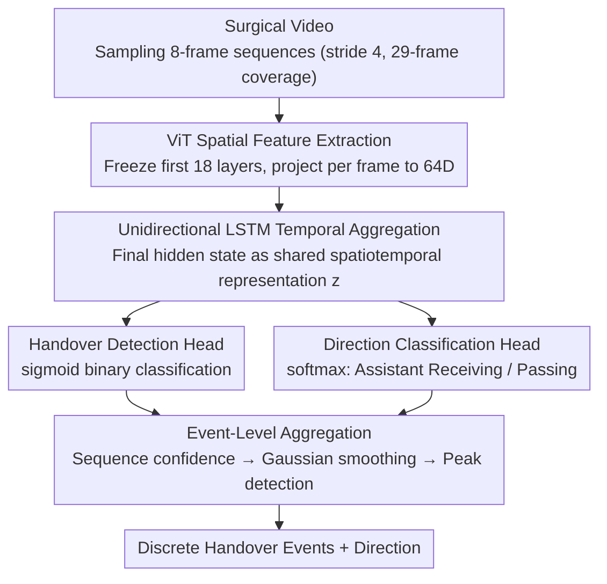

# Event-Level Detection of Surgical Instrument Handovers in Videos

**Conference**: CVPR 2026  
**arXiv**: [2604.07577](https://arxiv.org/abs/2604.07577)  
**Code**: Yes  
**Area**: Medical Imaging  
**Keywords**: surgical video, instrument handover, ViT-LSTM, multi-task, event detection

## TL;DR

A spatiotemporal visual framework is proposed for instrument handover detection in real-world surgical videos. By combining ViT spatial feature extraction with unidirectional LSTM temporal modeling and employing multi-task learning to jointly predict handover events and directions, the model achieves an F1-score of 0.84 on kidney transplant surgery videos.

## Background & Motivation

Reliable monitoring of surgical instrument handovers is essential for maintaining surgical workflow efficiency and patient safety. Failures in handovers during surgery can lead to serious adverse events, such as retained instruments. Automatically detecting handovers from intraoperative videos remains highly challenging: frequent occlusions, cluttered backgrounds, dynamic lighting, and the temporal evolutionary nature of the handover itself make single-frame analysis insufficient.

Previously, SurgiGuard utilized CLIP features and graph reasoning to detect handovers but relied primarily on frame-level features and lacked explicit temporal modeling. This paper introduces a ViT+LSTM spatiotemporal architecture validated on real surgical recordings rather than simulated environments.

## Method

### Overall Architecture

Ours addresses the problem of automated recognition of instrument handovers in intraoperative videos—handover is an event with temporal evolution that cannot be identified from a single frame. The workflow is as follows: an 8-frame sequence is sampled from the video (stride 4, covering a 29-frame temporal window); ViT independently extracts spatial features for each frame, which are linearly projected to 64 dimensions and fed into a unidirectional LSTM for temporal aggregation to obtain a shared spatiotemporal representation $z$; this representation is passed to a "handover detection" head and a "handover direction" head for joint prediction, outputting confidence scores per sequence; finally, sequence-level confidence scores are concatenated into a 1D signal along the time axis, followed by Gaussian smoothing and peak detection to extract discrete handover events (rather than frame-by-frame determination), aligning the output granularity with the clinical perception of a "single handover."

### Key Designs

**1. ViT Spatial Feature Extraction: Customizing for Handover Scenes via "Freeze Bottom, Tune Top"**

Surgical footage contains frequent occlusions, cluttered backgrounds, and lighting variations, requiring strong single-frame representations while avoiding overfitting on small datasets. The approach uses a pre-trained ViT backbone, freezing the first 18 transformer layers and fine-tuning only the upper layers to adapt to handover analysis. Frame-level features are projected into a 64-dimensional embedding space. This leverages large-scale pre-trained visual priors while keeping the number of trainable parameters manageable for small datasets.

**2. LSTM Temporal Aggregation: Handling Sparse Short Sequences with Strong Inductive Bias**

Since a handover is an event that evolves across frames, temporal modeling must be explicit. However, given the small scale of labeled data and sparse event distribution, Transformer-based temporal models are prone to underfitting. Consequently, a unidirectional LSTM was chosen over a Transformer—the strong sequence inductive bias of the LSTM is better suited for modeling short interaction sequences and is more stable than attention mechanisms when data is limited.

**3. Multi-task Joint Prediction: Shared Representation for Detection and Direction to Prevent Error Accumulation**

If handover detection and direction classification were performed sequentially, a cascaded pipeline would propagate errors from the first step to the second. Here, the shared spatiotemporal representation is fed simultaneously into a binary classification detection head (sigmoid) and a direction classification head (softmax: assistant receiving/assistant passing). The two tasks are optimized jointly, providing mutual supervisory signals and avoiding cascaded error accumulation.

**4. Event-Level Aggregation: Extracting Discrete Handover Events from Sequence Confidence**

This is one of the core contributions distinguishing the paper from frame-level methods like SurgiGuard. The pain point is that sequence-level outputs treat a single complete handover as a string of fragmented positive samples, whereas clinicians care about "how many handovers occurred and in which direction." The method concatenates sequence-level detection confidence into a 1D signal over time, applies Gaussian smoothing ($\sigma=3$) to suppress noise, and uses prominence-based peak detection to localize each peak as a single handover event. Directions are aggregated within each event interval using Gaussian weighting to obtain a single direction for that handover. Evaluating by "event" rather than "frame" avoids overestimation caused by double-counting long handovers and aligns the output granularity with clinical perception.

### Loss & Training

The total loss is $L = \lambda_{det} \cdot L_{det} + \lambda_{dir} \cdot L_{dir}$: $L_{det}$ uses weighted BCE to handle class imbalance, and $L_{dir}$ uses weighted CE calculated only on positive samples. Sequence labels are determined by majority voting of the center 5 frames (Assistant Receiving / Assistant Passing / Assistant Idle). During training, the first 18 layers of ViT are frozen while upper layers are fine-tuned, and data augmentations such as cropping and flipping are applied to reduce interference from cluttered surgical backgrounds and occlusions. The dataset consists of intraoperative videos from 5 kidney transplant surgeries, totaling 484 handover events.

## Key Experimental Results

### Main Results

| Model | Detection F1 | Direction Mean F1 |
|------|--------|------------|
| Multi-task ViT-LSTM | **0.84** | **0.72** |
| Single-task ViT-LSTM | 0.79 | 0.63 |
| VideoMamba | 0.84 | 0.61 |

### Key Findings

- Multi-task learning outperforms single-task learning in both detection (F1 0.84 vs. 0.79) and direction classification (0.72 vs. 0.63).
- Compared to VideoMamba, detection performance is comparable, but direction classification is significantly superior.
- Layer-CAM visualization demonstrates that the model correctly focuses on the hand-instrument interaction regions.

## Highlights & Insights

- Practical validation on real kidney transplant surgery videos provides significant clinical value.
- Event-level evaluation (rather than frame-level) aligns better with clinical perception.
- Layer-CAM interpretability analysis enhances clinical trustworthiness.
- A unified multi-task loss avoids error accumulation in cascaded pipelines, with detection and direction classification sharing a unified spatiotemporal representation.
- Choice of unidirectional LSTM over Transformer temporal models is justified by the small scale of labeled data and sparse event distribution; LSTM's strong sequence inductive bias is more suitable for modeling short interaction sequences.
- Specialized comparisons with the VideoMamba baseline demonstrate the impact of different temporal modeling strategies.

## Limitations & Future Work

- The dataset is relatively small (5 surgeries, 484 handover events), and generalizability requires further validation.
- Only handovers between the assistant and the lead surgeon are detected, excluding more complex multi-person interactions.
- No direct comparison was made with methods based on CLIP and graph reasoning, such as SurgiGuard, on the same dataset.
- Gaussian smoothing parameters and peak detection thresholds for event-level evaluation may need tuning based on specific surgery types.
- The potential of bidirectional LSTM or Transformer temporal models on larger datasets remains unexplored.
- Auxiliary information, such as instrument tracking, was not utilized to enhance handover detection.
- Data augmentation strategies include cropping and flipping to reduce interference from surgical background clutter.
- The event-level evaluation method is more meaningful for clinical applications, avoiding the overestimation issues inherent in frame-level evaluation.

## Rating

- Novelty: ⭐⭐⭐⭐ — Methodological design is relatively standard.
- Technical Depth: ⭐⭐⭐⭐ — Direct combination of ViT, LSTM, and multi-task learning.
- Experimental Thoroughness: ⭐⭐⭐⭐ — Limited dataset scale with 484 handover events across 5 surgeries.
- Value: ⭐⭐⭐⭐⭐ — Clear application in surgical safety with promising prospects for clinical translation.

<!-- RELATED:START -->

## Related Papers

- [\[CVPR 2026\] Synergistic Bleeding Region and Point Detection in Laparoscopic Surgical Videos](synergistic_bleeding_region_and_point_detection_in_laparoscopic_surgical_videos.md)
- [\[CVPR 2026\] SurgCoT: Advancing Spatiotemporal Reasoning in Surgical Videos through a Chain-of-Thought Benchmark](surgcot_advancing_spatiotemporal_reasoning_in_surgical_videos_through_a_chain-of.md)
- [\[CVPR 2026\] Benchmarking Endoscopic Surgical Image Restoration and Beyond](benchmarking_endoscopic_surgical_image_restoration_and_beyond.md)
- [\[CVPR 2026\] The Invisible Gorilla Effect in Out-of-distribution Detection](the_invisible_gorilla_effect_in_out-of-distribution_detection.md)
- [\[CVPR 2026\] SegMoTE: Token-Level Mixture of Experts for Medical Image Segmentation](segmote_token-level_mixture_of_experts_for_medical_image_segmentation.md)

<!-- RELATED:END -->
