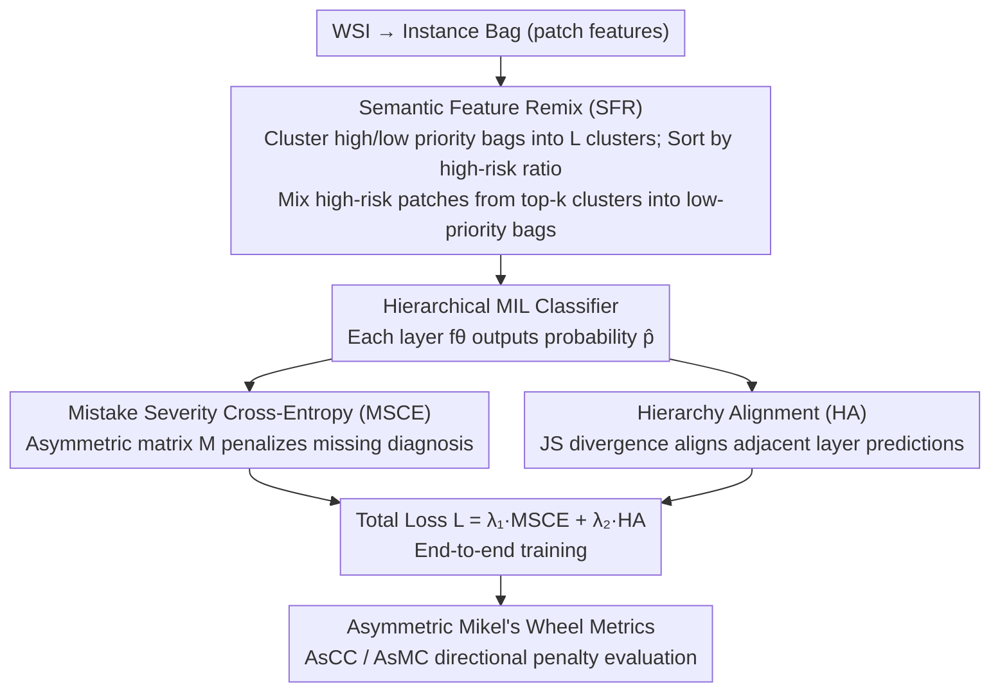

# Every Error has Its Magnitude: Asymmetric Mistake Severity Training for Multiclass Multiple Instance Learning

**Conference**: CVPR2026  
**arXiv**: [2603.13682](https://arxiv.org/abs/2603.13682)  
**Code**: To be confirmed  
**Area**: Medical Imaging  
**Keywords**: Multiple Instance Learning, Mistake Severity, Whole Slide Image, Asymmetric Misclassification, Hierarchical Classification, Pathological Diagnosis

## TL;DR

Ours proposes the PAMS (Priority-Aware Mistake Severity) method, which significantly reduces the risk of severe misdiagnosis in multiclass MIL WSI diagnosis through Asymmetric Mistake Severity Cross-Entropy loss (MSCE), Semantic Feature Remix (SFR), and Asymmetric Mikel's Wheel metrics.

## Background & Motivation

1.  **Background**: Multiple Instance Learning (MIL) is widely used in pathological diagnosis, modeling WSI as a bag of patches. Existing methods focus on maximizing accuracy, ignoring differences in misclassification severity.
2.  **Limitations of Prior Work**: Misclassification costs are asymmetric in clinical scenarios. Missing a diagnosis (misclassifying malignant as normal) is far more severe than over-diagnosis (misclassifying normal as malignant), yet traditional cross-entropy penalizes all errors equally.
3.  **Key Challenge**: WSI multiclassification has priority characteristics. Pathologists label the most urgent diagnosis when observing co-existing symptoms. There is an implicit priority hierarchy between classes, unlike natural images where objects are labeled independently.
4.  **Key Insight**: Existing Mistake Severity (MS) methods (e.g., CDW-CE) define severity weights based on inter-class distance but ignore directionality—misclassifications of the same distance have completely different clinical risks in different directions.
5.  **Goal**: Address the lack of clinical WSI MS solutions. Existing MS research is mainly conducted on natural images and fails to handle WSI constraints (weak labels, complex co-existing symptoms, class priorities).
6.  **Limitations of Prior Work (Metrics)**: Existing MS metrics (ECC/EMC) are based on symmetric distances and cannot distinguish the directionality of misclassifications, failing to evaluate model performance from a safety perspective.

## Method

### Overall Architecture

PAMS aims to solve the problem where "MIL pathological diagnosis only pursues accuracy regardless of misdiagnosis severity"—misjudging malignant as normal is much more dangerous than the reverse, yet cross-entropy treats them the same. The training pipeline consists of four synergistic components: First, **Semantic Feature Remix (SFR)** synthesizes hard cases in the feature space where "high-risk symptoms are hidden in low-risk slides" to compensate for the lack of co-existing samples in weakly labeled WSIs. Then, multiclass labels are organized into a hierarchical structure (from fine-grained $\mathcal{H}$ to root $\mathcal{R}$), with one classifier $f_{\theta_h}$ per layer outputting prediction probabilities $\hat{p}^h$. The training objective $\mathcal{L} = \lambda_1 \mathcal{L}_{MSCE} + \lambda_2 \mathcal{L}_{HA}$ includes: **Mistake Severity Cross-Entropy (MSCE)** which adds directional penalties to cross-entropy to heavily penalize missing diagnoses, and **Hierarchy Alignment (HA)** which uses JS divergence to align predictions between adjacent layers for consistency. Finally, a set of **Asymmetric Mikel's Wheel metrics** (AsCC/AsMC) is used for safety evaluation.

### Key Designs

**1. Semantic Feature Remix (SFR): Synthesizing hard cases of "high-risk hidden in low-risk" using weak labels**

The first step solves the lack of co-existing hard cases. In clinical practice, symptoms often co-exist, but WSIs only have weak labels and lack pixel-level annotations. Given two bags of different priorities ($Y_a \succ Y_b$), SFR clusters all instances into $L$ clusters, ranks them by the proportion of patches from the high-priority sample $Z_a$, and mixes $Z_a$ patches from top-$k$ clusters into the low-priority bag $Z_b$ to form synthetic sample $Z_{a+b}$ with label $Y_a$. This simulates clinical cases where high-risk symptoms are hidden in low-risk slides, forcing the model to learn to prioritize the most urgent diagnosis.

**2. Mistake Severity Cross-Entropy (MSCE): Adding directional penalties to cross-entropy**

Traditional cross-entropy penalizes all errors equally. MSCE defines an asymmetric weight matrix $M^h$: when the ground truth class $c_i^h$ is more urgent than the predicted class $c_j^h$, the penalty is $\alpha^{|i-j|}$ ($\alpha>1$); for the reverse direction, the weight is 1. The final loss is $\mathcal{L}_{MSCE} = -\sum_h \hat{p}^h M^h (\tilde{Y}^h)^\top \sum_c \tilde{Y}^h[c] \log \hat{p}^h[c]$. Unlike Weighted CE, which weights by class frequency, MSCE dynamically captures directional differences between predicted and true labels.

**3. Hierarchy Alignment (HA): Consistency across granularity levels**

HA ensures that classifiers at different hierarchy levels do not provide contradictory diagnoses. It uses Jensen-Shannon divergence to align predictions of adjacent layers by aggregating fine-grained predictions $\hat{p}^{h+1}$ into a coarse-grained representation $\dot{p}^{h+1}$ and matching it with the current layer $\hat{p}^h$. The total objective is $\mathcal{L} = \lambda_1 \mathcal{L}_{MSCE} + \lambda_2 \mathcal{L}_{HA}$.

**4. Asymmetric Mikel's Wheel Metrics: Direction-aware evaluation**

Existing MS metrics (ECC/EMC) use symmetric distances and cannot distinguish the direction of misclassification. PAMS proposes AsCC (Asymmetric Classification Confidence) and AsMC (Asymmetric Misclassification Confidence). The confusion weight is defined as $W_{i,j}^h = 1 + |i-j| + \mathbb{1}(c_i^h \succ c_j^h) \times P$ ($P=2$), adding an extra penalty when high-priority classes are misclassified as low-priority, reflecting true clinical risk.

## Key Experimental Results

### Datasets

- **BRACS**: Breast cancer H&E WSIs, 547 slides, 7 classes (Normal → Invasive Carcinoma), 3-level hierarchy (Benign/Atypical/Malignant).
- **In-house**: 4734 Colon biopsy WSIs, 7 classes, 3-level hierarchy; includes a test set of 182 complex mixed-symptom cases.

### Main Results (Table 1, BRACS + TransMIL)

| Method | ACC | AUC | AsCC | AsMC |
|------|-----|-----|------|------|
| Cross Entropy | 40.23 | 74.90 | 58.48 | 50.18 |
| Chang et al. | 47.51 | 79.48 | 63.98 | 51.02 |
| Hong et al. ($\tau=10$) | 47.13 | 79.80 | 62.44 | 45.54 |
| CDW-CE | 44.83 | 79.06 | 61.05 | 47.32 |
| **PAMS (Ours)** | **47.59** | **80.61** | **64.92** | **55.65** |

Ours achieves the best performance across all metrics, with the most significant gains in AsCC and AsMC.

### Ablation Study (Table 2, BRACS + TransMIL)

| Ablation Item | ACC Gain | AsMC Gain |
|--------|----------|-----------|
| w/o MSCE | -2.46 | -4.84 |
| w/o HA | -2.84 | -0.53 |
| w/o SFR | -0.54 | -4.02 |
| Remove All | -7.82 | -1.76 |

- MSCE contributes most to severity metrics (AsMC drops 4.84).
- SFR also contributes significantly to AsMC (drops 4.02).
- The three components work best in synergy.

### CIFAR-10 Results (Table 4)

| Method | ACC | AsCC | AsMC |
|------|-----|------|------|
| CE | 83.24 | 87.23 | 34.84 |
| CDW-CE | 84.11 | 87.87 | 34.63 |
| **MSCE (Ours)** | **85.64** | **89.12** | **35.70** |

This verifies the generalization ability of MSCE in the natural image domain.

## Highlights & Insights

- **Novelty (Asymmetric Modeling)**: First to introduce directional misclassification penalties in MIL WSI diagnosis, accurately reflecting the clinical need that missing a diagnosis is more dangerous than over-diagnosis.
- **Novelty (SFR)**: Dynamically mixes samples in feature space using weak label information to simulate complex co-existing symptoms without pixel-level labels.
- **Novelty (Metrics)**: AsCC/AsMC address the flaw where symmetric metrics cannot distinguish misclassification directions, applicable to all safety-critical classification tasks.
- **Universality**: Validated on BRACS, In-house medical data, and CIFAR-10; compatible with multiple MIL architectures.

## Limitations & Future Work

- Hierarchical structures require manual pre-definition and domain expertise; different diseases may require different designs.
- Hyperparameters $\alpha$ and $P$ in MSCE require tuning.
- SFR depends on clustering quality; the choice of $L$ and top-$k$ affects performance.
- Validated only in pathology; not yet tested on other modalities like radiology or dermoscopy.
- In-house dataset is not public, limiting reproducibility.

## Related Work & Insights

- **vs. Weighted CE**: Uses fixed weights and cannot capture directional differences; MSCE calculates penalties dynamically based on prediction vs. ground truth.
- **vs. HXE / Soft Labels**: Improves hierarchical information but has limited impact on severity metrics.
- **vs. HAF**: Feature space regularization method with poorer generalization on DTFD-MIL.
- **vs. Hong et al.**: Their random remix strategy is unstable on BRACS; SFR is more robust via semantic guidance.
- **vs. CDW-CE**: Based on class distance but still symmetric; PAMS's asymmetric design better fits clinical needs.

## Rating

- Novelty: ⭐⭐⭐⭐
- Experimental Thoroughness: ⭐⭐⭐⭐
- Writing Quality: ⭐⭐⭐⭐
- Value: ⭐⭐⭐⭐

<!-- RELATED:START -->

## Related Papers

- [\[CVPR 2026\] Contrastive Cross-Bag Augmentation for Multiple Instance Learning-based Whole Slide Image Classification](contrastive_cross-bag_augmentation_for_multiple_instance_learning-based_whole_sl.md)
- [\[ICML 2025\] Do Multiple Instance Learning Models Transfer?](../../ICML2025/medical_imaging/do_multiple_instance_learning_models_transfer.md)
- [\[ICLR 2026\] ASMIL: Attention-Stabilized Multiple Instance Learning for Whole-Slide Imaging](../../ICLR2026/medical_imaging/asmil_attention-stabilized_multiple_instance_learning_for_whole-slide_imaging.md)
- [\[CVPR 2026\] Universal-to-Specific: Dynamic Knowledge-Guided Multiple Instance Learning for Few-Shot Whole Slide Image Classification](universal-to-specific_dynamic_knowledge-guided_multiple_instance_learning_for_fe.md)
- [\[ICLR 2026\] Mixture of Mini Experts: Overcoming the Linear Layer Bottleneck in Multiple Instance Learning](../../ICLR2026/medical_imaging/mixture_of_mini_experts_overcoming_the_linear_layer_bottleneck_in_multiple_insta.md)

<!-- RELATED:END -->
