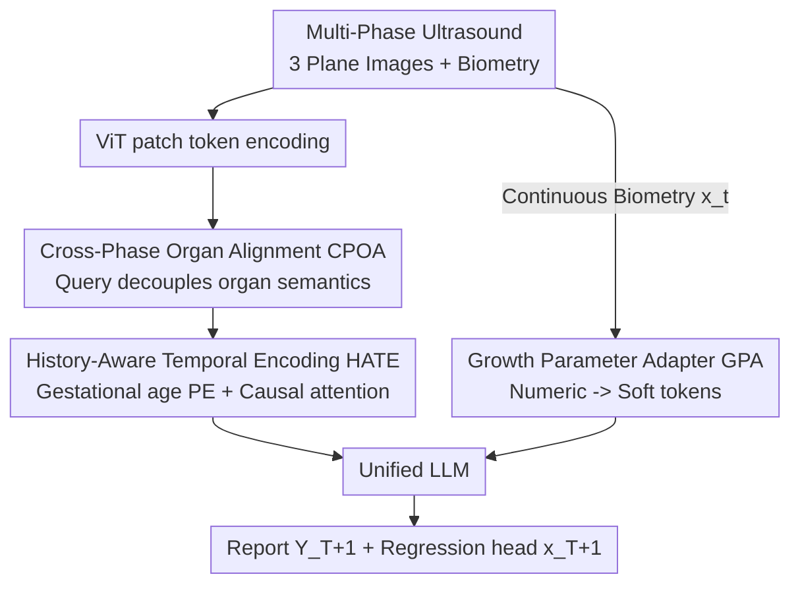

# F$^2$-Assist: Multi-Phase Fetal Growth Forecast and Report Generation from Ultrasound Examination

**Conference**: CVPR 2026  
**Paper**: [CVF Open Access](https://openaccess.thecvf.com/content/CVPR2026/html/Pu_F2-Assist_Multi-Phase_Fetal_Growth_Forecast_and_Report_Generation_from_Ultrasound_CVPR_2026_paper.html)  
**Code**: Not released (GrowthFetus dataset not yet public)  
**Area**: Medical Imaging  
**Keywords**: Fetal ultrasound, longitudinal growth prediction, report generation, multimodal LLM, continuous biometry  

## TL;DR
F$^2$-Assist feeds multi-organ ultrasound images and continuous biometry (HC/AC/BPD/FL) from multiple prenatal examinations into a unified multimodal LLM. By employing "Cross-Phase Organ Alignment," "History-Aware Temporal Encoding," and "Growth Parameter Adapter," it predicts the **next-phase** fetal growth parameters and generates ultrasound reports simultaneously, improving the numerical prediction R² from the previous SOTA of 0.59 up to 0.78.

## Background & Motivation
**Background**: Fetal ultrasound is the most common non-invasive tool for prenatal monitoring. Clinicians evaluate fetal development through a series of examinations (3–5 times during pregnancy) combining multi-organ images (brain, abdomen, femur) and quantitative biometry (head circumference HC, abdominal circumference AC, biparietal diameter BPD, and femur length FL). Recently, medical multimodal large models (MLLMs) have been utilized for ultrasound/CXR report generation.

**Limitations of Prior Work**: Existing methods suffer from two critical flaws. The first is an **isolated single-phase perspective**, where examinations or even single organs are treated as independent samples, completely ignoring the patient's longitudinal history. It is specifically this individualized growth trajectory that is essential for identifying abnormalities and guiding early intervention. The second is the **inability to perform quantitative reasoning**. Existing MLLMs largely perform qualitative text description and are insensitive to continuous numerical values that carry key diagnostic/predictive weight, treating numbers as ordinary text tokens and failing to capture numerical magnitudes or continuous trends.

**Key Challenge**: Fetal growth is a non-linear, individualized time series characterized by **non-equidistant sampling** due to irregular examination intervals. Furthermore, minor numerical deviations are clinically significant. Existing models lack both temporal modeling for irregular longitudinal histories and mechanisms to accurately inject continuous biometry into LLM reasoning—preventing them from predicting future growth states.

**Goal**: The authors propose and define a novel task: **Multi-Phase Fetal Growth Forecast and Report Generation**. Given multiple multimodal examinations from early to mid-pregnancy $(I_1, x_1, \dots, I_T, x_T)$, the goal is to simultaneously predict the next-phase biometry $\hat{x}_{T+1}$ and structured report $\hat{Y}_{T+1}$. The task is decomposed into three technical challenges: heterogeneous multi-organ alignment, irregular temporal modeling, and quantitative reasoning.

**Core Idea**: Within a unified MLLM, multi-view ultrasound sequences are fused with **temporal embeddings** and **numerical embeddings**. Three tightly coupled modules address the aforementioned challenges, enabling the LLM to both write reports and report precise values. Additionally, the authors contribute the first large-scale multi-phase multi-organ fetal ultrasound dataset, GrowthFetus (2,000 fetuses, 9,280 examinations), to support this task.

## Method
### Overall Architecture
F$^2$-Assist is a unified longitudinal reasoning framework. Each patient has $T$ historical pregnancy phases. In phase $t$, three standard planes $I_t = \{I_t^{(p)} \mid p \in \{\text{brain}, \text{abdomen}, \text{femur}\}\}$ and the corresponding biometry vector $x_t = (\text{HC}, \text{AC}, \text{BPD}, \text{FL}) \in \mathbb{R}^4$ are observed. The goal is to map the observed sequence to the next phase's values and report: $(I_1, x_1, \dots, I_T, x_T) \mapsto (\hat{x}_{T+1}, \hat{Y}_{T+1})$.

The data flow consists of a three-stage serial pipeline: images are encoded by a ViT and passed to **Cross-Phase Organ Alignment** to decouple mixed multi-organ patches into stable organ-level tokens. These tokens, augmented with gestational age positional encoding, are sent to **History-Aware Temporal Encoding** to aggregate a patient-specific "growth signature" token across the irregular history. Parallel to this, continuous biometry is encoded into differentiable soft tokens via the **Growth Parameter Adapter**. Finally, both sets of conditions are fed into the LLM, which generates the report and predicts the next-phase values directly from hidden states using a lightweight regression head.

### Key Designs

**1. Cross-Phase Organ Alignment (CPOA): Decoupling multi-organ patches into stable cross-phase organ tokens**

**Design Motivation**: A single examination contains brain, abdomen, and femur planes from different imaging views. Flattening all patches together loses organ priors and entangles semantics, making subsequent temporal modeling difficult. CPOA uses a query-driven approach to extract prototypes per organ. Each plane $I_t^{(p)}$ is encoded into patch tokens $F_t^{(p)} = [f_{t,1}^{(p)}, \dots, f_{t,N}^{(p)}]$. For each anatomical region $p$, a learnable semantic prototype (query) $q^{(p)}$ is introduced to perform soft matching and weighted aggregation:

$$\alpha_{t,i}^{(p)} = \mathrm{softmax}_i\!\left((q^{(p)})^\top f_{t,i}^{(p)}\right), \qquad u_t^{(p)} = \sum_{i=1}^{N} \alpha_{t,i}^{(p)} f_{t,i}^{(p)}.$$

The aggregated organ prototype is fused with a learnable organ encoding $e^{(p)}$ to anchor identity: $v_t^{(p)} = \mathrm{LN}(u_t^{(p)} + e^{(p)})$. Unlike standard positional encoding, $e^{(p)}$ acts as a "structural anchor" to ensure semantics are decoupled. Finally, the three organ tokens are concatenated in a **fixed clinical order** (brain $\to$ abdomen $\to$ femur) and projected: $v_t = W_v[v_t^{\text{brain}}; v_t^{\text{abdomen}}; v_t^{\text{femur}}]$. This deterministic ordering eliminates permutation ambiguity and ensures the same organ falls into the same "slot" across phases, stabilizing long-term temporal modeling. Ablation shows this as the most critical module (removing it collapsed R² from 0.78 to 0.35).

**2. History-Aware Temporal Encoding (HATE): Modeling individualized growth on non-equidistant history**

**Design Motivation**: Fetal growth is non-linear and varies by individual, and examinations occur at variable, uneven intervals. Standard sequence models fail to capture this irregular continuity. HATE is a Transformer-based temporal module. For each aligned token $v_t$, a **gestational age-aware positional encoding** $\pi_t$ is added (providing the model with the actual relative gestational week rather than a simple index), followed by a causal temporal mask to ensure phase $t$ only attends to previous phases:

$$z_t = \mathrm{HATE}(v_t + \pi_t, \text{causal-mask}(T)).$$

HATE utilizes multi-head attention to focus on different developmental stages (early, mid, late). The final fused token $z_T$ serves as a compact, patient-specific "growth signature" for subsequent regression and generation. Ablation shows replacing HATE with MeanPool/1D Conv/GRU performs significantly worse (R² of 0.63/0.67/0.70 vs. 0.78), as global attention can jointly reason about "early trends + late deviations."

**3. Growth Parameter Adapter (GPA): Encoding continuous values into soft tokens for numerical reasoning**

**Design Motivation**: LLMs excel at linguistic reasoning but are insensitive to minor numerical variations critical in clinical settings. GPA encodes continuous biometry vectors into differentiable soft tokens injected into the LLM. Each biometry vector $x_T \in \mathbb{R}^4$ is z-normalized by gestational week and projected via MLP: $e_{\text{num}} = \phi_{\text{num}}(\tilde{x}_T)$. A learnable numerical query $q_{\text{num}}$ anchors the quantitative semantics and interacts with multimodal attention to yield the numerical token $g = q_{\text{num}} + W_g e_{\text{num}}$. This allows the LLM to attend to precise values alongside vision and text.

To avoid cascade errors from "reading numbers via text," GPA's numerical prediction does not rely on text but uses a **lightweight regression head** directly from the final hidden state at the EOS position $h_{\text{EOS}}$: $\hat{z}_{T+1} = \psi_{\text{reg}}(h_{\text{EOS}})$. The loss is Smooth-$\ell_1$: $L_{\text{num}} = \|z_{T+1} - \hat{z}_{T+1}\|_{1,\text{smooth}}$. Ablation confirms that "Digit-as-Text" achieves an R² of only 0.47, while GPA reached 0.78, proving that structured differentiable numerical embeddings capture magnitude and continuity more effectively.

### Loss & Training
The authors use a two-stage curriculum training to stabilize interactions between the vision encoder, temporal module, and LLM:

- **Stage I — Frozen LLM**: Only the new modules (CPOA / HATE / GPA) are trained while the LLM is frozen, ensuring organ-level tokens and growth representations are temporally consistent before adjusting the language model.
- **Stage II — LoRA Fine-tuning**: The LLM's attention layers are unfrozen and fine-tuned using LoRA (rank 16), conditioned on the fused temporal-growth features. End-to-end joint optimization:

$$L = L_{\text{txt}} + \lambda_{\text{num}} L_{\text{num}},$$

where $L_{\text{txt}}$ is the standard text generation loss and $L_{\text{num}}$ enforces numerical accuracy. This curriculum improves convergence and yields more accurate joint text and quantitative predictions.

## Key Experimental Results
Dataset: GrowthFetus (2020–2023), 2,000 fetuses, 9,280 examinations, avg. 4.43 phases (range 3–8), covering 11–40 weeks of gestation. Patient-level 70/15/15 split. Baseline history length $N \geq 3$. Vision backbone: CLIP-L (ViT-L/14, 448²), Decoder: Qwen-7B, Temporal fusion: 4-layer 8-head Transformer.

### Main Results
Comparison with medical/general MLLMs (all fine-tuned on GrowthFetus):

| Method | B4 ↑ | CIDEr ↑ | MAE(cm) ↓ | Acc@±10% ↑ | R² ↑ |
|------|------|---------|-----------|------------|------|
| LLaVA-Med (7B) | 0.25 | 1.72 | 2.03 | 40.0 | 0.44 |
| R2GenGPT (7B) | 0.27 | 1.78 | 1.94 | 53.0 | 0.42 |
| Qwen2.5-VL (8B) | 0.33 | 1.98 | 1.24 | 58.9 | 0.58 |
| InternVL-3 (7B) | 0.37 | 2.42 | 1.38 | 56.4 | 0.59 |
| Lingshu (7B) | 0.44 | 3.34 | 1.13 | 69.3 | 0.59 |
| **F$^2$-Assist (8B)** | **0.53** | **3.66** | **0.80** | **77.3** | **0.78** |

Ours leads across text and numerical metrics: R² improved from 0.59 to 0.78, while MAE dropped from 1.13 to 0.80.

Comparison with specialized time-series models:

| Method | Avg MAE ↓ | Avg Acc@±10% ↑ | Avg R² ↑ |
|------|-----------|----------------|----------|
| Growth-Chart | 1.20 | 37.5 | 0.32 |
| Transformer | 1.06 | 72.3 | 0.76 |
| LSTM | 0.88 | 74.3 | 0.78 |
| **Ours** | **0.80** | **77.3** | **0.79** |

Integrating multimodal ultrasound images provides complementary cues that single-modality numerical models lack.

### Ablation Study
Module Ablation:

| Config | B4 ↑ | CIDEr ↑ | MAE ↓ | R² ↑ |
|------|------|---------|-------|------|
| Full model | 0.53 | 3.66 | 0.80 | 0.78 |
| w/o CPOA | 0.44 | 3.08 | 0.93 | 0.35 |
| w/o HATE | 0.50 | 3.72 | 1.26 | 0.42 |
| w/o GPA | 0.52 | 3.51 | 1.18 | 0.58 |

GPA Design: "No numeric" (image only) R²=0.29; "Digit-as-Text" R²=0.47; Adapter Dim=32 R²=0.78.

### Key Findings
- **CPOA is the foundation**: Removing it causes R² to crash from 0.78 to 0.35. It ensures the model focuses on morphology rather than scan-induced appearance variance.
- **Numbers require structural encoding**: Treating numbers as text is insufficient for clinical magnitudes.
- **Sweet spot for history length $N$**: Performance improves up to 4 phases (R²=0.82) but declines at $N \geq 5$ due to data sparsity in long-history samples and dilution of recent growth focus.
- **Week-specific accuracy**: Accuracy peaks during 28–32 weeks (>90% at ±10% tolerance), while AC/FL predictions degrade after 36 weeks due to imaging difficulty and sparse late-term training data.

## Highlights & Insights
- **Numbers as first-class citizens**: GPA bypasses the linguistic blind spot by using differentiable tokens and a regression head—an insight applicable to any scientific LLM task involving continuous values.
- **Deterministic Organ Ordering**: Using a fixed clinical order with "structure anchors" effectively eliminates permutation ambiguity and stabilizes longitudinal alignment.
- **Gestational Age PE**: Directly feeding the relative week into positional encoding handles non-equidistant sampling more effectively than simple indexing.
- **Unified Framework**: Shared temporal-growth representations ensure consistency between the generated report and the predicted biometry.

## Limitations & Future Work
- Predictions for AC/FL degrade in the late third trimester (>36 weeks). Test-time adaptation may be needed for robustness in data-scarce periods.
- The benefit of "long history" is limited by data; samples with more than 4 phases are rare, making $N \geq 5$ difficult to validate.
- Generalization across centers, machine brands (e.g., Samsung vs. Sonoscape), and ethnicities remains to be verified. Evaluation relies on NLP metrics; formal clinical factual assessment by doctors is still needed.

## Related Work & Insights
- **vs. HERGen / RECAP / STREAM**: These longitudinal report models focus on visual dynamics or case retrieval but **do not explicitly model numerical trajectories**. F$^2$-Assist differentiates itself by co-fusing growth biometry with vision and language.
- **vs. General MLLMs**: Standard models are static and lack temporal or numerical reasoning. This work nearly doubles the R² (0.59 $\to$ 0.78), showing that the issue isn't model scale but the lack of task-specific consistency mechanisms.
- **vs. Time-series Models**: Single-modality models miss visual indicators; F$^2$-Assist proves multimodal input improves MAE from 0.88 to 0.80 compared to LSTM.

## Rating
- Novelty: ⭐⭐⭐⭐⭐ First to propose joint multi-phase growth forecast and report generation; soft numeric tokens address a major LLM pain point.
- Experimental Thoroughness: ⭐⭐⭐⭐ Comprehensive baselines and ablations; however, lacks cross-center validation and doctor-led factual assessment.
- Writing Quality: ⭐⭐⭐⭐ Strong mapping between motivation and modules; minor inconsistency in module naming (GFGPT vs HATE).
- Value: ⭐⭐⭐⭐⭐ Directly addresses clinical prenatal monitoring needs with a dataset and framework that sets a standard for longitudinal medical imaging analysis.

<!-- RELATED:START -->

## Related Papers

- [\[CVPR 2026\] CURE: Curriculum-guided Multi-task Training for Reliable Anatomy Grounded Report Generation](cure_curriculum-guided_multi-task_training_for_reliable_anatomy_grounded_report_.md)
- [\[CVPR 2026\] Phrase-grounded APO for Improving Chest X-ray Report Generation](phrase-grounded_apo_for_improving_chest_x-ray_report_generation.md)
- [\[CVPR 2026\] Unleashing Video Language Models for Fine-grained HRCT Report Generation](unleashing_video_language_models_for_fine-grained_hrct_report_generation.md)
- [\[CVPR 2026\] Personalized Longitudinal Medical Report Generation via Temporally-Aware Federated Adaptation](personalized_longitudinal_medical_report_generation_via_temporally-aware_federat.md)
- [\[CVPR 2026\] Gastric-X: A Multimodal Multi-Phase Benchmark Dataset for Advancing Vision-Language Models in Gastric Cancer Analysis](gastric-x_a_multimodal_multi-phase_benchmark_dataset_for_advancing_vision-langua.md)

<!-- RELATED:END -->
