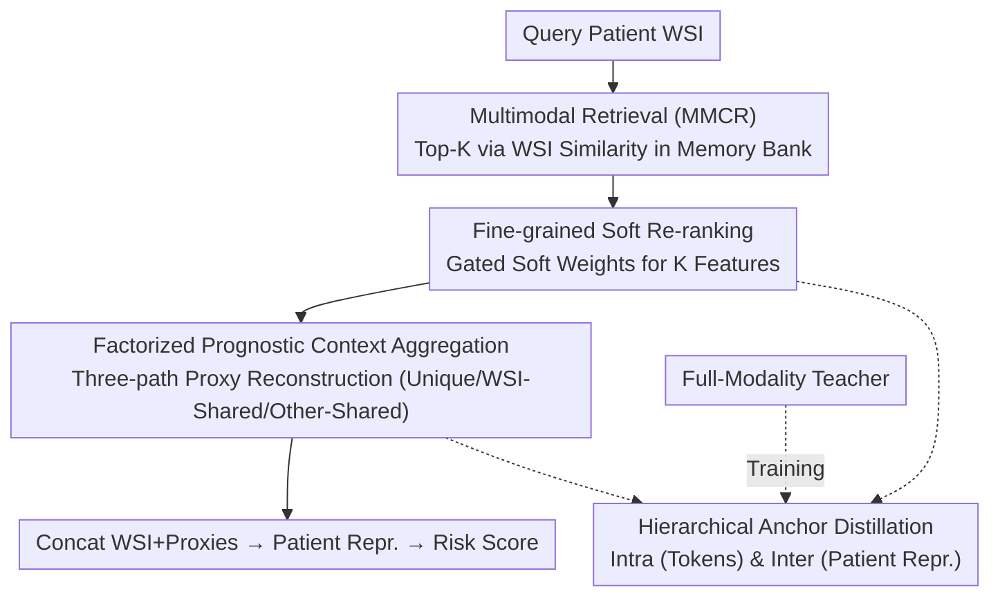

# Factorized Context Aggregation for Robust Cancer Risk Estimation via Soft Re-Ranked Retrieval and Hierarchical Anchors

**Conference**: CVPR 2026  
**Paper**: [CVF Open Access](https://openaccess.thecvf.com/content/CVPR2026/html/Moghadam_Factorized_Context_Aggregation_for_Robust_Cancer_Risk_Estimation_via_Soft_CVPR_2026_paper.html)  
**Code**: https://github.com/pazadimo/fca-robust-risk-estimation  
**Area**: Medical Imaging  
**Keywords**: Cancer Risk Prediction, Missing Modalities, Soft Re-ranked Retrieval, Factorized Context Aggregation, Teacher-Student Distillation  

## TL;DR
This paper addresses the clinical scenario where multimodal data (e.g., genomics, pathology reports) is available during training, but only Whole Slide Images (WSI) are available during inference. It proposes using WSI as an anchor to retrieve multimodal features of similar patients from a memory bank with soft re-ranking, followed by factorized cross-attention to reconstruct proxy representations of missing modalities into three paths: "modality-specific," "shared with WSI," and "shared with other modalities." Finally, it employs a full-modality teacher for hierarchical anchor distillation. Across 24 missing modality scenarios in 8 cancer types, it improves the survival prediction C-index to 0.617, a relative gain of ~8.5% over histology-only baselines, lagging only ~1.4% behind the full-modality upper bound.

## Background & Motivation
**Background**: Cancer survival and risk prediction are fundamental to personalized treatment. Recently, multimodal approaches—integrating WSIs with complementary modalities like gene expression, pathology reports, and clinical variables—have demonstrated superior prognostic power compared to unimodal histology models.

**Limitations of Prior Work**: Multimodal models typically assume all modalities are present. In reality, genomic sequencing is expensive, requires specialized equipment, and is tissue-destructive, leading to frequent data missingness; only WSI is routinely and universally available. This creates a gap between multimodal training and missing-modality inference. Existing methods for handling missing modalities fall into two categories: data-centric methods (imputation or generative reconstruction), which introduce noise and oversmooth salient features; and strategic methods (attention fusion, knowledge transfer, prompting), which focus only on cross-modal shared knowledge, losing critical modality-specific prognostic signals.

**Key Challenge**: In cancer risk prediction, each modality carries fine-grained, complementary prognostic clues (reports provide staging and expert judgment, histology provides microenvironment morphology, and genomics provide molecular drivers). Thus, it is essential to both recover unique information from missing modalities and utilize cross-modal shared information. Data-centric and strategic methods tackle these independently. Furthermore, the scalability of integrating WSIs ($100,000 \times 100,000$ pixels) with high-dimensional genomics ($60,000$ dimensions) is challenging. Existing targeted methods often make simplified assumptions, such as supporting only a single auxiliary modality or reducing the task to discrete risk classification.

**Goal**: Estimate a patient-level risk score robust to missing modalities, assuming only WSI is available at inference while any number/type of auxiliary modalities are accessible during training.

**Key Insight**: The authors hypothesize that effectively addressing missing modalities requires a hybrid of "data-centric (recovering unique signals)" and "strategy-centric (leveraging shared signals)" approaches. Instead of pixel-level generative reconstruction, the model retrieves proxy features from similar patients, based on the premise that patients with similar WSI morphology often share prognostic correlations in genomics and reports.

**Core Idea**: Using WSI as the sole anchor, multimodal features of the top-K similar patients are retrieved from a full-modality memory bank. These are assigned fine-grained importance weights via gated soft re-ranking. Factorized cross-attention then reconstructs proxy representations for each missing modality into "unique," "shared with WSI," and "shared with other modalities" components. A hierarchical anchor distillation process from a full-modality teacher constrains the entire retrieval-aggregation pipeline.

## Method

### Overall Architecture
For a query patient $P_q$, given only WSI $S_q$, the goal is to estimate a risk score $\hat r_q$. The workflow involves encoding full-modality patients from the training set into a **vectorized memory bank** $B$. At query time, WSI embeddings are used to retrieve the top-K similar patients and their multimodal features. For each missing modality, **soft re-ranking** assigns weights to these K features, and **Factorized Context Aggregation** reconstructs them into proxy representations $\hat C^j_q$. These are concatenated with the WSI to form a patient representation $R_q$, which is passed to the risk estimator. During training, a **teacher** with access to full modalities provides intra- and inter-level anchor distillation to align the student’s token-level and patient-level representations. At inference, neither the teacher nor the actual auxiliary modalities are required.

### Key Designs

**1. Multimodal Retrieval and Vectorized Memory: Retrieving "Ready-made" Missing Features via WSI Similarity**
To avoid the noise of pixel-level generation, the authors use retrieval. Foundation models (FM) for each modality encode the training set into a memory bank $B=\{F^{(WSI)}(S_n),\{F^{(m)}(C^{(m)}_n)\}_{m=1}^M\}_{n=1}^N$. For a query, the WSI FM extracts $z^{WSI}_q=F^{(WSI)}(S_q)$. The top-K similar patients $N_q=\mathrm{TopK}\big(\mathrm{sim}(z^{WSI}_q,z^{WSI}_n)\big)$ are identified, and their auxiliary features $\{\hat z^{(1)}_k,\dots,\hat z^{(M)}_k\}_{k\in N_q}$ are retrieved. Crucially, the authors avoid joint latent space retrieval, which oversmooths modality-specific semantics; WSI-based retrieval preserves unique information while maintaining morphological similarity.

**2. Fine-grained Soft Re-ranking: Modality-Specific Soft Weights to Avoid Oversmoothing**
Equally averaging top-K neighbors leads to oversmoothing and loss of prognostic differences. A **gated soft re-ranking** module stacks K retrieved features $\hat Z^{(m)}_q\in\mathbb R^{K\times d}$ and applies a learnable gate $h^{(m)}_q=\hat Z^{(m)}_q W_{gate}+B_{gate}$ to compute soft scores:
$$SR_{(q,m)}=\alpha+\sigma\big(h^{(m)}_q\big)$$
where $\sigma$ is the sigmoid function and $\alpha$ ensures a minimum contribution from each neighbor. These scores $SR_{(q,m)}\in\mathbb R^{K\times 1}$ are calculated independently for each modality, allowing the model to adaptively capture dependencies between retrieved content and risk characteristics.

**3. Factorized Prognostic Context Aggregation: Reconstruction via Unique, WSI-Shared, and Other-Shared Paths**
To avoid entangling unique and shared signals, proxy $\hat C^j_q$ for missing modality $j$ is reconstructed using **factorized** attention. Modality tokens $T^{(m)}_q$ are constructed from either observed WSI or weighted retrieved features. **Factorized cross-attention** uses $T^j_q$ as the query:
$$\hat C^j_q=\alpha^{j,j}_q f^j_V(T^j_q)+\alpha^{j,WSI}_q f^j_V(T^{WSI}_q)+\sum_{\ell\neq j}\alpha^{j,\ell}_q f^j_V(T^\ell_q)$$
These three terms represent **modality-specific unique information**, **information shared with WSI**, and **information shared with other auxiliary modalities**, respectively. This architecture unifies data-centric (unique recovery) and strategy-centric (shared alignment) approaches.

**4. Hierarchical Modality Anchors: Token-level and Patient-level Distillation**
A teacher model trained on full modalities acts as a distillation anchor. **Intra-Modality Anchors** align fine-grained generated tokens $T^{(m)}_n$ with the teacher's modality-specific representations via $L_{intra} = \frac{1}{N}\sum_n\sum_m D_{KL}(T^{(m)}_n \| R^{(m)}_{Teacher,n})$ to guide re-ranking. **Inter-Modality Anchors** align the student’s final patient representation $R_n$ with the teacher's via $L_{inter} = \frac{1}{N}\sum_n D_{KL}(R_n \| R_{Teacher,n})$, ensuring the overall multimodal structure is preserved.

### Loss & Training
The total loss is $L_{total}=L_{surv}+\lambda_{intra}L_{intra}+\lambda_{inter}L_{inter}$, where $L_{surv}$ is the Cox partial log-likelihood. WSI FMs (large MIL architecture) and Genomic FMs (BulkRNABert style) are self-trained to prevent data leakage, while reports are encoded using OpenBioLLaMA-7B.

## Key Experimental Results

### Main Results
Evaluated on 8 TCGA datasets across 24 missing-modality scenarios (H+G†, H+R†, H+G†+R†, where † signifies missing at inference).

| Config (Avg. C-index↑) | Histology Baseline | Best SOTA | Full Modality Upper Bound | Ours |
|------|------|------|------|------|
| H + G† | 0.569 | ~0.594 | 0.615 | **0.617** |
| H + R† | 0.569 | ~0.601 | 0.613 | **0.613** |
| H + G† + R† | 0.569 | ~0.604 | 0.649 | **0.621** |
| Overall | 0.569 | 0.597 | 0.626 | **0.617** |

Ours achieves the highest C-index in 16 out of 24 scenarios, with an overall gain of ~8.5% over the histology baseline and a gap of only ~1.4% from the upper bound. In the hardest H+G†+R† scenario, while many baselines degrade, the proposed method remains robust.

### Ablation Study
Incremental module addition (Overall Avg. C-index):

| Configuration | Overall C-index | Note |
|------|------|------|
| Histology Baseline | 0.569 | WSI only |
| + Soft Re-ranking (MMCR) | 0.593 | Retrieval + Weighting |
| + Factorized Context Aggregation | 0.607 | Surpasses previous SOTA |
| + Intra Anchor | 0.609 | Fine-grained distillation |
| + Inter Anchor (alone) | 0.609 | Patient-level distillation |
| Full (Hierarchical Anchors) | **0.617** | Complete model |

### Key Findings
- **Factorized Context Aggregation** is the most significant contributor (0.593→0.607). Decomposing proxies into unique/shared paths is more effective than simple retrieval.
- Both anchor levels are necessary; combined, they achieve 0.617.
- Retrieval depth K involves a trade-off: report retrieval (H+R†) favors lower K to avoid dilution, while genomics (H+G†) is more stable at medium-to-high K.
- The method is robust even when 40% of auxiliary modalities are missing during training.

## Highlights & Insights
- **"Retrieval as Proxy" instead of "Generation"**: Using existing features of similar patients sidesteps the artifacts and oversmoothing common in pixel-level generative models.
- **Factorized three-path attention** elegantly unifies data-centric and strategy-centric philosophies within a single mechanism.
- **WSI-only retrieval** (vs. joint latent space) is a strategic choice that preserves modality-specific signals.
- Enhanced robustness in double-modality missing scenarios suggests that soft re-ranking acts as a de-noising regularizer.

## Limitations & Future Work
- Dependence on a representative "full-modality reference pool"; its performance across institutional distribution shifts requires further validation.
- Requirement of a full-modality teacher during training might limit feasibility for data-poor institutions.
- Performance in clinical settings is still limited by the overall C-index range (0.55–0.68) and the exclusion of 3D imaging.
- Future directions: Modality-specific K selection and stronger distribution alignment objectives.

## Related Work & Insights
- **vs. Data-centric (CycleR, Shaspec)**: These methods reconstruct at the input level, risking noise; Ours uses retrieved proxies.
- **vs. Strategy-centric (EgoKD, CrossKD, AcMAE)**: These focus on shared knowledge but discard unique signals; Ours explicitly preserves them via the factorized path.
- **vs. LDVAE (CVPR'25)**: While LDVAE uses VAE for limited WSI+Genomics scenarios with discretized risk, Ours supports arbitrary modalities and continuous risk modeling, outperforming it in most scenarios.

## Rating
- Novelty: ⭐⭐⭐⭐⭐ 
- Experimental Thoroughness: ⭐⭐⭐⭐⭐ 
- Writing Quality: ⭐⭐⭐⭐ 
- Value: ⭐⭐⭐⭐⭐ 

<!-- RELATED:START -->

## Related Papers

- [\[ICML 2026\] Auditing Sybil: Explaining Deep Lung Cancer Risk Prediction Through Generative Interventional Attributions](../../ICML2026/medical_imaging/auditing_sybil_explaining_deep_lung_cancer_risk_prediction_through_generative_in.md)
- [\[NeurIPS 2025\] Mamba Goes HoME: Hierarchical Soft Mixture-of-Experts for 3D Medical Image Segmentation](../../NeurIPS2025/medical_imaging/mamba_goes_home_hierarchical_soft_mixture-of-experts_for_3d_medical_image_segmen.md)
- [\[CVPR 2026\] Better than Average: Spatially-Aware Aggregation of Segmentation Uncertainty Improves Downstream Performance](better_than_average_spatially-aware_aggregation_of_segmentation_uncertainty_impr.md)
- [\[CVPR 2026\] Real2Sim2Real: RetinalDepth-64K for Depth Estimation in Posterior Segment Ophthalmic Surgery](real2sim2real_retinaldepth-64k_for_depth_estimation_in_posterior_segment_ophthal.md)
- [\[CVPR 2026\] FedVG: Gradient-Guided Aggregation for Enhanced Federated Learning](fedvg_gradient-guided_aggregation_for_enhanced_federated_learning.md)

<!-- RELATED:END -->
