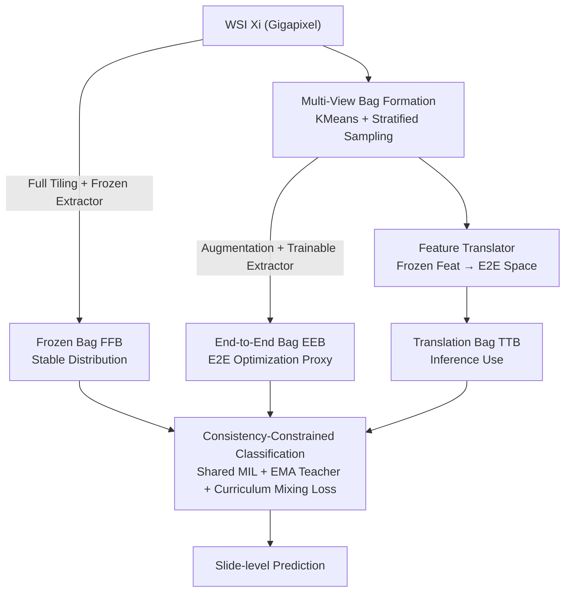

# FBTA: Enabling Single-GPU End-to-End Gigapixel WSI Classification with Feature Bridging and Translation Alignment

**Conference**: CVPR 2026  
**Paper**: [CVF Open Access](https://openaccess.thecvf.com/content/CVPR2026/html/Dong_FBTA_Enabling_Single-GPU_End-to-End_Gigapixel_WSI_Classification_with_Feature_Bridging_CVPR_2026_paper.html)  
**Code**: To be open-sourced (the paper states "The code will be available")  
**Area**: Medical Imaging  
**Keywords**: Computational Pathology, Whole Slide Image (WSI), Multiple Instance Learning (MIL), End-to-End Training, Feature Translation  

## TL;DR
FBTA employs "pseudo-bag proxy + feature translation + three-view consistency constraint" to compress Multiple Instance Learning (MIL) of gigapixel Whole Slide Images (WSI) into a single 24GB GPU for true end-to-end training. Compared to direct full-image end-to-end approaches, it achieves a speedup of over 100$\times$ and provides plug-and-play performance gains across three MIL architectures and two feature extractors (e.g., ABMIL accuracy +15.8% on STAD).

## Background & Motivation
**Background**: In computational pathology, a WSI at 20$\times$ magnification can reach $100,000 \times 100,000$ pixels, making it impossible to fit the entire image into a GPU. The mainstream approach is a two-stage "patch-to-bag" pipeline: first, the WSI is tiled into patches (instances), a **frozen** feature extractor $f_\text{FFE}$ encodes each patch into features for caching, and then a trainable MIL network $f_\text{MIL}$ aggregates these features for slide-level prediction.

**Limitations of Prior Work**: Since $f_\text{FFE}$ remains frozen and does not update with the downstream task, a **semantic gap** exists between the cached features and the classification objective. This gap persists whether the extractor is pre-trained on natural images or through self-supervision on pathology images, effectively capping classification performance.

**Key Challenge**: The root cause of this gap is that **memory constraints force the extractor to be frozen**. Eliminating the gap requires the extractor to participate in training (end-to-end). However, backpropagating through tens of thousands of patches from a single WSI is unfeasible; a single 24GB card (e.g., RTX 3090) can only hold approximately 400 instances.

**Goal**: Engineering-heavy solutions rely on multi-GPU model parallelism or gradient checkpointing, but these involve high hardware costs, system complexity, and slow training, making them difficult to deploy in hospital or clinical research environments. Algorithmic approaches like Local Learning use local supervision as a proxy for end-to-end training but are limited to low-magnification WSIs and remain computationally intensive. The authors emphasize: Prior to this work, **no method could perform true end-to-end MIL on 20$\times$ WSIs using a single 24GB GPU**.

**Core Idea**: It is unnecessary to run the entire WSI end-to-end. Ours uses a **representative subset of patches (pseudo-bag)** as a proxy to train the extractor, a **frozen view** to stabilize the training distribution, and a **feature translator** to "translate" cached frozen features into end-to-end features. This allows inference to reap the benefits of end-to-end training without the need to re-extract features for the entire image.

## Method

### Overall Architecture
FBTA consists of two steps. **Step 1: Multi-View Bag Formation**: For each WSI $X_i$, three complementary feature bags are constructed—① **Frozen Bag** $F^{FB}_i$ (features extracted from all patches using a frozen extractor); ② **End-to-End Bag** $F^{EB}_i$ (representative patches $X^{SB}_i$ selected via KMeans clustering + stratified sampling, augmented, and passed through a **trainable** extractor $f_\text{TFE}$); ③ **Translation Bag** $F^{TB}_i$ (a trainable translator $f_T$ maps the frozen features $F^{SB}_i$ of the subset into the end-to-end feature space). The instances in these bags correspond one-to-one. **Step 2: Consistency-Constrained Bag Classification**: The three bags share the same MIL network $f_\text{MIL}$ for prediction, with an EMA teacher providing temporally smoothed consistency supervision. The networks $f_\text{TFE}$, $f_\text{MIL}$, and $f_T$ are updated jointly.

The key to understanding the framework lies in the roles of the three views: $F^{EB}_i$ contains very few instances ($CM \ll N_i$) and acts as the **proxy for end-to-end optimization**; $F^{FB}_i$ has a stable distribution to **stabilize MIL training**; $F^{TB}_i$ ensures that **expensive feature re-extraction is avoided during inference**.

### Key Designs

**1. Multi-View Bag Formation: Using Pseudo-Bags to Bypass the Memory Wall**

The pain point is direct: end-to-end backpropagation of tens of thousands of patches exceeds single-card memory. Borrowing the insight from DBPAug that "pseudo-bags constructed via Instance Sampling without Replacement (ISR) are sufficient to represent the WSI," Ours combines ISR with **KMeans clustering and stratified sampling**. Frozen features $F^{FB}_i$ are clustered into $C$ clusters. $M$ instances are randomly sampled from each cluster to form the patch subset $X^{SB}_i$ and its corresponding features $F^{SB}_i$. Stratified sampling ensures every histological pattern is represented. The subset patches, after random augmentation $X^{AB}_i$, are fed into the **trainable** extractor $f_\text{TFE}$ (same architecture as $f_\text{FFE}$) to produce the end-to-end pseudo-bag $F^{EB}_i$. Since only $CM \ll N_i$ instances are involved, the overhead is reduced to a single card—experimentally, with $M{=}1$, a single iteration can handle 50,000+ instances, and ABMIL requires only ~8GB VRAM.

**2. Feature Translator: "Translating" Frozen Features to End-to-End Space**

A new challenge arises during inference: to benefit from end-to-end training, one would normally need to re-extract features for all patches using $f_\text{TFE}$, which is extremely slow (approx. 120 minutes on the validation set). FBTA introduces an instance-level translator $f_T$ to map cached frozen features $F^{SB}_i$ into the end-to-end feature space while maintaining the sequence order. $f_T$ consists of $K$ **parallel MLP heads with residual connections**, with the output averaged: $F^{TB}_i = \frac{1}{K}\sum_{k=1}^{K} f_{T[k]}(F^{SB}_i)$. This multi-head ensemble makes the translator robust when tracking the "rapidly changing target $F^{EB}_i$ during training." Translation is over 200$\times$ faster than re-extraction (120 min $\to$ 27 s).

**3. Consistency-Constrained Bag Classification: EMA Teacher + Curriculum Mixed Loss**

The three views share one $f_\text{MIL}$ and produce predictions $\tilde{Y}^{FB}_i, \tilde{Y}^{EB}_i, \tilde{Y}^{TB}_i$. First, the cross-entropy loss $L_{i,\text{cls}}$ is calculated. Because $f_\text{TFE}$ changes at every step, the end-to-end feature distribution is unstable. An EMA teacher $f^{*}_\text{MIL}$ is introduced to provide smooth supervision and consistency constraints (where $\phi(\cdot)$ is the cosine similarity consistency loss):

$$L_{i,\text{cls}*} = \phi(\tilde{Y}^{FB}_i, \hat{Y}^{FB}_i) + \phi(\tilde{Y}^{EB}_i, \hat{Y}^{EB}_i) + \phi(\tilde{Y}^{TB}_i, \hat{Y}^{TB}_i)$$

Similarly, an EMA version of the trainable extractor $f^{*}_\text{TFE}$ provides a smooth target for the translator via $L_2$ distance: $L^{TB}_{i,\text{dist}} = \frac{1}{K}\sum_{k=1}^{K} L_2\big(f_{T[k]}(F^{SB}_i),\, f^{*}_\text{TFE}(X^{SB}_i)\big)$. The final total loss uses a **curriculum coefficient** $t/T$ (current/total epoch) for the EMA classification term to prevent strong constraints from an unstable early-stage teacher:

$$L_i = L^{TB}_{i,\text{dist}} + L_{i,\text{cls}} + (t/T)\cdot L_{i,\text{cls}*}$$

### Loss & Training
During inference, the translator $f_T$ maps the cached frozen bag $F^{FB}_i$ containing **all** instances into the end-to-end space, and the EMA teacher $f^{*}_\text{MIL}$ produces the final prediction: $\tilde{Y}^{EB}_i = f^{*}_\text{MIL}(f_T(F^{FB}_i))$. Hyperparameters: $C{=}100$, $M{\in}\{1,2\}$, Number of MLP heads $K{=}10$.

## Key Experimental Results

Experiments were conducted on TCGA-NSCLC (LUAD vs. LUSC, few-shot settings) and TCGA-STAD (three-class classification). Patches are $256 \times 256$ at 20$\times$ magnification. Hardware: single 24GB RTX 3090.

### Main Results (Plug-and-play Gains with ImageNet Pre-trained Extractor)
FBTA serves as a plug-and-play framework, consistently improving ABMIL, TransMIL, and MambaMIL across ResNet-50 and ViT-B/32 extractors. Representative ResNet-50 results (AUC / ACC / F1, %):

| Dataset | MIL | Vanilla (AUC/ACC/F1) | +FBTA (AUC/ACC/F1) | Gain (ACC) |
|--------|-----|----------------------|--------------------|----------|
| STAD | ABMIL | 67.9 / 42.5 / 34.0 | 70.6 / 58.3 / 57.1 | **+15.8%** |
| STAD | MambaMIL | 75.9 / 55.0 / 53.1 | 78.3 / 64.2 / 63.6 | +9.2% |
| NSCLC-Shot50 | ABMIL | 75.7 / 68.4 / 69.5 | 90.2 / 81.5 / 80.8 | **+13.1%** |
| NSCLC-Shot100| ABMIL | 84.7 / 70.5 / 71.5 | 91.2 / 82.9 / 82.6 | +12.4% |

Key Observation: With FBTA, classic ABMIL performance approaches that of SOTA MambaMIL, effectively closing the gap between traditional and modern MIL architectures.

### Efficiency Comparison (vs. Full-Image End-to-End / Local Learning)

| Method | NSCLC-S20 AUC | NSCLC-S20 ACC | Time per Epoch | Memory |
|------|--------------|--------------|--------------|------|
| Direct/LoRA Fine-tuning | — | — | — | **OOM** |
| Local Learning | 72.1 | 68.4 | 306 s | 24 GB |
| ABMIL+FBTA | **82.1** | **73.3** | **27 s** | **4 GB** |

### Ablation Study (View Contribution, NSCLC-Shot20)

| Views Used | Avg AUC | Avg ACC | Note |
|------------|---------|---------|------|
| Vanilla MIL | 74.3 | 67.1 | Baseline |
| $F^{EB}_i$ Only | 73.2 | 66.2 | E2E only; domain shift masks gains |
| $F^{EB}_i + F^{FB}_i$ | 76.8 | 69.3 | Frozen bag stabilizes training |
| $F^{EB}_i + F^{FB}_i + F^{TB}_i$ | 77.6 | 71.0 | Full FBTA; optimal performance |

### Key Findings
- **Frozen view acts as a "stabilizer"**: Using only end-to-end features performs similarly to the vanilla baseline due to distribution shifts. Including the frozen bag suppresses domain bias and stabilizes MIL training.
- **Translator is the key to deployment**: The 200$\times$ speedup (120 min $\to$ 27 s) makes hyperparameter tuning and fast inference feasible.
- **Greater gains on scarce data and difficult tasks**: On the fine-grained STAD three-class task, ABMIL accuracy increased by 15.8%, demonstrating FBTA's effectiveness in few-shot scenarios.

## Highlights & Insights
- **Decoupled "Three-view" Strategy**: The framework decouples "end-to-end optimization," "training stability," and "inference efficiency" into three views, which are unified by consistency losses. This strategy can be transferred to other large-input tasks.
- **Engineering solutions for "Moving Targets"**: Instead of forcing the translator to be perfect, it uses a multi-head MLP ensemble to robustly approximate the shifting end-to-end target, coupled with EMA teacher smoothing.
- **Curriculum consistency weighting ($t/T$)**: A low-cost trick to avoid over-reliance on an unstable teacher during early training stages.

## Limitations & Future Work
- Evaluation focused on TCGA-NSCLC/STAD few-shot subsets; generalization on large-scale, multi-center datasets across more cancer types is yet to be fully verified.
- While Lipschitz analysis supports using $F^{TB}_i$ as a proxy, translation remains an approximation; error rates in extreme histological patterns are not discussed.
- Pseudo-bags rely on sampling; extremely small tumor regions might be missed, which is why KMeans stratified sampling was chosen, though robustness remains an open question.

## Related Work & Insights
- **vs. Two-stage Frozen MIL**: Existing methods (ABMIL/TransMIL) leave a semantic gap; FBTA fills this gap by allowing end-to-end training.
- **vs. Engineering Approaches**: FBTA lowers the barrier for end-to-end MIL from multi-GPU clusters to a single consumer-grade card (4GB-8GB VRAM).
- **vs. Local Learning**: FBTA enables true end-to-end training at 20$\times$ magnification with 10$\times$ faster training and superior performance.

## Rating
- Novelty: ⭐⭐⭐⭐⭐ 
- Experimental Thoroughness: ⭐⭐⭐⭐ 
- Writing Quality: ⭐⭐⭐⭐ 
- Value: ⭐⭐⭐⭐⭐ 

<!-- RELATED:START -->

## Related Papers

- [\[CVPR 2026\] Turning Pre-Trained Vision Transformers into End-to-End Histopathology Whole Slide Image Models for Survival Prediction](turning_pre-trained_vision_transformers_into_end-to-end_histopathology_whole_sli.md)
- [\[NeurIPS 2025\] Revisiting End-to-End Learning with Slide-level Supervision in Computational Pathology](../../NeurIPS2025/medical_imaging/revisiting_end-to-end_learning_with_slide-level_supervision_in_computational_pat.md)
- [\[CVPR 2026\] Post-training Feature Pruning for Fundus Images Classification](post-training_feature_pruning_for_fundus_images_classification.md)
- [\[CVPR 2026\] Dual-Level Hypergraph Generation for Addressing Feature Scarcity in Whole-Slide Image Classification](dual-level_hypergraph_generation_for_addressing_feature_scarcity_in_whole-slide_.md)
- [\[CVPR 2026\] SAR2Net: Learning Spatially Anchored Representations for Retrieval-Guided Cross-Stain Alignment](sar2net_learning_spatially_anchored_representations_for_retrieval-guided_cross-s.md)

<!-- RELATED:END -->
