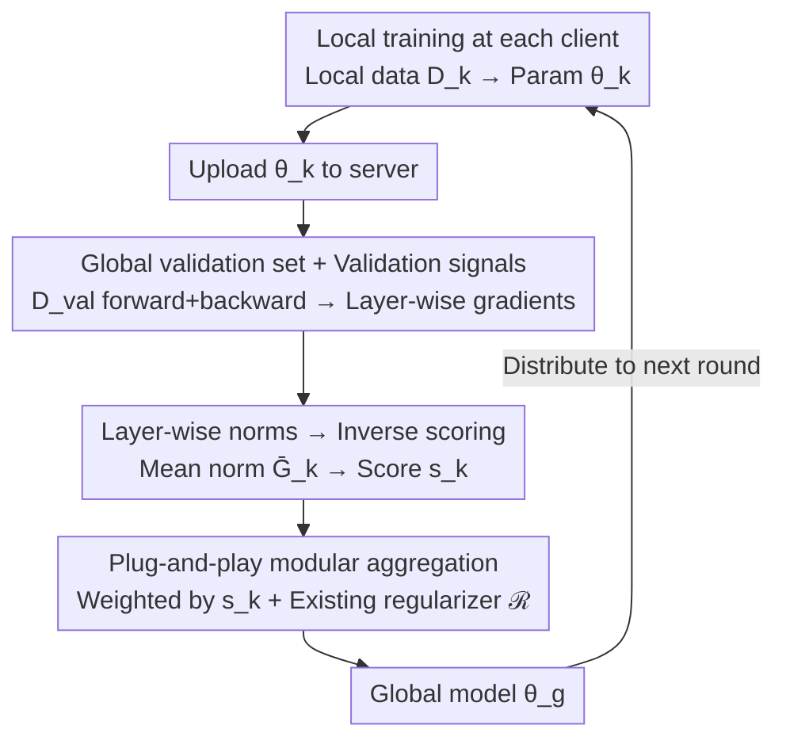

# FedVG: Gradient-Guided Aggregation for Enhanced Federated Learning

**Conference**: CVPR 2026 Findings  
**arXiv**: [2602.21399](https://arxiv.org/abs/2602.21399)  
**Code**: [Project Page](https://machine-intelligence-lab-wvu.github.io/fedvg/)  
**Area**: Medical Imaging / Federated Learning  
**Keywords**: Federated Learning, Gradient Aggregation, Data Heterogeneity, Validation Gradient, Fisher Information Matrix, Medical Image Classification

## TL;DR

FedVG proposes scoring each client using layer-wise gradient norms on a global validation set. Clients with flatter gradients (smaller norms) receive higher aggregation weights, significantly enhancing the generalization performance of federated learning in highly heterogeneous data scenarios.

## Background & Motivation

1.  **Client Drift in Federated Learning**: Standard FedAvg aggregates based on data volume, ignoring model drift caused by differences in client data distributions. This leads to severe performance degradation of the global model in non-IID scenarios.
2.  **Data Volume $\neq$ Model Quality**: Existing methods assume that clients with more data are more reliable. However, under heterogeneous distributions, a client with a large amount of skewed data may degrade the global model.
3.  **Over-emphasis on Poorly Performing Clients**: Some methods assign excessively high weights to "compensate" for poorly performing clients, which exacerbates aggregation bias.
4.  **Bias in Local Gradients**: Gradients calculated solely on local data are inherently biased towards local distributions and cannot objectively reflect the generalization ability of the client model.
5.  **Neglected Layer-wise Behavioral Differences**: Convergence behavior and drift levels differ across layers in non-IID scenarios. Deeper layers are particularly susceptible to local bias, yet existing methods rarely conduct layer-wise analysis.
6.  **Urgent Needs in the Medical Field**: Medical imaging data is naturally distributed across different institutions. Restricted by privacy regulations, it cannot be centralized, necessitating robust federated learning solutions to train high-quality diagnostic models.

## Method

### Overall Architecture

FedVG aims to solve the inherent flaw of "aggregation by data volume" in federated learning: in non-IID scenarios, clients with large but skewed data distributions can misguide the global model. The core idea is to maintain an additional **global validation set** $D_{\text{val}}$ at the server (which can be constructed from public datasets) to serve as a "neutral touchstone" for measuring generalization. Within one communication round: clients perform local training as usual and transmit parameters $\theta_k$ to the server; the server performs a forward and backward pass for each client model using $D_{\text{val}}$ to obtain **layer-wise validation gradients** (signal extraction); the layer-wise gradient norms are averaged and used for inverse-proportional scoring to obtain client scores $s_k$ (scoring mechanism); finally, the global model is aggregated using weights $s_k$ and distributed for the next round (aggregation strategy). Local training remains unchanged, as all discriminatory logic is moved to the server.

### Key Designs

**1. Global Validation Set + Validation Gradient Signals: Using a Neutral Reference Set to Evaluate Clients**

The first step is determining the evaluation criterion. Since local data is inherently skewed, monitoring local training gradients only captures signals biased by local distributions, failing to reflect true generalization. FedVG introduces a **fixed validation set** $D_{\text{val}}$ on the server, constructed from public data of the same modality and category as the target task. Crucially, the method uses **gradients instead of validation loss** as the signal. The paper notes that classification heads often absorb most local data bias, causing validation loss to over-reflect the performance of the final layer while masking representation mismatches in deeper layers. Validation gradients reflect not only "current performance" but also "how much and in what direction parameters need to adjust for better generalization," providing richer information.

**2. Layer-wise Norms → Inverse Proportional Scoring: Using Loss Landscape Flatness to Measure Client Quality**

Once validation gradients are obtained, they are compressed into a comparable scalar score. The criterion is: a flatter loss landscape on the validation set indicates stronger generalization. Specifically, the client model $\theta_k$ is decomposed into $L$ layers, and the mean of the layer-wise validation gradient norms is calculated:

$$\bar{G}_k = \frac{1}{L} \sum_{\ell=1}^{L} \left\| \nabla_{\theta_k^{(\ell)}} \mathcal{L}_{\text{val}} \right\|$$

Layer-wise analysis is preferred over treating the model as a whole because deeper layers drift more severely under non-IID conditions; this approach captures these differences more precisely. Subsequently, inverse-proportional normalization is applied—smaller norms indicate the model resides in a flatter region and requires minimal adjustment, thus receiving higher weights:

$$s_k = \frac{1/(\bar{G}_k + \epsilon)}{\sum_{j=1}^{K} 1/(\bar{G}_j + \epsilon)}$$

This is grounded in theory: the cross-entropy gradient is the score function of the log-likelihood, and its norm is proportional to the square root of the diagonal approximation of the Fisher Information Matrix (Joint Fisher). Since low Fisher Information corresponds to flat minima and better generalization, the "small gradient norm → high weight" logic has an information-theoretic basis.

**3. Plug-and-Play Modular Integration: Modifying Weights Only**

FedVG defines a general aggregation rule as $\theta_g^{t+1} = \left(\theta_g^t - \sum_{k} s_k \cdot \Delta\theta_k^{t+1}\right) + \mathcal{R}^{t+1}$, where $\mathcal{R}^{t+1}$ represents specific regularization or correction terms (e.g., 0 for FedAvg, dynamic regularization for FedDyn, or control variables for Scaffold). FedVG only replaces the client weight $s_k$ with the gradient-based score (or an average with the original weight). This allows it to be seamlessly integrated with algorithms like FedAvg, FedProx, Scaffold, FedDyn, and FedAvgM as a plug-and-play module. There is zero additional overhead on the client side, as all gradient computations are performed on the server.

### Loss & Training

Local client training still utilizes the original task loss (e.g., cross-entropy). Ours **does not introduce additional loss terms**, only adjusting aggregation weights via validation gradient norms, thereby keeping client computational overhead constant.

## Key Experimental Results

### Main Results: Performance under Different Heterogeneity Levels

On CIFAR-10 (ResNet-18), OrganAMNIST, and COVID19 (ResNet-50), with heterogeneity controlled by Dirichlet $\alpha \in \{100, 10, 1, 0.1, 0.05\}$:

| Method | CIFAR-10 (α=0.05) | OrganAMNIST (All α) | COVID19 (α=0.05) |
|------|-------------------|---------------------|-------------------|
| FedAvg | Significantly lower | Lower than FedVG | Lower than FedVG |
| FedProx | Lower than FedVG | Lower than FedVG | Lower than FedVG |
| Scaffold | Medium | Lower than FedVG | Near but lower |
| FedDyn | Significantly lower (p<0.05) | Lower than FedVG | Lower than FedVG |
| **FedVG** | **Highest/Near Highest** | **Best for all α** | **Best for α=0.05** |

- Wilcoxon Test: FedVG significantly outperforms FedDyn at all $\alpha$ levels (p < 0.05), and no baseline significantly outperforms FedVG at any $\alpha$.
- ViT Experiments (ViT-S/16, ViT-B/16): FedVG maintains optimal performance under high heterogeneity, validating its effectiveness across non-CNN architectures.

### External Validation

Using STL-10 and CIFAR-100 as external validation sets (different from the training distribution) at $\alpha=0.1/0.05$:

| Val Set | α=0.1 | α=0.05 |
|--------|-------|--------|
| Original (CIFAR-10 sub) | 61.06% | 53.58% |
| STL-10 | 59.32% | 53.85% |
| CIFAR-100 | 58.83% | 52.62% |

FedVG maintains superior performance over baselines even when the validation set exhibits distribution shift.

### Ablation Study

- **Validation Set Class Imbalance**: As the imbalance ratio $\rho \to 0$, FedVG consistently outperforms FedAvg, demonstrating robustness to imbalanced validation sets.
- **Norm Types**: L1 and L2 norms both correctly identify high-quality clients; spectral and delta norms perform worse. L1 (70.36%) and L2 (70.43%) are similar and better than spectral norm (68.50%).
- **Aggregation Granularity**: Model-level (default) is optimal for CIFAR-10/OrganAMNIST. Layer-wise or block-wise aggregation shows slight advantages for COVID19/DermaMNIST (ResNet-50).

## Highlights & Insights

- **Simplicity and Efficiency**: The core idea is clear—measuring generalization via validation gradient flatness without complex regularization.
- **Solid Theoretical Foundation**: Establishes a clear link with the Fisher Information Matrix, providing an information-theoretic justification for using gradient norms as a generalization metric.
- **Plug-and-Play**: Modifies only the server-side aggregation weights, requiring no changes to client training and integrating seamlessly with 6 major FL algorithms.
- **Comprehensive Evaluation**: Extensive testing across 5 datasets, 3 architectures, 5 levels of heterogeneity, and multiple ablation studies.
- **Privacy-Friendly**: Uses public data for the validation set; all gradient computations are processed at the server without increasing client burden.

## Limitations & Future Work

- **Validation Set Assumption**: Requires a publicly available dataset relevant to the target task, which may be difficult to obtain in some specialized medical fields.
- **Risk of Overlap**: Domain similarity or shared samples between the validation set and specific client data could introduce unfair bias.
- **Server Overhead**: Requires a full forward and backward pass for every participating client model in each round, which is computationally expensive for many clients or large models.
- **Granularity Selection**: The effectiveness of model-level vs. layer-level aggregation varies by scenario; an adaptive selection mechanism is currently missing.
- **Coverage of Complex Scenarios**: Has not yet been tested against heterogeneous model architectures or dynamic client participation.

## Related Work & Insights

| Method | Core Idea | Difference from FedVG |
|------|---------|----------------|
| FedAvg | Data-volume weighting | Ignores model quality; poor in high heterogeneity |
| FedProx | Proximal regularization | Client-side modification; FedVG is server-side |
| Scaffold | Control variables | Requires extra communication for variables |
| FedDyn | Dynamic regularization | Statistically significantly lower than FedVG |
| Elastic | Sensitivity-based interpolation | Strong baseline; FedVG+Elastic further improves |
| FedMD/FedDF | Knowledge distillation | Uses public data for training; FedVG uses it for scoring |
| FedNCL/FedMA | Layer-wise aggregation | Focuses on alignment; does not use validation gradients |

## Rating

- Novelty: ⭐⭐⭐⭐ — Using validation gradient norms as a client generalization metric is innovative with deep theoretical links.
- Experimental Thoroughness: ⭐⭐⭐⭐⭐ — Covers multiple datasets, architectures, and external validation sets extensively.
- Writing Quality: ⭐⭐⭐⭐ — Clear structure with complete theoretical derivation and intuitive illustrations.
- Value: ⭐⭐⭐⭐ — Practical and plug-and-play; directly applicable to privacy-sensitive federated learning.

<!-- RELATED:START -->

## Related Papers

- [\[CVPR 2026\] OmniFM: Toward Modality-Robust and Task-Agnostic Federated Learning for Heterogeneous Medical Imaging](omnifm_toward_modality-robust_and_task-agnostic_federated_learning_for_heterogen.md)
- [\[CVPR 2025\] DFLMoE: Decentralized Federated Learning via Mixture of Experts for Medical Data](../../CVPR2025/medical_imaging/dflmoe_decentralized_federated_learning_via_mixture_of_experts_for_medical_data_.md)
- [\[CVPR 2026\] Personalized Longitudinal Medical Report Generation via Temporally-Aware Federated Adaptation](personalized_longitudinal_medical_report_generation_via_temporally-aware_federat.md)
- [\[CVPR 2026\] IEBGL:An Interpretability-Enhanced Brain Graph Learning Framework with LLM-Instructed Topology and Literature-Augmented Semantics](iebglan_interpretability-enhanced_brain_graph_learning_framework_with_llm-instru.md)
- [\[CVPR 2026\] Better than Average: Spatially-Aware Aggregation of Segmentation Uncertainty Improves Downstream Performance](better_than_average_spatially-aware_aggregation_of_segmentation_uncertainty_impr.md)

<!-- RELATED:END -->
