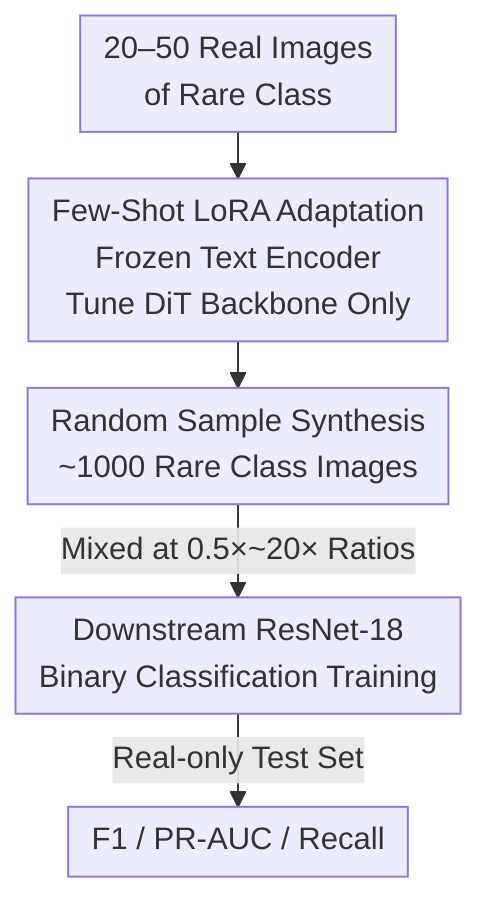

# Few-Shot Synthetic Data Generation with Diffusion Models for Downstream Vision Tasks

**Conference**: CVPR 2026  
**arXiv**: [2605.11898](https://arxiv.org/abs/2605.11898)  
**Code**: None  
**Area**: Medical Imaging / Diffusion Models / Data Augmentation  
**Keywords**: Few-shot, LoRA Fine-tuning, Synthetic Data Augmentation, Class Imbalance, Rare Class Detection

## TL;DR
Using only 20–50 real images of rare classes to fine-tune a pre-trained diffusion model (FLUX.2-dev) via LoRA, approximately 1000 synthetic samples are generated to supplement the positive class. Across vastly different domains—chest X-ray pathology classification and industrial magnetic tile crack detection—the F1/Recall of rare classes improved significantly (Chest X-ray F1 from 0.193 to 0.686, Magnetic Tile F1 from 0.051 to 0.296).

## Background & Motivation
**Background**: In safety-critical and industrial scenarios, rare events (rare pathologies, occasional defects) inherently possess very few samples, leading to poor recall for the positive class in classifiers. Standard countermeasures involve data augmentation, but traditional methods are limited to geometric/photometric transformations and cannot introduce "novel" visual variations.

**Limitations of Prior Work**: While diffusion models can synthesize semantically meaningful new samples, training or adapting these models typically requires large datasets and substantial compute. They are nearly unusable in few-shot scenarios where **only dozens of positive samples** are available.

**Key Challenge**: The nature of rare classes is "minimal positive samples," and the generative models capable of producing them conversely require large volumes of data for training—a classic "chicken and egg" cycle.

**Goal**: To verify a pragmatic question: Can Parameter-Efficient Fine-Tuning (LoRA) adapt a **pre-trained** diffusion model from a minimal real set (20–50 images) to output batches of synthetic samples for downstream training? Furthermore, to quantify the impact of the "synthetic-to-real ratio" on downstream performance.

**Key Insight**: Instead of training a generative model from scratch, this work leverages the existing priors of large-scale text-to-image diffusion models. LoRA is used solely to learn "what this rare class looks like," with diversity derived entirely from random seeds during sampling, avoiding complex prompt engineering.

**Core Idea**: Construct a lightweight, cross-domain reusable pipeline for rare class augmentation using LoRA-adapted diffusion models and systematic scanning of synthetic-to-real ratios.

## Method

### Overall Architecture
The pipeline consists of three sequential steps: ① LoRA fine-tuning of a pre-trained diffusion model using ~50 real rare-class images; ② Batch sampling of ~1000 synthetic images using the fine-tuned adapter; ③ Mixing these synthetic images into the downstream classifier's positive training set at varying ratios, evaluated on a **held-out test set containing only real images**. The approach is intentionally simplistic—no manual filtering of generated images, no prompt augmentation, and no extra labeling—to isolate the utility of "vanilla few-shot diffusion augmentation."

### Key Designs

**1. Few-Shot LoRA Adaptation: Specializing Large Models with Minimal Data**

The pain point is the scarcity of samples. This work performs DreamBooth-style LoRA fine-tuning on the FLUX.2-dev pre-trained text-to-image model. Low-rank updates are inserted only into the DiT transformer backbone, while the two text encoders remain frozen. This allows "memorizing" the target class appearance with minimal parameter updates. Settings include rank $r=64$, $\alpha=8$, dropout $0.08$, trained for 200 steps using 8-bit AdamW in bf16 mixed precision at a learning rate of $5\times10^{-3}$. To fit into a single A100 80GB, the transformer is NF4-quantized during training. A fixed caption ("a photo of <class name>") is used for all images. The design relies on the pre-trained prior for most generative capabilities, requiring only 20–50 images for adaptation.

**2. Pure Random Seed-Driven Synthetic Sampling: Diversity via Noise, Not Prompts**

To ensure diversity without mode collapse, the authors use a restrained approach: each adapter samples ~1000 images at $512\times512$ resolution, with 20–24 denoising steps and a Classifier-Free Guidance (CFG) scale of 1.5–2.5. **Diversity stems entirely from random sampling across different seeds**, excluding prompt augmentation or multiple caption templates. Since LoRA is trained only on the rare class, the model primarily generates that class, naturally labeling the output as the positive class. Validation via LPIPS and PSNR distributions shows PSNR values close to real images (preserving low-level structure) and LPIPS distributions with slight semantic-level shifts, indicating added diversity without collapse.

**3. Synthetic/Real Ratio Scanning + Real-only Evaluation: Quantifying Utility**

To determine the optimal volume of synthetic data, the study scans six synthetic/real ratios ($0.5\times$, $1\times$, $2\times$, $4\times$, $10\times$, $20\times$), plus a "no-synth" baseline (~50 real samples) and a "synth-only" setting. The downstream model is an ImageNet-pre-trained ResNet-18 with a binary classification head, using `BCEWithLogitsLoss` with inverse class frequency weighting. All configurations share a **real-only** held-out test set with 5-fold cross-validation reporting F1, PR-AUC, and Recall. This protocol reveals that moderate augmentation yields maximum gains, while excessive augmentation leads to diminishing returns or slight degradation.

### Loss & Training
The downstream classifier utilizes `BCEWithLogitsLoss` with positive class weights set to the inverse of the class ratio. The diffusion adaptation stage follows the standard DreamBooth-LoRA objective. Both stages are independent; the generator and discriminator are not jointly trained.

## Key Experimental Results

### Main Results
Both domains represent severely imbalanced binary classification (Magnetic tile crack vs. non-crack; Chest X-ray rare pathology vs. normal). The following table shows performance across varied synthetic ratios (5-fold average on real-only test set):

| Dataset | Synthetic Ratio | F1 | PR-AUC | Recall |
|--------|---------|------|--------|--------|
| Magnetic Tiles | 0× (Baseline) | 0.051 | 0.141 | 0.063 |
| Magnetic Tiles | 4× (Best F1) | **0.296** | 0.313 | 0.423 |
| Magnetic Tiles | 20× | 0.235 | 0.311 | **0.658** |
| Magnetic Tiles | synth-only 20× | 0.310 | 0.375 | 0.614 |
| Chest X-ray | 0× (Baseline) | 0.193 | 0.846 | 0.130 |
| Chest X-ray | 4× (Best F1) | **0.686** | 0.677 | 0.744 |
| Chest X-ray | 20× | 0.537 | 0.741 | 0.540 |
| Chest X-ray | synth-only 20× | 0.439 | 0.738 | 0.465 |

On Magnetic Tiles, F1 increased nearly six-fold from 0.051 to 0.296 at a 4× ratio. On Chest X-rays, F1 rose from 0.193 to 0.686. Recall scaled monotonically with synthetic volume, reaching 0.658 at 20× for tiles, indicating significantly enhanced detection of rare defects.

### Ablation Study
The core "ablation" is the ratio scanning and the synth-only comparison:

| Configuration | Key Finding | Description |
|------|---------|------|
| no-synth baseline | Extremely low F1 | With ~50 real positives, the model barely learns the rare class. |
| Moderate augmentation (4×) | Highest F1 in both domains | The "sweet spot" for maximum gain. |
| Excessive augmentation (10×–20×) | F1 drops, Recall rises | Diminishing returns; over-sampling distorts the training distribution. |
| synth-only (20×) | Respectable Recall but lags overall | Synthetic data is better suited for augmentation than total replacement. |

### Key Findings
- **Moderation is Optimal**: Peak F1 for both domains occurs at 4×; beyond this, F1 declines as excessive synthetic samples distort the distribution.
- **Recall/F1 Decoupling**: Higher synthetic volumes increase Recall, but decreased precision lowers F1, suggesting models become more aggressive but more prone to false positives.
- **Augment over Replace**: "Synth-only" performance is generally inferior to "real + synthetic" mixtures.
- **Cross-Domain Robustness**: Consistent trends across medical imaging and industrial defects—despite different modalities and structures—confirm the transferability of pre-trained diffusion priors.
- **Generation Quality Diagnosis**: LPIPS/PSNR distributions show synthetic samples preserve low-level structures while introducing semantic diversity without mode collapse.

## Highlights & Insights
- **Lowering the "Few-Shot" Threshold**: Using LoRA and pre-trained priors brings diffusion augmentation to extreme 20–50 image scenarios where data was previously insufficient.
- **Minimalist "Control Experiment" Design**: By avoiding filtering and prompt engineering, the work cleanly proves the inherent efficacy of vanilla few-shot diffusion augmentation.
- **Actionable Engineering Conclusions**: The 4× "sweet spot" provides more practical guidance for deployment than a single SOTA point.
- **Smart Cross-Domain Validation**: Success in both medical (grayscale textures) and industrial (local defects) domains strongly supports the claim of generalizability.

## Limitations & Future Work
- **Low Absolute Metrics**: A peak F1 of 0.296 on Magnetic Tiles is far from practical; the paper proves "relative improvement" rather than "deployable accuracy."
- **Lack of Rigid Baselines**: Missing horizontal comparisons against geometric augmentation, GANs, or other diffusion techniques makes it difficult to judge the cost-benefit vs. cheaper alternatives.
- **PR-AUC Inconsistency**: The Chest X-ray baseline PR-AUC (0.846) dropped in some augmented configurations, suggesting enhancement primary affects Recall/F1 at specific thresholds rather than overall ranking capability.
- **Single Rare Class per Domain**: Generalization is based on single-class tasks; scalability to multi-class or detection/segmentation is unverified.
- **Future Directions**: Lightweight quality filtering, combining with traditional augmentation, and adaptive ratio selection could further improve performance.

## Related Work & Insights
- **vs. Azizi et al. (Synthetic data for ImageNet)**: While they use diffusion for large-scale classification, this work adapts the concept to **extreme few-shot rare class** scenarios (20–50 images).
- **vs. DreamBooth / Custom Diffusion**: These focus on generation quality of new concepts; this work repurposes the paradigm for **downstream discriminative utility**.
- **vs. RoentGen (Medical Diffusion)**: Unlike prior work relying on domain-specific models or large data, this emphasizes a **few-shot cross-domain pipeline** evaluated by downstream metrics.

## Rating
- Novelty: ⭐⭐⭐ (Combines existing LoRA/DreamBooth/Diffusion techniques; innovation lies in extreme simplification and cross-domain validation.)
- Experimental Thoroughness: ⭐⭐⭐ (Solid 5-fold cross-validation and ratio scanning, but lacks broad baselines and multi-class tests.)
- Writing Quality: ⭐⭐⭐⭐ (Clear motivation, concise workflow, and actionable conclusions.)
- Value: ⭐⭐⭐⭐ (Provides a low-cost, reproducible augmentation strategy for data-scarce scenarios.)

<!-- RELATED:START -->

## Related Papers

- [\[CVPR 2026\] SD-FSMIS: Adapting Stable Diffusion for Few-Shot Medical Image Segmentation](sd_fsmis_adapting_stable_diffusion_for_few_shot_medical_image_segmentation.md)
- [\[CVPR 2026\] RDFace: A Benchmark Dataset for Rare Disease Facial Image Analysis under Extreme Data Scarcity and Phenotype-Aware Synthetic Generation](rdface_a_benchmark_dataset_for_rare_disease_facial_image_analysis_under_extreme_.md)
- [\[CVPR 2026\] Interpretable Cross-Domain Few-Shot Learning with Rectified Target-Domain Local Alignment](interpretable_cross-domain_few-shot_learning_with_rectified_target-domain_local_.md)
- [\[CVPR 2026\] Focus on Background: Exploring SAM's Potential in Few-shot Medical Image Segmentation with Background-centric Prompting](focus_on_background_exploring_sams_potential_in_few-shot_medical_image_segmentat.md)
- [\[CVPR 2026\] Universal-to-Specific: Dynamic Knowledge-Guided Multiple Instance Learning for Few-Shot Whole Slide Image Classification](universal-to-specific_dynamic_knowledge-guided_multiple_instance_learning_for_fe.md)

<!-- RELATED:END -->
