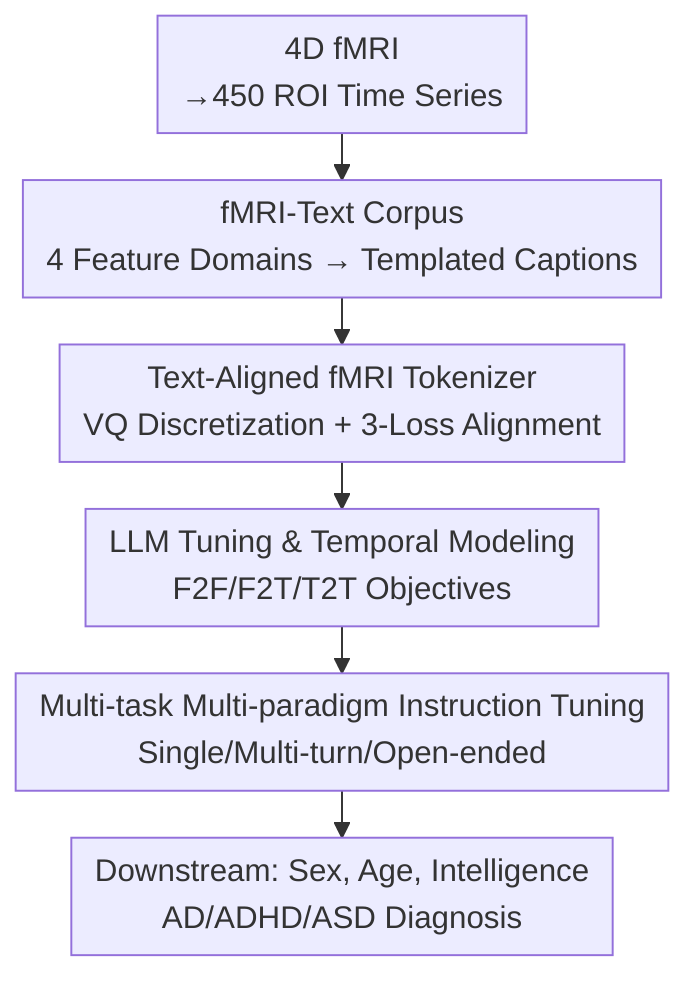

# fMRI-LM: Towards a Universal Foundation Model for Language-Aligned fMRI Understanding

**Conference**: CVPR 2026  
**Paper**: [CVF Open Access](https://openaccess.thecvf.com/content/CVPR2026/html/Wei_fMRI-LM_Towards_a_Universal_Foundation_Model_for_Language-Aligned_fMRI_Understanding_CVPR_2026_paper.html)  
**Code**: None  
**Area**: Medical Imaging  
**Keywords**: fMRI foundation model, brain-language alignment, neural tokenizer, instruction tuning, multi-task generalization  

## TL;DR
fMRI-LM utilizes a three-stage framework that first discretizes brain signals into tokens aligned with the text embedding space, and then enables a pre-trained LLM to model brain activity as a predictable and describable "language." By complementing the lack of natural pairs with a synthetic fMRI-to-text description corpus, it achieves zero-shot/few-shot performance on diverse tasks including sex, age, fluid intelligence, and AD/ADHD/ASD diagnosis using a single model. Furthermore, LoRA fine-tuning achieves or even surpasses the performance of full fine-tuning.

## Background & Motivation
**Background**: Functional MRI (fMRI) records BOLD signals and is a mainstream method for non-invasive brain activity observation. Early deep learning approaches (CNN/GNN) performed well in supervised tasks like sex prediction and disease diagnosis. Recently, "fMRI foundation models" such as BrainLM and Brain-JEPA have emerged, pre-trained on large-scale brain images via masked reconstruction or contrastive learning before being transferred to downstream tasks.

**Limitations of Prior Work**: These fMRI foundation models remain trapped in "pure neural signal objectives"—pre-training only optimizes for mask prediction or contrastive loss. Downstream tasks require task-specific fine-tuning, and these models completely lack a "language" interface, preventing them from answering questions or generating explanations in natural language like multimodal LLMs (MLLMs). Meanwhile, in the EEG field, some work quantizes neural signals into symbols aligned with LLMs, but they use fixed "single-question-single-answer" templates, failing to leverage the generation and reasoning capabilities of LLMs. Additionally, existing fMRI-to-text works only serve decoding scenarios for "task fMRI + explicit stimulus-text pairs," essentially mapping neural activity back to presented text.

**Key Challenge**: The primary obstacle to integrating fMRI into LLMs is that **natural fMRI-text pairs do not exist**. Vision-language models rely on "image + caption" for alignment, but fMRI signals are high-dimensional, abstract, and lack ready-made text descriptions. Without this bridge, LLMs cannot learn the linguistic semantics of "describing brain function."

**Goal**: To build a universal fMRI foundation model capable of understanding **resting-state, task-independent** brain activity, without relying on task-induced paired text, while providing a unified language interface for both modeling and instructional Q&A.

**Key Insight**: This work adapts the MLLM paradigm of "frozen LLM + modality encoder aligned to text space" and proposes a key observation: since image-derived features (functional connectivity, graph metrics, functional gradients, ICA components) inherently characterize the "low-level organization" of the brain, these numerical features can be **templated into structured text descriptions**. These synthetic captions bridge low-level neural organization and high-level cognitive semantics.

**Core Idea**: Use a synthetic "fMRI image feature → text description" corpus to align brain signals into the LLM's text embedding space, and then treat brain activity as "a language"—recordable, sequence-predictable, and describable—for unified modeling and instruction fine-tuning by a pre-trained LLM.

## Method

### Overall Architecture
fMRI-LM decomposes "enabling LLM to understand fMRI" into three sequential stages, plus an offline corpus construction step. The input is 4D fMRI $X_{raw}\in\mathbb{R}^{T\times X\times Y\times Z}$, segmented into time series $X\in\mathbb{R}^{T\times N}$ of $N=450$ ROIs based on the Schaefer-400 (cortical) + Tian-Scale III (subcortical) atlases. The output is a unified model capable of answering questions about sex/age/disease and generating free-form text descriptions.

The pipeline consists of: **(0)** Templating image features of each scan into text descriptions to create synthetic fMRI-text pairs; **(Stage 1)** Training a tokenizer that discretizes fMRI into tokens that are geometrically consistent with the frozen text embedding space; **(Stage 2)** Freezing the tokenizer and fine-tuning the pre-trained LLM to perform both temporal "next-step prediction" of brain tokens and text generation based on fMRI; **(Stage 3)** Performing multi-task, multi-paradigm instruction fine-tuning on the aligned LLM to grant high-level semantic understanding.

### Key Designs

**1. fMRI-Text Description Corpus Construction: Bridging Missing Pairs with Templated Captions**

This is the foundation of the paper, addressing the lack of natural fMRI text. The authors characterize each scan across four complementary feature domains: functional connectivity (FC), functional gradients (FG), graph metrics (Graph), and independent component analysis (ICA). Each domain provides both ROI-level and global descriptions (e.g., network connectivity strength, gradient variance, modularity/global efficiency/average clustering coefficient, and network fALFF, totaling 23 descriptors). All brain measurements are z-score standardized relative to the UK Biobank cohort distribution for cross-subject comparability. Numerical values are then fitted into fixed templates, and DeepSeek-V3 is used to polish fragmented sentences into coherent paragraphs. High-level demographic/cognitive/clinical attributes are also synthesized (used only in Stage 3). To verify that these descriptors carry valid information, a BERT classifier was trained on the 4 types of descriptors for UKB sex prediction, achieving ~70% accuracy, proving that the text encodes discriminative brain organization information.

**2. Text-aligned fMRI Tokenizer: Discretizing Brain Signals into Text-congruent Tokens**

To make a frozen LLM understand non-text modalities, inputs must be encoded into discrete representations in the "same geometric space" as text embeddings. A Transformer encoder $E_\theta$ encodes $X\in\mathbb{R}^{T\times N}$ into a latent sequence $z=E_\theta(X)\in\mathbb{R}^{M\times C}$, where patches are cut only along the temporal dimension ($M=\lceil T/P\rceil\times N$) to preserve all ROIs. Vector quantization $Q$ maps each $z_m$ to a discrete code $\tilde z_m$. Alignment is achieved through three losses: (i) Auto-encoding reconstruction, where a lightweight decoder $D_\phi$ restores the input, $L_{quant}=\lVert X-D_\phi(\tilde z)\rVert_2^2 + L_{commitment}$, ensuring information fidelity; (ii) **Domain adversarial alignment**—sampling text embeddings from a frozen LLM (e.g., GPT-2) using OpenWebText tokens to train a domain classifier that distinguishes between fMRI and text tokens, while a gradient reversal layer (GRL) forces "confusion," $L_{domain}=-\frac{1}{M}\sum_m\big[t_m\log C(z_m)+(1-t_m)\log(1-C(z_m))\big]$ (where $t_m=1$ for fMRI), making fMRI embeddings "disguise" themselves as text; (iii) **Contrastive cross-modal alignment**—using the synthetic descriptions to form fMRI-text positive/negative pairs with a SigLIP-style contrastive loss $L_{contrast}$ to pull paired representations together. The total objective is:

$$L_{tokenizer}=L_{quant}+L_{contrast}+\lambda L_{domain},\quad \lambda=0.5$$

**3. LLM Fine-tuning and Temporal Modeling: Brain Activity as Auto-regressive "Language"**

After obtaining discrete fMRI tokens, the tokenizer is frozen and the pre-trained LLM is fine-tuned. Let the token sequence be $z=\{z_{(w,n)}\}$, where $w$ is time and $n$ is ROI. Instead of standard "next word prediction," the authors use **next-step prediction in the temporal dimension**: given tokens for all $N$ ROIs at time $w$, predict the $N$ tokens for time $w+1$. Training uses three paradigms: **F2F** (fMRI-to-fMRI temporal prediction) $L_{F2F}$ to capture temporal dependencies; **F2T** (fMRI-to-Text) to generate description text; and **T2T** (Text-to-Text) using random text for standard language modeling to prevent "catastrophic forgetting." The combined objective is:

$$L_{LLM}=L_{F2T}+\alpha L_{F2F}+\beta L_{T2T},\quad \alpha=0.1,\ \beta=0.5$$

This step unifies temporal modeling and text generation as auto-regressive prediction within the LLM's expanded vocabulary.

**4. Multi-task Multi-paradigm Instruction Tuning**

Finally, the aligned LLM is fine-tuned using instructions that represent downstream tasks as "natural language questions + target answers." Three paradigms of increasing difficulty are used: (i) Single-turn Q&A (e.g., "Sex?" → "Male"); (ii) Multi-turn/Multi-target Q&A (answering multiple questions like sex + AD status simultaneously); (iii) Open-ended description (generating free-form clinical interpretations).

### Loss & Training
Each stage is trained for 50 epochs using AdamW, a learning rate of $10^{-4}$, cosine annealing, and a batch size of 32. In Stage 1, the text encoder is frozen while the fMRI tokenizer is trained. In Stages 2/3, the tokenizer is frozen, and the LLM is fine-tuned (full or LoRA). Data is resampled to TR=2.0s, cropped/interpolated to 160 time points and 450 ROIs.

## Key Experimental Results

Experiments cover 7 datasets: UKB and ABCD for Stage 1/2 pre-training, and HCP, HCP-A, ADNI4, ADHD200, and ABIDE2 for downstream evaluation.

### Main Results (Classification, Acc/AUC)
fMRI-LM-B(Q) utilizes a Qwen3-0.6B base. It mostly achieves the best or second-best results.

| Dataset-Task | Metric | BrainLM | Brain-JEPA | BrainMass | fMRI-LM-B(Q) |
|--------------|--------|---------|------------|-----------|--------------|
| UKB-Sex      | Acc    | 88.72   | 88.77      | 92.31     | **94.45**    |
| HCP-Sex      | Acc    | 81.09   | 77.82      | 75.32     | **83.04**    |
| ADNI-AD      | Acc    | 78.82   | 82.26      | 80.05     | **85.27**    |
| ADHD200      | Acc    | 71.22   | 72.04      | 66.19     | **78.57**    |
| ABIDE2-ASD   | Acc    | 65.22   | 57.49      | 58.79     | **76.56**    |

### Ablation Study

| Configuration | Observation |
|---------------|-------------|
| Full model    | Baseline performance across all benchmarks. |
| w/o Descriptors | Significant drop, especially in sex classification. Highlights the necessity of synthetic pairs. |
| LoRA vs Full  | Comparable performance; LoRA even better on HCP-Sex/ADHD. Keeps LLM knowledge intact. |
| 0%→100% Pre-train | Monotonic increase; removing UKB has a larger impact than removing ABCD. |

### Key Findings
- **Synthetic descriptors are vital**: Removing them significantly degrades performance, validating the hypothesis that linguistic supervision bridges neural organization.
- **LoRA is competitive**: Tuning fewer parameters helps maintain the LLM's language priors while learning neural-semantic mappings.
- **Few-shot adaptation**: While strict zero-shot performance is moderate, performance recovers significantly with just 2 labeled samples (2-shot).
- **Multi-task synergy**: Multi-target Q&A results in only minor degradation compared to single-task, with some targets (sex, fluid intelligence) even showing improvement.

## Highlights & Insights
- **"Manufacturing captions" to solve missing pairs**: Using templated features + LLM polishing effectively bypasses the lack of natural fMRI-text data. This logic is transferable to other scientific signals (EEG, gene expression, etc.).
- **Three-loss alignment**: The combination of reconstruction (fidelity), domain adversarial GRL (disguise as text), and SigLIP contrast (semantic pairing) is a clean recipe for injecting new modalities into frozen LLMs.
- **Brain activity as language**: Unifying temporal prediction and description generation as auto-regression shows a clear understanding of why language priors are powerful.

## Limitations & Future Work
- Focuses primarily on **resting-state** fMRI; coverage of task-based/evoked scenarios is limited.
- Zero-shot performance requires improvement; some supervision "ignition" is currently necessary.
- Potential systematic biases in template-based captioning need further investigation.
- Continuous regression targets are currently handled via discretization/linear probes; a more "language-native" solution is needed.

## Related Work & Insights
- **vs BrainLM / Brain-JEPA**: These models focus on pure neural objectives and lack language interfaces, requiring task-specific heads. fMRI-LM achieves better zero/few-shot transfer via language alignment.
- **vs EEG-LLM**: While some EEG works quantize signals, they often use restricted templates. fMRI-LM utilizes multi-paradigm Q&A and synthetic descriptions to leverage LLM reasoning.

## Rating
- Novelty: ⭐⭐⭐⭐⭐ 
- Experimental Thoroughness: ⭐⭐⭐⭐ 
- Writing Quality: ⭐⭐⭐⭐ 
- Value: ⭐⭐⭐⭐⭐ 

<!-- RELATED:START -->

## Related Papers

- [\[CVPR 2026\] MedMO: Grounding and Understanding Multimodal Large Language Model for Medical Images](medmo_grounding_and_understanding_multimodal_large_language_model_for_medical_im.md)
- [\[CVPR 2026\] MLLM-HWSI: A Multimodal Large Language Model for Hierarchical Whole Slide Image Understanding](mllm-hwsi_a_multimodal_large_language_model_for_hierarchical_whole_slide_image_u.md)
- [\[CVPR 2026\] Bridging Brain and Semantics: A Hierarchical Framework for Semantically Enhanced fMRI-to-Video Reconstruction](bridging_brain_and_semantics_a_hierarchical_framework_for_semantically_enhanced_.md)
- [\[CVPR 2026\] Duala: Dual-Level Alignment of Subjects and Stimuli for Cross-Subject fMRI Decoding](duala_dual-level_alignment_of_subjects_and_stimuli_for_cross-subject_fmri_decodi.md)
- [\[CVPR 2026\] Modeling the Brain's Grammar: ROI-Guided fMRI Pretraining for Transferable and Interpretable Vision Decoding](modeling_the_brains_grammar_roi-guided_fmri_pretraining_for_transferable_and_int.md)

<!-- RELATED:END -->
