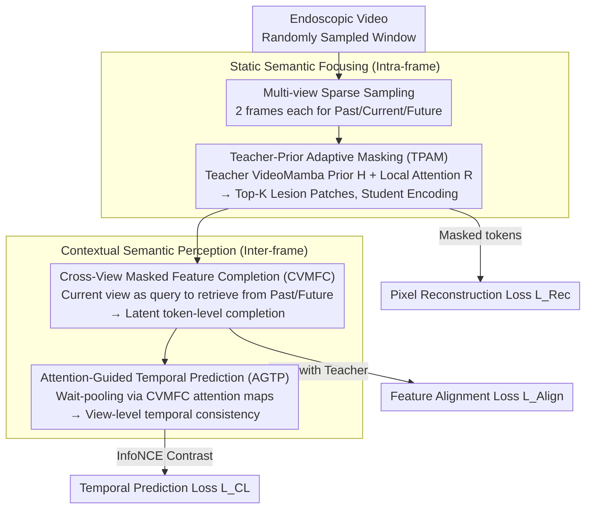

# Focus-to-Perceive Representation Learning: A Cognition-Inspired Hierarchical Framework for Endoscopic Video Analysis

**Conference**: CVPR 2026  
**arXiv**: [2603.25778](https://arxiv.org/abs/2603.25778)  
**Code**: [Available](https://github.com/MLMIP/FPRL)  
**Area**: Medical Imaging / Endoscopic Video Analysis  
**Keywords**: Self-supervised learning, endoscopic video, hierarchical semantic modeling, masked reconstruction, Mamba

## TL;DR

Ours proposes FPRL, a cognition-inspired hierarchical self-supervised framework that mitigates motion bias by first "focusing" on key static intra-frame semantics and then "perceiving" inter-frame contextual evolution, achieving SOTA on 11 endoscopic datasets.

## Background & Motivation

Endoscopic video analysis is essential for early screening of gastrointestinal diseases, but the scarcity of high-quality labels severely restricts algorithm performance. Self-supervised video pre-training is a powerful direction for addressing label insufficiency. However, existing methods (e.g., VideoMAE, VideoMAE V2) are primarily designed for natural videos, emphasizing dense spatio-temporal modeling and motion semantics—effective for tasks like action recognition but contradictory to the core characteristics of endoscopic videos.

Key semantics in endoscopic videos depend on **static, local visual cues** (e.g., morphology, color, and texture of lesions) rather than salient temporal dynamics. When dense spatio-temporal modeling is directly transferred to endoscopic videos, models tend to over-focus on irrelevant movements such as camera shake and tissue displacement (termed "motion bias"), ignoring static semantics critical for diagnosis.

It is observed that experienced endoscopists follow a "focus-then-perceive" cognitive pattern: first carefully inspecting semantically salient regions (color/texture abnormalities) within a single frame, then tracking the temporal evolution of these candidate regions. This clinical cognitive process inspired the design of the FPRL framework.

## Method

### Overall Architecture

FPRL decomposes the "focus-then-perceive" habit of endoscopists into two hierarchical components: **Static Semantic Focusing** captures lesion-centric local cues (morphology, color, texture) within a single frame, and **Contextual Semantic Perception** tracks how these cues evolve between adjacent frames. By stacking both, the model preserves diagnostic-critical static semantics without being misled by irrelevant motion like camera shake.

The framework utilizes a teacher-student masked reconstruction paradigm. Given a time window, past, current, and future views are sampled sparsely. A frozen teacher encoder (pre-trained VideoMamba-S) processes only the current view to produce stable semantic priors, while a student encoder (EndoMamba-S), trained from scratch, processes masked views. Guided by the teacher's prior, the student identifies key lesion patches and reconstructs masked features of the current view using information from past/future views, integrating both "focusing" and "perceiving" into a single self-supervised objective. The pipeline is illustrated below:

### Key Designs

**1. Multi-view Sparse Sampling: Reducing dynamic redundancy in endoscopic videos**

Dense spatio-temporal modeling often leads models to overfit "motion bias" by focusing on highly similar adjacent frames. FPRL independently samples three sparse views (past, current, future) within a time window, taking only 2 frames per view. Minimal intra-view frames suppress dynamic redundancy, forcing the model to attend to static semantics, while the inter-view gaps provide sufficient semantic variance for temporal alignment.

**2. Teacher-Prior Adaptive Masking (TPAM): Focusing masks on lesion regions**

Random masking treats lesions and background identically, causing the student to waste reconstruction capacity on meaningless intestinal wall textures. TPAM determines visible patches using two signals: a global prior from the teacher ($\ell_2$ normalized feature saliency map $H$) and a local image-specific signal ($R$ from a lightweight multi-head self-attention layer). These are fused as:

$$S = \alpha H + (1-\alpha) R$$

Top-K selection then determines the learnable binary mask $M$. By only encoding visible patches, representation capacity is concentrated on lesion semantics.

**3. Cross-View Masked Feature Completion (CVMFC): Latent space retrieval for masked features**

Pure intra-frame pixel reconstruction fails to capture cross-frame semantic correspondence. CVMFC uses masked features of the current view as queries to retrieve semantics from past/future views. A Transformer-style block (cross-attention → self-attention → FFN) uses past and future views as keys/values to produce completion features $z_c^p$ and $z_c^f$, which are then aligned with the frozen teacher features $z_t$. This establishes fine-grained, token-level correspondences.

**4. Attention-Guided Temporal Prediction (AGTP): View-level temporal consistency**

To complement token-level alignment and prevent global drift, AGTP performs weighted pooling on adjacent view tokens using cross-attention maps from CVMFC. The prediction target is updated via EMA to provide stable supervision, then compared with the global average pooled features of the current view via contrastive learning.

### Loss & Training

The total loss is a weighted combination of three components:

$$\mathcal{L}_{total} = \lambda_1 \mathcal{L}_{Rec} + \lambda_2 \mathcal{L}_{Align} + \lambda_3 \mathcal{L}_{CL}$$

| Loss Item | Function | Weight |
|:---|:---|:---|
| Pixel Reconstruction $\mathcal{L}_{Rec}$ | Restores lesion texture/boundary details of masked tokens | $\lambda_1 = 1.0$ |
| Feature Alignment $\mathcal{L}_{Align}$ | Establishes token-level temporal correspondence (Cosine + $\ell_2$) | $\lambda_2 = 0.8$ |
| Temporal Prediction $\mathcal{L}_{CL}$ | InfoNCE contrastive learning for view-level consistency | $\lambda_3 = 1.0$ |

The model is trained using AdamW (LR 1.5e-4, cosine schedule) for 400 epochs with a batch size of 64 on 4x NVIDIA A800 GPUs.

## Key Experimental Results

### Main Results

| Method | Conference/Year | Pre-train Time (h) | PolypDiag F1 (%) | CVC-12k Dice (%) | KUMC F1 (%) |
|:---|:---|:---|:---:|:---:|:---:|
| Scratch | - | N/A | 83.5 | 53.2 | 73.5 |
| VideoMAE | NeurIPS'22 | 25.3 | 91.4 | 80.9 | 82.8 |
| Endo-FM | MICCAI'23 | 20.4 | 90.7 | 73.9 | 84.1 |
| M2CRL | NeurIPS'24 | 24.3 | 94.2 | 81.4 | 86.3 |
| EndoMamba | MICCAI'25 | 38.2 | 94.5 | 84.5 | 88.8 |
| **FPRL (Ours)** | - | **18.2** | **95.2** | **86.1** | **89.8** |

Under the same architecture, FPRL achieves Gains of 0.7%/1.6%/1.0% over EndoMamba while reducing pre-training time by 52%.

### Ablation Study

| $\mathcal{L}_{Rec}$ | $\mathcal{L}_{CL}$ | $\mathcal{L}_{pt}$ | $\mathcal{L}_{ft}$ | $\mathcal{L}_{pf}$ | Classification | Segmentation | Detection |
|:---:|:---:|:---:|:---:|:---:|:---:|:---:|:---:|
| ✓ | | | | | 92.3 | 83.8 | 84.0 |
| ✓ | ✓ | ✓ | ✓ | | 94.2 | 84.0 | 86.1 |
| ✓ | ✓ | ✓ | ✓ | ✓ | **95.2** | **86.1** | **89.8** |

Masking Strategy Ablation:

| Masking Strategy | Classification (%) | Segmentation (%) | Detection (%) |
|:---|:---:|:---:|:---:|
| Random | 93.8 | 85.6 | 87.8 |
| Adaptive | 94.5 | 85.6 | 83.9 |
| Teacher-Prior + Adaptive (Ours) | **95.2** | **86.1** | **89.8** |

### Key Findings

- Hierarchical semantic modeling (decoupling static vs. contextual semantics) is the core driver of performance.
- Dual-path completion (past + future) improves results by approximately 1.9%/2.0%/3.6% compared to single-path.
- The combination of teacher prior and adaptive masking is optimal; neither alone fully captures lesion features.
- A 4-layer decoder with 1 CVMFC block is sufficient; deeper designs lead to over-smoothed features.

## Highlights & Insights

1.  **Cognition-Inspired Paradigm**: Systematically translates the "focus-then-perceive" clinical workflow into a technical solution with high interpretability.
2.  **Explicit Motion Bias Modeling**: Formulates the concept of "motion bias" in endoscopy and addresses it via a hierarchical framework.
3.  **Efficiency**: Pre-training takes only 18.2h, which is 52% less than EndoMamba (38.2h) and 67% less than VideoMamba (55.4h).
4.  **Sophisticated TPAM**: Effectively merges global teacher knowledge with local attention for adaptive mask learning.

## Limitations & Future Work

- Single-frame pre-training variants perform poorly due to artifacts (motion blur, lighting flickers, reflections).
- Future work could explore quality-aware sampling to avoid interference from low-quality frames.
- Generalization to other medical imaging domains beyond endoscopy remains to be explored.
- The scalability of Mamba for extremely long sequences warrants further investigation.

## Related Work & Insights

- EndoMamba’s bidirectional/unidirectional Mamba topology provides the foundation for FPRL’s spatio-temporal decoupling.
- The teacher-student paradigm leverages EMA update strategies from methods like BYOL.
- M2CRL’s exploration of multi-view masked contrastive learning inspired the CVMFC design.
- Domain knowledge (clinical workflow) can significantly guide framework design in specialized fields like endoscopy.

## Rating

- **Novelty**: ⭐⭐⭐⭐ — Hierarchical "focus-perceive" paradigm is original; TPAM design is innovative.
- **Experimental Thoroughness**: ⭐⭐⭐⭐⭐ — Covered 11 datasets, 4 tasks, and extensive ablations on masking, ratios, and losses.
- **Writing Quality**: ⭐⭐⭐⭐ — Clear motivation and systematic method description, though heavy notation may increase reading load.
- **Value**: ⭐⭐⭐⭐ — Substantial advancement for self-supervised learning in endoscopy; adaptable to other medical tasks.

<!-- RELATED:START -->

## Related Papers

- [\[CVPR 2026\] Bridging Brain and Semantics: A Hierarchical Framework for Semantically Enhanced fMRI-to-Video Reconstruction](bridging_brain_and_semantics_a_hierarchical_framework_for_semantically_enhanced_.md)
- [\[CVPR 2026\] H2-Surv: Hierarchical Hyperbolic Multimodal Representation Learning for Survival Prediction](h2-surv_hierarchical_hyperbolic_multimodal_representation_learning_for_survival_.md)
- [\[CVPR 2026\] Unlocking Positive Transfer in Incrementally Learning Surgical Instruments: A Self-reflection Hierarchical Prompt Framework](unlocking_positive_transfer_in_incrementally_learning_surgical_instruments_a_sel.md)
- [\[CVPR 2026\] Masked-Diffusion Autoencoders for 3D Medical Vision Representation Learning](masked-diffusion_autoencoders_for_3d_medical_vision_representation_learning.md)
- [\[CVPR 2026\] KAMP: Knowledge-Anchored Multimodal Pretraining Framework for Medical Image Representation](kamp_knowledge-anchored_multimodal_pretraining_framework_for_medical_image_repre.md)

<!-- RELATED:END -->
