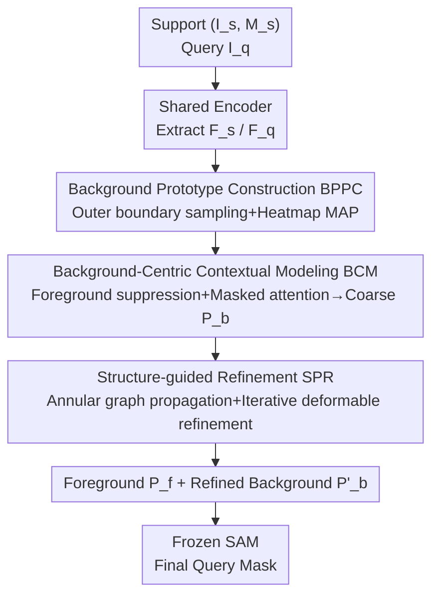

# Focus on Background: Exploring SAM's Potential in Few-shot Medical Image Segmentation with Background-centric Prompting

**Conference**: CVPR 2026  
**Paper**: [CVF Open Access](https://openaccess.thecvf.com/content/CVPR2026/html/Bo_Focus_on_Background_Exploring_SAMs_Potential_in_Few-shot_Medical_Image_CVPR_2026_paper.html)  
**Code**: https://github.com/primebo1/FoB_SAM  
**Area**: Medical Imaging  
**Keywords**: SAM, Few-shot Medical Image Segmentation, Background Prompting, Prompt Localization, Structural Prior

## TL;DR
This work redefines "Few-Shot Medical Image Segmentation (FSMIS) using SAM" as a **background point prompt localization problem**. It proposes FoB, a plug-and-play prompt generator that generates accurate background prompt points outside foreground boundaries through background prototype construction, background-centric contextual modeling, and structure-guided iterative refinement. This constrains SAM's over-segmentation and significantly advances the SOTA in FSMIS across three medical datasets.

## Background & Motivation
**Background**: The mainstream paradigm for FSMIS is the prototype network, which obtains prototypes by Masked Average Pooling (MAP) of target class pixel features in support images and compares them with query features for localization. Recent works integrate the Segment Anything Model (SAM). For instance, ProtoSAM first uses an FSMIS model for coarse segmentation and selects high-confidence points from the probability map as SAM prompts, thereby decoupling and independently training the FSMIS module from SAM.

**Limitations of Prior Work**: While SAM is robust for natural images, its direct application to medical images leads to **severe over-segmentation**. The authors identify the root cause: SAM, trained on natural images, struggles to distinguish low-contrast, blurry anatomical boundaries between adjacent organs or tissues, often including regions outside the boundaries.

**Key Challenge**: Existing SAM-based methods (e.g., ProtoSAM, AM-SAM) generate only **foreground prompts**. The authors' key insight is that **accurate background prompts are critical for suppressing over-segmentation**. Providing only foreground points tells SAM "where to segment" but fails to tell it "where to stop," leading to boundary leakage.

**Goal**: To build a generator specifically for **high-precision background prompt points** without fine-tuning SAM and while maintaining independent training. This requires solving two difficulties: (1) converting support masks into descriptors that guide point localization in query images; (2) reliably locating background points for novel classes that lack semantic meaning, particularly given that effective background points must be close to class boundaries to provide precise constraints.

**Core Idea**: Instead of extracting prompts from segmentation maps, the task is **redefined as a background-centric point localization problem**. Drawing inspiration from few-shot keypoint detection, the model directly learns to locate background points near target boundaries and utilizes a structural prior—the natural "annular" distribution of background points in medical images—to iteratively correct predictions.

## Method

### Overall Architecture
FoB is an **independently trained, plug-and-play** prompt generator. It takes a support image-mask pair $(I^s, M^s)$ and a query image $I^q$ as input, and outputs a set of foreground prompts $P_f$ and refined background prompts $P'_b$ on the query image. These are fed into a frozen SAM to obtain the final mask. The pipeline consists of three collaborative modules: **BPPC** for background prototype construction via support mask sampling, **BCM** for background-foreground spatial context modeling for coarse localization, and **SPR** for imposing annular structural constraints and iterative refinement. Training is entirely detached from SAM.

### Key Designs

**1. BPPC: Translating Support Masks into Boundary-Adjacent Background Prototypes**

The first challenge in prompt localization is converting a binary mask into a descriptor for point localization. BPPC samples background points only within a **narrow ring outside the foreground boundary**. Two dilations with different radii ($r=15$, $\epsilon=2$) are applied to the support mask $M^s$. A "differential ring" is formed by their subtraction, from which $N_p$ points are uniformly sampled: $P = U\big(\rho(M^s, r) - \rho(M^s, r-\epsilon),\, N_p\big)$. These points naturally surround the foreground boundary, satisfying the requirement for effective background prompts.

For each sampled point $\mu_i$, a 2D Gaussian heatmap $G_i = N(\mu_i, \sigma)$ is generated. These heatmaps serve as weighting maps for MAP on support features to obtain background prototypes: $p_b^i = \mathrm{MAP}(F_s, G_i) = \frac{\sum_{u,v} F_s(u,v) G_i(u,v)}{\sum_{u,v} G_i(u,v)}$. Weighting by Gaussian heatmaps (rather than single-pixel values) enables local weighted averaging to suppress aliasing, resulting in stable point-vector prototypes for matching in query images.

**2. BCM: Locating Background Points for Novel Classes via Foreground-Background Context**

Background regions of novel classes are non-semantic and lack fixed patterns. BCM focuses on learning the "spatial layout and relative relationship of background points relative to the foreground"—a context that remains consistent for new classes. It involves two steps:

**Foreground Suppression**: The cosine similarity between query features and the support foreground prototype $p_{fg}^s$ yields a correlation map $C$. Foreground regions are numerically suppressed via $F_{sup} = (1 - C) \odot F_q$ to differentiate foreground and background features. Next, a set of coarse prompt proposals $\Phi = \xi^{-1}\big((A \odot PW_s)(W_q\,\xi(F_{sup}))\big)$ is generated using prototypes, where each channel indicates a candidate position for a background point. $A$ is a channel attention conditioned on prototypes $P$ to distinguish different $p_b^i$.

**Masked Attention Modeling**: $F_{sup}$ is fed into a Transformer with mask bias. Proposals $\Phi$ are converted into soft mask biases $B = \mathrm{ReLU}(C(\Phi))$ and added to the attention logits. This forces the model to focus on coarsely activated background regions, modeling relative relationships between points and the foreground via pixel-level interactions. A lightweight detection head outputs background point heatmaps $\hat{H}$, and maximum response positions provide **coarse background coordinates** $P_b = \{\mu_b^1, \dots, \mu_b^{N_p}\}$. Ablations show BCM alone contributes +4.11% Dice.

**3. SPR: Correcting Outliers using the "Annular Structural Prior"**

BCM predicts background points independently, often resulting in outliers or collapsed point clusters that violate the "annular" distribution typical in medical imaging. SPR corrects the geometric distribution in two sub-steps:

**Structure Propagation Graph (SPG)**: A graph is constructed to encode the support structure and propagate it to the query via cross-instance graph convolution. The structure matrix fuses two parts: an adaptive structure $A_{ada} = \mathrm{softmax}\big(\frac{1}{\sqrt{C}} PW_\theta (PW_\phi)^\top\big)$ capturing variations across classes, and a static annular structure $A_{ring}$ where each point exchanges information only with its two neighbors on the ring ($(A_{ring})_{ij}=1$ if $j=(i\pm 1)\bmod N_p$). This smoothes features and suppresses outliers. The final $A = \alpha A_{ada} + (1-\alpha) A_{ring}$ (where $\alpha$ is learnable) injects the prior via GCN $Q' = \mathrm{ReLU}(D^{-1/2} A D^{-1/2} Q W_g)$.

**Iterative Deformable Refinement (IDR)**: SPG only corrects feature space distributions. Inspired by deformable attention, for each coarse point $\mu_b^i$ and its prototype, $k=8$ candidate offsets $\phi(v)$ are predicted using a direction vector $v=(q_b^i, f)$. Candidates are aggregated using weights $w = \mathrm{softmax}(q_b^i W_{att})$ calculated from conditional features: $\mu_b^i = \sum_m w_m (\mu_b^i + \Delta\mu_m)$. Features $f$ are updated via bilinear sampling for the next round. After $\kappa=3$ iterations, coordinates converge to positions consistent with the updated feature distribution, yielding refined background points $P'_b$.

### Loss & Training
The total loss is $L_{total} = L_{rac} + \lambda_1 L_{heat} + \lambda_2 L_{coor} + L_{fore}$ ($\lambda_1=10^3$, $\lambda_2=10^{-4}$).

- **$L_{rac}$ Regional-aware Contrastive Loss**: Prevents background points from falling into the foreground. Based on InfoNCE, it pulls the support foreground prototype $p_{fg}^s$ closer to the outer foreground features (positive $p_p^s$) and pushes it away from background prototypes $p_b^i$ (negatives): $L_{rac} = -\log\frac{e^{\mathrm{sim}(p_{fg}^s, p_p^s)/\tau}}{\sum_i e^{\mathrm{sim}(p_{fg}^s, p_b^i)/\tau}}$ ($\tau=0.1$). It improves Dice by +2.28%.
- **$L_{heat}$ Prompt Regression**: MSE loss for coarse/refined heatmaps against GT heatmaps.
- **$L_{coor}$ Coordinate Regression**: Supervises coordinate refinement in SPR.
- **$L_{fore}$ Foreground Understanding**: Pixel-wise cross-entropy for the correlation map $C$, enhancing foreground-background discrimination in BCM.

At inference, $N_f=10$ foreground points are sampled from $C$ (threshold $T=0.9$) and fed to SAM (ViT-H) along with $N_p=10$ background points.

## Key Experimental Results

### Main Results
Evaluated on Abd-MRI, Abd-CT, and Skin-DS datasets (Dice %) under 1-way 1-shot settings. Setting I includes classes that may appear unlabeled in training backgrounds; Setting II uses completely unseen classes.

| Dataset / Setting | Metric | FoB+SAM | Prev. SOTA | Gain |
|--------|------|------|----------|------|
| Abd-CT / Setting I | Avg Dice | **86.21** | 78.52 (GMRD) | +7.69 |
| Abd-CT / Setting II | Avg Dice | **84.80** | 77.32 (GMRD) | +7.48 |
| Abd-MRI / Setting I | Avg Dice | **84.46** | 83.47 (PGRNet) | +0.99 |
| Skin-DS / Setting I | Avg Dice | 76.62 | 74.50 (RPT) | +2.12 |

In Cross-Domain FSMIS (CD-FSMIS), FoB+SAM significantly outperforms domain-adaptation methods: CT→MRI reaches 73.30 (vs. FAMNet 65.79), and MRI→CT reaches 67.02 (vs. FAMNet 64.75). The authors attribute this to the domain-invariance of contextual point matching and geometric localization.

### Ablation Study
Module ablation (Abd-CT, Avg Dice %):

| Configuration | Avg Dice | Note |
|------|---------|------|
| BPPC only | 81.01 | Provides localization foundation |
| BPPC + BCM | 83.49 | Context modeling +4.11 vs. BCM-only baseline |
| BPPC + SPR | 85.12 | Structural refinement is effective |
| BPPC + BCM + SPR (Full) | **86.21** | SPR adds +1.09 over BCM |

Loss ablation: Removing $L_{heat}$ causes performance to drop to 35.26 (increased learning difficulty). Removing $L_{rac}$ yields 83.93 (+2.28 gain derived from $L_{rac}$).

### Key Findings
- **Background prompts are the cure for over-segmentation**: Regardless of the number of foreground points, adding background points consistently improves performance, peaking at $N_f=N_p=10$.
- **BCM provides the largest contribution** (+4.11%), indicating contextual reasoning is the primary driver for background localization.
- **Superiority on MRI**: While the concurrent work AM-SAM is comparable on Abd-CT, it lags significantly on Abd-MRI due to blurry boundaries. FoB outperforms AM-SAM on MRI without fine-tuning SAM.

## Highlights & Insights
- **Perspective Shift**: While most SAM-based FSMIS works focus on foreground prompts, FoB proves that accurate background prompts are the key to constraining over-segmentation—a simple yet effective observation.
- **Differential Ring Sampling**: The use of two dilations provides an elegant, zero-cost way to restrict background points to a narrow band that is "close to the boundary but not in the foreground."
- **Structural Prior + GCN**: Explicitly encoding the geometry of background points into $A_{ring}$ and using iterative refinement to pull coordinates back to the ring is a strategy applicable to any keypoint task with regular spatial layouts.
- **Decoupled from SAM**: FoB can be trained independently and used plug-and-play. It avoids the high computational cost of joint fine-tuning (e.g., AM-SAM) while achieving high performance.

## Limitations & Future Work
- **Dependency on Annular Structure**: The $A_{ring}$ prior might mislead for non-closed, occluded, or topologically complex targets (e.g., multi-connected or hollowed shapes).
- **Empirical Hyperparameters**: Values like dilation $r=15$, $N_p=10$, and threshold $T=0.9$ are empirical; their cross-modal robustness requires further analysis.
- **Constraints of Base SAM**: FoB optimizes prompt quality but does not change SAM's inherent weakness regarding low-contrast boundaries. Using medical-specific SAM variants (e.g., SAM-Med2D) yields better results but may conflict with standard FSMIS protocols.

## Related Work & Insights
- **vs. ProtoSAM**: Both decouple FSMIS from SAM, but ProtoSAM selects foreground points from coarse maps. FoB tackles over-segmentation from the root by specializing in background point localization.
- **vs. AM-SAM (Concurrent)**: AM-SAM uses adapters to fine-tune SAM jointly with a prompt generator. FoB is more efficient and robust on MRI blurry boundaries by freezing SAM.
- **vs. Traditional FSMIS**: Traditional methods perform dense prototype matching; FoB performs sparse pixel matching for prompt generation, leveraging SAM's segmentation capability to achieve significant gains.

## Rating
- Novelty: ⭐⭐⭐⭐⭐ Reframes SAM-based FSMIS as background-centric localization.
- Experimental Thoroughness: ⭐⭐⭐⭐ Extensive ablations and cross-domain tests, though limited to 1-shot.
- Writing Quality: ⭐⭐⭐⭐ Clear motivation and logical flow.
- Value: ⭐⭐⭐⭐⭐ Plug-and-play and highly effective for clinical scenarios.

<!-- RELATED:START -->

## Related Papers

- [\[CVPR 2026\] BackSplit: The Importance of Sub-dividing the Background in Biomedical Lesion Segmentation](backsplit_the_importance_of_sub-dividing_the_background_in_biomedical_lesion_seg.md)
- [\[CVPR 2026\] SD-FSMIS: Adapting Stable Diffusion for Few-Shot Medical Image Segmentation](sd_fsmis_adapting_stable_diffusion_for_few_shot_medical_image_segmentation.md)
- [\[CVPR 2025\] Enhancing SAM with Efficient Prompting and Preference Optimization for Semi-supervised Medical Image Segmentation](../../CVPR2025/medical_imaging/sam_dpo_semi_supervised.md)
- [\[CVPR 2026\] From Infusion to Assimilation Distillation for Medical Image Segmentation](from_infusion_to_assimilation_distillation_for_medical_image_segmentation.md)
- [\[CVPR 2026\] Universal-to-Specific: Dynamic Knowledge-Guided Multiple Instance Learning for Few-Shot Whole Slide Image Classification](universal-to-specific_dynamic_knowledge-guided_multiple_instance_learning_for_fe.md)

<!-- RELATED:END -->
