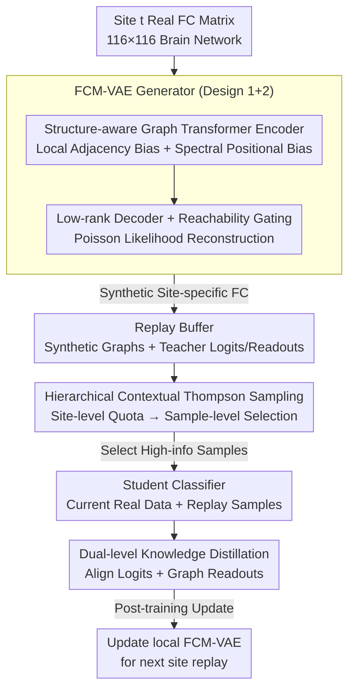

# Continual Learning for fMRI-Based Brain Disorder Diagnosis via Functional Connectivity Matrices Generative Replay

**Conference**: CVPR 2026  
**arXiv**: [2604.14259](https://arxiv.org/abs/2604.14259)  
**Code**: [github.com/4me808/FORGE](https://github.com/4me808/FORGE)  
**Area**: Medical Imaging  
**Keywords**: continual learning, fMRI, functional connectivity, generative replay, knowledge distillation

## TL;DR

This paper proposes FORGE, the first continual learning framework specifically designed for cross-site fMRI brain disorder diagnosis. It utilizes a structure-aware VAE to generate realistic functional connectivity (FC) matrices for privacy-preserving generative replay. Combined with dual-level knowledge distillation and a hierarchical contextual bandit sampling strategy, it effectively mitigates catastrophic forgetting.

## Background & Motivation

fMRI functional connectivity (FC) matrices are powerful representations for brain disorder diagnosis. However, clinical data usually arrive sequentially from different institutions. Existing diagnostic models are either trained on a single site or require full multi-site data access, facing the issue of catastrophic forgetting. Traditional continual learning methods are mainly designed for image data and are insufficient for graph-structured medical data, particularly fMRI. Privacy regulations further restrict the sharing of raw data across institutions.

## Method

### Overall Architecture

FORGE addresses "learning while forgetting" in cross-site fMRI diagnosis: clinical data arrives sequentially from different institutions, and raw data from old sites cannot be retained for replay due to privacy regulations. The core idea is to replace real data replay with **generative replay** and apply **dual-level knowledge distillation**. The backbone is FCM-VAE, a generator designed for FC matrices: a structure-aware encoder embeds the topology and spectral geometry of the brain network into a latent space, and a low-rank decoder reconstructs realistic synthetic FC matrices accordingly. Upon arriving at a new site, synthetic samples from previous sites are stored in a replay buffer, and a **Hierarchical Contextual Thompson Sampling** strategy selects the most informative batch. The student classifier learns from both current real FC matrices and selected synthetic samples, aligning with a frozen teacher from the previous site via logit-level and graph-readout-level distillation. After training, the FCM-VAE is updated at the current site to prepare for the next stage.

### Key Designs

**1. FCM-VAE Structure-aware Graph Transformer Encoder: Enabling Topology-aware Generation**

Traditional generators often lose the topology and spectral properties of FC matrices. FORGE adopts a Graph Transformer as the encoder: features for each ROI node are concatenated from the node's FC connectivity spectrum, spectral embeddings (first $k$ non-trivial eigenvectors of the Laplacian), and node degree. Beyond standard $QK^\top/\sqrt{d_h}$, the attention scores incorporate two **additive** biases: a local adjacency bias $\tilde A = A^{adj}+I$ to enforce local topological constraints and a spectral positional bias to capture global geometry. Using additive biases preserves the expressiveness of global attention, maintaining robustness in low-sample, complex graph scenarios like fMRI.

**2. Low-rank Decoder (with Reachability Gating): Constraining Generation via FC Properties**

Functional connectivity exhibits strong low-rank structures. FORGE transforms Pearson correlations $r_e$ via Fisher-z transform and normalization into non-negative strengths, then reconstructs them using **Poisson likelihood**. The rate $\hat\lambda_e(z)=\exp(\nu_e+\omega_e(z))$ for each edge consists of a site-shared baseline $\nu_e$ and an individual deviation $\omega_e(z)=\sum_{r=1}^{R}\alpha_r U_{ur}(z)U_{vr}(z)$. This **low-rank bilinear** form explicitly encodes the low-rank prior. Finally, a soft gate $G=\sigma(A^{adj}+\mathrm{logit}(\varepsilon))$ projected from the adjacency matrix modulates the output to avoid spurious edges.

**3. Hierarchical Contextual Thompson Sampling (HCTS): Optimizing Replay Budgets**

Uniform sampling wastes fixed budget $K$ on low-information samples. FORGE splits sampling into a two-layer contextual bandit: **Site-level** sampling constructs contexts $\phi_i=[\text{Acc}_i, \text{Forget}_i]$ to estimate replay gains and distribute $K$ into quotas $k_i$ via softmax, prioritizing sites with higher forgetting. **Sample-level** sampling uses contexts $\psi_u=[\text{margin}_u, \text{closeness}_u]$ to select $k_i$ valuable samples and performs farthest-first traversal in the readout embedding space to ensure coverage and reduce redundancy.

**4. Dual-level Knowledge Distillation + Generative Replay: Multi-granularity Knowledge Transfer**

Aligning only logits misses shifts in intermediate representations. For each new site, the student classifier fits current data while performing two alignments on generated replay samples: **Logit-level** L2 loss pulls student logits towards the frozen teacher, and **Graph-readout level** L2 loss aligns graph-level representations $\rho(E_\theta(G))$. Teacher outputs are computed once and fixed when samples enter the buffer, providing stable supervision without repeated forward passes.

### Loss & Training

The unified training objective includes four components: (1) classification loss for current site real data; (2) classification loss for replayed synthetic data; (3) logit-level distillation using L2 distance; (4) graph-readout level distillation using L2 distance.

## Key Experimental Results

### Main Results

Evaluations were conducted on ABIDE (Autism), REST-meta-MDD (Depression), and BSNIP (Schizophrenia) datasets:

| Dataset | Task | Method | Forgetting Mitigation | Accuracy |
|---------|------|------|-----------------------|-----------|
| ABIDE | ASD Diagnosis | FORGE | **SOTA** | **SOTA** |
| REST-meta-MDD | MDD Diagnosis | FORGE | **SOTA** | **SOTA** |
| BSNIP | SZ Diagnosis | FORGE | **SOTA** | **SOTA** |

### Ablation Study

- The quality of FC matrices generated by FCM-VAE significantly exceeds existing graph generative models.
- Graph-readout distillation further improves performance compared to using logit distillation alone.
- The hierarchical sampling strategy outperforms uniform random sampling.

### Key Findings

- Structure-aware encoding effectively captures the topological characteristics of FC matrices.
- Generative replay effectively mitigates catastrophic forgetting under privacy constraints.
- The low-rank decoder produces FC matrices with higher biological fidelity.

## Highlights & Insights

- The first complete framework combining continual learning with fMRI functional connectivity analysis.
- Privacy-preserving generative replay addresses regulatory constraints on medical data sharing.
- Structure-aware designs fully exploit domain-specific characteristics of FC matrices.

## Limitations & Future Work

- The use of a fixed brain atlas (AAL-116) limits finer-grained ROI analysis.
- Generative fidelity may decrease on sites with extremely small sample sizes.
- Domain adaptation for inter-site scanner variability has not yet been considered.

## Related Work & Insights

- The graph-level continual learning design can be generalized to other graph classification scenarios.
- The application of spectral positional encoding in Graph Transformers is a noteworthy technique.
- The low-rank decoder approach is applicable to other data generation tasks involving low-rank structures.

## Rating

7/10 — The problem definition is clear and the method design is comprehensive. It represents valuable interdisciplinary work, though its impact is restricted by the niche scale of the fMRI field.

<!-- RELATED:START -->

## Related Papers

- [\[NeurIPS 2025\] Riemannian Flow Matching for Brain Connectivity Matrices via Pullback Geometry](../../NeurIPS2025/medical_imaging/riemannian_flow_matching_for_brain_connectivity_matrices_via_pullback_geometry.md)
- [\[CVPR 2026\] Forging a Dynamic Memory: Retrieval-Guided Continual Learning for Generalist Medical Foundation Models](forging_a_dynamic_memory_retrieval-guided_continual_learning_for_generalist_medi.md)
- [\[CVPR 2026\] Cross-domain Dual-stream Feature Disentanglement for Brain Disorder Prediction with Sparsely Labeled PET](cross-domain_dual-stream_feature_disentanglement_for_brain_disorder_prediction_w.md)
- [\[CVPR 2026\] Meta-learning In-Context Enables Training-Free Cross Subject Brain Decoding](meta-learning_in-context_enables_training-free_cross_subject_brain_decoding.md)
- [\[CVPR 2026\] Bridging Brain and Semantics: A Hierarchical Framework for Semantically Enhanced fMRI-to-Video Reconstruction](bridging_brain_and_semantics_a_hierarchical_framework_for_semantically_enhanced_.md)

<!-- RELATED:END -->
