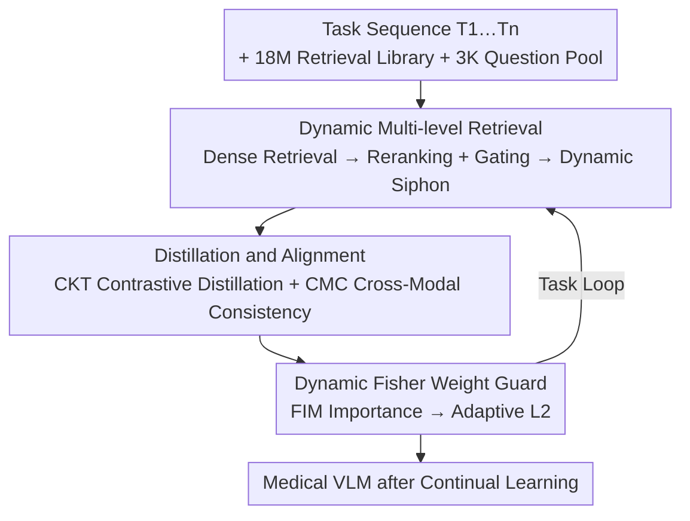

# Forging a Dynamic Memory: Retrieval-Guided Continual Learning for Generalist Medical Foundation Models

**Conference**: CVPR 2026  
**Paper**: [CVF Open Access](https://openaccess.thecvf.com/content/CVPR2026/html/Chen_Forging_a_Dynamic_Memory_Retrieval-Guided_Continual_Learning_for_Generalist_Medical_CVPR_2026_paper.html)  
**Code**: Available (Marked "Code available" in the paper; refer to the original text for the repository address ⚠️)  
**Area**: Medical Imaging / Continual Learning / Multi-modal VLM  
**Keywords**: Continual Learning, Retrieval-Augmented Generation (RAG), Knowledge Distillation, Medical VLM, Catastrophic Forgetting

## TL;DR
PRIMED introduces Retrieval-Augmented Generation (RAG) into the continual learning of medical VLMs. It utilizes an 18-million-scale multi-modal medical retrieval library and a 3,000-item question pool as "dynamic memory." During fine-tuning, image-text pairs are retrieved in real-time as replay data. Combined with Contrastive Knowledge Distillation and Dynamic Fisher Weight constraints, it achieves SOTA across all metrics on the self-developed MGTIL benchmark.

## Background & Motivation
**Background**: Multi-modal VLMs represented by CLIP (e.g., PMC-CLIP, BiomedCLIP in the medical domain) have become the mainstream for generalist medical foundation models, showing strong performance in tasks like classification and prognosis via image-text contrastive pre-training. Continual Learning (CL) is essential for adapting a model to new medical tasks incrementally, avoiding retraining for every disease or storing separate models.

**Limitations of Prior Work**: Medical CL is more challenging than natural image CL. The authors highlight the core difference using a distribution map (Fig.1): natural images have "large intra-domain variance, yet similar low-level features across domains," forming a network-like distribution. Medical images are the opposite: **intra-domain similarity is high (e.g., pathological slides look very similar), while cross-domain imaging principles differ drastically** (e.g., CT vs. pathology vs. fundus), forming a cluster-like distribution. Consequently, medical CL must achieve both "finer-grained intra-domain discrimination" and "bridging larger cross-domain gaps," which are contradictory requirements. Furthermore, catastrophic forgetting causes fine-tuned VLMs to lose both old downstream task knowledge and their original zero-shot capabilities.

**Key Challenge**: The most direct way to mitigate forgetting is replaying historical samples, but VLM pre-training data is often unavailable. Current methods rely on **sampling or generating** pseudo-replay data based on ImageNet labels. However, since medical VLM supervision is caption/context-based, constructing reference sets by labels is unnatural and fails to capture the cluster-like structure of medical data.

**Key Insight**: The authors observe that RAG is already a standard in LLMs for fine-grained, dynamic retrieval. They propose "replacing" replay data with on-demand retrieved content. Compared to fixed sampling/generation, RAG retrieval aligns better with the clustered distribution of medical data and dynamically adjusts recalled content according to intra-domain drift, domain switching, and task difficulty.

**Core Idea**: Use "real-time RAG-retrieved medical image-text pairs" to replace "fixed sampled/generated replay sets." This is integrated into a knowledge distillation framework to dynamically adjust parameter importance, distillation granularity, and reference data distribution based on the required level of detail—this is **PRIMED (Precision Retrieval-Infused model for MEDical)**.

## Method

### Overall Architecture
The input to PRIMED is a sequence of medical tasks $[T_1, \dots, T_n]$ (each consisting of labeled images and class names), with BiomedCLIP (ViT-B/16) as the backbone. The goal is to fine-tune the backbone for the current task while maintaining performance on old tasks and preserving zero-shot capabilities. The process centers on a "dynamic memory"—composed of an 18M image-text retrieval library and a 3K question pool. During training, reference data is retrieved in real-time to serve as "review material" for distillation, integrated with three loss functions.

The process follows three serial stages (corresponding to Fig.2 a/b/c): (a) **Real-time Fine-grained Retrieval**, using the question pool to conduct multi-level retrieval from the 18M library, followed by Dynamic Siphon layered sampling for specialized image-text pairs; (b) **Distillation and Alignment**, using the model from the previous task as the teacher for Contrastive Knowledge Distillation (CKT) and Cross-Modal Consistency (CMC) on retrieved data; (c) **Dynamic Fisher Weight Guard**, using Fisher information to dynamically evaluate parameter importance for adaptive $L_2$ regularization.

### Key Designs

**1. 18M Multi-modal Retrieval Library + 3K Question Pool: Converting "Replay Memory" into Retrievable External Knowledge**

This is the "memory carrier" designed to solve the problem of unavailable pre-training data. Following BIOMEDICA, the authors collect images, captions, and text from PubMed. To facilitate CL, they perform text compression, decompose multi-image entries into single-image ones, and encode them with Qwen3-Embedding-8B to build an **18-million-scale** retrieval library $S$, where each entry is a triplet $(\hat{s}, c, i)$—embedding, caption, and image. Additionally, a **3,000-item question pool** $M^0$ is curated from literature and datasets, categorized by domain, lesion location, and disease. Before task $T_i$, the pool incorporates labels from previous tasks: $M^i = M^0 \cup \bigcup_{k=1}^{i-1} D_k$, ensuring "review" of old tasks.

**2. Dynamic Multi-level Retrieval: Dense Retrieval → Visual Reranking + Lexical Gating → Dynamic Siphon Layered Sampling**

This corresponds to Fig.2(a), consisting of three steps. First, **dense retrieval**: a query $m$ is encoded as $\Phi_E(m)$ and compared to library vectors via cosine similarity $\langle m, \hat{s}\rangle = \frac{\Phi_E(m)}{\lVert\Phi_E(m)\rVert_2}\cdot \hat{s}$. To handle ties in medical similarity scores, a **dynamic threshold** $\tau_m$ is set at the $k'=\min(k,|U^i_m|)$ largest unique similarity value. Second, **reranking + gating**: use the VLM encoder $\Phi_V$ to calculate cross-modal scores $S_v$, deduplicating the top-$k_v$ images per caption. If needed, BM25 lexical gating further prunes the set to $k$ items. Third, **Dynamic Siphon**: the question pool is split into three subsets—task-level $M_{task}$, domain-level $M_{domain}$, and general $M_{gen}$. Different top-k parameters $a,b,c$ are used for each, dynamically adjusting the proportion of specialized vs. general reference data.

**3. Contrastive Knowledge Distillation (CKT) + Cross-Modal Consistency (CMC): Retaining Knowledge and Preventing Modal Decoupling**

The model $T_{i-1}$ from the previous task acts as the teacher (Fig.2b). For a batch $B$ of image-text pairs, the student calculates a $B\times B$ matrix $M^i$, and the teacher calculates $M^{i-1}$. Softmax outputs are compared using KL divergence in both image-to-text and text-to-image directions to form the **CKT loss** $L_{CKT}=L_{Distill\text{-}i2t}+L_{Distill\text{-}t2i}$. This preserves the cross-modal structure. To prevent the student from inheriting the teacher's drift, **CMC loss** $L_{CMC}=L_{Align\text{-}i2t}+L_{Align\text{-}t2i}$ aligns the student's matrix $M^i$ with the identity matrix to maintain internal alignment. Total training loss: $L_{Train}=L_{CE}+\alpha L_{CKT}+\beta L_{CMC}$.

**4. Dynamic Fisher Guard (DFG): Adaptive Regularization Intensity**

Traditional EWC uses a static Fisher Information Matrix $W^{\theta_{t-1}}_i$ for $L_{EWC}=\sum_i W^{\theta_{t-1}}_i (\theta^t_i-\theta^{t-1}_i)^2$. The authors propose that importance should be recalculated at each optimization step $j$ **only for the gradient component excluding the classification loss**: $W^{(j)}_i = \big(\frac{\partial (L^{(j)}_{Train}-L^{(j)}_{CE})}{\partial \theta^t_i}\big)^2$, leading to $L^{(j)}_{DFG}=\sum_i W^{(j)}_i (\theta^{t(j)}_i-\theta^{t-1}_i)^2$. This dynamically identifies and protects parameters undergoing significant changes due to distillation/alignment.

### Loss & Training
Total loss: $L_{Train}=L_{CE}+\alpha L_{CKT}+\beta L_{CMC}$, with $L_{DFG}$ as a dynamic regularizer. Backbone: BiomedCLIP, 4×A6000, 1000 steps per MGTIL task, batch size 64, learning rate $1\times10^{-5}$, seed 42. Selection of the "Last" model as the teacher proved optimal.

## Key Experimental Results

The authors established the **MGTIL (Medical Generalist Task Incremental Learning) benchmark**, containing: **HieraMedTransfer** (9 datasets across X-ray/pathology/fundus domains) and **MedXtreme** (6 domains including endoscopy/dermatology, up to 33 classes). Versions include `PRIMEDuni` (uniform sampling) and `PRIMEDdyn` (dynamic multi-level retrieval).

### Main Results

HieraMedTransfer (Δ relative to l2 baseline):

| Method | Order I Avg. | Order I Last | Order II Avg. | Order II Last |
|------|------|------|------|------|
| l2 baseline | 68.5 | 74.1 | 63.9 | 66.8 |
| ZSCL (ICCV'23) | +2.0 | +3.5 | +1.1 | +10.1 |
| GIFT (CVPR'25) | +1.3 | +1.1 | +1.1 | +4.5 |
| **PRIMEDuni** | +4.2 | +7.6 | +3.8 | +10.2 |
| **PRIMEDdyn** | **+4.6** | **+8.0** | **+4.1** | **+14.4** |

MedXtreme (Δ relative to l2 baseline):

| Method | Order I ACC | Order I BWT | Order II ACC | Order II BWT |
|------|------|------|------|------|
| l2 baseline | 61.1 | -10.0 | 57.3 | -14.5 |
| GIFT (CVPR'25) | +4.9 | +6.3 | +8.4 | +10.4 |
| **PRIMEDuni** | +5.1 | +5.6 | +7.2 | +7.9 |
| **PRIMEDdyn** | **+7.5** | **+7.3** | **+10.8** | **+11.1** |

Key takeaways: ① Even without dynamic retrieval, `PRIMEDuni` outperforms prior methods, indicating the CKT+CMC+DFG loss suite is superior for complex medical tasks. ② `PRIMEDdyn` achieves SOTA across all metrics, with significant gains in Order II of HieraMedTransfer.

### Ablation Study

Module-level ablation (HieraMedTransfer Order I, Table 3):

| Configuration | Transfer | Avg. | Last | Description |
|------|------|------|------|------|
| CKT only | 56.2 | 71.8 | 82.6 | Essential component |
| CMC only | 54.3 | 68.9 | 78.9 | Alignment alone is insufficient |
| CKT+CMC | 56.9 | 71.6 | 82.2 | |
| CKT+DFG | 57.2 | 72.8 | 82.5 | |
| CMC+DFG | 56.7 | 70.2 | 77.1 | Large drop in Last without CKT |
| **CKT+CMC+DFG** | **58.3** | **73.1** | 82.1 | Full Ours |

### Key Findings
- **CKT is the Foundation**: Removing CKT causes significant drops in "Last" performance; distillation is key to preserving cross-modal structure.
- **Dynamic Retrieval Drives Quality in Hard Tasks**: `PRIMEDdyn` significantly outperforms `PRIMEDuni` on MedXtreme, proving that difficult tasks rely on fine-grained retrieval for granular memory construction.
- **Teacher Selection**: Using the "Last" task model as a teacher is more effective than the initial CLIP model or weight-averaged models.
- **Dynamic Regularization > Static**: DFG outperforms standard $l_2$ and EWC by adapting to real-time gradient drift during distillation/alignment.

## Highlights & Insights
- **Adapting RAG from "Inference Enhancement" to "CL Replay Source"**: While RAG typically supplements LLM inference, this work uses it during training to replace sampled/generated replay. This bypasses the unavailability of pre-training data and fits the clustered nature of medical data.
- **Reusable Three-tier Siphon Strategy**: Splitting queries into task/domain/general categories with specific budgets provides a structured "review plan" transferable to other incremental learning scenarios.
- **Redefining Fisher Importance in DFG**: Calculating Fisher importance specifically for the non-classification loss gradients allows the model to lock parameters most critical for knowledge preservation in real-time.

## Limitations & Future Work
- **Dependency on Library Quality**: The upper bound of accuracy is limited by the 18M library's quality and coverage. Performance on rare diseases or new modalities (OOD scenarios) remains underexplored ⚠️.
- **Computational Overhead**: Real-time dense retrieval, reranking, and distillation on 18M entries during training incur significant costs. The logic for end-to-end throughput and training cost needs quantification.
- **Benchmark Specificity**: While MGTIL is extensive, the data splits are curated by the authors. Validation on external clinical streaming data is necessary.
- **Potential Improvements**: Adaptive scheduling of retrieval budgets ($a, b, c$) or learning the siphon ratios could optimize efficiency and robustness.

## Related Work & Insights
- **vs. ZSCL / SND / GIFT (VLM CL Distillation)**: Unlike ZSCL (uniform datasets) or GIFT (generative replay), this work uses **multi-level multi-modal RAG** to build specialized reference sets.
- **vs. EWC (Regularization)**: DFG evolves the static Fisher importance of EWC into a dynamic, gradient-specific measure suited for real-time drift in VLM CL.
- **vs. iCaRL / Rehearsal**: Rehearsal is often unfeasible for VLMs due to data privacy or unavailability; this method "borrows" external knowledge via retrieval without storing original training data.

## Rating
- Novelty: ⭐⭐⭐⭐⭐ First to use multi-stage RAG as a dynamic replay source for medical CL.
- Experimental Thoroughness: ⭐⭐⭐⭐ Extensive benchmark and ablation; lacks quantification of retrieval/training overhead.
- Writing Quality: ⭐⭐⭐⭐ Clear problem definition (Fig.1) and complete formulas.
- Value: ⭐⭐⭐⭐⭐ Provides a practical replay-free solution for the continuous deployment of medical models.

<!-- RELATED:START -->

## Related Papers

- [\[CVPR 2026\] Attention Consistent Longitudinal Medical Visual Question Answering Guided by Vision Foundation Models](attention_consistent_longitudinal_medical_visual_question_answering_guided_by_vi.md)
- [\[CVPR 2026\] SAR2Net: Learning Spatially Anchored Representations for Retrieval-Guided Cross-Stain Alignment](sar2net_learning_spatially_anchored_representations_for_retrieval-guided_cross-s.md)
- [\[NeurIPS 2025\] EWC-Guided Diffusion Replay for Exemplar-Free Continual Learning in Medical Imaging](../../NeurIPS2025/medical_imaging/ewc-guided_diffusion_replay_for_exemplar-free_continual_learning_in_medical_imag.md)
- [\[CVPR 2026\] DK-DDIL: Adaptive Knowledge Retention for Dynamic Domain-Incremental Learning in Medical Imaging](dk-ddil_adaptive_knowledge_retention_for_dynamic_domain-incremental_learning_in_.md)
- [\[CVPR 2026\] InvCoSS: Inversion-driven Continual Self-supervised Learning in Medical Multi-modal Image Pre-training](invcoss_inversion-driven_continual_self-supervised_learning_in_medical_multi-mod.md)

<!-- RELATED:END -->
