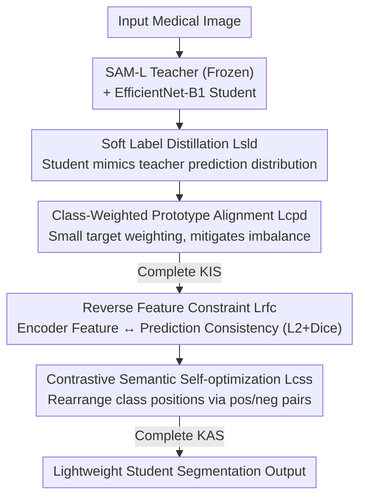

# From Infusion to Assimilation Distillation for Medical Image Segmentation

**Conference**: CVPR 2026  
**Paper**: [CVF Open Access](https://openaccess.thecvf.com/content/CVPR2026/html/Hong_From_Infusion_to_Assimilation_Distillation_for_Medical_Image_Segmentation_CVPR_2026_paper.html)  
**Code**: https://github.com/hjklearn/IAD  
**Area**: Medical Imaging  
**Keywords**: Knowledge Distillation, Medical Image Segmentation, SAM, Prototype Alignment, Contrastive Learning  

## TL;DR
Addressing the issue where existing Knowledge Distillation (KD) "simply pours knowledge in without allowing the student to digest it," leading to degraded generalization, this paper proposes a two-stage framework, IAD. It first "infuses" the semantic knowledge of a SAM teacher into a lightweight student via soft labels and class-weighted prototype alignment, then "assimilates" the knowledge through contrastive semantic self-optimization and reverse feature constraints to preserve the student's inherent advantages. It achieves DICE improvements of 4.32%, 1.85%, and 2.42% on Synapse, ACDC, and Polyp datasets, respectively, with an average cross-dataset generalization gain of 4.16%.

## Background & Motivation
**Background**: Medical Image Segmentation (MIS) requires lightweight models capable of real-time execution on resource-constrained devices. While foundation models like SAM achieve excellent segmentation, they are computationally heavy. Consequently, KD is used to transfer the representation capabilities of large teachers to compact students by minimizing prediction discrepancies, thereby improving the student's accuracy and generalization on transfer datasets. Mainstream KD methods are categorized into response-based (KD, LSKD, CrossKD...), feature-based (OFD, AT, CATKD...), and hybrid approaches (DIST+, VL2Lite...).

**Limitations of Prior Work**: The authors conducted a pilot experiment (Fig. 1) using SAM-L as the teacher and EfficientNet-B1 as the student. After distilling on Synapse and testing on transfer sets like ISIC2018, PH2, BUSI, and STU, performance **actually dropped** for 58% of the 12 mainstream KD methods, while remaining gains were limited. Visualization (Fig. 2) revealed that although the teacher is generally stronger, the student outperforms the teacher in certain easy-to-segment local regions. Traditional KD forces the student to mimic the teacher indiscriminately, "misleading" the student in areas where it was already proficient, resulting in performance degradation.

**Key Challenge**: Teacher and student models differ in scale and feature learning advantages. Existing KD only focuses on "feature alignment" or "distribution alignment," effectively **pouring** knowledge into the student without allowing for **adaptive internalization or integration** post-transfer. This failure to preserve inherent capabilities or properly absorb teacher semantics limits both performance gains and generalization.

**Goal**: (1) Effectively infuse class-level semantics from the teacher to the student while mitigating class imbalance in medical images; (2) Enable the student to digest and assimilate knowledge after infusion while retaining its own advantages.

**Key Insight**: The authors attribute poor generalization on transfer sets to "insufficient knowledge internalization." They decouple distillation into two steps: infusion followed by assimilation—analogous to eating before digesting, rather than just overfilling.

**Core Idea**: Replace one-time feature/distribution alignment with a two-stage distillation process: first injecting soft labels and class-prototype semantics, then assimilating via contrastive self-optimization and reverse constraints. This ensures the student learns from the teacher while retaining its own strengths.

## Method

### Overall Architecture
IAD is a serial two-stage distillation framework. The teacher is a fixed SAM-L with LoRA, and the student is EfficientNet-B1. The first stage is the **Knowledge Infusion Stage (KIS)**: The teacher is frozen, and soft label distillation is used to make the student mimic the teacher's prediction distribution, supplemented by "class-weighted prototype alignment" to handle class-level semantics and imbalance. The student output is also supervised by ground truth. The second stage is the **Knowledge Assimilation Stage (KAS)**: Building on the infused knowledge, reverse constraints are applied to student encoder features (aligning features with predictions), and contrastive semantic self-optimization is used to separate foreground/background and rearrange relative inter-class positions. This allows the student to "digest" knowledge and preserve its advantages. Both stages are trained sequentially, maintaining ground truth segmentation supervision to ensure task fidelity.

### Key Designs

**1. Soft Label Distillation + Class-Weighted Prototype Alignment: Injecting Distributions while Complementing Class Semantics and Addressing Imbalance**

Soft label distillation $\mathcal{L}_{\text{sld}}$ uses L2 distance to align teacher predictions $\bm{O}_t$ and student predictions $\bm{O}_s$: $\mathcal{L}_{\text{sld}} = \frac{1}{B}\sum_{b=1}^{B}\|\bm{O}_t^{(b)}-\bm{O}_s^{(b)}\|_2^2$. However, pixel-wise mimicry is merely "shallow distribution fitting" and fails to capture discriminative class-level semantic structures, often being skewed by class imbalance (e.g., small organs like the gallbladder or pancreas being overwhelmed by large classes). To address this, the authors add class-weighted prototype alignment. For each class per image based on ground truth tags, teacher prototypes $\bm{P}_t$ and student prototypes $\bm{P}_s\in\mathbb{R}^{B\times N\times C}$ are calculated by averaging features of all pixels in that class (Algorithm 1). Weighted L2 alignment is then applied: $\mathcal{L}_{\text{cpd}}=\frac{1}{N}\sum_{n=1}^{N} w_n\|\bm{P}_t^{n}-\bm{P}_s^{n}\|_2^2$. Crucially, $w_n$ **assigns higher weights to small target classes** (e.g., $w_n=2$ for gallbladder, $4$ for pancreas on Synapse; $1$ otherwise), forcing distillation focus onto neglected small organs. The KIS loss is $\mathcal{L}_{\text{kis}}=\mathcal{L}_{\text{sld}}+\mathcal{L}_{\text{cpd}}$. t-SNE (Fig. 4) shows that original student class prototypes are entangled, but become clearly separable after KIS.

**2. Reverse Feature Constraint: Aligning Encoder Features with Predictions to Strengthen Discriminative Structure**

The first KAS step addresses the potential semantic inconsistency between student encoder features $\bm{F}_l$ and final predictions $\bm{O}_s$. $\bm{F}_l$ is first projected via convolution and reshaping to $X=\text{Re}(\text{Conv}(\bm{F}_l))$, matching the prediction's channel count and resolution. A joint L2 and Dice constraint is then applied: $\mathcal{L}_{\text{rfc}}=\frac{1}{B}\sum_{b=1}^{B}\|X^{b}-\bm{O}_s^{b}\|_2^2 + 1-\frac{2\sum_{h,w}\text{S}(X)\text{S}(\bm{O}_s)+\epsilon}{\sum_{h,w}\text{S}(X)+\text{S}(\bm{O}_s)+\epsilon}$ (where $\text{S}$ is softmax, $\epsilon=1\text{e-}6$). This is "reverse" because **predictions are used to constrain low-level encoder features**: the L2 term ensures global consistency, while the Dice term enforces pixel-level semantic alignment within target regions, enhancing the discriminative power of encoder features.

**3. Contrastive Semantic Self-optimization: Using Pos/Neg Pairs to Internalize Knowledge and Sharpen Boundaries**

The second assimilation mechanism resolves the suppression of the student's inherent useful features after being "led" by the teacher. Contrastive pairs are constructed: the positive sample $\bm{F}_+=\text{Re}(\text{Conv}(\bm{F}_l))$ uses student encoder features directly; the negative sample $\bm{F}_-=\text{Conv}((1-\text{S}(\bm{F}_l))+(1-\text{S}(\bm{O}_s)))$ is formed by **element-wise inversion and summation** of softmaxed features and predictions (representing "reverse" semantics). An InfoNCE-style loss pulls $\bm{O}_s$ toward positive samples and pushes it away from negatives: $\mathcal{L}_{\text{css}}=-\log\frac{\exp(\text{sim}(\bm{O}_s,\bm{F}_+)/t)}{\exp(\text{sim}(\bm{O}_s,\bm{F}_+)/t)+\exp(\text{sim}(\bm{O}_s,\bm{F}_-)/t)}$ (where $\text{sim}$ is cosine similarity and $t$ is temperature). This sharpens foreground/background boundaries and rearranges class positions in feature space (Fig. 5), facilitating the internalization of student semantics and mitigating the suppression of inherent features. The KAS loss is $\mathcal{L}_{\text{kas}}=\mathcal{L}_{\text{rfc}}+\mathcal{L}_{\text{css}}$. Notably, **KAS is plug-and-play** and can be added to existing KD methods.

### Loss & Training
Sequential training is performed in two stages, with ground truth segmentation loss $\mathcal{L}_{\text{sgs}}$ (CE+Dice for multi-label, BCE-with-logits for binary) added in each:

- Stage 1: $\mathcal{L}_{\text{st1}}=\alpha\mathcal{L}_{\text{kis}}+\beta\mathcal{L}_{\text{sgs}}(\bm{O}_s,\text{O}_{\text{gt}})$. The teacher is frozen, and $\bm{O}_t$ is the distillation target.
- Stage 2: $\mathcal{L}_{\text{st2}}=\gamma\mathcal{L}_{\text{kas}}+\delta\mathcal{L}_{\text{sgs}}(\bm{O}_s,\text{O}_{\text{gt}})$, applying $\mathcal{L}_{\text{rfc}}$ and $\mathcal{L}_{\text{css}}$ on student representations.
- Weights $(\alpha,\beta,\gamma,\delta)$: Synapse uses $(0.2,0.8,0.1,1)$, ACDC uses learnable weights, and binary datasets use $(0.1,1,0.01,1)$. SAM-L+LoRA teacher, EfficientNet-B1 student, RTX 3090, Synapse at 512×512, batch 16, AdamW lr 0.0025.

## Key Experimental Results

### Main Results
SAM-L Teacher vs. EfficientNet-B1 Student, compared against 12 mainstream KD methods. The Gain column is relative to the Student Baseline.

| Dataset | Metric | Student Baseline | Next Best KD | IAD (Ours) | Gain |
|--------|------|----------|---------|-------------|------|
| Synapse | Avg. DICE↑ | 79.85 | ~81.75 (KD) | **84.17** | +4.32 |
| Synapse | Avg. HD95↓ | 19.16 | — | **12.94** | -6.22 |
| ACDC | Avg. DICE↑ | 87.44 | ~88.53 (CrossKD) | **89.29** | +1.85 |
| Polyp (Avg of 4) | Avg. DICE↑ | 75.56 | ~77.17 (AT) | **77.98** | +2.42 |
| Polyp (Avg of 4) | Avg. mIoU↑ | 67.32 | — | **69.70** | +2.38 |

Cross-dataset generalization (distill on Synapse, freeze encoder, fine-tune decoder, test on seen/unseen sets):

| Dataset | Metric | Student Baseline | Next Best KD | IAD | Gain |
|--------|------|----------|---------|-----|------|
| Avg of 4 sets | DICE↑ | 72.40 | ~75.60 (VL2Lite) | **76.56** | +4.16 |
| Avg of 4 sets | mIoU↑ | 61.25 | — | **65.48** | +4.23 |
| STU (unseen) | DICE↑ | 54.12 | 64.76 (VL2Lite) | **66.30** | +12.18 |

Note that in Tab. 4, most KD methods (KD/AT/OFD/CrossKD/SinKD…) **actually cause performance drops** relative to the baseline (e.g., KD -3.62), validating the core argument that "infusion without assimilation" hurts generalization. IAD is the only method that is consistently positive and optimal.

### Ablation Study

Main Ablation for KIS and KAS (Synapse / ACDC, Tab. 5):

| Config | Synapse DICE↑ | Synapse HD95↓ | ACDC DICE↑ | Description |
|------|---------------|---------------|------------|------|
| Student (None) | 79.85 | 19.16 | 87.44 | Baseline |
| KIS only | 83.13 | 14.35 | 88.72 | W/o KAS, DICE -1.04 |
| KAS only | 82.63 | 19.86 | 88.62 | W/o KIS, DICE -1.54, HD95 spikes 6.92 |
| KIS+KAS (IAD) | **84.17** | **12.94** | **89.29** | Full Model |

Ablation of the four loss terms within KIS/KAS (Synapse, Tab. 6): Using $\mathcal{L}_{\text{sld}}$ (82.18) or $\mathcal{L}_{\text{cpd}}$ (82.42) alone is inferior to full KIS (83.13). In KAS, keeping only $\mathcal{L}_{\text{rfc}}$ (83.90) or $\mathcal{L}_{\text{css}}$ (82.48) also leads to drops. KAS as plug-and-play (Tab. 9, Synapse): Adding KAS to other KD methods improved OFD by +3.04 DICE, CrossKD by +3.23, and CILD by +2.27—proving the assimilation stage is a universal gain module.

### Key Findings
- **KIS is the Foundation, KAS is the Amplifier**: Using KAS alone (without KIS infusion) causes Synapse HD95 to jump from 12.94 to 19.86, showing that without class-level semantics, assimilation has "no ingredients to cook." Conversely, KIS alone is 1+ points behind the full version, showing "infusion without digestion" leaves gains on the table.
- **Class-Weighting Tackles Imbalance**: By weighting the pancreas (+4 weight), Pancreas DICE on Synapse improved from 61.46 (student) to 68.95, one of the largest gains.
- **Generalization is the True Watershed**: Many KD methods gain slightly on in-distribution Synapse but collapse on unseen sets (PH2/STU). IAD remains stable and positive because it preserves the student's inherent useful features.
- L2 distance outperformed L1/KLD in both stages (Tab. 8).

## Highlights & Insights
- **Convincing Diagnosis of "Infusion without Assimilation"**: The statistical evidence of 58% performance drops on transfer sets across 12 KD methods, combined with the visualization of students outperforming teachers locally, clearly explains why KD can hurt generalization. The problem definition itself is a contribution.
- **Transferable Reverse Feature Constraint**: While KD usually aligns student features to the teacher, this reverse alignment of features to the student's own predictions strengthens internal "feature ↔ prediction" consistency. This self-distillation-style regularization could be applied to other tasks.
- **Clever Negative Sample Construction**: Using the "semantic complement" (inverted softmaxed features/predictions) as negative samples for contrastive learning avoids extra sampling or memory banks, making it computationally efficient.
- **High Utility of Plug-and-Play KAS**: The ability to add KAS to existing KD pipelines for a 2-3 DICE gain has significant practical value for existing workflows.

## Limitations & Future Work
- **Fixed Teacher/Student Pairs**: Evaluation was limited to SAM-L + EfficientNet-B1. Robustness across different architectures (e.g., CNN/Transformer teachers or smaller students) remains unverified. ⚠️
- **Manual Class Weights**: $w_n$ is manually set per dataset (e.g., specific weights for gallbladder/pancreas). Automated or adaptive weighting would be a clear improvement.
- **Training Complexity**: Two-stage sequential training increases pipeline complexity. No report on training time or memory overhead relative to single-stage KD. ⚠️
- The evaluation focused on 2D slices; performance on 3D volumetric data was not tested.

## Related Work & Insights
- **vs. Standard Response-Based KD (KD/LSKD/CrossKD)**: These only align prediction distributions, lacking class-level semantics and post-transfer internalization. IAD adds class-weighted prototypes and an assimilation stage, preventing performance drops on transfer sets.
- **vs. CSW-KD / IFVD (Semantic Modeling)**: These also model class relationships, but for natural scenes. IAD specifically handles class-internal semantics at the prediction layer with soft labels, making it more effective for medical image class imbalance.
- **vs. Feature/Hybrid KD (OFD, DIST+, VL2Lite)**: These perform suboptimally in MIS and ignore post-transfer assimilation. IAD's KAS fills this gap and can enhance these existing methods.
- **vs. De-LightSAM (MIS-specific Distillation)**: While also for medical segmentation, this paper is the first to attribute "poor generalization" to "insufficient internalization" and provide a two-stage solution.

## Rating
- Novelty: ⭐⭐⭐⭐ Decoupling distillation into "Infusion + Assimilation" and identifying internalization as a factor in generalization is a novel perspective; individual components draw on existing concepts.
- Experimental Thoroughness: ⭐⭐⭐⭐⭐ Comprehensive comparison with 12 KD methods, across 7 datasets, including seen/unseen generalization, component ablations, plug-and-play tests, and p-value significance.
- Writing Quality: ⭐⭐⭐⭐ The motivation is clearly articulated through pilot experiments and visualization; formulas are complete.
- Value: ⭐⭐⭐⭐ High practical value for lightweight medical segmentation deployment, especially through the reusable KAS module.

<!-- RELATED:START -->

## Related Papers

- [\[CVPR 2026\] PDD: Manifold-Prior Diverse Distillation for Medical Anomaly Detection](pdd_manifold-prior_diverse_distillation_for_medical_anomaly_detection.md)
- [\[CVPR 2026\] Momentum Memory for Knowledge Distillation in Computational Pathology](momentum_memory_for_knowledge_distillation_in_computational_pathology.md)
- [\[CVPR 2026\] SegMoTE: Token-Level Mixture of Experts for Medical Image Segmentation](segmote_token-level_mixture_of_experts_for_medical_image_segmentation.md)
- [\[CVPR 2026\] PMRNet: Physics-informed Multi-scale Refinement Network for Medical Image Segmentation](pmrnet_physics-informed_multi-scale_refinement_network_for_medical_image_segment.md)
- [\[CVPR 2026\] GeoSemba: Reconstructing State Space Model for Cross Paradigm Representation in Medical Image Segmentation](geosemba_reconstructing_state_space_model_for_cross_paradigm_representation_in_m.md)

<!-- RELATED:END -->
