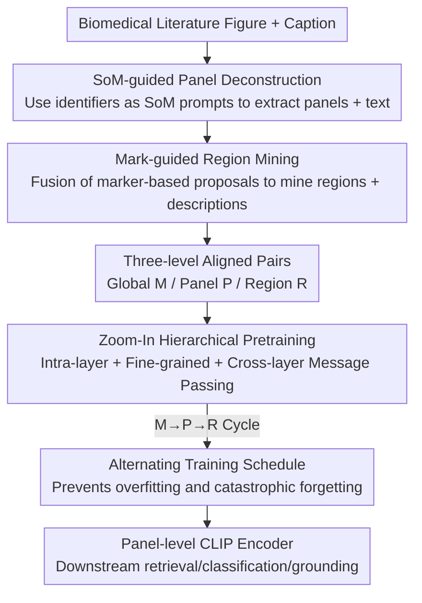

# From Panel to Pixel: Zoom-In Vision-Language Pretraining from Biomedical Scientific Literature

**Conference**: CVPR 2026  
**Paper**: [CVF Open Access](https://openaccess.thecvf.com/content/CVPR2026/html/Yuan_From_Panel_to_Pixel_Zoom-In_Vision-Language_Pretraining_from_Biomedical_Scientific_CVPR_2026_paper.html)  
**Code**: Not released  
**Area**: Medical Imaging / Multi-modal VLM  
**Keywords**: Biomedical Vision-Language Pretraining, Hierarchical Supervision, Panel Deconstruction, Region-level Alignment, Data Efficiency  

## TL;DR
Addressing the issue that biomedical literature figures are typically composite images containing multiple panels and annotated arrows, whereas existing VLP methods compress the entire figure into a single coarse image-text pair, this paper proposes the Panel2Patch data pipeline. It utilizes off-the-shelf LVLMs to automatically decompose literature figures into three levels of aligned image-text pairs: "Global-Panel-Region." Combined with a zoom-in pretraining framework featuring cross-layer message passing, the method achieves SOTA on multiple biomedical benchmarks using only 1/6 of the data compared to previous works.

## Background & Motivation
**Background**: Biomedical vision-language foundation models (e.g., PMC-CLIP, BiomedCLIP, BIOMEDICA/BMC-CLIP) predominantly follow the path of "scraping image-text pairs from scientific literature and scaling up." Data volume has increased from 1.6M to 24M, relying on web-scale corpora to learn general representations.

**Limitations of Prior Work**: The vast majority of figures in scientific literature are **multi-panel composite figures** (containing sub-figures A/B/C/D), while the captions often provide only a high-level summary. Existing pipelines either treat the entire multi-panel figure as a **single** image-text instance (BiomedCLIP, BMC-CLIP) or crop it into panels but reuse the global caption (Open-PMC-18M). This results in entangled text referring to multiple elements being associated with specific panel crops, leading to coarse and misaligned image-text pairs. This contradicts how clinicians actually interpret images: they **zoom in on local structures** to examine specific vessels or stained regions.

**Key Challenge**: There is a fundamental trade-off between "scalability" and "fine-grained supervision" in existing vision-language data generation. Fine-grained methods in natural imagery (FineCLIP, FG-CLIP) rely on manual annotation, pretrained detectors, or specialized captioners to obtain region-level alignment. However, annotation costs are high, and domain gaps prevent migration to biomedicine. Conversely, methods that scrape literature at scale sacrifice granularity. **No existing method** simultaneously produces hierarchical supervision across "multi-panel, single-panel, and fine-grained region" scales with corresponding hierarchical captions.

**Key Insight**: The authors identify a crucial observation: **Scientific figures themselves already encode hierarchical visual structures and explicit localization cues.** Multi-panel layouts, panel identifiers ("A", "B", ...), and author-drawn arrows, boxes, or magnified insets are "instructional designs" that serve as naturally available, weakly supervised signals that can be automatically extracted without additional manual annotation or specialized detectors.

**Core Idea**: By using off-the-shelf LVLMs and treating inherent "panel identifiers + visual markers" as implicit Set-of-Marks prompts, the authors automatically extract "Global-Panel-Region" hierarchical image-text pairs (Panel2Patch). These are trained using a zoom-in pretraining framework where panel-level embeddings are bidirectionally refined by global context and local regional evidence—essentially "mining better supervision" rather than "scraping more data."

## Method

### Overall Architecture
The method consists of two main components: the **Panel2Patch data pipeline**, which converts biomedical figures into three-level aligned image-text pairs, and **Zoom-In Hierarchical Pretraining**, which maps these pairs into a shared embedding space and allows panel-level representations to be refined by the other two levels.

On the data side, given a scientific figure and its caption, Panel2Patch first performs **SoM-guided Panel Deconstruction** (extracting single-panel images and associating them with specific text), followed by **Mark-guided Region Mining** (localizing regions using arrows/asterisks and pairing them with fine-grained descriptions). This produces image-text pairs at three granularities: global-level $(x^M_i, y^M_i)$, panel-level $(x^P_{ij}, y^P_{ij})$, and region-level $(x^R_{ijk}, y^R_{ijk})$. Note that the quantity of pairs at each level naturally varies.

For pretraining, a **shared** image encoder $f_v$ and text encoder $f_t$ map all granularities into the same $d$-dimensional space. Through three types of alignment (intra-layer, fine-grained, and cross-layer message passing), the panel-level embedding is refined into the primary representation for downstream tasks. Finally, an alternating training schedule (M→P→R) is used to prevent overfitting or catastrophic forgetting at any single level.

### Key Designs

**1. SoM-guided Panel Deconstruction: Utilizing existing "A/B/C" identifiers as free Set-of-Marks prompts**

The pain point is that feeding multi-panel figures as single images loses the fine correspondence between panels. The authors treat the **existing** panel labels (e.g., "A", "I") as implicit Set-of-Mark cues in two steps: First, **Panel Proposals**, where an LVLM is prompted to (i) box visually coherent panel rectangles and (ii) read nearby labels as identifiers. For robustness, queries are repeated across random scales and crops, and NMS is applied to boxes **sharing the same identifier** to obtain compact panel crops. A classifier is used to discard non-photographic plots (e.g., bar charts). Second, **Panel-aware Text Association**, where identifiers serve as anchors to decompose the composite caption into semantic units. The LVLM assigns each segment to the matching panel label. This "identifier-driven" assignment bypasses complex biomedical CLIP reasoning, allowing general-purpose LVLMs to function without domain fine-tuning. Finally, the LVLM generates brief descriptions combining the crop and its assigned text. Audits of 2000 figures showed ~80% were correctly decomposed.

**2. Mark-guided Region Mining: Anchoring "words in captions" to "locations in figures" using arrows/asterisks**

Fine-grained region supervision often suffers from hallucinations when relying solely on detectors and captioners. The authors exploit the fact that biomedical figures frequently use arrows, brackets, or color overlays to highlight key structures. They implement **Mark-anchored Dual-path Proposal Fusion**: one path detects marker boxes (arrows, asterisks), while the other generates caption boxes from the panel caption. The fusion rule retains a caption box only if its center falls within a normalized distance $\le \tau$ of a marker center (ensuring text proposals are anchored to explicit visual cues). Nearby markers without caption proposals are locally dilated to approximate the target object's scope. NMS is applied to the union of these boxes. On the text side, two complementary paths are used: the LVLM breaks long sentences into clauses anchored to keywords like "arrow," and also directly generates short descriptions focusing on local details (morphology, staining intensity) for each crop. This "gate" mechanism significantly reduces LVLM hallucinations.

**3. Hierarchical Embedding Space: Bidirectional refinement via Top-Down context and Bottom-Up evidence**

To prevent the three levels from learning in isolation, the authors map all inputs into a shared space. Three alignment strategies are applied: (i) **Intra-layer alignment**, performing standard CLIP contrastive learning within each level ($\mathcal{L}^M_{\text{intra}}$, $\mathcal{L}^P_{\text{intra}}$, $\mathcal{L}^R_{\text{intra}}$); (ii) **Fine-grained alignment**, pairing region crops with descriptions and performing ROI pooling on panel feature maps to ensure consistency between pixel-level and feature-level representations; (iii) **Cross-layer Message Passing**, using average pooling to aggregate fine-grained embeddings into coarse summaries $\bar v^P_i$ and $\bar v^R_{ij}$. CLIP losses are then applied to align adjacent levels:

$$\mathcal{L}^{M\leftrightarrow P}_{\text{inter}} = \mathcal{L}_{\text{CLIP}}(\{v^M_i\}, \{\bar v^P_i\}) + \mathcal{L}_{\text{CLIP}}(\{t^M_i\}, \{\bar t^P_i\})$$

$$\mathcal{L}^{P\leftrightarrow R}_{\text{inter}} = \mathcal{L}_{\text{CLIP}}(\{v^P_{ij}\}, \{\bar v^R_{ij}\}) + \mathcal{L}_{\text{CLIP}}(\{t^P_{ij}\}, \{\bar t^R_{ij}\})$$

The former injects global context into panels (top-down), while the latter aggregates regional evidence into panels (bottom-up), achieving bidirectional communication across $M\leftrightarrow P\leftrightarrow R$.

**4. Alternating Training Schedule: M→P→R cycle to resolve data imbalance and catastrophic forgetting**

The number of samples across the three levels varies significantly. Mixing them randomly risks overfitting one level while forgetting others. The authors adopt a coarse-to-fine **alternating schedule**: each step activates only one granularity in a rotating M→P→R sequence. This cyclic supervision ensures that parameters updated for one level are "re-tempered" by others before they drift excessively, maintaining balanced representations across all scales.

### Loss & Training
The total objective combines intra-layer CLIP (across three levels), fine-grained region alignment (with ROI pooling consistency), and cross-layer losses $\mathcal{L}^{M\leftrightarrow P}_{\text{inter}}$ and $\mathcal{L}^{P\leftrightarrow R}_{\text{inter}}$, using the M→P→R schedule. For regions, one of two text descriptions is randomly sampled. The model uses a ViT-L/14 encoder initialized from BMC-CLIP. **The text encoder and early layers of the vision tower are frozen, while the last 5 transformer blocks of the image encoder are updated.** Training utilized AdamW (weight decay 0.05, $\beta_1{=}0.9$, $\beta_2{=}0.95$), cosine learning rate with 1000 warmup steps, base $lr=1e{-}5$, for 20 epochs on 8 nodes. Preprocessing utilized Qwen2.5-VL-72B and took ~2900 GPU-hours (8×H100).

## Key Experimental Results

### Main Results
Retrieval performance (on Biomedica-derived test sets, I2T/T2I). Single-panel short-context retrieval (Panel A) shows significant leads, and Box-Text retrieval (Panel B) is also improved:

| Task / Model | I2T R@1 | I2T R@10 | T2I R@1 | T2I R@10 |
|------|------|------|------|------|
| Single Panel · BioMedCLIP | 33.66 | 74.84 | 30.07 | 73.20 |
| Single Panel · BMC-CLIP | 34.15 | 73.53 | 32.03 | 73.86 |
| Single Panel · **Ours** | **36.60** | **79.90** | **38.24** | **80.88** |
| Box-Text · BMC-CLIP | 8.04 | 27.82 | 9.29 | 28.42 |
| Box-Text · **Ours** | **8.64** | 27.73 | **9.38** | **30.50** |

Zero-shot classification (averaging over six biomedical specialties) shows that **Ours** with 400K pairs outperforms models trained on $\ge 10\times$ more data:

| Model | Data Count | Avg. |
|------|------|------|
| BiomedCLIP | 15M | 41.93 |
| BMC-CLIP | 24M | 47.85 |
| BMC-LongCLIP | 1M | 48.18 |
| **Ours** | **400K** | **50.25** |

### Ablation Study

**Impact of Supervision Levels** (Retrieval R@10):

| Config | Single Panel I2T R@10 | Box-Text I2T R@10 | Note |
|------|------|------|------|
| Single Panel Only | 77.61 | 23.66 | Lacks region supervision; grounding drops significantly |
| Region Only | 73.37 | 25.65 | Lacks panel data; panel-level semantics lost |
| Panel2Patch (Full) | **79.90** | **27.73** | Levels are complementary; highest performance |

**Alternating Training** (Cross-depth retrieval R@10):

| Train -> Test | I2T R@10 | Note |
|------|------|------|
| Multi -> Multi | 29.35 | Good on multi-panel |
| Multi -> Single | 8.14 | Collapses on fine scale |
| Single -> Single | 15.36 | Decent on single panel |
| Ours -> Single | 14.79 | Approaches single-only performance |
| Ours -> Multi | **29.59** | Multi-panel performance maintained |

### Key Findings
- **Quality Outweighs Quantity**: Using 400K pairs outperforms models like BMC-CLIP (24M) in zero-shot classification without changing the learning objective—merely upgrading the supervision granularity.
- **Region Supervision handles Grounding**: Removing region levels leads to a sharp decline in box-text retrieval. Panels and regions are mutually beneficial.
- **Alternating Training mitigates forgetting**: Single-level models overfit quickly (e.g., multi-only models fail at fine scales). The M→P→R cycle preserves multi-panel performance while achieving strong single-panel results.
- **Zero-shot Generalization**: The region-level understanding generalizes across radiology, microscopy, and cytology without task-specific fine-tuning.

## Highlights & Insights
- **Leveraging Document Structure as Implicit Supervision**: Treating panel labels and arrows as SoM cues effectively transforms decades of publishing standards into free weak labels. This can be extended to any domain following instructional layout conventions.
- **Dual-path Gating for Hallucination Suppression**: Using visual markers as a "gate" for text proposals ensures textual labels are anchored to physical evidence, a practical trick for utilizing LVLMs in data mining.
- **Message Passing Benefits**: Panel embeddings benefit from being at the center of the hierarchy, absorbing both top-down context and bottom-up evidence.
- **Reality of Data Efficiency**: Achieving SOTA with 60% less data suggests the bottleneck for biomedical foundation models may be supervision granularity rather than raw volume, offering a path for teams with limited compute.

## Limitations & Future Work
- **Dependency on LVLM Parsing Quality**: A ~20% error rate in panel decomposition indicates noise propagates into the supervision; the impact of this noise requires further study.
- **Restriction to "Marked" Figures**: The method relies on explicit labels and arrows, potentially failing on continuous scene images (e.g., whole-slide histology) without such cues. ⚠️ Specific thresholds like $\tau$ were not fully explored in terms of sensitivity.
- **Preprocessing Cost**: The pipeline requires ~2900 GPU-hours, which, while a one-time cost, remains significant for small-scale researchers.
- **Code Availability**: The model/data are not currently public, necessitating a custom pipeline with Qwen2.5-VL-72B for replication.

## Related Work & Insights
- **vs. BiomedCLIP / BMC-CLIP**: These models rely on scaling corpus size (15M/24M). **Ours** focuses on upgrading the supervision granularity of existing data, surpassing them with 400K pairs.
- **vs. Open-PMC-18M**: While it also crops panels, it reuses global captions. **Ours** uses identifier-driven association to pair specific text segments with panels and regions.
- **vs. FineCLIP / MedTrinity-25M**: These rely on heavy manual labels or expensive vision-language models for per-region captions. **Ours** provides a "drop-in" alternative for biomedicine using inherent figure markers.

## Rating
- Novelty: ⭐⭐⭐⭐⭐ Leveraging instructional layouts as hierarchical supervision is a unique and generalizable insight.
- Experimental Thoroughness: ⭐⭐⭐⭐ Covers various tasks and ablations, though lacks deeper sensitivity analysis on the decomposition noise.
- Writing Quality: ⭐⭐⭐⭐ Clear motivation; logical explanation of the three-level hierarchy.
- Value: ⭐⭐⭐⭐⭐ Proves that mining better supervision is a viable alternative to raw data scaling for biomedical AI.

<!-- RELATED:START -->

## Related Papers

- [\[CVPR 2026\] MedKCO: Medical Vision-Language Pretraining via Knowledge-Driven Cognitive Orchestration](medkco_medical_vision-language_pretraining_via_knowledge-driven_cognitive_orches.md)
- [\[CVPR 2026\] IBISAgent: Reinforcing Pixel-Level Visual Reasoning in MLLMs for Universal Biomedical Object Referring and Segmentation](ibisagent_reinforcing_pixel-level_visual_reasoning_in_mllms_for_universal_biomed.md)
- [\[ICCV 2025\] Vector Contrastive Learning for Pixel-wise Pretraining in Medical Vision](../../ICCV2025/medical_imaging/vector_contrastive_learning_for_pixel-wise_pretraining_in_medical_vision.md)
- [\[CVPR 2026\] LLaDA-MedV: Exploring Large Language Diffusion Models for Biomedical Image Understanding](llada-medv_exploring_large_language_diffusion_models_for_biomedical_image_unders.md)
- [\[CVPR 2026\] Modeling the Brain's Grammar: ROI-Guided fMRI Pretraining for Transferable and Interpretable Vision Decoding](modeling_the_brains_grammar_roi-guided_fmri_pretraining_for_transferable_and_int.md)

<!-- RELATED:END -->
