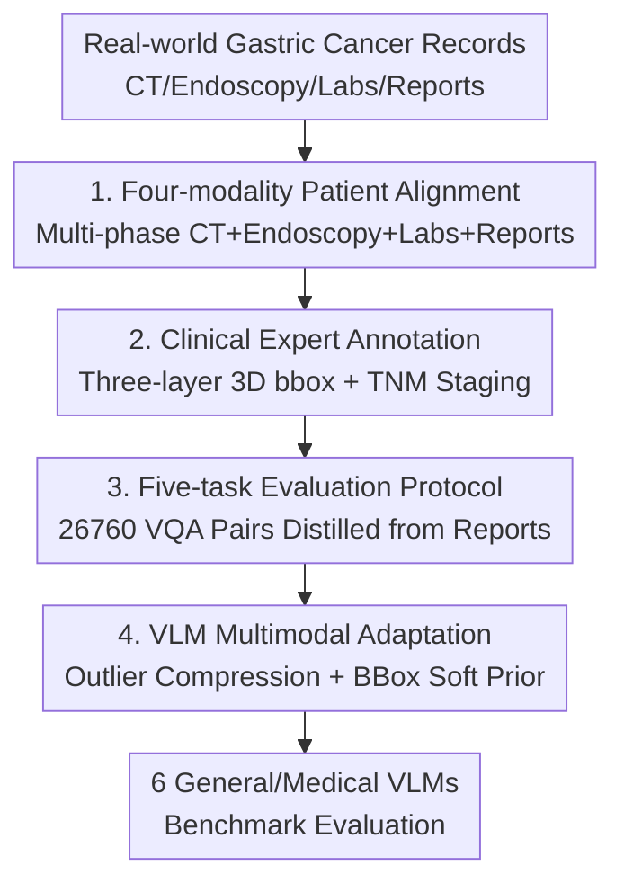

# Gastric-X: A Multimodal Multi-Phase Benchmark Dataset for Advancing Vision-Language Models in Gastric Cancer Analysis

**Conference**: CVPR 2026  
**Paper**: [CVF Open Access](https://openaccess.thecvf.com/content/CVPR2026/html/Li_Gastric-X_A_Multimodal_Multi-Phase_Benchmark_Dataset_for_Advancing_Vision-Language_Models_CVPR_2026_paper.html)  
**Code**: https://huggingface.co/datasets/HaoChen2/Gastric-X (Dataset; paper states full version released upon publication)  
**Area**: Medical Imaging  
**Keywords**: Gastric Cancer Diagnosis, Multimodal Benchmark, Multi-phase CT, Medical VLM, Clinical Reasoning  

## TL;DR
Gastric-X constructs a multimodal benchmark of 1.7K cases based on real-world gastric cancer clinical workflows. It aligns four-phase 3D CT, endoscopy images, structured biochemical indicators, and clinical reports at the patient level. By defining five tasks—VQA, report generation, cross-modal retrieval, staging classification, and lesion detection—it systematically evaluates six general/medical VLMs, revealing a significant gap in the ability of current models to achieve "cross-modal evidence corroboration."

## Background & Motivation
**Background**: Vision-Language Models (VLM) such as CLIP, BLIP, and Flamingo have demonstrated strong cross-modal reasoning on natural images, prompting the medical community to shift this paradigm to clinical diagnosis. Existing medical VLMs are mostly built on "single-modal 2D imaging + free-text report" datasets like MIMIC-CXR, CheXpert, and PadChest. Only recently have a few voxel-level CT datasets like MedVL-CT69K and 3D-RAD appeared.

**Limitations of Prior Work**: Nearly all these benchmarks are limited to "image-report matching." They lack three elements essential for real-world diagnosis: **multi-phase/dynamic imaging** (temporal changes across different contrast phases), **structured biochemical tests** (blood routines, tumor markers, etc.), and **precise lesion localization annotations**. Consequently, models only learn superficial correlations between images and text, failing to replicate the "cross-verification of multi-source evidence" used by physicians.

**Key Challenge**: Oncological diagnosis is inherently multimodal—radiologists examine multi-phase CT, gastroenterologists check endoscopy, and these are integrated with lab values and medical history. Since existing datasets only provide a "half-puzzle," VLMs fail to generalize to real clinical reasoning.

**Goal**: To create a dataset derived directly from real gastric cancer diagnostic workflows that aligns heterogeneous evidence at the patient level, paired with evaluation tasks simulating clinical stages. The objective is to evaluate model performance and determine if current VLMs can truly correlate biochemical signals, tumor spatial features, and textual reports.

**Core Idea**: Utilizing "four-modality patient-level alignment + clinical-grade expert annotation + five-task evaluation protocol," the entire diagnostic information flow is integrated into a unified benchmark. This compels VLMs to perform genuine multimodal corroboration rather than surface-level matching.

## Method

### Overall Architecture
Gastric-X is not a new model but an engineering project comprising a **dataset + evaluation protocol**. Starting from 1.74K real-world gastric cancer patient records, it aligns four types of heterogeneous evidence at the patient level: four-phase 3D CT (non-contrast, arterial, venous, and balance phases), endoscopy images, structured biochemical/EHR data, and three types of clinical reports. It further adds expert annotations of three-layered 3D bounding boxes, TNM staging, and VQA pairs distilled from reports. Finally, it defines five tasks corresponding to clinical stages and provides a unified scheme to adapt general/medical VLMs to multimodal multi-phase inputs.

Scale: 7.1K CT scans (83.48K slices), 1.7K endoscopy images, 21,408 3D bounding boxes, 26,760 VQA pairs, 11 serum biochemical items + 5 tumor markers + 134 structured EHR items. The pipeline is illustrated below:

### Key Designs

**1. Four-modality Patient-level Alignment: Integrating the Full Diagnostic Flow**

Addressing the limitation that existing datasets only provide partial evidence, Gastric-X aligns four types of evidence used by clinicians to the **same patient**: ① Four-phase 3D CT (arterial, venous, balance, non-contrast), where each phase reflects different blood perfusion and tissue enhancement; ② Endoscopy images providing mucosal texture, color, and microvascular details; ③ Structured biochemical data (11 serum tests, 5 tumor markers, 134 EHR items); ④ Three types of textual reports (CT, endoscopy, diagnosis). Compared to other datasets, Gastric-X is the only resource providing this configuration, which is a prerequisite for models to perform evidence cross-verification.

**2. Clinical-grade Expert Annotation: 3D Bounding Boxes + TNM Staging**

To ensure clinical semantics, ground truth is provided by clinicians. For each CT study, three 3D bounding boxes are provided across four phases at **three levels**: the tumor core, regional lymph nodes, and the entire gastric region, covering multi-scale lesion analysis. A total of 21,408 3D bboxes were generated. Staging employs the standard **TNM system** (Primary Tumor, Regional Lymph Nodes, Distant Metastasis), which directly informs treatment decisions. All annotations were completed and cross-verified by frontline clinicians under IRB approval, with de-identification to ensure reliable training/evaluation signals.

**3. Five-task Evaluation Protocol: Mapping Clinical Stages to Measurable Tasks**

The authors constructed **26,760 VQA pairs** based on clinical reports, converting narrative observations into structured reasoning questions. They defined **five tasks corresponding to clinical workflow stages**: Visual Question Answering (understanding and reasoning), Report Generation (linguistic expression), Cross-modal Retrieval (alignment), Disease Staging Classification (decision-making), and Lesion Detection (localization). Metrics include Precision/Accuracy/F1/AUC for VQA/Classification; ROUGE-L/BLEU-4/METEOR/BERTScore-F1 for Report Generation; Recall@K/MedR/MnR/mAP for Retrieval; and COCO-style AP/localization accuracy for Detection. This protocol evaluates the entire clinical chain from "perception → reasoning → decision → localization."

**4. VLM Multimodal Adaptation: Outlier Compression + BBox Soft Prior**

To evaluate standard VLMs, adaptation was required for multi-phase 3D data and tables. For models like LLaVA-1.5 and BLIP-2, multi-phase CT slices are concatenated into multi-channel inputs. Architecture-wise, models like X2-VLM and LLaVA-Med were equipped with 3D Swin Transformer vision encoders, resulting in X2-VLM-Med. Two auxiliary modalities were integrated with minimal changes: **Bounding boxes** are rendered as colored overlays on CT slices, acting as **soft spatial priors** to guide attention without altering the vision encoder. **Biochemical tables** are not fed in full; instead, following the clinician's habit of "identifying abnormalities," only **outliers exceeding physiological thresholds** are extracted and converted into concise text (Test Name + Value + Deviation Factor). This significantly reduces noise compared to full table inputs.

### Loss & Training
Models were fine-tuned using AdamW (learning rate $5\times10^{-5}$, weight decay 0.01, 10% linear warm-up) with a batch size of 32 on RTX 3090 GPUs. Data was split 70/15/15 at the **patient level** to prevent information leakage across phases. Tasks were trained independently, initialized from X2-VLM checkpoints, with the text encoder learning rate set to 2× the vision encoder.

## Key Experimental Results

### Dataset Comparison
Comparison between Gastric-X and mainstream medical VLM datasets (abridged Table 1):

| Dataset | Year | Site | Modality | Multi-phase | Labs | Lesion BBox | Text Format |
| :--- | :--- | :--- | :--- | :--- | :--- | :--- | :--- |
| PathVQA | 2020 | Multi | Pathology | ✗ | ✗ | ✗ | VQA |
| MIMIC-CXR | 2024 | Chest | X-ray | ✗ | ✓ | ✗ | Report |
| Merlin | 2024 | Abdo | CT | ✗ | ✓ | ✗ | Report |
| MedVL-CT69K | 2025 | Multi | CT | ✓ | ✗ | ✗ | Report |
| **Gastric-X** | 2025 | **Stomach** | **CT+Endo** | **✓** | **✓** | **✓** | **Report** |

### Main Results (X2-VLM-Med as Strongest Baseline)
Performance in VQA and Retrieval (abridged Table 2a/4, full modality configuration):

| Task | Metric | X2-VLM-Med | Med-Flamingo | LLaVA-1.5-7B |
| :--- | :--- | :--- | :--- | :--- |
| VQA (Img+Tab+BBox) | AUC | **91.5** | 86.5 | 77.8 |
| VQA (Image Only) | AUC | 85.3 | 80.5 | 67.8 |
| Report Gen. | BERTScore-F1 | **82.0** | 73.1 | 57.8 |
| Retrieval I→T | R@1 | **48.9** | 42.8 | 24.3 |
| Retrieval T→I | R@1 | **47.5** | 41.5 | 22.1 |

### Ablation Study
Incremental gains of auxiliary modalities for X2-VLM-Med:

| Input Configuration | VQA AUC | Report BERTScore-F1 |
| :--- | :--- | :--- |
| Image Only | 85.3 | 68.7 |
| Image + Table | 88.7 | 76.2 |
| Image + BBox | 89.2 | 78.3 |
| Image + Table + BBox | **91.5** | **82.0** |

In classification (Table 5), X2-VLM-Med reached 90.8 AUC, approximately +0.7 higher than the Swin Transformer baseline under the same configuration. In detection (Table 6), MedVInT achieved the highest AP@0.5 (72.1), while X2-VLM-Med performed best in AP@0.75 and localization accuracy.

## Key Findings
- **Monotonic Multimodal Gains**: All models demonstrated improved performance in VQA, report generation, and classification as more modalities were added, confirming that auxiliary modalities provide discriminative information beyond imaging.
- **Biochemical Tables vs. Bounding Boxes**: Adding BBoxes generally yielded higher gains than tables (e.g., 78.3 vs 76.2 in report generation), but the combination produced the best result, suggesting complementary roles.
- **No Single Winner Across Tasks**: While X2-VLM-Med led in reasoning and retrieval, specialized pre-trained models like MedVInT performed better in coarse detection (AP@0.5), indicating a tension between general alignment and fine-grained localization.

## Highlights & Insights
- **"Outlier Extraction" Strategy**: Instead of raw tables, only abnormal values were fed as text description. This clinical-inspired trick effectively denoises structured data and is transferable to other domains.
- **BBox as Rendered Overlay**: Using BBoxes as visual prompts without modifying the encoder is a cost-effective way to inject spatial priors into any VLM.
- **Patient-level Data Splitting**: Splitting by patient instead of image prevents leakage of multi-phase slices, ensuring the benchmark's integrity.
- **Evaluation Purpose**: The benchmark serves as a probe to determine if VLMs genuinely correlate biochemical signals and spatial features, rather than just optimizing scores.

## Limitations & Future Work
- **Dataset Scale**: 1.74K patients from a single center (e.g., Ruijin Hospital) limits the scale and does not verify cross-institutional/cross-device generalization.
- **Engineering vs. Architecture**: The adaptation strategies (concatenation, Swin replacement, BBox overlay) are engineering-focused; native architectures for multi-phase alignment are yet to be proposed.
- **Detection Gap**: The fact that general VLMs are outperformed on detection tasks suggests that current multimodal alignment has not yet mastered fine-grained spatial localization.
- **Data Availability**: The full dataset requires institutional agreements; HuggingFace only hosts a small sample (CC BY-NC-ND 4.0).

## Related Work & Insights
- **vs. MIMIC-CXR / CheXpert**: These focus on 2D images and reports. Gastric-X introduces multi-phase 3D CT and structured labs to simulate real-world reasoning.
- **vs. MedVL-CT69K / 3D-RAD**: While these move to 3D CT, they lack the biochemical data and precise lesion bboxes integrated into Gastric-X.
- **vs. Merlin**: Merlin includes EHR data but lacks multi-phase imaging, endoscopy, and lesion boxes.

## Rating
- Novelty: ⭐⭐⭐⭐ First patient-level aligned gastric cancer benchmark for VLM combining multi-phase CT, endoscopy, labs, and bboxes.
- Experimental Thoroughness: ⭐⭐⭐⭐ Systematically evaluated across 6 models, 5 tasks, and 4 modality configurations.
- Writing Quality: ⭐⭐⭐⭐ Clinical motivation is well-articulated; tables and diagrams are standardized.
- Value: ⭐⭐⭐⭐ Provides a high-quality clinical reasoning platform; the outlier compression and soft prior tricks are highly portable.

<!-- RELATED:START -->

## Related Papers

- [\[CVPR 2026\] OmniBrainBench: A Comprehensive Multimodal Benchmark for Brain Imaging Analysis Across Multi-stage Clinical Tasks](omnibrainbench_a_comprehensive_multimodal_benchmark_for_brain_imaging_analysis_a.md)
- [\[CVPR 2026\] SurgCoT: Advancing Spatiotemporal Reasoning in Surgical Videos through a Chain-of-Thought Benchmark](surgcot_advancing_spatiotemporal_reasoning_in_surgical_videos_through_a_chain-of.md)
- [\[ICML 2026\] Seizure-Semiology-Suite (S³): A Clinically Multimodal Dataset, Benchmark, and Models for Seizure Semiology Understanding](../../ICML2026/medical_imaging/seizure-semiology-suite_s3_a_clinically_multimodal_dataset_benchmark_and_models_.md)
- [\[CVPR 2026\] RDFace: A Benchmark Dataset for Rare Disease Facial Image Analysis under Extreme Data Scarcity and Phenotype-Aware Synthetic Generation](rdface_a_benchmark_dataset_for_rare_disease_facial_image_analysis_under_extreme_.md)
- [\[CVPR 2026\] IVAAN: Instance-level Vision-Language Alignment via Attribute-Guided Text Prompts Generation for Nuclei Analysis](ivaan_instance-level_vision-language_alignment_via_attribute-guided_text_prompts.md)

<!-- RELATED:END -->
