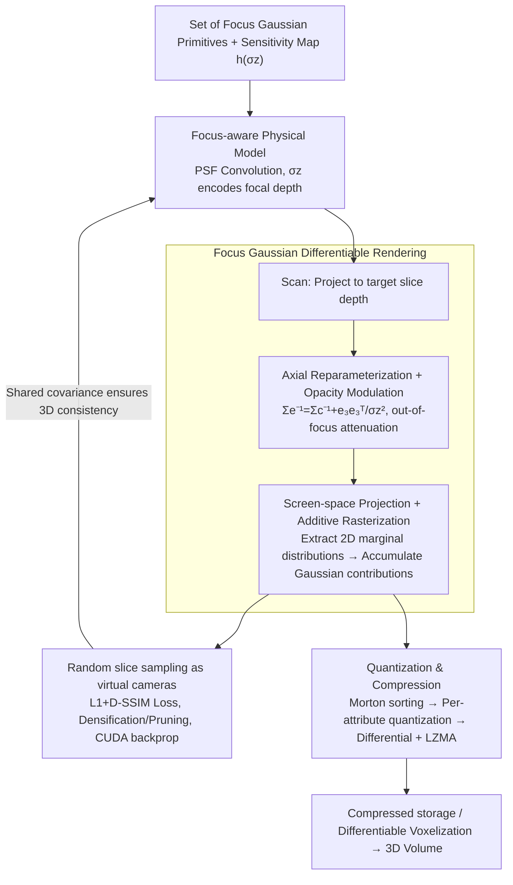

# GaussianPile: A Unified Sparse Gaussian Splatting Framework for Slice-based Volumetric Reconstruction

**Conference**: CVPR 2026  
**arXiv**: [2603.20611](https://arxiv.org/abs/2603.20611)  
**Code**: None  
**Area**: Medical Imaging / 3D Reconstruction  
**Keywords**: 3D Gaussian Splatting, Volume Compression, Slice Imaging, Focus-aware Model, Real-time Rendering

## TL;DR
GaussianPile is proposed to extend 3D Gaussian Splatting from surface appearance modeling to slice-based volumetric reconstruction by introducing a focus-aware physical imaging model (Focus Gaussian). It achieves high-quality volumetric compression and reconstruction on ultrasound and light-sheet microscopy data, performing $11\times$ faster than NeRF-based methods and achieving $16\times$ compression compared to voxel grids.

## Background & Motivation
1. **Background**: Data volume in modern biomedical imaging (3D microscopy, volumetric ultrasound, etc.) is growing exponentially, making storage, transmission, and analysis costs a significant bottleneck. Implicit Neural Representations (INR) achieve high compression ratios but suffer from slow training and inference (hours) and loss of high-frequency details. 3DGS offers efficient fitting and real-time rendering but is designed for surface modeling from multi-view images.
2. **Limitations of Prior Work**: Standard 3DGS discards internal volumetric information, leading to "ghosting" artifacts when applied directly to volumetric data—2D projections appear reasonable, but 3D internal structures remain inconsistent. While modified rendering equations exist for integral projection modalities (e.g., X-ray) and dense slice modalities (e.g., MRI with theoretical zero-thickness), there is no suitable model for **finite-thickness slice** modalities (e.g., ultrasound, light-sheet microscopy) where the imaging system has a limited axial depth of field.
3. **Key Challenge**: Standard 3DGS rendering relies on an "all-in-focus" assumption (all Gaussians contribute regardless of depth), which does not match the physics of slice imaging—each slice should only observe signals within a limited depth range near the focal plane. This lack of physical constraint causes Gaussian primitives to grow unconstrained in the axial direction, creating ghosting artifacts between different slices.
4. **Goal**: To design a suitable Gaussian Splatting rendering model for finite-thickness slice imaging systems, enabling a single set of Gaussian primitives to accurately reconstruct 2D slices while maintaining 3D volumetric consistency.
5. **Key Insight**: Explicitly integrate the Point Spread Function (PSF) of the imaging system into the Gaussian primitive rendering process, modeling the finite depth of field via axial reparameterization of the covariance matrix.
6. **Core Idea**: Convolve the axial sensitivity function of the imaging system into the 3D Gaussian primitives to obtain "Focus Gaussians." Their covariance naturally encodes focal depth information, ensuring both 2D slice fidelity and 3D volumetric consistency.

## Method

### Overall Architecture
The core objective is to reconstruct volumetric data from "finite-thickness slice" imaging (ultrasound, light-sheet microscopy) using 3D Gaussian Splatting without generating ghosting artifacts. The approach optimizes **a single set** of Focus Gaussian primitives that can accurately render 2D images slice-by-slice and be directly voxelized into a consistent 3D volume.

The pipeline operates as follows: Each Gaussian is first projected onto the depth of the slice to be rendered (Scan). A focal model then performs axial reparameterization and opacity modulation to attenuate signals too far from the focal plane. Finally, screen-space projection and **additive** rasterization accumulate the contributions of all Gaussians into a 2D image. During training, slices are randomly sampled as virtual cameras for fitting. Once complete, these primitives can render arbitrary slices or be quantized and compressed for storage.

### Key Designs

**1. Focus-aware Physical Model: Embedding "Finite Focal Depth" into Rendering**

Standard 3DGS assumes all Gaussians contribute regardless of depth. This "all-in-focus" assumption allows primitives to fit 2D images at specific slice positions perfectly while forming chaotic 3D structures in between due to the lack of axial constraints. This results in ghosting artifacts.

GaussianPile addresses this by convolving the imaging system's Point Spread Function (PSF) directly into the rendering. It assumes the PSF follows an anisotropic Gaussian $\text{psf}(\mathbf{x}_c) \propto \exp(-\frac{1}{2}(\frac{x_c^2}{\sigma_x^2}+\frac{y_c^2}{\sigma_y^2}+\frac{z_c^2}{\sigma_z^2}))$, where $\sigma_z$ represents axial focusing capability. This defines a sensitivity map $h(-z_c) = \exp(-z_c^2 / (2\sigma_z^2))$. The rendered intensity of a slice is the convolution of the Gaussian primitive with this sensitivity map. The scalar $\sigma_z$ unifies three imaging modalities: $\sigma_z \to \infty$ returns to the all-in-focus model (X-ray / Standard 3DGS), $\sigma_z \to 0$ recovers the zero-thickness model (MRI), and finite $\sigma_z$ corresponds to ultrasound or light-sheet microscopy. In practice, $\sigma_z \approx \delta_z$ (scanning step size) is used as the default per the Nyquist criterion.

**2. Differentiable Rendering of Focus Gaussians: Constraining Forward Pass and Gradients**

The "Gaussian $\circledast$ sensitivity map" convolution is solved efficiently in closed form via four steps. First, **axial reparameterization** applies an additive correction to the inverse covariance $\Sigma_e^{-1} = \Sigma_c^{-1} + \mathbf{e}_3 \mathbf{e}_3^\top / \sigma_z^2$ and updates the mean $\mu_e = \Sigma_e \Sigma_c^{-1} \mu_c$. This shrinks axial support while leaving lateral structure intact. Second, **opacity modulation** is applied:

$$\text{opacity}_r = \exp\!\Big(-\tfrac{1}{2}\big(\mu_c^\top \Sigma_c^{-1} \mu_c - \mu_e^\top \Sigma_e^{-1} \mu_e\big)\Big)$$

This attenuates Gaussians further from the focal plane, eliminating cross-slice ghosting. Third, **screen-space projection** takes the marginal distribution of the Focus Gaussian covariance on the $(x_c, y_c)$ plane and normalizes it by $\tilde{\alpha} = \alpha \cdot \text{opacity}_r / \sqrt{\det(\Sigma_{2d})}$, ensuring energy conservation. Fourth, **additive rasterization** is used instead of alpha-blending, as volumetric pixel intensity is a linear sum of contributions: $I(p) = \sum_{i} \tilde{\alpha}_i \exp(-\frac{1}{2} \mathbf{d}_i^\top \Sigma_{2d,i}^{-1} \mathbf{d}_i)$.

**3. Quantization and Compression: Exploiting Spatial Correlation**

To achieve $>16\times$ compression, GaussianPile exploits the spatial structure of primitives. It utilizes a "spatial sorting → differential → entropy coding" pipeline. Primitives are sorted by Morton Z-order to maximize spatial locality. Attributes are then quantized: positions (14-bit), opacity (12-bit), log-scales (12-bit), and normalized quaternions (12-bit). Differential encoding followed by LZMA compression is applied to these streams, yielding significantly higher compression than standard 3DGS.

### Loss & Training
The loss function is $\mathcal{L} = \mathcal{L}_1 + \lambda \mathcal{L}_{\text{D-SSIM}}$ with $\lambda = 0.2$. Optimization uses the Adam optimizer for 30K iterations with random slice sampling. Initialized with 1,000K Gaussians, adaptive densification and pruning occur between steps 500 and 25,000. A differentiable voxelizer is used for 3D quality evaluation.

## Key Experimental Results

### Main Results (2D Reconstruction Quality)

| Method | ABUS PSNR↑ | rDL-LSM PSNR↑ | TNNI1 PSNR↑ | Tribolium PSNR↑ | Typical Training Time |
|------|-----------|--------------|------------|----------------|-------------|
| HEVC | 29.67 | 29.34 | 35.76 | 35.51 | ~instant |
| INIF (INR) | 24.84 | 17.54 | 30.89 | 31.55 | 27m-1h24m |
| NeurComp (INR) | 19.85 | 30.32 | 39.25 | 32.59 | 11m-2h41m |
| 3DGS (Original) | 27.41 | 28.63 | 38.17 | 27.81 | 10m-1h |
| **Ours (10K iter)** | **32.25** | **33.78** | **40.87** | **35.32** | **2-4m** |
| **Ours (30K iter)** | **33.07** | **34.57** | **42.08** | **36.14** | **5-13m** |

### Ablation Study (Impact of $\sigma_z$, Tribolium Data)

| $\sigma_z$ Setting | PSNR ↑ | SSIM ↑ | Training Time | Gaussian Count |
|-----------------|--------|--------|---------|---------|
| $\delta_z/10$ | 34.25 | 0.927 | 8m9s | 215k |
| $\delta_z/2$ | 36.44 | 0.942 | 8m18s | 214k |
| **$\delta_z$ (Default)** | **36.67** | **0.944** | **7m23s** | **211k** |
| $2\delta_z$ | 36.12 | 0.940 | 8m8s | 162k |
| $10\delta_z$ (All-in-focus) | 23.05 | 0.858 | 9m17s | 66k |

### Key Findings
- **Ghosting in Standard 3DGS**: Standard 3DGS achieves 27.41 PSNR for 2D but drops significantly in 3D consistency. GaussianPile maintains consistency (33.07 2D vs 33.22 3D), proving the physical model locks volumetric structure.
- **$\sigma_z = \delta_z$ is Optimal**: This aligns with Nyquist sampling theory. When $\sigma_z = 10\delta_z$ (approaching all-in-focus), PSNR drops by 13.6 dB.
- **Speed Advantage**: 30K iterations take ~8 minutes, 5-11$\times$ faster than INR methods with higher quality.
- **Compression Efficiency**: Achieves 16-26$\times$ compression, whereas 3DGS often inflates data size (0.1-3$\times$). It matches INR compression ratios while maintaining better fidelity.

## Highlights & Insights
- **Elegant Physical Integration**: Decomposing PSF convolution into an additive correction of the covariance matrix maintains differentiability and closed-form Gaussian properties. The single scalar $\sigma_z$ elegantly unifies multiple modalities.
- **Removing Spherical Harmonics**: Removing SH coefficients saves 40% in storage and prevents overfitting to view-dependent 2D projections, thereby protecting 3D geometry consistency.
- **Additive Rasterization**: Choosing an accumulation model over alpha-blending correctly reflects the physics of volumetric projection and ensures proper gradient flow.

## Limitations & Future Work
- Assumes a spatially invariant PSF; real optical systems possess spatially varying aberrations.
- May over-smooth heavily noisy or undersampled data; physical or semantic priors could help.
- Lacks support for 4D spatiotemporal data (e.g., live cell imaging).
- Requires per-scene optimization; a feed-forward model for large-scale pre-training is a future direction.

## Related Work & Insights
- **vs. Standard 3DGS**: 3DGS fails at volume consistency due to lack of physical modeling. GaussianPile resolves this via Focus Gaussians.
- **vs. INR Methods**: INR is slow and loses high-frequency details; GaussianPile is $5-11\times$ faster with better detail retention.
- **vs. Radiative Gaussian Splatting**: While Radiative GS handles integral projections ($\sigma_z \to \infty$), GaussianPile addresses finite focal depth ($\sigma_z$ is finite), complementarily covering different modalities.

## Rating
- Novelty: ⭐⭐⭐⭐⭐ The Focus Gaussian physical model is elegantly designed and fills a critical gap in volumetric rendering.
- Experimental Thoroughness: ⭐⭐⭐⭐ Multiple datasets and metrics are provided, though comparisons with more specialized compression codecs could be strengthened.
- Writing Quality: ⭐⭐⭐⭐⭐ Derivations are clear and visual comparisons are excellent.
- Value: ⭐⭐⭐⭐⭐ Resolves fundamental 3DGS limitations for volumetric data with practical utility in medical imaging.

<!-- RELATED:START -->

## Related Papers

- [\[CVPR 2026\] Adaptive Anisotropic Gaussian Splatting for Multi-contrast MRI Arbitrary-Scale Super-Resolution with Anatomy Guidance](adaptive_anisotropic_gaussian_splatting_for_multi-contrast_mri_arbitrary-scale_s.md)
- [\[CVPR 2026\] EchoPOSE: 6D Pose Estimation of Sparse Echocardiograms for Left-Ventricular 3D Shape Reconstruction](echopose_6d_pose_estimation_of_sparse_echocardiograms_for_left-ventricular_3d_sh.md)
- [\[ICLR 2026\] MedGMAE: Gaussian Masked Autoencoders for Medical Volumetric Representation Learning](../../ICLR2026/medical_imaging/medgmae_gaussian_masked_autoencoders_for_medical_volumetric_representation_learn.md)
- [\[ECCV 2024\] Radiative Gaussian Splatting for Efficient X-ray Novel View Synthesis](../../ECCV2024/medical_imaging/radiative_gaussian_splatting_for_efficient_x-ray_novel_view_synthesis.md)
- [\[ICLR 2026\] OmniCT: Towards a Unified Slice-Volume LVLM for Comprehensive CT Analysis](../../ICLR2026/medical_imaging/omnict_towards_a_unified_slice-volume_lvlm_for_comprehensive_ct_analysis.md)

<!-- RELATED:END -->
