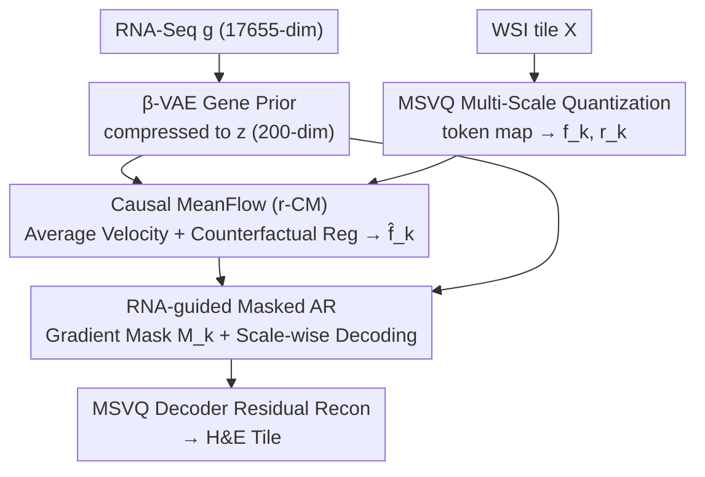

# GeneVAR: Causal MeanFlow for Autoregressive Gene-to-WSI Tile Synthesis

**Conference**: CVPR 2026  
**Paper**: [CVF Open Access](https://openaccess.thecvf.com/content/CVPR2026/html/Zhao_GeneVAR_Causal_MeanFlow_for_Autoregressive_Gene-to-WSI_Tile_Synthesis_CVPR_2026_paper.html)  
**Code**: https://github.com/JWZhao-uestc/GeneVAR (Available)  
**Area**: Medical Imaging / Diffusion & Autoregressive Generation / Computational Pathology  
**Keywords**: Gene-to-Pathology Image Synthesis, Autoregressive Generation, Causal Modeling, MeanFlow, Counterfactual Regularization

## TL;DR
GeneVAR reformulates the synthesis of H&E pathology tiles from RNA-Seq expression profiles into a multi-scale coarse-to-fine autoregressive process. By embedding an RNA-conditioned Causal MeanFlow module within the autoregressive trajectory, it utilizes average velocity fields and counterfactual interventions to disentangle genuine gene-driven morphology from non-biological confounders like staining and contrast. It achieves SOTA performance in FID and downstream classification across five TCGA cohorts.

## Background & Motivation
**Background**: While substantial work in computational pathology focuses on "predicting gene expression from pathology images," the reverse direction—directly synthesizing tissue morphology from RNA-Seq (Gene-to-WSI tile synthesis)—has long been underdeveloped. Its value lies in performing "in silico experiments" to explore how molecular perturbations manifest morphologically, generating privacy-safe synthetic training data, and mitigating data scarcity and imbalance in downstream cancer classification. Existing solutions typically use one-step GAN generation (RNA-GAN) or cascaded diffusion (RNA-CDM).

**Limitations of Prior Work**: These methods almost exclusively compress the entire transcriptome into a low-dimensional global embedding, **injecting it only once during initialization**. The authors highlight three structural flaws: ① **Signal Decay**—molecular guidance gradually fades as generation progresses, causing images to drift toward surface correlations rather than gene-driven morphology; ② **Scale Rigidity**—fixed-resolution synthesis disrupts cross-scale semantic consistency, weakening the alignment between transcriptomes and morphology; ③ **Pure Correlation Learning**—since embeddings are learned through correlations, models lack resistance to confounders such as staining differences, tumor purity, and imaging artifacts, entangling genuine gene-driven morphology with non-biological factors.

**Key Challenge**: To ensure transcriptome signals "stay online" to drive morphology throughout the process, one must solve the temporal issue of "decay after a single injection" while **actively suppressing non-biological confounders** during generation. The latter is inherently a causal problem that correlation-based generators cannot address.

**Core Idea**: The synthesis is reconstructed as a **multi-scale coarse-to-fine autoregressive process** (where transcriptomes are repeatedly injected across multiple scales to address signal decay and scale rigidity). A **Causal MeanFlow** module is embedded within the autoregressive trajectory, utilizing average velocity fields for single-step reconstruction and counterfactual interventions to push away "negative samples" (degraded variants like staining/contrast/sharpness shifts). This forces the velocity field to align only with scale-invariant morphology regulated by genes. The authors explicitly state that this is "artifact invariance" and **do not claim gene-level causal discovery**.

## Method

### Overall Architecture
GeneVAR takes an RNA-Seq expression profile $g \in \mathbb{R}^{17655}$ as input and outputs a corresponding H&E-stained WSI tile. The pipeline consists of three synergistic components: first, a **$\beta$-VAE** compresses the high-dimensional expression profile into a compact molecular prior $z \in \mathbb{R}^{200}$; on the image side, **Multi-Scale Vector Quantization (MSVQ)** discretizes the tile into $K$ coarse-to-fine token maps, obtaining scale-wise aggregated features $f_k$ and scale-aligned embeddings $r_k$. Then, the core module **Causal MeanFlow (r-CM)**, guided by $z$, refines $r_k$ into "causally enhanced features" $\hat f_k$. Finally, **RNA-guided Masked Autoregression** constructs a mask $M_k$ based on the gradient difference between $\hat f_k$ and $f_k$ to highlight transcriptome-significant regions, concatenates $z$ with $\{M_k\hat f_k\}$, and decodes them scale-by-scale into token maps, which are then residually reconstructed into the final tile by the MSVQ decoder.

### Key Designs

**1. Multi-scale Coarse-to-fine Autoregressive Reconstruction: Replacing "Single Injection" with "Continuous Multi-scale Injection"**

This represents a paradigm shift targeting signal decay and scale rigidity. Drawing inspiration from Visual Autoregression (VAR), GeneVAR quantizes WSI tiles into hierarchical token maps $S=\{s_k\}_{k=1}^{n}$ and uses the transcriptome $g$ (represented by its prior $z$) as a recursive condition to generate tokens scale-by-scale: $s_k = P_\Theta(s_{<k}, g)$. On the image side, MSVQ discretizes the tile into $K$ complete token maps of different resolutions (rather than single tokens), significantly reducing inference costs while maintaining cross-scale structural coherence. Scale-wise aggregated features and aligned embeddings are defined as:

$$f_k=\sum_{i=1}^{k} U(W(s_i),\, h_K\times w_K),\qquad r_{k+1}=U(f_k,\, h_{k+1}\times w_{k+1}),$$

where $f_k\in\mathbb{R}^{h_K\times w_K\times d}$ aggregates information from the previous $k$ scales to the highest resolution, and $r_{k+1}$ provides the scale-aligned embedding. Because $z$ participates in every scale, the transcriptome remains an "active driver" of morphology, preventing the global embedding from fading after a single injection—a fundamental reason why it is more faithful to gene signals than GANs or cascaded diffusion models. The VAR-style 10-step sampling is also much faster than diffusion models that often require hundreds of steps.

**2. $\beta$-VAE Compact Gene Prior: Providing a Biologically Credible Compressed Representation for High-dimensional Expression Profiles**

RNA-Seq dimensionality is extremely high (17,655), making it expensive and noisy to feed directly into a generator. Following the approach of RNA-CDM, a $\beta$-VAE with a two-layer encoder/decoder maps each expression profile to a latent code $z$. The training objective is:

$$\mathcal{L}_{\psi,\theta}=-\mathbb{E}_{f_\psi(z|g)}[\log g_\theta(g|z)] + \beta\cdot \mathrm{KL}\big(f_\psi(z|g)\,\|\,p(z)\big),$$

where $\beta$ balances reconstruction fidelity and latent space regularization. The resulting $z$ serves as the molecular prior throughout downstream generation. Ablation studies show this step is critical: replacing $z$ with a class-label embedding causes the FID to surge by 14.75; using a linear embedding is also 9.20 worse than $\beta$-VAE—indicating that only this bio-structurally aware compression can support the required conditioning strength for gene-to-WSI synthesis.

**3. Causal MeanFlow (r-CM): Disentangling Gene Signals from Confounders via Average Velocity Fields and Counterfactual Intervention**

This is the core of the paper. it addresses two issues: the rapid expansion of high-scale token maps leading to "trivially predictable" positions and redundant attention hindering morphological fidelity; and the fact that autoregression itself lacks a mechanism to suppress non-biological confounders.

The mechanism operates on two levels. **(a) RNA-conditioned Average Velocity Modeling**: Unlike traditional Flow Matching which uses instantaneous velocity $v$, r-CM draws from MeanFlow to use "average velocity" $u$ (displacement over two timesteps divided by the interval), compressing multi-step integration into a single step. Given the interpolated latent variable and noise:

$$f_k^t = t f_k + (1-t)\epsilon_k,\quad v(f_k^t,t)=\frac{d f_k^t}{dt}=f_k-\epsilon_k,$$

deriving the relationship between $u$ and $v$ yields a closed-form target $u_{tgt}=v(f_k^t,t)-(t-r)\big(v(f_k^t,t)\partial_{f_k}u_\phi+\partial_t u_\phi\big)$, estimated by the network $u_\phi=\Phi(f_k^t,r_k,z,t,r)$. $\Phi$ performs an additional task compared to original MeanFlow: using **biology-enhanced adaLN** to perform position-wise fusion of semantic features from $r_k$ and transcriptome signals from $z$ (Equation 7 uses $z+t+r$ and $r_k+t+r$ to produce separate $\alpha,\beta,\gamma$ sets for modulating attention/cross-attention). During inference, single-step sampling is performed as $\hat f_k=\epsilon_k-\Phi(\epsilon_k,r_k,z,1,0)$.

**(b) Counterfactual Regularization**: To prevent generation from being "sidetracked" by non-causal factors like tumor purity or staining, the authors apply three perturbations to each tile—color anomaly, contrast adjustment (simulating staining variation), and sharpening (simulating tumor purity differences)—yielding counterfactual variants $X_a,X_c,X_s$. Instead of using expensive partial derivatives for the target velocity $u^a_{tgt}$, the average velocity is decomposed into magnitude and direction: the direction is given by the normalized flow between two sampled fields $f_k^{a,t},f_k^{a,r}$, and the magnitude is scaled by a random factor $\lambda$ relative to $\|u_{tgt}\|$ (Equation 9). The learning objective is a contrastive formulation:

$$\mathcal{L}_\Phi=\mathbb{E}\big[\|u_\phi-\mathrm{sg}(u_{tgt})\|^2\big]-\frac{\alpha}{N}\sum_{u^n_{tgt}\sim C_u}\mathbb{E}\big[\|u_\phi-\mathrm{sg}(u^n_{tgt})\|^2\big],$$

which pulls the predicted velocity toward the true anchor $u_{tgt}$ and pushes it away from the counterfactual set $C_u$ (including degraded variants and extreme counterfactuals from other WSIs; $\mathrm{sg}$ denotes stop-gradient, and $\alpha$ controls causal regularization strength). Consequently, $\Phi$ is forced to align only with scale-invariant morphological semantics. t-SNE visualizations show that while original MeanFlow velocity trajectories overlap and are difficult to classify, Causal MeanFlow trajectories are clearly separated.

**4. RNA-guided Masked Autoregression: Locating Transcriptome-Significant Regions via Gradients to Inject Guidance into Key Tokens Only**

After r-CM converges, it produces a stable $\hat f_k$, which the authors use to construct a mask to "select positions that should be gene-guided." The gradient of the reconstruction MSE with respect to $r_k$ is calculated, and its $\ell_2$ norm across channels is thresholded:

$$G_k=\nabla_{r_k}\big(\mathbb{E}\|f_k-\hat f_k\|^2\big),\qquad M_k=\mathbb{I}\big(\|G_k\|_2>\gamma\big),\ \gamma\sim\mathcal{N}(0,1)^{h_k\times w_k}.$$

Tokens with large gradients imply that "perturbations here strongly affect reconstruction," identifying them as RNA-conditioned salient regions to be prioritized. Masked autoregressive decoding follows: $p(s_1,\dots,s_K)=\prod_k p(s_k|s_{<k},s_0=z)$, implemented by a causal-masked ViT transformer (GPT-2 style). $z$ serves as the initial condition token $r_1$, and positions where $M_k=0$ are replaced by a learnable embedding $e$. Training uses cross-entropy $\mathcal{L}_\Theta=\sum_k \mathrm{CE}(s_k',s_k)$. To save computation, masking is applied only at high scales where $k\ge K_m$. Ablation studies show that gradient-guided masking (FID 12.95) significantly outperforms random (16.26) and Euclidean distance (14.97) masking, demonstrating that "causally driven by genes" is not the same as "poorly reconstructed," with the former being the correct criterion for guidance injection.

### Loss & Training
Three objectives are used: $\beta$-VAE uses Equation (3) for reconstruction and KL divergence; Causal MeanFlow uses Equation (10) for contrastive causal velocity loss (pulling anchors, pushing counterfactuals); and the autoregressive transformer uses Equation (13) for scale-wise cross-entropy. $\alpha$ controls causal regularization strength, and masking is enabled for $k\ge K_m$ to balance accuracy and cost.

## Key Experimental Results

Data: 5 TCGA cohorts (LUAD/KIRP/COAD/CESC/GBM), 256×256 non-overlapping tiles at 20× magnification, with each RNA-Seq profile paired with its corresponding WSI tile set. Generation quality is measured by FID (50K samples), and downstream utility is measured by F1/ACC/AUC in tile- and WSI-level classification.

### Main Results (Generation Fidelity FID, lower is better)

| Method | Type | #Step | ALL FID | COAD | LUAD |
|------|------|-------|---------|------|------|
| RNA-CDM | Diffusion | 2000 | 23.36 | 33.60 | 27.98 |
| U-ViT | Diffusion | 100 | 18.55 | 26.75 | 17.86 |
| SiT | Flow Matching | 25 | 18.84 | 29.47 | 19.52 |
| LlamaGen | Token AR | 256 | 17.43 | 27.91 | 17.52 |
| VAR | Scale-wise AR | 10 | 16.83 | 25.84 | 15.40 |
| **GeneVAR (Ours)** | Scale-wise AR | **10** | **12.95** | **19.86** | **13.65** |

On ALL, GeneVAR achieves 12.95, which is 3.88 lower than the runner-up VAR (16.83) and 10.41 lower than RNA-CDM. In COAD, it reduces FID by 5.98 relative to VAR using only 10 steps.

### Downstream Classification (Synthetic Data Utility, Table 3 Tile-level)

| Setup | Metric | RNA-CDM | VAR | Ours |
|------|------|---------|-----|------|
| Replacing 75% real tiles (p=0.75) | ACC | 0.492 | 0.521 | **0.592** |
| Full synthetic pre-training (q=1.0) | ACC | 0.650 | 0.708 | **0.767** |

Replacing up to 75% of real data with GeneVAR synthetic tiles actually improves classification accuracy (0.579→0.592), whereas RNA-CDM and VAR show significant drops. Purely synthetic pre-training with GeneVAR yields the largest gain (+0.188 ACC). For WSI-level MIL (COAD MSS vs MSI), synthetic pre-training improved all models (TransMIL/ACMIL/WiKG/MambaMIL), with ACMIL showing the highest gain (ACC +0.096, AUC +0.121).

### Ablation Study

| Config | rFID↓ | FID↓ | Description |
|------|-------|------|------|
| Vanilla MeanFlow | 6.63 | 16.05 | Original average velocity |
| MF + RNA Condition | 4.41 | 15.23 | Added RNA-Seq guidance |
| MF + Counterfactual Intervention | 3.70 | 15.78 | Added causal regularization |
| **Full r-CM** | **2.03** | **12.95** | Both components included |

| RNA Encoding | FID↓ | Masking Strategy | FID↓ |
|--------------|------|----------|------|
| class-label emb | 27.70 | w/o masking | 16.83 |
| linear emb | 22.15 | Random | 16.26 |
| **$\beta$-VAE** | **12.95** | E-distance | 14.97 |
| | | **Gradient** | **12.95** |

### Key Findings
- **Causal regularization primarily improves reconstruction fidelity (rFID)**: Adding counterfactual intervention reduced rFID from 4.41 to 3.70, though FID increased slightly (15.23→15.78). RNA conditioning is the main driver for overall generation quality; combining both yields the lowest rFID and FID. Using all three degradation variants ($u^a,u^c,u^s$) is optimal.
- **Gene priors are indispensable**: Class-label embeddings are 14.75 FID worse than $\beta$-VAE, and linear embeddings are 9.20 worse, proving bio-structured compression is fundamental to conditioning strength.
- **r-CM is both accurate and efficient**: Replacing it with a non-generative ViT dropped FID by 2.94. Using flow matching achieved 14.02 but required 25× the steps, highlighting the efficiency of single-step sampling with MeanFlow.
- **Plug-and-play capability**: Applying r-CM + gradient masking to VAR/ImageFolder reduced FID by 3.88/4.05 respectively, demonstrating the module's versatility.
- **Gradient masking $\neq$ Reconstruction difficulty masking**: Euclidean distance masking (picking poorly reconstructed tokens) only reached 14.97, while gradient guidance (picking causally significant tokens) reached 12.95—a 2.02 difference.

## Highlights & Insights
- **Clever use of "counterfactuals" as negative sample constraints** in the generation trajectory: Instead of attempting causal discovery, the authors construct staining/contrast/sharpness variations and use contrastive loss to push the velocity field away from these non-causal directions. This maintains honesty (avoiding claims of gene-level causality) while effectively suppressing confounders.
- **Combination of Average Velocity (MeanFlow) and Autoregression**: By replacing multi-step flow matching integration with single-step average velocity and embedding it into the scale-wise VAR framework, the model achieves diffusion-level fidelity in just 10 steps. This "AR skeleton + flow kernel" architecture is transferable to other conditional generation tasks.
- **Gradient-guided masking provides a useful criterion**: The decision of where to inject conditions is based on the "gradient magnitude of reconstruction with respect to $r_k$" rather than "reconstruction error." This shifts the concept of "saliency" from error-based to sensitivity-based, an idea applicable to other generators requiring sparse condition injection.
- **Evaluation beyond visual fidelity**: By using HoverNet to compare cell composition distributions (neoplastic/dead ratios matching real tissue), the study grounds "biological credibility" in measurable metrics rather than just FID.

## Limitations & Future Work
- **Explicit avoidance of causal discovery**: r-CM only guarantees "artifact invariance / biological grounding" and does not claim to discover the gene $\to$ morphology causal chain, thus limiting its biological interpretability. ⚠️
- **Closed-form derivation of average velocity depends on partial derivatives** (Equations 5-6 contain $\partial_{f_k}u,\partial_t u$). To save computation, the counterfactual target uses a magnitude/direction decomposition approximation (Equation 9). The extent to which this approximation remains close to the true closed-form target is not quantitatively evaluated. ⚠️
- Validation was limited to five TCGA cohorts, bulk RNA-Seq, and 256×256 tiles; generalization to spatial transcriptomics, single-cell resolution, and cross-institutional staining variations remains unknown.
- Counterfactuals only cover three types of manual degradation; clinical scanning differences and tissue processing variations may be more complex; sensitivity analysis for hyperparameters like $\alpha$ (causal reg strength) and $\lambda$ (magnitude random factor) is not fully reported.

## Related Work & Insights
- **vs RNA-CDM (Cascaded Diffusion)**: RNA-CDM uses a single global RNA-Seq condition, fixed resolution, and 2000-step sampling without accounting for non-biological confounders. GeneVAR shifts to multi-scale AR with continuous injection and Causal MeanFlow for deconfounding, reducing ALL FID from 23.36 to 12.95 and steps from 2000 to 10.
- **vs VAR (Visual Autoregression)**: GeneVAR adopts the multi-scale coarse-to-fine skeleton of VAR but replaces class embeddings with $\beta$-VAE gene priors and inserts the r-CM module. Applying r-CM back to VAR also reduces FID by 3.88, indicating the gains come from the module rather than just the skeleton.
- **vs RNA-GAN**: The one-step, fixed-resolution GAN approach is surpassed in both fidelity and scalability by the multi-scale AR + causal modeling route.
- **vs Vanilla MeanFlow / Flow Matching**: GeneVAR couples $r_k$ semantics with $z$ transcriptome signals (biology-enhanced adaLN) within the average velocity network and adds counterfactual regularization, causing velocity trajectories to separate by category—a key adaptation of the generic generation kernel for the pathology domain.

## Rating
- Novelty: ⭐⭐⭐⭐⭐ First to unify multi-scale AR, average velocity fields, and counterfactual causal regularization for gene-to-WSI.
- Experimental Thoroughness: ⭐⭐⭐⭐⭐ 5 TCGA cohorts, FID + cell distribution + tile/WSI dual-layer classification + multiple ablations and plug-and-play validation.
- Writing Quality: ⭐⭐⭐⭐ Mechanisms are well-explained, though the closed-form derivation and counterfactual approximation are somewhat dense and require careful reading.
- Value: ⭐⭐⭐⭐⭐ Synthetic data can replace 75% of real tiles without performance loss, demonstrating high utility for pathology data scarcity and privacy-sensitive scenarios.

<!-- RELATED:START -->

## Related Papers

- [\[CVPR 2026\] STEPH: Sparse Task Vector Mixup with Hypernetworks for Efficient Knowledge Transfer in WSI Prognosis](sparse_task_vector_mixup_wsi_prognosis.md)
- [\[CVPR 2026\] FBTA: Enabling Single-GPU End-to-End Gigapixel WSI Classification with Feature Bridging and Translation Alignment](fbta_enabling_single-gpu_end-to-end_gigapixel_wsi_classification_with_feature_br.md)
- [\[CVPR 2026\] Diffusion-Based Native Adversarial Synthesis for Enhanced Medical Segmentation Generalization](diffusion-based_native_adversarial_synthesis_for_enhanced_medical_segmentation_g.md)
- [\[ICML 2025\] Implementing Adaptations for Vision AutoRegressive Model](../../ICML2025/medical_imaging/implementing_adaptations_for_vision_autoregressive_model.md)
- [\[CVPR 2026\] Cross-Modal Guided Visual Synthesis for Data-Efficient Multimodal Depression Recognition](cross-modal_guided_visual_synthesis_for_data-efficient_multimodal_depression_rec.md)

<!-- RELATED:END -->
