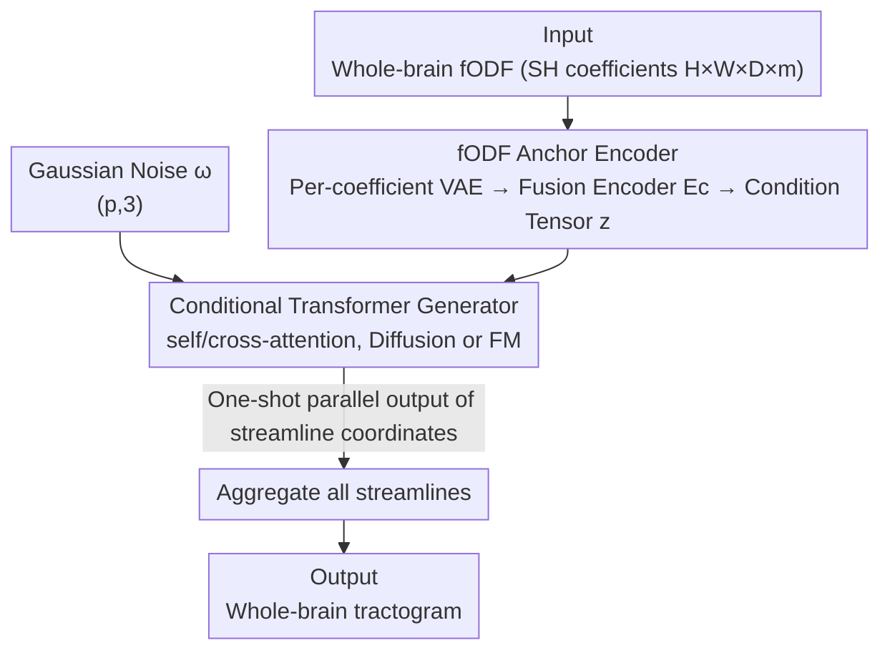

# GenTract: Generative Global Tractography

**Conference**: CVPR 2026  
**Paper**: [CVF Open Access](https://openaccess.thecvf.com/content/CVPR2026/html/Sargood_GenTract_Generative_Global_Tractography_CVPR_2026_paper.html)  
**Code**: https://github.com/alecsargood/GenTract  
**Area**: Medical Imaging / Diffusion Models  
**Keywords**: White matter tractography, global tractography, conditional generation, diffusion models, Flow Matching  

## TL;DR
GenTract reformulates brain white matter tractography from a local search of "step-by-step progression along local directions" into a global conditional generation task that "samples entire streamline coordinates in parallel, conditioned on whole-brain dMRI." By utilizing a VAE to encode fODF and a conditional Transformer (Diffusion / Flow Matching), it achieves SOTA precision on high-quality data and outperforms the second-best method by up to ~3.5x in low-resolution and noisy scenarios.

## Background & Motivation
**Background**: Tractography infers 3D trajectories (streamlines) of white matter pathways from diffusion Magnetic Resonance Imaging (dMRI). The mainstream approach is **local tracking**: starting from seed points and tracing streamlines step-by-step by reading local fiber orientation distributions (fODF). Recent Machine Learning variants treat this as reinforcement learning (TrackToLearn / TractOracle) or autoregressive diffusion for next-step prediction (DDTracking). Another approach is **global tractography**, which solves for all streamlines in the brain simultaneously as an optimization problem.

**Limitations of Prior Work**: Local tracking is essentially **stepwise extrapolation**, where errors accumulate along the streamline, leading to numerous false positive connections. This is particularly severe in complex fiber configurations (crossing/kissing) or clinical scans with low resolution and low signal-to-noise ratios. It also **depends on seeding masks** (defining starting points), where the mask generation process introduces operator-related subjectivity that undermines reproducibility. Although global methods are more robust to local noise and less dependent on seeding masks, traditional optimization is **computationally slow, prone to sub-optimal solutions, and often generates incomplete tractograms**, preventing them from becoming mainstream.

**Key Challenge**: Local methods are fast but lack precision (error accumulation + seed dependency), while global methods are stable but computationally prohibitive (optimization bottlenecks + failure modes). Neither route has successfully achieved both "global robustness" and "practical efficiency."

**Goal**: Ours aims to retain the advantages of global methods—considering whole-brain context and eliminating reliance on seeding masks—while replacing expensive iterative optimization with one-shot generative sampling to achieve both accuracy and efficiency.

**Key Insight**: The authors observe that modern generative models (Diffusion / Flow Matching) excel at "sampling complex structured objects directly from noise." If a streamline is treated as an object to be generated and the whole-brain fODF as the condition, tractography becomes "sampling streamlines from a learned conditional distribution." All coordinates are **produced in parallel**, naturally eliminating stepwise error propagation and the need for seeding masks.

**Core Idea**: Replace "stepwise local tracking / slow global optimization" with "generative sampling conditioned on global fODF," allowing the model to directly learn the mapping from dMRI to anatomically plausible streamlines.

## Method

### Overall Architecture
GenTract consists of two main components: a **global fODF encoder** that compresses whole-brain diffusion information into a condition tensor $z$, and a **conditional Transformer generator** that samples all coordinates of a streamline from Gaussian noise in one shot, guided by $z$. During training, a VAE first compresses each fODF coefficient volume into a latent representation. A weight-sharing class-conditional fusion encoder $E_c$ then refines and downsamples these into $z$. The generator learns the continuous-time process from "noise to clean streamline" using Diffusion or Flow Matching objectives. During inference, $z$ is computed for a new subject, and a tractogram is assembled through repeated batch sampling of streamlines.

The input is a 4D tensor of size $H \times W \times D \times m$ (a spherical harmonic coefficient vector of dimension $m$ per voxel; $m=28$ for $L_{max}=6$), and the output is a collection of streamlines with shape $(p, 3)$ (each having $p$ 3D sampling points).

### Key Designs

**1. Reformulating tractography as a global conditional generation task: parallel sampling of entire streamlines**

This step addresses two major pain points: stepwise error accumulation in local methods and the dependency on seeding masks. GenTract no longer "predicts the next step" but treats a streamline as a holistic object. Given the whole-brain fODF condition $z$, the model samples from a learned **conditional distribution** and **simultaneously** outputs all $p$ coordinates of the streamline. Since all coordinates are generated in parallel without an autoregressive chain, errors do not snowball along the streamline. Furthermore, as sampling begins from noise + global conditions, no starting points are required, **completely eliminating seeding masks**—a major hurdle for reproducibility. This is why it remains robust under noise/low-resolution where local methods fail: while local methods drift due to blurred local information, GenTract maintains judgment based on whole-brain context.

**2. fODF Anchor Encoder: Per-coefficient VAE + Class-conditional fusion to compress the global condition tensor $z$**

The generator requires a "whole-brain view," but raw fODF data is high-dimensional. To compress it into a compact and informative condition $z$, a two-stage encoder is used. The first stage is **per-coefficient representation learning**: the fODF at each voxel is projected onto spherical harmonic bases:
$$f(\theta,\phi)\approx\sum_{l=0}^{L_{max}}\sum_{k=-l}^{l}\vartheta_{lk}\,Y_l^k(\theta,\phi)$$
obtaining $m$ coefficient volumes (each $H \times W \times D$). The authors **train an independent VAE for each coefficient** (fine-tuned from MAISI VAE) using a composite loss (reconstruction + perceptual + adversarial + KL) to compress the $i$-th coefficient volume into latent space $z^{(i)}$. The second stage is **fusion and refinement**: a 3D ResNet-style **class-conditional encoder** $E_c$ encodes each $z^{(i)}$ into $\hat z^{(i)}=E_c(z^{(i)}, i)$. Weights are shared across all $m$ coefficients, but the coefficient index $i$ is fed as a condition to preserve specific information and further reduce spatial resolution. Crucially, $E_c$ is **trained jointly with the downstream generator** (while the VAE is frozen), allowing it to adaptively extract the most useful information for tracking. Finally, all $\hat z^{(i)}$ are concatenated along the channel dimension to form the global condition tensor $z$ (shape $(H_c W_c D_c,\ m C_c)$).

**3. Conditional Transformer Generator: self/cross-attention + Diffusion / Flow Matching paradigms**

This is the core "drawing" component. The generator takes three inputs: noisy streamline $x_t$ (shape $(p, 3)$), timestep $t$, and condition $z$. These are projected to a shared dimension $n$, supplemented with sinusoidal positional encodings and learnable time embeddings, and passed through $M$ Transformer layers. Two types of attention serve distinct roles: **self-attention** models geometric dependencies between points within a streamline to ensure continuity; **cross-attention** injects the global anatomical condition $z$, allowing the brain structure to guide streamline growth. The authors make the generation paradigm **plug-and-play** and, for the first time in global tractography, implement and compare Diffusion and Flow Matching. Diffusion learns the denoising process by predicting the added noise:
$$\mathcal{L}_D(\theta)=\mathbb{E}_{t,x_0,\epsilon}\big[\|\epsilon_\theta(x_t,t)-\epsilon\|^2\big]$$
Flow Matching directly regresses the vector field that transports noise to data ($v=x_1-x_0$ for linear interpolation):
$$\mathcal{L}_{FM}(\theta)=\mathbb{E}_{t,x_0,x_1}\big[\|v_\theta(x_t,t)-v\|^2\big]$$
Both losses backpropagate through the Transformer **and** the class-conditional encoder $E_c$. Inference starts from random noise and solves the reverse process conditioned on $z$.

### Loss & Training
The VAE stage is pre-trained with a composite loss (reconstruction + perceptual + adversarial + KL) and frozen. The generator stage is trained with $\mathcal{L}_D$ or $\mathcal{L}_{FM}$, updating both the Transformer and the fusion encoder $E_c$. Data: 1042 subjects from HCP Young Adult. Supervision targets come from the PyAFQ pipeline (fODF estimation via CSD + probabilistic tracking + atlas filtering for 24 bundles), split 75/10/15, with deterministic rotation augmentation (±15°/±30°/±45°). SH voxels are downsampled to 1.875 mm³, z-score normalized, and streamline coordinates are min-max scaled to $[-1, 1]$. Inference uses DDIM.

## Key Experimental Results

### Main Results
Evaluated against classic local (iFOD2, SD Stream), deep local (TractOracle, DDTracking), and classic global (tckglobal) methods on the HCP test set. Evaluation used two independent tools: BundleSeg (BS % P accuracy + Bundle count /51) and TractOracle-Net (TO-Net % P).

| Method | BS % P | BS Bundles (/51) | TO-Net % P |
|------|--------|------------------|------------|
| tckglobal | 0.19 | 42.91 | 17.83 |
| iFOD2 | 1.96 | 48.88 | 6.30 |
| SD Stream | 4.71 | 47.85 | 11.10 |
| DDTracking | 35.20 | 49.69 | 30.70 |
| TractOracle | 28.93 | 48.20 | 39.55 |
| **GenTract** | **61.95** | 36.62 | **56.35** |

GenTract leads significantly in precision: BS % P is **1.8× and 2.1×** higher than the second-best DDTracking (35.20) and TractOracle (28.93), respectively. The cost is a lower bundle count (36.62 vs. ~48-50 for baselines), representing higher false negatives. The authors attribute this to the training target being restricted to the 24-bundle PyAFQ distribution, leading to a narrower learned "valid streamline" space.

### Robustness Experiments (Noise / Low Resolution)
Under Rician noise and synthetic downsampling to 3 mm³, local and classic global methods nearly collapse, while GenTract maintains a significant lead.

| Setup | Metric | GenTract | Next Best | Notes |
|------|------|----------|----------|------|
| Rician Noise | BS % P | **60.32** | 22.06 (TractOracle) | GenTract BS % P dropped only 2.6% |
| Low Res + Noise (HCP) | BS % P | **15.73** | 4.44 (DDTracking) | Order of magnitude higher; local/tckglobal drop to 0% |
| Low Res + Noise (HCP) | TO-Net % P | **43.43** | 8.42 (DDTracking) | — |
| Ext. TractoInferno (LR+Noise) | BS % P | **24.94** | 9.74 (TractOracle) | Multi-dataset lead proves generalization |

### Ablation Study
All configurations found all 24 AFQ bundles; differences were primarily in AFQ % P precision.

| Config | AFQ % P | Notes |
|------|---------|------|
| Diffusion, M=4 | 81.8 | More layers are better |
| Diffusion, M=8 | **85.0** | Optimal depth |
| Flow Matching, M=8 | 82.45 | FM slightly underperforms Diffusion at same depth |
| Diffusion, M=8, n=128 | 80.6 | Underfitting due to small dimension |
| Diffusion, M=8, n=256 | **85.0** | Optimal embedding dimension |
| Diffusion, M=8, n=512 | 79.3 | Overfitting due to large dimension |

Final selection: Diffusion + $M=8$ + $n=256$. For inference: 5 steps achieved only 69.7%; 10 steps jumped to 82.9%. 25/50 steps yielded marginal gains (85%+) while increasing time from 391s to 1976s—thus, **10 DDIM steps** were used.

### Key Findings
- **Diffusion > Flow Matching**: At equal depth, Diffusion consistently achieves higher precision (85.0 vs 82.45). This is the first direct comparison of these paradigms in global tractography.
- **Accuracy-Recall Trade-off**: GenTract pushes precision to SOTA but at the expense of lower bundle recall; the cause is likely the 24-bundle training distribution. ⚠️ Care must be taken when comparing bundle counts as supervision varies across methods.
- **Robustness is the Key Selling Point**: The worse the data, the greater GenTract's relative advantage (an order of magnitude higher in low-res), validating the design of "global parallel sampling + whole-brain conditioning" against local drift.

## Highlights & Insights
- **Switching from "Stepwise Tracking" to "Holistic Sampling" is a clean paradigm shift**: By avoiding autoregression, error accumulation and seeding mask issues vanish simultaneously. This "reframing of the problem" is a valuable strategy for other stepwise extrapolation tasks.
- **Per-coefficient VAE + Shared Weight Encoder**: Handling $m$ SH coefficient volumes with shared weights and differentiating them via $i$-conditioning is a practical template for processing "multi-channel isomorphic volumes" while saving parameters.
- **Making the generation paradigm plug-and-play** and comparing Diffusion vs. FM provides a solid empirical reference for future generative tasks in medical structures.

## Limitations & Future Work
- **Lower Recall**: Effectively identifying fewer bundles than baselines, limited by the 24-bundle PyAFQ training distribution. Expanding to more comprehensive bundle atlases or diverse supervision might mitigate this.
- **Heavily dependent on proxy "Ground Truth"**: Tractography lacks an absolute biological ground truth. Precision relies entirely on proxy filters like BundleSeg/TO-Net, which inherit their own biases and performance ceilings. ⚠️ Metrics aren't directly comparable across different filtering tools.
- **Computational Barrier**: Requires one VAE per SH coefficient and training on H100s; replication costs are high. 10-step inference for a whole-brain tractogram still takes hundreds of seconds.
- **Observation**: "Low-res/Noise" evaluations use **synthetic degradation** (downsampling + Rician noise). Real clinical low-field scans have more complex degradation patterns; generalization to real clinical data requires further validation.

## Related Work & Insights
- **vs DDTracking**: Both use diffusion, but DDTracking is an autoregressive local method "predicting the next step," remaining sensitive to noise. GenTract is a global method "generating the whole streamline," eliminating error accumulation and achieving 1.8× higher precision.
- **vs TractOracle / TrackToLearn**: These utilize RL + anatomical rewards to reduce false positives, but they are still stepwise agents. GenTract uses global conditional sampling and remains more stable under noise (2.6% drop in BS % P vs 23.8% for TractOracle).
- **vs tckglobal (Classic Global)**: Both seek global optimality, but tckglobal relies on traditional energy optimization—slow, prone to local optima, and precision drops to 0% at low resolutions. GenTract replaces optimization with generative sampling, maintaining global vision while being faster and more stable.

## Rating
- Novelty: ⭐⭐⭐⭐⭐ First to formalize global tractography as a conditional generation task; paradigm shift is clean and powerful.
- Experimental Thoroughness: ⭐⭐⭐⭐ Main comparisons + 3 sets of degradation/external robustness + architecture/step ablations are well-executed, though the recall deficit could be deeper.
- Writing Quality: ⭐⭐⭐⭐⭐ Clearly derived motivation; honest acknowledgment of lower recall and ground-truth proxy limitations.
- Value: ⭐⭐⭐⭐ Robustness in low-res/noisy scenarios has significant clinical potential, though compute barriers and recall issues limit immediate deployment.

<!-- RELATED:START -->

## Related Papers

- [\[CVPR 2026\] SemiGDA: Generative Dual-distribution Alignment for Semi-Supervised Medical Image Segmentation](semigda_generative_dual-distribution_alignment_for_semi-supervised_medical_image.md)
- [\[CVPR 2026\] Solving a Nonlinear Blind Inverse Problem for Tagged MRI with Physics and Deep Generative Priors](solving_a_nonlinear_blind_inverse_problem_for_tagged_mri_with_physics_and_deep_g.md)
- [\[CVPR 2026\] Continual Learning for fMRI-Based Brain Disorder Diagnosis via Functional Connectivity Matrices Generative Replay](forge_continual_learning_for_fmri_based_brain_disorder_diagnosis.md)
- [\[CVPR 2026\] A Supervised Multi-task Framework for Joint cryo-ET Restoration Enabled by Generative Physical Simulation](a_supervised_multi-task_framework_for_joint_cryo-et_restoration_enabled_by_gener.md)
- [\[AAAI 2026\] Rethinking Bias in Generative Data Augmentation for Medical AI: a Frequency Recalibration Approach](../../AAAI2026/medical_imaging/rethinking_bias_in_generative_data_augmentation_for_medical_ai_a_frequency_recal.md)

<!-- RELATED:END -->
