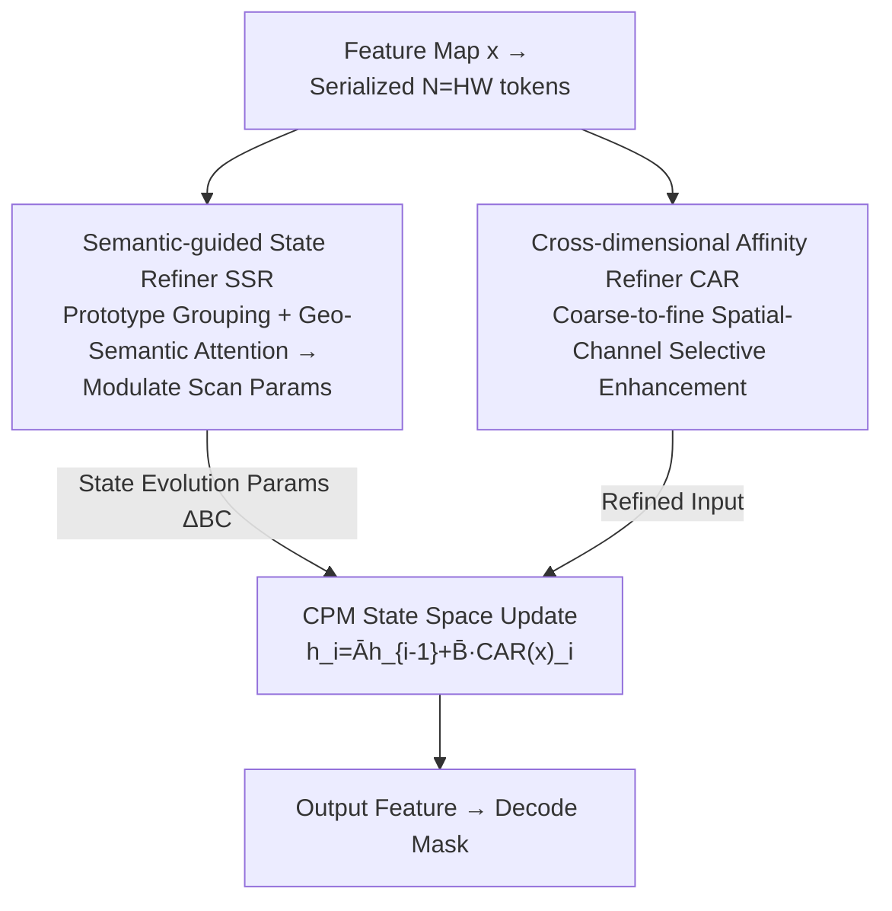

# GeoSemba: Reconstructing State Space Model for Cross Paradigm Representation in Medical Image Segmentation

**Conference**: CVPR 2026  
**Paper**: [CVF Open Access](https://openaccess.thecvf.com/content/CVPR2026/html/Sun_GeoSemba_Reconstructing_State_Space_Model_for_Cross_Paradigm_Representation_in_CVPR_2026_paper.html)  
**Code**: https://github.com/Mrliujunwen/GeoSemba  
**Area**: Medical Image / Semantic Segmentation / State Space Models (Mamba)  
**Keywords**: Mamba, Medical Image Segmentation, State Space Models, Geometric Semantic Propagation, Spatial-Channel Interaction

## TL;DR
Addressing Mamba's issues where 2D images are flattened into 1D sequences—causing information to "propagate by scanning order rather than semantic relevance" and "spatial-channel decoupling"—GeoSemba introduces the Semantic-guided State Refiner (SSR) for geometrically conditioned cross-region semantic propagation and the Cross-dimensional Affinity Refiner (CAR) for coarse-to-fine spatial-channel selective enhancement. It refreshes segmentation accuracy across six medical modalities with lower computational overhead.

## Background & Motivation

**Background**: In medical image segmentation, while ViTs can establish long-range dependencies, their quadratic complexity hampers practical deployment. Mamba has become a new favorite due to its linear complexity state-space modeling and parallelizability, leading to numerous variants such as Mamba-UNet, SegMamba, and Spatial-Mamba.

**Limitations of Prior Work**: Mamba's scanning mechanism **serializes 2D images into 1D token streams**, which can disrupt the continuity of clinically meaningful structures. Existing improvements (enhancing structural guidance, adaptive scanning paths) still primarily organize information flow **based on spatial proximity** rather than cross-region semantic affinity. Consequently, semantically distinct but spatially close responses are propagated together after serialization (Fig. 1a), blurring discriminative evidence. Furthermore, the path dependency of sequence propagation biases models toward dependencies based on "scanning order." Some works use attention-style enhancement for spatial awareness but treat **spatial interaction and channel discrimination separately**. However, medical diagnostic cues often emerge from the **joint effect** of space and channels. Lacking explicit spatial-channel coupling, low-magnitude yet discriminative responses are suppressed during aggregation, leading to overly homogenized representations. Other works rely on multi-directional scanning to expand context at the cost of extra computation, while spatial-channel coupling remains under-modeled.

**Key Challenge**: The real problem after serialization is not "maintaining adjacency" but rather "**deciding which responses should interact after serialization**." Information should propagate according to semantic relevance (not just scanning order), and channel responses should be established under spatial contextual conditions, all while maintaining Mamba's linear complexity.

**Goal**: To enable Mamba to simultaneously achieve (1) cross-level geometrically-aware semantic interaction and (2) coordinated spatial-channel modeling within a single scan.

**Key Insight**: **Reconstruct these two properties directly into the state-space update itself**. State transition parameters are modulated by semantic-geometric context (solving *who to interact with*), and inputs are pre-processed through spatial-channel refinement (solving *spatial-channel joint modeling*).

**Core Idea**: Use SSR to rewrite "how states evolve" and CAR to rewrite "inputs fed into the state." Both are integrated into a MetaFormer-style Cross-Paradigm Module (CPM) to complete geometric-semantic propagation and spatial-channel selective interaction in a single scan.

## Method

### Overall Architecture
GeoSemba uses an encoder-decoder structure where the core consists of stacked **Cross-Paradigm Modules (CPM)**. Each CPM follows the MetaFormer paradigm, instantiating the token mixer as a selective state-space update: **SSR handles parameterized state evolution, while CAR provides refined inputs**. Given a feature map $x\in\mathbb{R}^{H\times W\times C}$, it is first serialized into $N=HW$ tokens. SSR extracts prototype conditional context and predicts per-token scanning parameters $\{\Delta^{\text{SSR}}_i, B^{\text{SSR}}_i, C^{\text{SSR}}_i\}$, which are discretized as $\bar A^{\text{SSR}}_i=\exp(\Delta^{\text{SSR}}_i A)$ and $\bar B^{\text{SSR}}_i=\Delta^{\text{SSR}}_i B^{\text{SSR}}_i$. Simultaneously, CAR performs spatial-channel refinement on $x$ to obtain $\mathrm{CAR}(x)_i$. The CPM update is:
$$h^{\text{CPM}}_i=\bar A^{\text{SSR}}_i h^{\text{CPM}}_{i-1}+\bar B^{\text{SSR}}_i\,\mathrm{CAR}(x)_i,\qquad y^{\text{CPM}}_i=C^{\text{SSR}}_i h^{\text{CPM}}_i+Dx_i.$$
Intuitively, SSR determines "how the state propagates based on geometric-semantic relationships," while CAR ensures the input at each step is "purified across space and channels," with both paths coupled in a single scan.

### Key Designs

**1. Semantic-guided State Refiner (SSR): Propagating states by "geometrically conditioned semantic relevance" rather than scan order**

SSR addresses "who to interact with" in three steps. **Semantic Prototype Grouping (SPG)**: Introduces $M\ll N$ prototype anchors, assigning each token to the nearest prototype using cosine similarity $c_i=\arg\max_k \frac{x_i^\top p_k}{\lVert x_i\rVert\lVert p_k\rVert}$. Each prototype has a learnable embedding $e_k$ added back to its tokens. Anchors are updated via EMA during training to prevent drift. Mean features $a_k$ and spatial centroids $g_k$ are calculated for each group, concatenated, and passed through a $1\times1$ convolution to form prototype nodes $n_k=\phi_{1\times1}(\mathrm{Concat}(a_k,g_k))$—a compact descriptor preserving semantic consistency and coarse geometric layout. **Geometric-Semantic Nexus Attention (GSNA)**: Establishes dependencies on the prototype set via two paths: a global context path that pools prototypes and uses $1\times1$ convolutions for a modulation vector $\tilde F_g$, and a spatial relationship path using a 2D Manhattan distance prior $M^{\text{dist}}_{k,q}=\gamma^{|x_k-x_q|+|y_k-y_q|}$ ($0<\gamma<1$) for aggregation. This prior preserves **overall 2D spatial relationships**, avoiding directional bias found in axial decomposition, with minimal cost because it operates on $M\ll N$ prototypes. The paths are fused into $F^{\text{GSNA}}_k$. **Context-Modulated Scanning (CMS)**: For each token $x_i$, it is concatenated with its corresponding $F^{\text{GSNA}}_{c_i}$ and passed through an MLP+softmax to generate modulation signal $s_i$, which scales the base scanning parameters to produce final $\Delta^{\text{SSR}}_i, B^{\text{SSR}}_i, C^{\text{SSR}}_i$. Thus, state evolution remains locally adaptive but is guided by prototype-level geometric-semantic context.

**2. Cross-dimensional Affinity Refiner (CAR): Modeling space and channels coarse-to-fine to preserve low-magnitude discriminative responses**

CAR follows a "Macro-perception → Micro-focus" design. **Macro-perception**: Input $x$ passes through a $3\times3$ depthwise convolution + BN + LeakyReLU to obtain a full-field coarse context prior $x_{\text{global}}$, then another $3\times3$ depthwise convolution yields $x_{\text{local}}$ (preserving local discriminative responses under global context). **Micro-focus**: Channel attention is applied to $x_{\text{local}}$ to get $a_c=\mathrm{CA}(x_{\text{local}})$, recalibrating it as $G_{\text{reg}}=a_c\odot x_{\text{local}}$ to suppress pseudo-channel responses. Then, **Token Aggregation (TA)** builds position-dependent interactions: location-sensitive queries $Q$ and pooled keys $K$ are split into $G$ channel groups. An affinity matrix $\Phi_g=Q_g K_g^\top$ is computed. Crucially, **Top-K Gating** is applied to keep only the strongest correlations, inducing structural sparsity and filtering noise. Finally, $G_{\text{reg}}$ is projected onto a $R\times R$ grid, selectively aggregated using the gated operators, and fused with the global prior $x_{\text{CAR}}=x_{\text{global}}\odot x_{TA}$. This ensures the "spatial position × channel selection" jointly determines which responses are enhanced.

### Loss & Training
PyTorch 2.1.1, single RTX 4090, 120 epochs, Adam optimizer, initial LR $10^{-4}$, batch size 8. Inputs resized to $512\times512$. Hyperparameters: $M=7$ prototypes, $G=12$ channel groups, $S=7$ context aggregation size, $R=32$ spatial reduction.

## Key Experimental Results

Experiments used six public datasets spanning dermoscopy (ISIC2018), radiology (COVID19-1), ultrasound (BUSI), microscopy (DSB2018), colonoscopy (ClinicDB), and fundus (DRIVE) modalities. Metrics: DSC / IoU.

### Main Results (DSC %, selected modalities)

| Method | ISIC2018 | COVID19-1 | BUSI | DSB2018 | ClinicDB | DRIVE |
|------|----------|-----------|------|---------|----------|-------|
| TransUNet | 87.3 | 75.6 | 75.5 | 91.8 | 87.4 | 81.5 |
| VM-UNet | 89.7 | 80.0 | 79.2 | 91.5 | 91.9 | 84.0 |
| Spatial-Mamba | 90.1 | 83.3 | 81.2 | 91.9 | 91.8 | 85.8 |
| SCSegamba | 90.7 | 83.3 | 81.5 | 92.5 | 92.3 | 86.6 |
| DefMamba | 90.4 | 82.8 | 81.1 | 91.6 | 91.7 | 85.8 |
| **GeoSemba** | **91.1** | **83.8** | **82.1** | **93.2** | **94.8** | **86.6** |

Ours achieves a **Gain** of +1.25% DSC and +1.75% IoU on average compared to Spatial-Mamba. Compared to the multi-scan SCSegamba, Ours yields a **Gain** of +0.78% / +1.13% while maintaining higher efficiency (0.018s vs 0.023s per image).

### Ablation Study (ISIC2018 DSC %)

| Configuration | DSC | Description |
|------|-----|------|
| GeoSemba(Full) | 91.1 | Complete model |
| w/o CAR | 90.5 | Remove Cross-dimensional Affinity Refiner |
| w/o SSR | 90.7 | Remove Semantic-guided State Refiner |
| SSR: w/o SPG | 88.6 | Remove Prototype Grouping |
| SSR: w/o GSNA | 88.3 | Remove Geo-Semantic Attention (largest drop) |
| CAR: w/o MP | 88.4 | Remove Macro-perception |
| CAR: w/o CA | 88.6 | Remove Channel Attention |
| CAR: w/o Top-K | 89.8 | Remove Top-K Sparse Gating |

### Key Findings
- **GSNA is the most critical part of SSR**: Removing it causes a drop from 91.1 to 88.3, more than removing SPG (to 88.6), showing prototype-level geo-semantic modeling is vital.
- **Macro-perception/Channel Attention are more critical in CAR than Top-K**: Dropping MP/CA lowers the score to 88.4/88.6, while dropping Top-K only lowers it to 89.8.
- **Prototype number $M=7$ is the sweet spot**: $M=3$ lacks expression (89.2) and $M=12$ degrades/slows down (90.1), while $M=7$ is optimal (91.1).
- **Narrower advantage on regular shapes**: On ClinicDB, where polyps have clear boundaries, the need for region-conditioned refinement is lower, resulting in smaller gains.

## Highlights & Insights
- **Reconstructing "who to interact with" into SSM parameters**: Instead of post-processing with attention, SSR directly modulates scanning parameters $\Delta/B/C$ to propagate information by semantic relevance.
- **Manhattan distance prior replaces axial decomposition**: Preserves 2D spatial context without directional bias and maintains linear efficiency by operating on the small prototype set.
- **Top-K structured sparse affinity**: Row-level denoising in the affinity matrix is a transferable idea for any aggregation scenario with noisy affinities.
- **Accuracy and efficiency via single scan**: Surpassing multi-scan models like VM-UNet with lower latency proves that reconstructing a single scan is more effective than stacking scan directions.

## Limitations & Future Work
- Limited gain on datasets with very regular shapes and clear boundaries (e.g., ClinicDB).
- Introduction of multiple sub-modules (SPG, GSNA, TA, etc.) involves several hyperparameters; their robustness across more datasets needs further exploration.
- Only validated on 2D slices; performance on 3D volumes or large-scale/weakly-labeled scenarios is unknown.
- Manhattan prior depends on prototype centroid coordinates; poor grouping quality might lead to geometric distortion.

## Related Work & Insights
- **vs. Structure-preserving (LocalMamba / Spatial-Mamba / DefMamba)**: These use structural cues for spatial continuity but still propagate by proximity. Ours uses SSR for explicit geo-semantic propagation.
- **vs. Spatial-enhancement (MambaIRv2 / VSSD / FSE-Mamba)**: These strengthen spatial context but fail to coordinate with channel selection; CAR's coarse-to-fine joint modeling addresses this.
- **vs. Multi-scan (VM-UNet / SCSegamba)**: These expand context via multiple scans at higher costs; GeoSemba surpasses them in a single scan with fewer parameters and lower latency.

## Rating
- Novelty: ⭐⭐⭐⭐ Reconstructing geo-semantic propagation and spatial-channel interaction into a single SSM update is a novel approach.
- Experimental Thoroughness: ⭐⭐⭐⭐⭐ 6 modalities, 13 SOTAs, comprehensive ablations, and efficiency analysis.
- Writing Quality: ⭐⭐⭐⭐ Problem characterization is clear, though sub-module terminology is dense.
- Value: ⭐⭐⭐⭐ Significant gains while maintaining Mamba's efficiency; open-source and ready for medical segmentation tasks.

<!-- RELATED:START -->

## Related Papers

- [\[CVPR 2026\] Multimodal Causality-Driven Representation Learning for Generalizable Medical Image Segmentation](multimodal_causal-driven_representation_learning_for_generalizable_medical_image.md)
- [\[NeurIPS 2025\] DyG-Mamba: Continuous State Space Modeling on Dynamic Graphs](../../NeurIPS2025/medical_imaging/dyg-mamba_continuous_state_space_modeling_on_dynamic_graphs.md)
- [\[CVPR 2026\] From Infusion to Assimilation Distillation for Medical Image Segmentation](from_infusion_to_assimilation_distillation_for_medical_image_segmentation.md)
- [\[CVPR 2026\] SegMoTE: Token-Level Mixture of Experts for Medical Image Segmentation](segmote_token-level_mixture_of_experts_for_medical_image_segmentation.md)
- [\[CVPR 2026\] KAMP: Knowledge-Anchored Multimodal Pretraining Framework for Medical Image Representation](kamp_knowledge-anchored_multimodal_pretraining_framework_for_medical_image_repre.md)

<!-- RELATED:END -->
