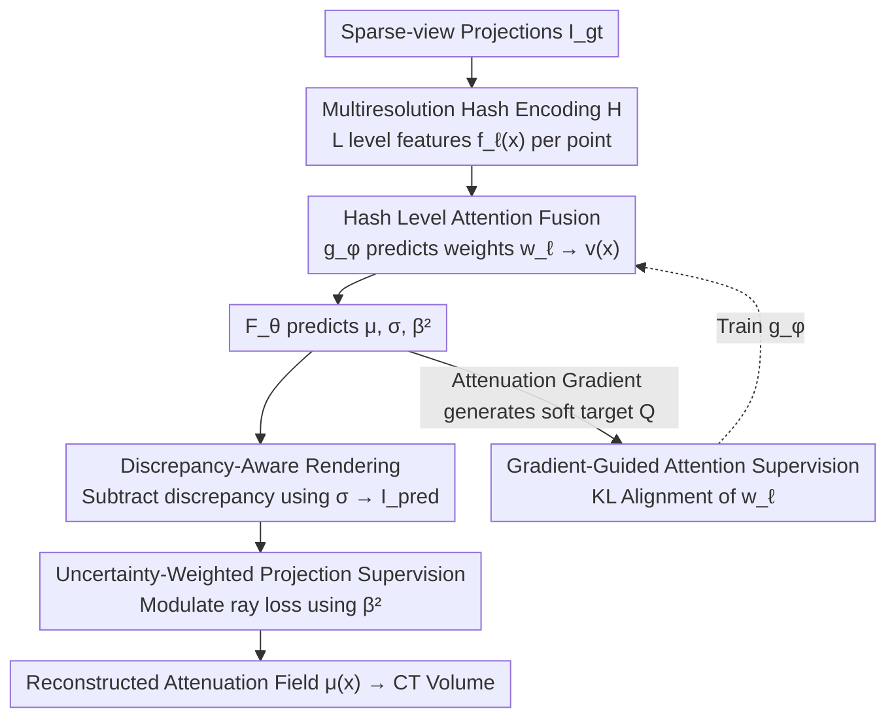

# GH-NAF: Grid-Adaptive Hash-Level-Attended Neural Attenuation Fields for Discrepancy-Aware CBCT

**Conference**: CVPR 2026  
**Paper**: [CVF Open Access](https://openaccess.thecvf.com/content/CVPR2026/html/Oh_GH-NAF_Grid-Adaptive_Hash-Level-Attended_Neural_Attenuation_Fields_for_Discrepancy-Aware_CBCT_CVPR_2026_paper.html)  
**Code**: https://github.com/seongje-oh/GH-NAF  
**Area**: Medical Imaging  
**Keywords**: Sparse-view CBCT Reconstruction, Neural Attenuation Fields, Multiresolution Hash Encoding, Hash-Level Attention, Projection Discrepancy Modeling  

## TL;DR
GH-NAF introduces a "spatial-position adaptive hash resolution level selection" attention mechanism to NeRF-style CBCT reconstruction. Combined with differentiable discrepancy-aware rendering and uncertainty-weighted supervision, the model suppresses high-frequency noise in homogeneous tissues while preserving details at structural boundaries, improving both intra-material contrast and edge sharpness in real CBCT.

## Background & Motivation

**Background**: Sparse-view CT reconstruction aims to restore high-quality CT volumes from minimal X-ray projections (dozens instead of hundreds) to reduce patient radiation dose. NeRF-based approaches formulate CT reconstruction as "learning a continuous attenuation field $F_\theta:(x,y,z)\mapsto\mu(x)$," using a differentiable X-ray forward model to integrate predicted attenuation into projections and aligning them with measured projections for self-supervised training (NAF pioneered this direction). Currently, **multiresolution hash encoding** (as seen in Instant-NGP) serves as the primary representation, using voxel grids of multiple resolutions to store learnable features that are then trilinearly interpolated to capture both low-frequency global structures and high-frequency local details.

**Limitations of Prior Work**: Real CBCT projections do not satisfy the ideal monochromatic assumption due to "projection discrepancies" such as scatter, detector glare, beam hardening, and noise. Existing NeRF/NAF methods treat these discrepancies as "averageable noise" and **uniformly fuse features from all hash levels without distinction**. This uniform fusion entangles heterogeneous frequency components, leading to false high-frequency textures in smooth tissues, blurred structural boundaries, and the propagation of projection-induced biases through the representation.

**Key Challenge**: Requirements for low-frequency and high-frequency modeling are **spatially heterogeneous**. Homogeneous tissues favor low frequencies (coarse levels), while structural boundaries require high frequencies (fine levels). Uniform fusion uses the same weights across space, failing to adapt locally, resulting in a lose-lose situation where smooth areas exhibit noisy textures and sharp areas are blurred. Furthermore, low-frequency noise in real projections arises from stochastic scattering processes that are inherently difficult to isolate or remove.

**Goal**: To stabilize low frequencies in homogeneous regions and preserve high frequencies at boundaries without relying on discrepancy supervision labels, while implicitly subtracting projection discrepancies from the primary attenuation.

**Key Insight**: Since different hash levels encode different frequencies, **uniform fusion should be avoided**. Weights for each level should be dynamically determined based on local attenuation variations at each spatial point and the model's estimated uncertainty.

**Core Idea**: Replace "uniform level fusion" with "grid-adaptive hash-level attention," using attenuation gradients to generate soft targets and uncertainty to modulate supervision intensity, achieving frequency-aware representation decoupling.

## Method

### Overall Architecture
The input to GH-NAF is sparse-view X-ray projections $I_{gt}$, and the output is a continuous attenuation field $\mu(x)$ (reconstructed CT volume). The pipeline integrates "multi-scale hash features → position-adaptive fusion → prediction of attenuation, discrepancy, and uncertainty → discrepancy-corrected rendering → alignment with measured projections." An additional "gradient-guided level attention supervision" branch trains the attention module on how to select levels.

The key to the process: the hash encoder $H$ provides $L$ level features $f_\ell(x)$ at each point $x$; a lightweight MLP $g_\phi$ assigns attention weights $w_\ell(x)$ for weighted fusion into $v(x)$; fused features are fed into $F_\theta$ to output attenuation $\mu$, discrepancy density $\sigma$, and heteroscedastic variance $\beta^2$ (uncertainty). The renderer uses $\sigma$ to subtract projection discrepancy from the primary attenuation to get $I_{pred}$. The supervision uses $\beta^2$ to weigh the loss for each ray, while the attention $w_\ell$ is trained via KL-alignment with a soft label $Q$ generated from attenuation gradients.

### Key Designs

**1. Hash-Level Attention Fusion: Replacing Uniform Fusion with Position-Based Attention**

This design directly addresses the "entangled frequency components" issue of uniform fusion. The multiresolution hash encoder $H$ yields $L$ levels of features $f_\ell(x)$ ($\ell=1,\dots,L$) at each point $x$, where coarse levels encode low-frequency global information and fine levels encode high-frequency details. GH-NAF introduces a lightweight MLP $g_\phi$ to predict an $L$-dimensional attention vector for each point, normalized via softmax to obtain weights $w_\ell(x)$, followed by a weighted sum:

$$v(x)=\sum_{\ell=1}^{L} w_\ell(x)\, f_\ell(x).$$

The fused $v(x)$ is then fed into a separate MLP $F_\theta$ that outputs three quantities: $\mu(x),\beta^2(x),\sigma(x)=F_\theta(v(x))$, where $\mu$ is the linear attenuation coefficient, $\sigma$ is the local discrepancy density, and $\beta^2>0$ is the heteroscedastic variance (uncertainty estimation for loss weighting). In smooth homogeneous regions, $g_\phi$ suppresses high-frequency levels in favor of coarse information; near boundaries or fine structures, it assigns higher weights to fine levels. This transforms the "frequency selection" into a **point-wise learnable local decision** rather than a global fixed rule.

**2. Discrepancy-Aware Rendering: Explicitly Subtracting Projection Discrepancy**

To address the deviation of real CBCT projections from ideal monochromatic assumptions (where scatter and other discrepancies cannot be directly removed), GH-NAF explicitly models discrepancy within the differentiable volume rendering. After sampling along ray $r$, the primary attenuation is the line integral of Beer’s Law $I_\mu(r)=\sum_i \mu(x_i^{(r)})\delta_i^{(r)}$ ($\delta_i$ is the path length). The discrepancy contribution is estimated using the integral of discrepancy density $S(r)=\sum_i \sigma(x_i^{(r)})\delta_i^{(r)}$. Following the formulation by Park et al., these are combined into a discrepancy-corrected log-projection:

$$I_{pred}(r)=I_\mu(r)-\ln\!\Big(\frac{\sinh(\lambda_\sigma S(r))}{\lambda_\sigma S(r)}\Big),$$

where $\lambda_\sigma>0$ controls discrepancy intensity. The correction term $\ln(\sinh x/x)$ is a smooth, physically-grounded function: as $S(r)\to 0$, it approaches 0, ensuring $I_{pred}(r)\approx I_\mu(r)$ in regions without discrepancy. When discrepancies exist, it subtracts an approximate discrepancy contribution from the primary attenuation. This allows the model to "implicitly absorb" discrepancies into $\sigma$ during alignment with real (corrupted) projections, preventing contamination of $\mu$.

**3. Uncertainty-Weighted Projection Supervision: Curriculum Weighting via Self-Estimated Variance**

Standard MSE treats all rays equally, risking bias from high-discrepancy or noisy regions. GH-NAF adopts uncertainty learning: it first calculates the absorption $\alpha_i^{(r)}=1-\exp(-\mu(x_i)\delta_i)$ and transmittance $T_i^{(r)}=\prod_{j<i}(1-\alpha_j)$ for each sample, yielding volume rendering weights $w_i^{(r)}=\alpha_i^{(r)}T_i^{(r)}$. Local variances along the ray are aggregated using the squared weights: $\hat\beta^{2,(r)}=\sum_i (w_i^{(r)})^2\beta^2(x_i^{(r)})$. The final projection loss is the negative log-likelihood of a Gaussian observation model:

$$\mathcal{L}_{proj}=\mathbb{E}_r\Big[\frac{\lVert I_{pred}(r)-I_{gt}(r)\rVert^2}{2\hat\beta^{2,(r)}}+\frac{1}{2}\ln\hat\beta^{2,(r)}\Big].$$

The inverse variance $1/\hat\beta^{2,(r)}$ acts as an adaptive confidence weight: it amplifies supervision for low-uncertainty rays and suppresses high-uncertainty ones. This creates a "curriculum" where the model first masters reliable low-uncertainty regions, then shifts focus to previously blurred areas as uncertainty decreases. The term $\frac{1}{2}\ln\hat\beta^{2,(r)}$ serves as a normalization penalty to prevent the model from trivializing the loss by inflating all variances.

**4. Gradient-Guided Level Attention Supervision: Teaching Attention with Attenuation Gradients**

The attention module $g_\phi$ lacks labels for "where to use high frequency." This design generates self-supervised signals using local attenuation gradients. The intuition is that regions with significant attenuation change (edges, fine structures) should use higher frequencies, while homogeneous regions should rely on coarse features. For each internal sample point, the attenuation change along the ray is estimated using central differences $\Delta\mu_i^{(r)}=\mu(x_{i+1}^{(r)})-\mu(x_{i-1}^{(r)})$, normalized across the batch to $[0,1]$ as $\widetilde{\Delta\mu}_i^{(r)}$, and linearly mapped to a target level $\bar\ell_i^{(r)}=(L-1)\,\widetilde{\Delta\mu}_i^{(r)}$. This target is converted into a Gaussian soft distribution $Q_i^{(r)}(\ell)\propto\exp(-(\ell-\bar\ell_i^{(r)})^2/2\sigma^2)$. The predicted attention distribution $W_i^{(r)}(\ell)=w_\ell(x_i^{(r)})$ is aligned with $Q$ via KL divergence, modulated by inverse variance:

$$\mathcal{L}_{attn}=\mathbb{E}_r\,\mathbb{E}_i\Big[\frac{\mathrm{KL}(Q_i^{(r)}\Vert W_i^{(r)})}{2\beta^2(x_i^{(r)})}\Big].$$

The $1/(2\beta^2)$ factor relaxes alignment penalties at high-uncertainty points where gradient cues may be unreliable. This heuristically drives attention allocation based on attenuation gradients without any manual annotations.

### Loss & Training
In addition to the three losses mentioned, two regularizations are added due to the ill-posed nature of sparse-view reconstruction: **Attenuation Sparsity Regularization** $\mathcal{L}_{dens}=\mathbb{E}_r\mathbb{E}_i[\log(1+s\,\mu(x_i^{(r)}))]$ (a concave log-sum penalty where $s>0$ controls intensity to suppress diffuse residuals and preserve sharp edges); and **Occlusion Regularization** $\mathcal{L}_{occ}=\mathbb{E}_r\mathbb{E}_i[\alpha_i^{(r)}\exp(-z_i^{(r)}/\tau)]$ ($z_i$ is depth, $\tau$ is decay length) to prevent opacity accumulation at ray starts. The total objective is:

$$\mathcal{L}_{total}=\mathcal{L}_{proj}+\lambda_{attn}\mathcal{L}_{attn}+\lambda_r\mathcal{L}_{dens}+\lambda_o\mathcal{L}_{occ}.$$

## Key Experimental Results

### Main Results

Real Datasets: FIPS (3 cases, low discrepancy reference) and a chest phantom captured by a mobile CBCT (720 projections, significant discrepancy). Due to the lack of ground truth (GT), FDK reconstructions from 720 views serve as pseudo-GT for evaluation on uniformly sampled subsets (FIPS: 25/50 views; chest phantom: 100/125/150/200 views). No-reference MANIQA is used for the high-discrepancy phantom, while PSNR/SSIM are used for low-discrepancy scenes.

Chest Phantom (MANIQA, higher is better):

| Views | NAF | SAX | GH-NAF (Ours) |
|-------|-----|-----|---------------|
| 100 | 0.252 | 0.268 | **0.338** |
| 125 | 0.296 | 0.268 | **0.414** |
| 150 | 0.292 | 0.353 | **0.392** |
| 200 | 0.260 | 0.322 | **0.393** |

FIPS (PSNR/SSIM, consistently superior to NeRF-style baselines):

| Model | Views | Seashell PSNR/SSIM | Walnut PSNR/SSIM | Pine PSNR/SSIM |
|-------|-------|--------------------|--------------------|----------------|
| NAF | 25 | 36.29 / 0.950 | 40.34 / 0.960 | 38.93 / 0.963 |
| SAX | 25 | 39.50 / 0.982 | 43.68 / 0.983 | 42.13 / 0.984 |
| GH-NAF | 25 | 39.91 / **0.972** | **46.54 / 0.991** | 43.84 / **0.989** |
| GH-NAF | 50 | 42.66 / 0.988 | 48.95 / **0.994** | 46.30 / **0.991** |

Synthetic Datasets (13 CT volumes, 15/30/50 views): GH-NAF outperforms most methods in PSNR/SSIM, with SSIM being notably higher (e.g., 0.934 at 15 views, 0.982 at 50 views). Gaussian baselines (R2-Gaussian/Vol3DGS) occasionally achieve higher PSNR but consistently lower SSIM, indicating weaker structural consistency.

### Ablation Study
Ablations on loss terms (synthetic dataset):

| Configuration | PSNR | SSIM | Description |
|---------------|------|------|-------------|
| $\mathcal{L}_{mse}$ instead of $\mathcal{L}_{proj}$ | 34.06 | 0.9470 | Removing discrepancy-aware supervision leads to significant drop |
| w/o $\mathcal{L}_{attn}$ | 39.59 | 0.9808 | Removing level attention supervision |
| w/o $\mathcal{L}_{den}$ & $\mathcal{L}_{occ}$ | 39.28 | 0.9771 | Removing regularizations |
| Full | **39.82** | **0.9815** | Complete objective performs best |

### Key Findings
- Replacing $\mathcal{L}_{proj}$ with standard MSE causes the largest performance drop (PSNR 39.82→34.06), proving discrepancy-aware supervision is the performance cornerstone.
- Removing $\mathcal{L}_{attn}$ consistently degrades results, underscoring its role in suppressing low-frequency bias and preserving sharp boundaries.
- The advantage of GH-NAF is concentrated in **SSIM/structural consistency and intra-material contrast**. While Gaussian-based methods may achieve higher PSNR, their lower SSIM indicates less structural fidelity; GH-NAF provides a better balance between intensity and structural accuracy.
- The more significant the discrepancy (chest phantom), the larger the lead GH-NAF holds over NAF/SAX.

## Highlights & Insights
- **Point-wise frequency attention**: By mapping multiresolution hash levels to specific frequencies, selecting levels per point decouples frequency representation, fitting the spatial heterogeneity of CT (homogeneous tissue vs. boundaries) better than uniform fusion.
- **Gradient-guided self-supervision**: The use of attenuation gradients to generate soft Gaussian targets for attention alignment is a lightweight self-supervised paradigm for frequency allocation without manual labels.
- **Multi-purpose uncertainty**: $\beta^2$ simultaneously weights projection loss, modulates attention alignment intensity, and prevents variance collapse via the $\ln\hat\beta^2$ term.
- **Discrepancy as a learnable field**: Using the $\ln(\sinh x/x)$ physical form to implicitly isolate scatter and other discrepancies into $\sigma$ prevents them from contaminating the main attenuation $\mu$.

## Limitations & Future Work
- **Reliability of pseudo-GT**: Real data evaluation relies on FDK pseudo-GT or no-reference metrics (MANIQA) due to strong discrepancies, making absolute accuracy difficult to verify.
- **PSNR disadvantage vs. Gaussians**: In synthetic scenarios, R2-Gaussian and Vol3DGS occasionally achieve higher PSNR, whereas GH-NAF excels in SSIM. If absolute intensity accuracy is the sole metric, the advantage is less pronounced.
- **Hyperparameter complexity**: The presence of multiple hyperparameters ($\lambda_\sigma, \lambda_{attn}, \dots$) suggests potential sensitivity, though robustness and efficiency details are deferred to the supplementary material.
- **Future directions**: Mapping target levels via learnable functions or incorporating multi-directional gradients might better handle anisotropic structures.

## Related Work & Insights
- **vs. NAF**: While NAF uses multiresolution hashes, it fuses levels uniformly and treats discrepancies as noise; GH-NAF decouples frequency via attention and explicitly models discrepancies.
- **vs. SAX**: SAX focuses on multi-scale interaction but lacks spatial-context-aware level selection; GH-NAF's point-wise attention offers superior boundary fidelity.
- **vs. Gaussian-based methods (R2-Gaussian/Vol3DGS)**: Gaussians are faster and often reach higher PSNR but suffer from artifacts and lower SSIM under real CBCT discrepancies. GH-NAF prioritizes structural consistency.
- **vs. Analytical Correction (Park et al.)**: Analytical methods often require metal geometry or multi-energy models; GH-NAF is more general-purpose by implicitly learning the discrepancy density $\sigma$.

## Rating
- Novelty: ⭐⭐⭐⭐ Point-wise level attention + gradient self-supervision is a distinct frequency decoupling strategy for neural field CBCT.
- Experimental Thoroughness: ⭐⭐⭐⭐ Broad coverage of real and synthetic data, though some ablation details are relegated to the supplement.
- Writing Quality: ⭐⭐⭐⭐ Clear motivation and linking of mechanisms; evaluation metrics are slightly inconsistent across datasets but well-explained.
- Value: ⭐⭐⭐⭐ Practical for low-dose clinical settings by addressing real CBCT projection discrepancies without labels.

<!-- RELATED:START -->

## Related Papers

- [\[CVPR 2026\] SAT-RRG: LLM-Guided Self-Adaptive Training for Radiology Report Generation with Token-Level Push–Pull Optimization](sat-rrg_llm-guided_self-adaptive_training_for_radiology_report_generation_with_t.md)
- [\[CVPR 2026\] Splat-Based Metal Artifact Reduction in Cone-Beam CT via Compact Attenuation Modeling](splat-based_metal_artifact_reduction_in_cone-beam_ct_via_compact_attenuation_mod.md)
- [\[ECCV 2024\] NePhi: Neural Deformation Fields for Approximately Diffeomorphic Medical Image Registration](../../ECCV2024/medical_imaging/textttnephi_neural_deformation_fields_for_approximately_diff.md)
- [\[CVPR 2026\] CMR-RD: Long-Tailed Adaptive VLM for Explainable CMR Diagnosis](cmr-rd_long-tailed_adaptive_vlm_for_explainable_cmr_diagnosis.md)
- [\[CVPR 2026\] Event-Level Detection of Surgical Instrument Handovers in Videos](event_level_detection_of_surgical_instrument_handovers_in_videos.md)

<!-- RELATED:END -->
