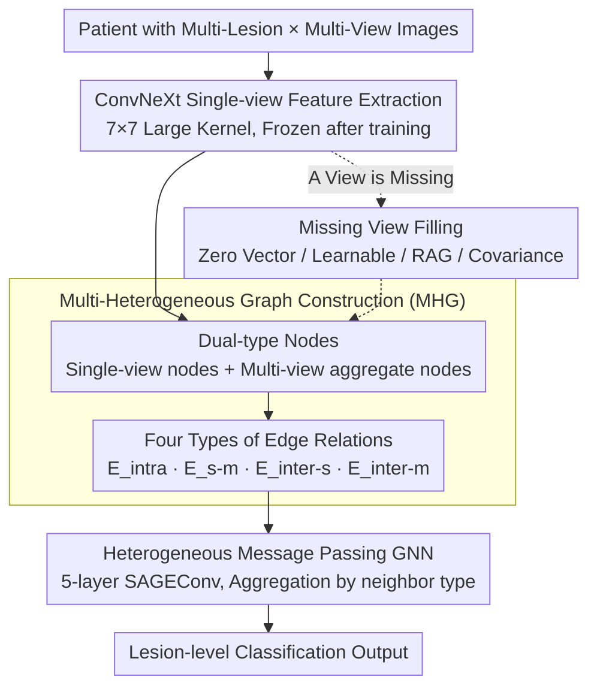

# GIIM: Graph-based Learning of Inter- and Intra-view Dependencies for Multi-view Medical Image Diagnosis

**Conference**: CVPR 2026  
**arXiv**: [2603.09446](https://arxiv.org/abs/2603.09446)  
**Code**: None  
**Area**: Medical Image Analysis / Graph Neural Networks / Computer-Aided Diagnosis  
**Keywords**: Multi-heterogeneous graph, multi-view diagnosis, intra/inter-view dependencies, missing view handling, CADx

## TL;DR

The GIIM framework is proposed, which simultaneously models the dynamic changes of the same lesion across phases and spatial associations between different lesions via a Multi-Heterogeneous Graph (MHG) with four types of edge relations. It incorporates four missing-view imputation strategies and significantly outperforms existing methods on Liver CT, Mammography, and Breast MRI modalities.

## Background & Motivation

**Background**: Clinical diagnosis requires synthesizing complex dependencies between abnormalities across multiple views—such as the dynamic changes of a single lesion in multi-phase contrast-enhanced CT and the spatial co-occurrence between different lesions. Methods like CNNs, Transformers, and GNNs have made progress in single-view or simple multi-view fusion.

**Limitations of Prior Work**:

1. Existing CADx methods typically process views independently or simply concatenate features, ignoring intra-view relationships between multiple lesions and inter-view temporal/spatial dynamics.
2. Attention-based methods require fixed-size inputs and cannot flexibly handle a variable number of lesions.
3. In clinical practice, views are often missing due to protocol constraints, technical failures, or patient-related reasons, and existing methods lack robustness to such cases.

**Key Challenge**: The need to simultaneously model four types of dependencies (intra-lesion cross-view, single-view multi-lesion, multi-view multi-lesion, and single-to-multi view aggregation) while maintaining robustness when views are missing.

**Goal**: To reconstruct multi-view medical diagnosis as a relationship modeling problem, utilizing heterogeneous graphs to comprehensively capture four types of dependencies while handling missing data.

**Key Insight**: GNNs are naturally suited for modeling a variable number of nodes and heterogeneous relationships, using different types of nodes and edges to encode various levels of clinical relationships.

**Core Idea**: Construct a multi-heterogeneous graph for each patient’s multi-lesion multi-view data and utilize type-aware message passing to simultaneously reason across the four types of dependencies.

## Method

### Overall Architecture

GIIM transforms multi-view medical diagnosis from "independent viewing" into unified relational reasoning: how the same lesion changes across multi-phase scans and how different lesions co-occur are the clinical cues radiologists use. It adopts a two-stage training approach—first, a ConvNeXt feature extractor (utilizing $7 \times 7$ large kernels and depthwise separable convolutions to capture morphology and intensity details) is trained independently for each view. Then, the extractor is frozen, and features from all lesions and views of a patient are assembled into a Multi-Heterogeneous Graph (MHG) for relational reasoning and classification via a heterogeneous message-passing GNN. The graph construction uses dual-type nodes to carry "single-phase" and "cross-phase aggregated" information and four types of edges to encode clinical dependencies. If a view is missing, an imputation strategy is used to generate the feature before graph entry. Since the graph is constructed per patient, it naturally supports an arbitrary number of lesions and views.

### Key Designs

**1. Dual-type Node Representation: Using two layers of nodes to carry "single-phase" and "cross-phase aggregated" information**

To model the "dynamic of the same lesion across phases," single-phase features alone are insufficient; a carrier to summarize all phases is needed. GIIM defines two categories of nodes: single-view nodes $N_{single}^v = f_v(l_v)$ representing features of a lesion in a specific view, and multi-view nodes $M_{multi} = \|_{v=1}^V N_{single}^v$ which concatenate all views of the same lesion as an aggregate node. in scenarios where lesion correspondence between views is uncertain (e.g., CC/MLO views in mammography), the single-view node is replaced by the mean of all lesion features in that view to avoid incorrect point-to-point alignment.

**2. Four Types of Edge Relations: Explicitly encoding four clinical dependencies into graph edges**

Existing methods either process views independently or use simple concatenation, losing intra-view multi-lesion relationships and inter-view dynamics. GIIM explicitly models these via four types of edges: $E_{intra}$ connects different views of the same lesion (arterial → venous → delayed phase) to capture temporal enhancement; $E_{s-m}$ connects a single-view node to its multi-view aggregate node to integrate phase information; $E_{inter-s}$ connects different lesions within the same view to model spatial co-occurrence (e.g., HCC often exists with satellite lesions); $E_{inter-m}$ connects aggregate nodes of different lesions to express high-level context, allowing small lesions to leverage the context of nearby large lesions. Ablation shows all four are indispensable, with $E_{intra}$ having the highest impact.

**3. Heterogeneous Message Passing: Aggregating by neighbor type to prevent edge information loss**

If all neighbors are aggregated uniformly, the distinction between single-view and multi-view relationships is blurred. GIIM aggregates features separately from single-view and multi-view neighbors using independent weight matrices $\mathbf{W}_{single}^k$ and $\mathbf{W}_{multi}^k$, then concatenates them with the node's previous state for non-linear transformation: $h_n^k = \sigma(\mathbf{W}^k \cdot \text{CONCAT}(h_n^{k-1}, h_{N_{single}(n)}^k, h_{M_{multi}(n)}^k))$. The model stacks 5 layers of SAGEConv ($512 \to 256 \to 128 \to 64 \to \text{classes}$), with the last layer outputting classification probabilities.

**4. Four Imputation Strategies for Missing Views: Enabling reasoning despite data gaps**

Clinical views are often missing due to protocols or equipment. GIIM provides four strategies: **Constant** fills with zero vectors, acting as a "missing marker" to force the model to learn to ignore missing nodes; **Learnable** uses a learnable parameter normalized by the Frobenius norm; **RAG-based** retrieves features from the database from complete samples with the most similar available features; **Covariance-based** calculates sample similarity based on the covariance matrix of feature differences between views and selects the most similar sample for filling. Experiments found zero vectors to be the most robust under missing-view tests, while generative filling (RAG/Covariance) performed better on complete data.

### Loss & Training

- **Single-view stage**: Standard cross-entropy classification; ConvNeXt is frozen after independent training.
- **Graph model stage**: MHG is trained end-to-end, with graphs constructed per patient (one patient graph per batch).

## Key Experimental Results

### Main Results

| Dataset | Method | Accuracy (%) | AUC (%) |
|--------|------|-------------|---------|
| Liver CT | NN-based (Multi-view) | 75.45 | 89.09 |
| | Attention-based | 73.41 | 88.53 |
| | **Ours** | **78.20** | **91.05** |
| VinDr-Mammo | NN-based | 67.48 | 82.21 |
| | Attention-based | 68.09 | 81.00 |
| | **Ours** | **71.17** | **82.54** |
| BreastDM (MRI) | NN-based | 80.85 | 87.35 |
| | Attention-based | 85.10 | 76.37 |
| | **Ours** | **87.23** | **89.02** |

Multi-view vs Single-view: Accuracy improved by ~12% on Liver and ~7.8% on Mammo.

### Ablation Study

**Comparison of Missing View Strategies (Liver, 100% Missing Rate Test)**

| Strategy | 100% miss-view | Full-view |
|------|----------------|-----------|
| NN-based | 70.00 | 75.45 |
| Ours (Constant) | **72.27** | 78.20 |
| Ours (Learnable) | 72.05 | 77.05 |
| Ours (RAG) | 71.59 | **78.41** |
| Ours (Covariance) | 72.05 | 78.18 |

**Edge Type Ablation**: Removing any of the four types leads to a performance drop; $E_{intra}$ (same-lesion cross-phase) has the most significant impact.

### Key Findings

- Zero-vector filling is the most stable under missing tests (acting as a "missing indicator"), while RAG/Covariance generative filling is superior with full data.
- The largest gain from multi-view consistency was in Liver CT (4-phase CT, where enhancement patterns change significantly).
- For BI-RADS classification, mean aggregation was used instead of per-lesion mapping due to the uncertainty in lesion correspondence between CC/MLO views.

## Highlights & Insights

- The design of four types of edges comprehensively covers the relational reasoning patterns of clinical radiologists, offering better interpretability than simple attention mechanisms.
- The trade-off in missing view strategies is practical: generative filling is better for complete data, while zero vectors are better for handling missing data.
- The categorized aggregation approach (single-view vs multi-view neighbors) in heterogeneous message passing prevents the loss of edge-type information.
- The flexibility of GNNs allows the framework to handle an arbitrary number of lesions and views, outperforming CNNs/Transformers that require fixed inputs.

## Limitations & Future Work

- Feature extraction and graph modeling are trained in stages; end-to-end joint training might yield further improvements.
- Graph structures are hard-coded by data (lesion/view count); dynamic graph construction or attention-weighted edges have not been explored.
- ConvNeXt is a relatively conservative backbone; stronger backbones like ViT or SAM could provide further gains.
- The datasets are relatively limited in size (max 920 cases); large-scale validation is still needed.

## Related Work & Insights

- **vs Phase Attention (Wang et al. 2022)**: Uses intra-phase + inter-phase attention but handles fixed inputs and ignores inter-lesion relations; GIIM uses GNNs to handle variable numbers of lesions.
- **vs SSL-MNGCN (Ibrahim et al. 2022)**: Uses GCNs for mammogram texture/spatial feature maps but does not model inter-view temporal relationships.
- **vs mmFormer (Zhang et al. 2022)**: Multimodal Transformer for incomplete brain tumor segmentation, but targets voxel-level tasks rather than lesion-level classification.
- **Insight**: The heterogeneous graph relational modeling paradigm can be generalized to other scenarios requiring joint reasoning across multi-view or multi-modal data.

## Rating

- Novelty: ⭐⭐⭐⭐ The combination of four types of heterogeneous edges and missing view strategies is well-rounded.
- Experimental Thoroughness: ⭐⭐⭐⭐ Three modalities, missing view ablation, and comparison of four filling strategies.
- Writing Quality: ⭐⭐⭐ Detailed content, though the structure is slightly complex.
- Value: ⭐⭐⭐ A general framework for medical multi-view diagnosis, though limited by dataset scale.

<!-- RELATED:START -->

## Related Papers

- [\[CVPR 2026\] CMR-RD: Long-Tailed Adaptive VLM for Explainable CMR Diagnosis](cmr-rd_long-tailed_adaptive_vlm_for_explainable_cmr_diagnosis.md)
- [\[CVPR 2026\] InvCoSS: Inversion-driven Continual Self-supervised Learning in Medical Multi-modal Image Pre-training](invcoss_inversion-driven_continual_self-supervised_learning_in_medical_multi-mod.md)
- [\[CVPR 2026\] Clinically-Grounded Counterfactual Reasoning for Medical Video Diagnosis](clinically-grounded_counterfactual_reasoning_for_medical_video_diagnosis.md)
- [\[CVPR 2026\] MedGRPO: Multi-Task Reinforcement Learning for Heterogeneous Medical Video Understanding](medgrpo_multi-task_reinforcement_learning_for_heterogeneous_medical_video_unders.md)
- [\[CVPR 2026\] MedTVT-R1: A Multimodal LLM Empowering Medical Reasoning and Diagnosis](medtvt-r1_a_multimodal_llm_empowering_medical_reasoning_and_diagnosis.md)

<!-- RELATED:END -->
