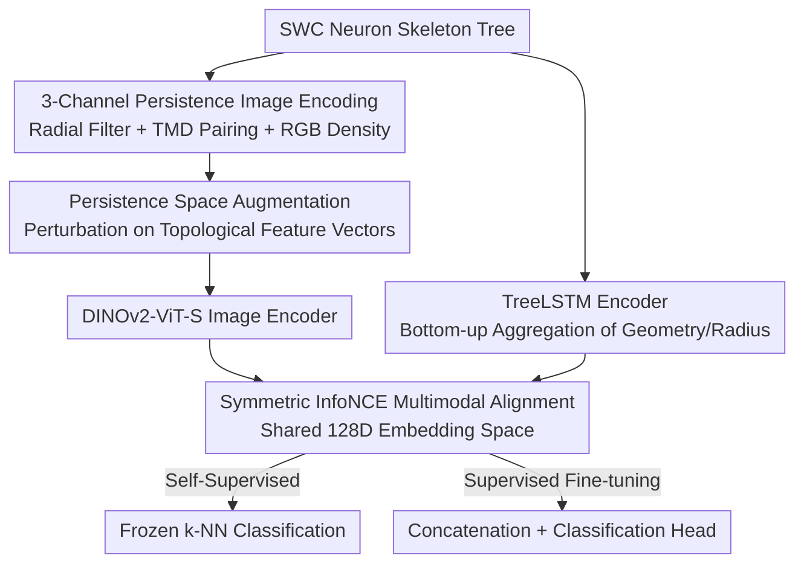

# GraPHFormer: A Multimodal Graph Persistent Homology Transformer for the Analysis of Neuroscience Morphologies

**Conference**: CVPR 2026  
**Paper**: [CVF Open Access](https://openaccess.thecvf.com/content/CVPR2026/html/Shah_GraPHFormer_A_Multimodal_Graph_Persistent_Homology_Transformer_for_the_Analysis_CVPR_2026_paper.html)  
**Code**: https://github.com/Uzshah/GraPHFormer  
**Area**: Medical Imaging  
**Keywords**: Neuronal Morphology, Persistent Homology, Topological Data Analysis, Multimodal Contrastive Learning, CLIP

## TL;DR
Ours aligns complementary "Graph Structure" and "Topological Persistent Homology" views of neuronal skeletons into a shared embedding space using CLIP-style symmetric InfoNCE. The graph encoder (TreeLSTM) captures local geometry, while the visual encoder (DINOv2 processing 3-channel persistence images) captures global topology. This approach achieves SOTA on 5 out of 6 neuronal morphology benchmarks, with gains up to 4.9 points in self-supervised settings over the previous generation.

## Background & Motivation
**Background**: The morphology of neurons and glia (branching patterns, path lengths, radius tapering, spatial arrangement) encodes critical information regarding circuit function, development, and pathology. Public repositories like NeuroMorpho.Org have accumulated tens of thousands of digital reconstructions, fostering two main data-driven representation paradigms: graph learning (GCN → Graph Transformer), which performs message passing directly on skeletons, and Topological Data Analysis (TDA), which uses persistent homology to compress branching "birth-death" processes into persistence diagrams. Specifically, the Topological Morphology Descriptor (TMD) designed for neurons vectorizes these summaries into images for classification.

**Limitations of Prior Work**: These two paradigms **operate in isolation**. Graph methods excel at encoding local branching patterns and geometric details but lose global, translation/rotation-invariant shape invariants. Topological methods (TMD) capture global spatial arrangements and stable shape summaries but erase fine-grained structural information (e.g., specific node connectivity or local radius variations). No prior work effectively unifies them.

**Key Challenge**: The topological view (global, invariant) and the graph view (local, geometric) describe **complementary facets** of the same neuron, yet unimodal methods only access half the information. Quantitative complementarity analysis in this paper shows that the Pearson correlation between the embeddings of these two modalities is only 0.04~0.08 (nearly orthogonal), indicating minimal overlap in encoded information.

**Goal**: Construct a multimodal architecture that processes both "raw skeleton trees + multi-channel persistence images" to let the two views supervise and align with each other in a shared space. This ensures a complete representation of global topology and local geometry, especially in self-supervised scenarios where morphological labels are expensive.

**Key Insight**: The authors noted that the CLIP alignment paradigm naturally fits "two modalities of the same object." By replacing "text/image" with "tree graph/persistence image" and using symmetric InfoNCE to pull together views of the same neuron while pushing others apart, a unified representation can be learned without labels. This is (according to the authors) the first application of the CLIP paradigm to neuron representation learning.

**Core Idea**: A dual-tower "Tree Encoder $\otimes$ Persistence Image Encoder" aligns graph structures and persistent homology into a shared embedding space via CLIP-style contrastive learning, making complementary views serve as supervision for each other.

## Method

### Overall Architecture
GraPHFormer is a dual-encoder contrastive learning framework. Input is a neuron reconstruction in SWC format, converted into two representations: (1) a directed tree graph fed into a **TreeLSTM** encoder for hierarchical branching; (2) a three-channel RGB **persistence image** fed into a **DINOv2-ViT-S** visual encoder for topological density. Both towers use MLP projection heads to map features into a shared 128-dimensional space, optimized via **symmetric InfoNCE**. After training, self-supervised downstream tasks use frozen k-NN evaluation (concatenating or adding embeddings), while supervised downstream tasks replace the projection head with a classification head for linear probing or end-to-end fine-tuning.

The novelty lies not in the "dual-tower + CLIP" shell, but in **how a neuron tree is transformed into a semantically correct persistence image for ViT** and **how to perform data augmentation in topological feature space** without destroying semantics.

### Key Designs

**1. Three-Channel RGB Persistence Images: Stacking Topology, Length, and Radius**

Single-channel TMD persistence images only record topological density (birth/death of branches), losing geometry. Ours expands this to three channels. First, **radial distance filtering** assigns a scalar to each node—the Euclidean distance $d_{raw}(v_i)$ to the soma—followed by a BFS-based cumulative maximum constraint, $f(v_i)=\max\{f(\text{parent}(v_i)),\,d_{raw}(v_i)\}$, ensuring monotonicity from soma to tips. The TMD elder-rule extracts birth-death pairs $(b_i, d_i)$.

Two geometric features are enriched for each pair: persistence $\delta_i=b_i-d_i$ and mean path radius $\bar{r}_i=\frac{1}{|\pi_i|}\sum_{v\in\pi_i}r(v)$, representing each branch as $\rho_i=(b_i,d_i,\delta_i,\bar{r}_i)$. Finally, a three-channel image ($112\times112$, $\sigma=16$ pixels) is generated using Gaussian weighted density:

$$I^{(c)}(x,y)=\sum_{i=1}^{m} w_i^{(c)}\cdot\frac{1}{2\pi\sigma^2}\exp\!\left(-\frac{(x-b_i)^2+(y-\delta_i)^2}{2\sigma^2}\right)$$

Weights vary by channel: $w_i^{(R)}=1$ (unweighted density for structure), $w_i^{(G)}=\delta_i$ (persistence-weighted for long branches), and $w_i^{(B)}=\bar{r}_i$ (radius-weighted for thickness). Ablation shows this improves performance by 2.6 points over the best single channel.

**2. Persistence-Space Augmentation: Perturbing Feature Vectors, Not Pixels**

Standard image augmentations (rotation, scaling, color jitter) are **harmful** to persistence images because pixel positions (birth vs. persistence axes) carry specific topological semantics. Ours applies augmentation **prior to image rendering on the feature vectors $\rho_i$**.

Three operations are applied randomly: (a) Birth-death jitter: adding Gaussian noise $b_i'=b_i+\mathcal{N}(0,\sigma_b^2)$; (b) Persistence scaling: $\delta_i'=\delta_i\cdot\alpha,\ \alpha\sim U(0.9,1.1)$; (c) Radius perturbation: $\bar{r}_i'=\bar{r}_i\cdot\beta,\ \beta\sim U(0.85,1.15)$. This step increases ACT-4 accuracy from 40.97% to 49.31% (+8.34 points), proving that augmentation must respect topological semantics.

**3. Dual-Tower Encoder: TreeLSTM for Hierarchy, DINOv2 for Density**

The tree encoder processes nodes $x_v\in\mathbb{R}^5$ (coordinates, radius, path length) using **TreeLSTM** with bottom-up aggregation: $h_v=\text{TreeLSTM}(x_v,\{h_c\}_{c\in C(v)})$. The root embedding $h_{root}$ represents the tree. The image side uses **DINOv2-ViT-S/14**, fine-tuning the entire backbone to transfer natural image features to the topological domain. 2-layer MLP projection heads map features to a 128D space.

**4. Symmetric InfoNCE Alignment: Cross-Modal Supervision**

For $N$ neurons in a batch, normalized embeddings $z_i^t$ and $z_i^v$ are computed. Pairwise similarity is $s_{ij}=\langle z_i^t,z_j^v\rangle/\tau$. The loss is:

$$L=-\frac{1}{2N}\sum_{i=1}^{N}\left[\log\frac{\exp(s_{ii})}{\sum_{j=1}^{N}\exp(s_{ij})}+\log\frac{\exp(s_{ii})}{\sum_{j=1}^{N}\exp(s_{ji})}\right]$$

This forces tree-image pairs of the same neuron together and others apart without requiring explicit negative sampling heuristics.

### Loss & Training
Implemented in PyTorch on an RTX 4090. AdamW optimizer ($\beta_1{=}0.9,\beta_2{=}0.999,\lambda{=}0.05$), LR $5\times10^{-4}$ with 20 epochs warmup and cosine annealing for 300 epochs. Batch size 128. Evaluations follow the TreeMoCo protocol.

## Key Experimental Results

### Main Results
Accuracy (%) across 6 benchmarks in Supervised (SL) and Self-Supervised (SS) settings.

| Setting | Dataset | GraPHFormer | Prev. SOTA | Gain |
|------|--------|-------------|----------|------|
| SS | BIL-6 | **86.2 ± 1** | SGTMorph 81.3 | +4.9 |
| SS | JML-4 | **72.7 ± 3** | SGTMorph 66.6 | +6.1 |
| SS | N7 | **83.8 ± 0.6** | SGTMorph 79.8 | +4.0 |
| SS | ACT-4 | 59.1 ± 4 | MorphRep 66.0 | −6.9 |
| SL | BIL-6 | **93.51** | SGTMorph 88.9 | +4.6 |
| SL | JML-4 | **76.5** | SGTMorph 72.4 | +4.1 |
| SL | N7 | **92.3** | SGTMorph 89.0 | +3.3 |
| SL | ACT-4 | 65.5 | SGTMorph 79.3 | −13.8 |

Ours is SOTA on 5/6 benchmarks. A unimodal baseline **PI (DINOv2-ViT-S, persistence image only)** achieved only 80.5% on BIL-6, significantly lower than the full GraPHFormer.

### Ablation Study
Channel encoding and augmentation results (AVG refers to mean across three datasets):

| Configuration | Key Metrics | Note |
|------|---------|------|
| RGB 3-Channel (Full) | 63.3 AVG | Complete multi-channel encoding |
| Strongest Single (R) | 60.7 AVG | Unweighted density |
| B (Radius) Channel | 58.4 AVG | Weakest single channel |
| Full Augmentation | 49.31 (ACT-4) | Complete persistence-space augmentation |
| No Augmentation | 40.97 (ACT-4) | 8.34 point drop |

### Key Findings
- **Orthogonal Modalities/Complementary Fusion**: Analysis shows Pearson correlation of tree/image embeddings is only 0.040 (N7) and 0.083 (JML-4). Fusion yields gains of +1.7% to +1.8%.
- **Persistence-Space Augmentation is Crucial**: On ACT-4, it provides an 8.34 point boost, confirming that generic image augmentations violate topological semantics.
- **Cross-Domain Generalization**: Training on neurons and testing on 11,925 glia yielded 78.87% species accuracy, showing shared morphological signatures across cell types.
- **Limitation on ACT-4**: Ours lags behind SGTMorph by 13.8 points in SL. This is because cortical layer classification relies on **absolute spatial coordinates**, which the translation-invariant TMD and TreeLSTM purposefully exclude.

## Highlights & Insights
- **Augmentation in topological feature space**: Because pixel positions in persistence images denote semantics, traditional augmentations are destructive. Perturbing $(b,d,\delta,\bar r)$ vectors before rendering preserves semantics effectively.
- **RGB Channels for Geometry**: Using R/G/B to carry density, persistence, and radius allows a standard ViT to "see" geometric quantities it otherwise couldn't from a purely topological summary.
- **CLIP for Same-Object Multimodality**: Contrastive learning here acts as self-distillation between two heterogeneous views, eliminating the need for paired labels.

## Limitations & Future Work
- **Ours acknowledges** that the fusion strategy (concatenation) is simple and sensitive to the curse of dimensionality. Future work will explore cross-modal attention and adaptive weighting.
- **Coordinate-invariance trade-off**: While providing generalization, it results in failures on datasets like ACT-4 where cortical depth is the primary feature.
- **Note**: The actual fusion gain (+1.7-1.8%) is modest compared to the overall performance boost, suggesting the strength lies in the unimodal representations themselves.

## Related Work & Insights
- **vs. TMD/Topological only**: PI unimodal baseline shows that topology alone is insufficient without graph structure.
- **vs. SGTMorph/Graph only**: SGTMorph retains coordinate-dependent features, outperforming Ours on ACT-4, but Ours wins elsewhere by incorporating global topological views.
- **vs. Graph Contrastive Learning**: Unlike TreeMoCo/GraphDINO which contrast on one modality, ours utilizes "Graph $\times$ Topological Image" cross-modal supervision.

## Rating
- Novelty: ⭐⭐⭐⭐ First to apply CLIP dual-tower to "Graph $\times$ Persistent Homology" for neurons.
- Experimental Thoroughness: ⭐⭐⭐⭐ 6 benchmarks, cross-dataset transfer, and quantitative complementarity.
- Writing Quality: ⭐⭐⭐⭐ Clear algorithms; transparent about ACT-4 limitations.
- Value: ⭐⭐⭐⭐ Provides a transferable multimodal representation tool for computational connectomics.

<!-- RELATED:START -->

## Related Papers

- [\[CVPR 2026\] SPECTRE：面向体积 CT Transformer 的自监督与跨模态预训练](scaling_self-supervised_and_cross-modal_pretraining_for_volumetric_ct_transforme.md)
- [\[CVPR 2026\] OmniBrainBench: A Comprehensive Multimodal Benchmark for Brain Imaging Analysis Across Multi-stage Clinical Tasks](omnibrainbench_a_comprehensive_multimodal_benchmark_for_brain_imaging_analysis_a.md)
- [\[CVPR 2026\] Gastric-X: A Multimodal Multi-Phase Benchmark Dataset for Advancing Vision-Language Models in Gastric Cancer Analysis](gastric-x_a_multimodal_multi-phase_benchmark_dataset_for_advancing_vision-langua.md)
- [\[CVPR 2026\] Diffusion MRI Transformer with a Diffusion Space Rotary Positional Embedding (D-RoPE)](diffusion_mri_transformer_with_a_diffusion_space_rotary_positional_embedding_d-r.md)
- [\[CVPR 2025\] Transformer-Based Multi-Region Segmentation and Radiomic Analysis of HR-pQCT Imaging for Osteoporosis Classification](../../CVPR2025/medical_imaging/transformer-based_multi-region_segmentation_and_radiomic_analysis_of_hr-pqct_ima.md)

<!-- RELATED:END -->
