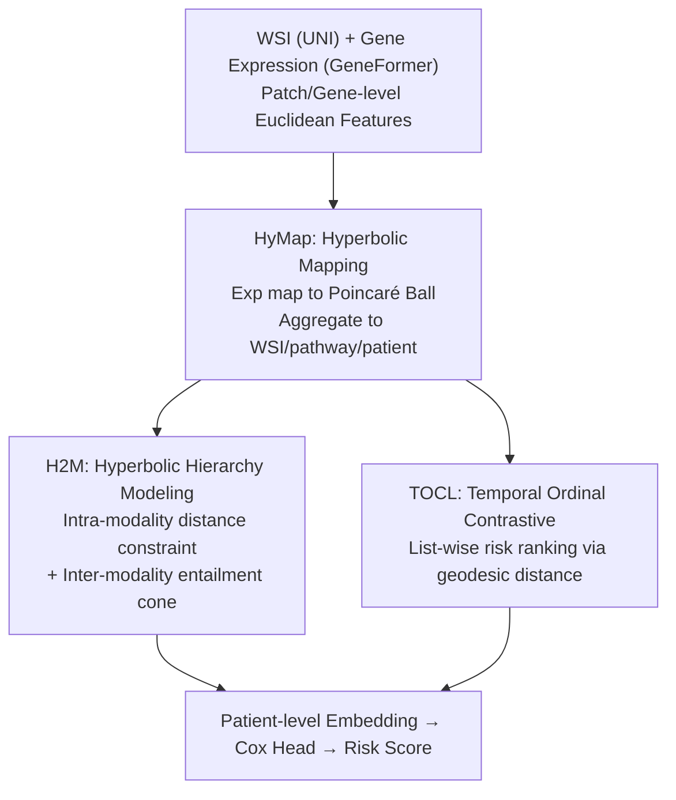

# H2-Surv: Hierarchical Hyperbolic Multimodal Representation Learning for Survival Prediction

**Conference**: CVPR 2026  
**Paper**: [CVF Open Access](https://openaccess.thecvf.com/content/CVPR2026/html/Yang_H2-Surv_Hierarchical_Hyperbolic_Multimodal_Representation_Learning_for_Survival_Prediction_CVPR_2026_paper.html)  
**Code**: Not yet open-sourced (original text states release upon acceptance)  
**Area**: Medical Imaging  
**Keywords**: Survival Prediction, Hyperbolic Geometry, Pathological-Genomic Multimodal, Hierarchical Structure, Ordinal Contrastive Learning

## TL;DR
H2-Surv embeds pathological WSI and genomic features into a hyperbolic (Poincaré ball) space. It models the tree-like hierarchy (patient→WSI/pathway→patch/gene) and the biological fact that genomics is more abstract than pathology using hierarchical distance constraints and cross-modal entailment cones. By employing a temporal ordinal contrastive loss to preserve the continuous ranking of survival time, it improves the average C-index from 0.684 to 0.716 across six TCGA/CPTAC datasets.

## Background & Motivation
**Background**: Cancer survival prediction estimates the "time to event (death/recurrence)" for individual patients. The mainstream approach involves fusing complementary signals from Whole Slide Images (WSI, providing tissue/cell morphology) and bulk RNA-seq gene expression (providing molecular mechanisms) for risk stratification. Models like MCAT, MOTCAT, PIBD, and SurvPath are representative of this direction.

**Limitations of Prior Work**: The authors identify three critical flaws in existing multimodal survival models. First, most models operate in Euclidean space, whereas pathology (patient→WSI→patch) and genomics (patient→pathway→gene) are inherently hierarchical tree structures. Since Euclidean volume grows polynomially, it cannot fit exponentially expanding trees, leading to distorted hierarchical relationships. Second, existing methods treat the two modalities as equivalent for "alignment," ignoring the biological fact that the genome is an upstream molecular mechanism that is more abstract and **encompasses** downstream morphological phenotypes; forced alignment flattens this asymmetric relationship. Third, many methods (e.g., MOTCAT, PIBD) discretize continuous survival time into coarse risk intervals, treating patients within the same interval as equivalent, which loses fine-grained ordinal information and breaks the continuity of survival outcomes.

**Key Challenge**: There is a fundamental mismatch between the "geometric structure" of hierarchy/entailment and Euclidean assumptions, as well as between continuous survival time and discrete interval supervision. Both prevent models from learning accurate risk rankings.

**Goal**: (1) Identify a geometric space naturally suited for hierarchy/entailment; (2) Characterize intra-modality hierarchy and inter-modality entailment simultaneously in this space; (3) Incorporate continuous ordinal relationships of survival time directly into the loss function rather than discretizing them.

**Core Idea**: Geometry shift—embed multimodal features into **hyperbolic space** (negative curvature, exponential volume expansion, naturally suited for trees). Intra- and inter-modality structures are expressed via hierarchical distance constraints and entailment cones, supplemented by a contrastive loss that performs "list-wise ordinal ranking" on hyperbolic geodesic distances to preserve temporal continuity.

## Method

### Overall Architecture
H2-Surv takes paired data (WSI and gene expression profiles) and outputs a patient-level risk score. The pipeline consists of three stages: First, features are extracted using two pretrained foundation models—UNI for patch-level features $x_{patch}\in\mathbb{R}^{M_i\times d}$ and GeneFormer for gene-level features $x_{gene}\in\mathbb{R}^{G\times d}$. Next, **HyMap** maps these Euclidean features into a shared Poincaré ball, aggregating them into WSI-level $x'_{wsi}$, pathway-level $x'_{pathway}$ (using 6 predefined biological pathways), and finally a patient-level multimodal embedding $x'_{pat}\in\mathbb{R}^d$, which is fed into a Cox partial likelihood head. During training, two sets of constraints are applied: **H2M** enforces intra-modality hierarchy and inter-modality entailment in hyperbolic space, while **TOCL** uses an ordinal contrastive loss to anchor the continuous order of survival time to geodesic distances.

### Key Designs

**1. HyMap: Moving Multimodal Features to Hyperbolic Space to Prevent Hierarchical Collapse**

To address the Euclidean volume limitation, HyMap embeds both modalities into an $n$-dimensional Poincaré ball $\mathbb{D}^n_c=\{w\in\mathbb{R}^n: c\|w\|^2<1,\ c>0\}$. The curvature $c$ is not a hyperparameter but is parameterized as a trainable scalar via softplus $c=\text{softplus}(\theta)=\log(1+e^\theta)$, ensuring $c>0$ and joint optimization. The mapping uses the exponential map grounded at the origin (utilizing Möbius addition $\oplus_c$ and conformal factor $\lambda^c_w=\frac{2}{1-c\|w\|^2}$):

$$\exp^c_w(x_{patch}^i):=w\oplus_c\left(\tanh\!\Big(\sqrt{c}\,\lambda^c_w\frac{\|x_{patch}^i\|}{2}\Big)\frac{x_{patch}^i}{\sqrt{c}\,\|x_{patch}^i\|}\right)$$

In practice, $w=0$, mapping Euclidean features as tangent vectors at the origin. Features are projected to $d=256$. By projecting both modalities into the **same** hyperbolic manifold, the exponential volume allows fine-grained "leaves" to reside near the boundary and abstract "roots" near the origin, preserving hierarchy with low distortion.

**2. H2M: Hardcoding Intra-modality Hierarchy and Inter-modality Entailment**

H2M implements two complementary geometric constraints. The **Intra-modality Hierarchy Constraint** requires lower-level nodes (patch/gene) to be more specific and thus further from the patient node than mid-level aggregations (WSI/pathway). This is defined via hyperbolic geodesic distance $d_H$ as a margin loss:

$$\mathcal{L}_{Hd}=\sum_{i=1}^N\sum_{m\in\{img,gen\}}\max\!\big(0,\ d_H(x'^{(i,m)}_{patch},x'^{(i,m)}_{pat})-d_H(x'^{(i,m)}_{wsi},x'^{(i,m)}_{pat})+\epsilon\big)$$

This forces the "root-near-center, leaf-near-boundary" order. The **Inter-modality Entailment Constraint** encodes "genomics as more abstract/encompassing pathology." An entailment cone is defined for each pathway embedding, with a half-angle that increases as its radius decreases $\text{aper}(x'_{pathway})=\sin^{-1}\!\big(\frac{2K}{\sqrt{c}\,\|x'_{pathway,space}\|}\big),\ K=0.1$. The model quantifies the external angle $\text{ext}(x'_{pathway},x'_{wsi})$ using the Lorentzian inner product. If the WSI falls outside the cone, it is penalized:

$$\mathcal{L}_{Hyent}=\sum_{(x'_{pathway},x'_{wsi})\in D}\max\!\Big(0,\ 1-\frac{\text{ext}(x'_{pathway},x'_{wsi})-\text{aper}(x'_{pathway})}{\pi}\Big)$$

This replaces symmetric alignment with directional entailment, matching the molecular-to-morphological biological hierarchy.

**3. TOCL: Anchoring Continuous Survival Time to Hyperbolic Geodesic Distance**

TOCL avoids discretization by using a list-wise risk ranking. For a query patient $q$, a set of positive samples $\{p_1,p_2,\dots\}$ (ordered by survival time proximity) and highly distant negative samples $\{n_1,n_2,\dots\}$ are constructed. Ordinal constraints $d_H(q,p_1)<d_H(q,p_i)<d_H(q,n)$ align temporal order with geometric order using a progressive ranking objective:

$$\mathcal{L}_{ordinal}=\sum_{i=1}^r-\log\frac{\sum_{p\in P_i}\exp(-d_H(q,p)/\tau)}{\sum_{p\in\cup_{j\ge i}P_j}\exp(-d_H(q,p)/\tau)+\sum_{n\in N}\exp(-d_H(q,n)/\tau)}$$

This ensures the model learns the **list-wise order** of survival proximity rather than binary classification, maintaining continuity in the risk space.

### Loss & Training
Let the patient's fused embedding be $x'^{(i)}_{pat}$. Given paired data $(x^{(i)}_{pathology},x^{(i)}_{gene},t^{(i)},\delta^{(i)})$ where $t^{(i)}$ is survival time and $\delta^{(i)}$ is the event indicator, the total objective is:

$$\mathcal{L}_{final}=\mathcal{L}_{surv}+\lambda(\mathcal{L}_{Hd}+\mathcal{L}_{Hyent})+\beta\,\mathcal{L}_{ordinal}$$

Weights are set to $\lambda=0.01$ and $\beta=0.1$. Training uses the Adam optimizer, learning rate $2\times10^{-4}$, 5-fold cross-validation, and batch size 1 on a V100 GPU (32GB).

## Key Experimental Results

### Main Results
On six benchmarks from TCGA and CPTAC, H2-Surv achieves an average C-index of 0.716, outperforming the strongest baselines PIBD/PANTHER (0.684) by 0.032.

| Method | Modality | BRCA | BLCA | UCEC(TCGA) | LUAD(TCGA) | Average |
|------|------|------|------|------|------|------|
| MOTCAT | Path+Gen | 0.673 | 0.683 | 0.675 | 0.670 | 0.667 |
| CMTA | Path+Gen | 0.668 | 0.691 | 0.697 | 0.686 | 0.669 |
| PIBD | Path+Gen | 0.736 | 0.667 | 0.714 | 0.688 | 0.684 |
| PANTHER | Path+Gen | 0.758 | 0.612 | 0.757 | 0.685 | 0.684 |
| **Ours (H2-Surv)** | Path+Gen | **0.763** | **0.701** | **0.760** | **0.700** | **0.716** |

The model also leads on CPTAC-UCEC (+0.020) and CPTAC-LUAD (+0.045), demonstrating robustness to heterogeneous data sources.

### Ablation Study
Baseline R1 reproduces MOTCAT (average 0.668).

| Row | HyMap | H2M | TOCL | Average C-index | Description |
|----|-------|-----|------|------|------|
| R1 | | | | 0.668 | Baseline (MOTCAT repro) |
| R2 | ✓ | | | 0.680 | Hyperbolic mapping only |
| R3 | ✓ | ✓ | | 0.694 | + Hierarchical/Entailment |
| R4 | ✓ | | ✓ | 0.693 | + Temporal Ordinal Loss |
| R5 | | | ✓ | 0.682 | TOCL only |
| R6 | ✓ | ✓ | ✓ | **0.716** | Full Model |

### Key Findings
- Adding HyMap alone (R2) increases the C-index by 1.2 points, suggesting that switching to hyperbolic geometry significantly improves multimodal embeddings.
- H2M (R3, 0.694) is slightly more effective than TOCL (R4, 0.693) when added individually; however, their synergy is crucial for achieving 0.716.
- CO-SNE visualization confirms patient-level embeddings cluster near the origin, while gene/patch levels move toward the Poincaré ball boundary.
- Kaplan-Meier analysis shows clearer separation and lower log-rank p-values than MOTCAT. Pathway attention maps successfully link oncogenic programs (e.g., ERBB2) to dense infiltrative sites.

## Highlights & Insights
- **Asymmetric Entailment**: Using entailment cones to represent "genomic pathways encompassing pathology" is more biologically accurate than traditional symmetric alignment. This concept is transferable to other "upstream-abstract, downstream-concrete" multimodal tasks.
- **Learnable Curvature**: $c=\text{softplus}(\theta)$ allows the model to determine the degree of hyperbolic curvature, avoiding manual tuning.
- **Continuous Ordinality**: TOCL preserves survival analysis's continuous nature by using list-wise ranking on geodesic distances, providing finer granularity than interval-based supervision.

## Limitations & Future Work
- Hyperbolic operations (exponential maps, Lorentzian inner products) are numerically sensitive; the paper lacks discussion on numerical stability and training costs.
- Pathways are fixed to 6 categories; the effectiveness on deeper or data-driven hierarchies is unverified.
- Experiments rely on specific backbones (UNI + GeneFormer); gain stability across different architectures is unknown.
- Batch size of 1 and small epoch counts suggest further exploration of scalability is needed.

## Related Work & Insights
- **vs MOTCAT / PIBD**: These methods use Euclidean alignment and discretize time. H2-Surv utilizes hyperbolic geometry to model hierarchy and directional entailment while replacing interval supervision with continuous ordinal contrastive learning.
- **vs PANTHER**: PANTHER uses prototype alignment, performing well on BRCA but weak on BLCA. H2-Surv shows more balanced performance across all datasets.
- **vs General Hyperbolic Models**: Previous medical hyperbolic models typically mapping modalities independently; this work specifically designs for the hierarchical and entailment traits of pathology and genomics.

## Rating
- Novelty: ⭐⭐⭐⭐⭐ First framework combining hyperbolic hierarchy, cross-modal entailment, and ordinal contrastive learning for survival prediction.
- Experimental Thoroughness: ⭐⭐⭐⭐ Extensive datasets and ablation, though lacks discussion on numerical stability.
- Writing Quality: ⭐⭐⭐⭐ Clear motivation-design mapping; some formulas are dense.
- Value: ⭐⭐⭐⭐ The asymmetric geometric modeling and continuous ordinal supervision are valuable for cross-modal tasks.

<!-- RELATED:START -->

## Related Papers

- [\[CVPR 2026\] MUST: Modality-Specific Representation-Aware Transformer for Diffusion-Enhanced Survival Prediction with Missing Modality](must_modality-specific_representation-aware_transformer_for_diffusion-enhanced_s.md)
- [\[CVPR 2025\] Distilled Prompt Learning for Incomplete Multimodal Survival Prediction](../../CVPR2025/medical_imaging/distilled_prompt_learning_for_incomplete_multimodal_survival_prediction.md)
- [\[CVPR 2026\] Turning Pre-Trained Vision Transformers into End-to-End Histopathology Whole Slide Image Models for Survival Prediction](turning_pre-trained_vision_transformers_into_end-to-end_histopathology_whole_sli.md)
- [\[CVPR 2026\] MDCS-MoAME: Multi-directional Composite Scanning with Mixture of Attention and Mamba Experts for Cancer Survival Prediction](mdcs-moame_multi-directional_composite_scanning_with_mixture_of_attention_and_ma.md)
- [\[CVPR 2026\] Focus-to-Perceive Representation Learning: A Cognition-Inspired Hierarchical Framework for Endoscopic Video Analysis](focus-to-perceive_representation_learning_a_cognition-inspired_hierarchical_fram.md)

<!-- RELATED:END -->
